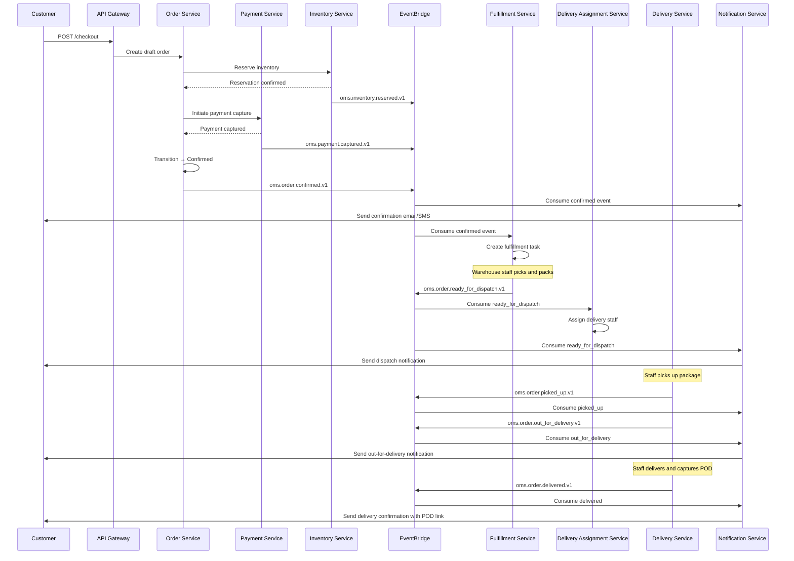
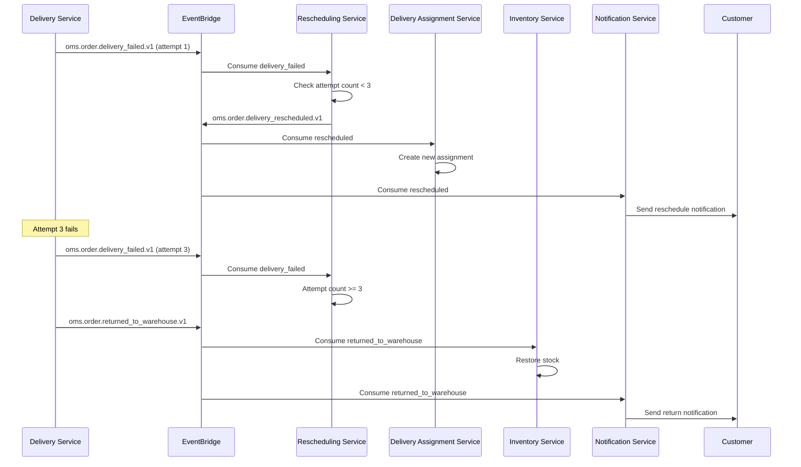

# Event Catalog

## Contract Conventions

All domain events in the Order Management and Delivery System follow these conventions:

- **Format:** JSON with a standard envelope containing metadata and payload.
- **Transport:** Amazon EventBridge with custom event bus `oms.events`.
- **Naming:** `{domain}.{entity}.{action}.v{version}` (e.g., `oms.order.confirmed.v1`).
- **Idempotency:** Every event carries a globally unique `event_id` (UUIDv7) generated at write time. Consumers must deduplicate by `event_id` before processing.
- **Ordering:** Events for the same aggregate are ordered by `sequence_number`. Consumers must process events in sequence order and reject out-of-order events until gaps are filled.
- **Correlation:** All events include a `correlation_id` linking them to the originating user request for distributed tracing.
- **Schema Evolution:** Breaking changes increment the version suffix. Non-breaking additions (new optional fields) do not require a version bump.

### Standard Event Envelope

```json
{
  "event_id": "0192b4c0-7e8b-7a3f-9c1d-2e4f6a8b0c1d",
  "event_type": "oms.order.confirmed.v1",
  "source": "order-service",
  "timestamp": "2026-04-04T14:30:00.000Z",
  "correlation_id": "req-abc123",
  "aggregate_id": "order-9f8e7d6c",
  "sequence_number": 2,
  "payload": { }
}
```

## Domain Events

| Event Type | Producer | Consumers | Trigger Condition | Payload Summary |
|---|---|---|---|---|
| `oms.order.draft_created.v1` | Order Service | Cart Service | Checkout initiated, inventory reserved | order_id, customer_id, line_items, reservation_ttl |
| `oms.order.confirmed.v1` | Order Service | Fulfillment Service, Notification Service, Analytics Service | Payment captured successfully | order_id, customer_id, total_amount, payment_ref, delivery_address |
| `oms.order.ready_for_dispatch.v1` | Fulfillment Service | Delivery Assignment Service, Notification Service | Pick-pack complete, manifest generated | order_id, warehouse_id, manifest_id, package_dimensions |
| `oms.order.picked_up.v1` | Delivery Service | Notification Service, Analytics Service | Delivery staff confirms package custody | order_id, assignment_id, staff_id, pickup_timestamp |
| `oms.order.out_for_delivery.v1` | Delivery Service | Notification Service | Delivery run started | order_id, assignment_id, staff_id, estimated_arrival |
| `oms.order.delivered.v1` | Delivery Service | Notification Service, Analytics Service, Archival Service | POD accepted and recorded | order_id, assignment_id, pod_id, delivered_at |
| `oms.order.delivery_failed.v1` | Delivery Service | Rescheduling Service, Notification Service | Delivery attempt unsuccessful | order_id, assignment_id, attempt_count, failure_reason |
| `oms.order.delivery_rescheduled.v1` | Rescheduling Service | Delivery Assignment Service, Notification Service | Failed delivery rescheduled | order_id, assignment_id, new_window_start, new_window_end |
| `oms.order.returned_to_warehouse.v1` | Delivery Service | Inventory Service, Notification Service | 3 failed attempts, returned to stock | order_id, assignment_id, warehouse_id |
| `oms.order.cancelled.v1` | Order Service | Payment Service, Inventory Service, Notification Service | Customer or admin cancels order | order_id, cancellation_reason, refund_required |
| `oms.payment.captured.v1` | Payment Service | Order Service | Gateway confirms capture | payment_id, order_id, amount, gateway_ref |
| `oms.payment.refund_initiated.v1` | Payment Service | Notification Service, Analytics Service | Refund triggered by cancellation or return | payment_id, order_id, refund_amount, refund_reason |
| `oms.payment.refund_completed.v1` | Payment Service | Notification Service, Order Service | Gateway confirms refund | payment_id, order_id, refund_amount, gateway_ref |
| `oms.inventory.reserved.v1` | Inventory Service | Order Service | Stock reserved for checkout | reservation_id, variant_id, quantity, ttl_expires_at |
| `oms.inventory.released.v1` | Inventory Service | Analytics Service | Reservation expired or order cancelled | reservation_id, variant_id, quantity, release_reason |
| `oms.inventory.low_stock.v1` | Inventory Service | Notification Service (Admin) | qty_on_hand falls below threshold | variant_id, warehouse_id, current_qty, threshold |
| `oms.return.requested.v1` | Return Service | Delivery Assignment Service, Notification Service | Customer initiates return | return_id, order_id, reason_code |
| `oms.return.picked_up.v1` | Delivery Service | Warehouse Service, Notification Service | Staff collects returned item | return_id, order_id, staff_id |
| `oms.return.inspected.v1` | Warehouse Service | Payment Service, Notification Service | Inspection result recorded | return_id, order_id, result, refund_amount |
| `oms.notification.dispatched.v1` | Notification Service | Analytics Service | Notification sent via any channel | notification_id, channel, recipient, event_type, delivery_status |

## Publish and Consumption Sequence

The following sequence diagram illustrates the event flow for the primary order-to-delivery lifecycle:



### Failed Delivery and Retry Sequence



## Operational SLOs

| SLO | Target | Measurement | Alerting |
|---|---|---|---|
| Event publish latency (producer → EventBridge) | P95 < 2 seconds | CloudWatch EventBridge PutEvents latency | SEV-2 if P95 > 5 s for 10 min |
| Event delivery latency (EventBridge → consumer) | P95 < 5 seconds | X-Ray trace duration from publish to consumer handler start | SEV-2 if P95 > 15 s for 10 min |
| DLQ depth | < 10 events sustained | CloudWatch DLQ ApproximateNumberOfMessagesVisible | SEV-2 if > 10 for 15 min |
| DLQ redrive success rate | > 99 % within 4 hours | Custom metric: redriven / total DLQ entries per day | SEV-3 if < 95 % |
| Consumer idempotency dedup rate | < 1 % duplicate events | Custom metric: dedup_count / total_consumed | SEV-3 if > 5 % |
| Notification dispatch latency | P95 < 60 seconds | CloudWatch custom metric from event timestamp to SES/SNS send | SEV-2 if P95 > 180 s |
| Event schema validation failure rate | < 0.1 % | Custom metric: schema_failures / total_events | SEV-3 if > 1 % |

### Retry and DLQ Policy

| Boundary | Strategy | Parameters | Max Elapsed | DLQ |
|---|---|---|---|---|
| EventBridge → Lambda consumer | Built-in retry | 2 retries with exponential backoff | ~6 minutes | EventBridge DLQ (SQS) |
| Lambda → downstream service call | Exponential backoff + jitter | base=500 ms, factor=2, max=30 s | 5 minutes | Lambda DLQ (SQS) |
| Notification dispatch | Fixed interval retry | 30 s interval, 3 retries | 90 seconds | Notification DLQ |
| Payment gateway call | Exponential backoff + jitter | base=1 s, factor=2, max=60 s | 3 retries | Manual escalation |
