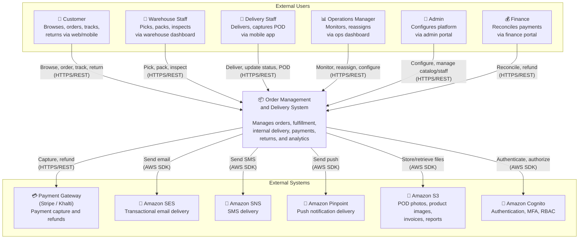

# System Context Diagram

## Overview

This document presents the C4 Level-0 system context diagram for the Order Management and Delivery System, identifying the system boundary, all external actors, and integrated external systems.

## System Context

The Order Management and Delivery System sits at the centre of the operational ecosystem, interacting with customers via web/mobile interfaces, internal staff via operational dashboards, and external services for payments, notifications, and storage.

## Interaction Summary

| Actor / System | Direction | Protocol | Data Exchanged |
|---|---|---|---|
| Customer | Inbound | HTTPS/REST | Browse, cart, checkout, order, return requests |
| Warehouse Staff | Inbound | HTTPS/REST | Pick list queries, scan verification, pack confirmation, inspection results |
| Delivery Staff | Inbound | HTTPS/REST | Assignment queries, status updates, POD uploads |
| Operations Manager | Inbound | HTTPS/REST | Dashboard queries, reassignment commands, zone configuration |
| Admin | Inbound | HTTPS/REST | Catalog CRUD, staff CRUD, config changes, audit log queries |
| Finance | Inbound | HTTPS/REST | Reconciliation reports, manual refund commands |
| Payment Gateway | Outbound | HTTPS/REST | Authorization, capture, refund requests; webhook callbacks |
| Amazon SES | Outbound | AWS SDK | Email send requests, delivery receipts |
| Amazon SNS | Outbound | AWS SDK | SMS publish requests, delivery receipts |
| Amazon Pinpoint | Outbound | AWS SDK | Push notification requests, engagement events |
| Amazon S3 | Outbound | AWS SDK | Object put/get for POD, images, invoices, reports |
| Amazon Cognito | Outbound | AWS SDK | Sign-up, sign-in, token validation, user pool management |

## Trust Boundaries

| Boundary | Inside | Outside | Controls |
|---|---|---|---|
| API Gateway | All backend services | All client applications | JWT validation, rate limiting, WAF, TLS termination |
| VPC Private Subnets | Lambda, Fargate, RDS, ElastiCache | Public internet, API Gateway | Security groups, NACLs, NAT gateway for outbound |
| Cognito User Pool | Authenticated sessions | Unauthenticated requests | OAuth 2.0 / OIDC flows, MFA, password policies |
| Payment Boundary | Internal payment records | Payment gateway | Tokenisation, PCI-DSS scope isolation, no raw card data |
