```mermaid
graph LR
    subgraph Actors
        C[Customer]
        WS[Warehouse Staff]
        DS[Delivery Staff]
        OM[Operations Manager]
        AD[Admin]
        FN[Finance]
        PG[Payment Gateway]
        NS[Notification Service]
        ST[System Timer]
    end

    subgraph Customer_Management["Customer Management"]
        UC01[UC-01: Register Account]
        UC02[UC-02: Manage Profile]
        UC03[UC-03: Manage Addresses]
    end

    subgraph Product_Catalog["Product Catalog"]
        UC04[UC-04: Browse Products]
        UC05[UC-05: Search Products]
        UC06[UC-06: Manage Catalog]
    end

    subgraph Cart_Checkout["Cart and Checkout"]
        UC07[UC-07: Manage Cart]
        UC08[UC-08: Apply Coupon]
        UC09[UC-09: Checkout]
    end

    subgraph Order_Management["Order Management"]
        UC10[UC-10: Create Order]
        UC11[UC-11: Track Order]
        UC12[UC-12: Cancel Order]
        UC13[UC-13: Modify Order]
    end

    subgraph Payment["Payment"]
        UC14[UC-14: Process Payment]
        UC15[UC-15: Process Refund]
        UC16[UC-16: Reconcile Payments]
    end

    subgraph Fulfillment["Fulfillment"]
        UC17[UC-17: View Pick List]
        UC18[UC-18: Verify Picks]
        UC19[UC-19: Pack Order]
        UC20[UC-20: Generate Manifest]
    end

    subgraph Delivery["Delivery"]
        UC21[UC-21: View Assignments]
        UC22[UC-22: Update Delivery Status]
        UC23[UC-23: Capture POD]
        UC24[UC-24: Record Failed Delivery]
        UC25[UC-25: Manage Delivery Zones]
    end

    subgraph Returns["Returns"]
        UC26[UC-26: Initiate Return]
        UC27[UC-27: Collect Return Pickup]
        UC28[UC-28: Inspect Return]
    end

    subgraph Admin_Ops["Administration"]
        UC29[UC-29: Manage Staff]
        UC30[UC-30: Configure Settings]
        UC31[UC-31: View Analytics]
        UC32[UC-32: Manage Templates]
        UC33[UC-33: View Audit Logs]
    end

    C --> UC01
    C --> UC02
    C --> UC03
    C --> UC04
    C --> UC05
    C --> UC07
    C --> UC08
    C --> UC09
    C --> UC11
    C --> UC12
    C --> UC13
    C --> UC26

    WS --> UC17
    WS --> UC18
    WS --> UC19
    WS --> UC20
    WS --> UC28

    DS --> UC21
    DS --> UC22
    DS --> UC23
    DS --> UC24
    DS --> UC27

    OM --> UC20
    OM --> UC21
    OM --> UC25
    OM --> UC31

    AD --> UC06
    AD --> UC29
    AD --> UC30
    AD --> UC31
    AD --> UC32
    AD --> UC33

    FN --> UC15
    FN --> UC16

    UC09 --> PG
    UC14 --> PG
    UC15 --> PG

    UC10 --> NS
    UC22 --> NS
    UC24 --> NS

    ST --> UC07
    ST --> UC16
```

# Use Case Diagram

## Overview

This document presents the UML use case diagram for the Order Management and Delivery System, identifying all actors and their interactions with the platform.

## Actors

| Actor | Type | Description |
|---|---|---|
| Customer | Primary | End user who browses, orders, tracks, and manages returns |
| Warehouse Staff | Primary | Staff responsible for picking, packing, and inspecting returns |
| Delivery Staff | Primary | Internal staff responsible for delivering orders and collecting returns |
| Operations Manager | Primary | Oversees fulfillment, delivery assignments, and performance |
| Admin | Primary | Manages platform configuration, catalog, staff, and analytics |
| Finance | Primary | Handles payment reconciliation and manual refunds |
| Payment Gateway | External | Third-party payment processing service (Stripe, Khalti) |
| Notification Service | External | AWS SES/SNS/Pinpoint for email, SMS, push delivery |
| System Timer | External | Scheduled triggers for reservation expiry, report generation, cleanup |

## Use Case Diagram

## Use Case Summary Table

| ID | Use Case | Primary Actor | Related Requirements |
|---|---|---|---|
| UC-01 | Register Account | Customer | FR-CM-001, FR-CM-004 |
| UC-02 | Manage Profile | Customer | FR-CM-002 |
| UC-03 | Manage Addresses | Customer | FR-CM-003 |
| UC-04 | Browse Products | Customer | FR-PC-001, FR-PC-002 |
| UC-05 | Search Products | Customer | FR-PC-004 |
| UC-06 | Manage Catalog | Admin | FR-PC-001, FR-PC-002, FR-PC-003 |
| UC-07 | Manage Cart | Customer | FR-SC-001 |
| UC-08 | Apply Coupon | Customer | FR-SC-003 |
| UC-09 | Checkout | Customer | FR-SC-002 |
| UC-10 | Create Order | System | FR-OM-001 |
| UC-11 | Track Order | Customer | FR-OM-002 |
| UC-12 | Cancel Order | Customer | FR-OM-003 |
| UC-13 | Modify Order | Customer | FR-OM-004 |
| UC-14 | Process Payment | System | FR-PM-001, FR-PM-002 |
| UC-15 | Process Refund | Finance | FR-PM-003 |
| UC-16 | Reconcile Payments | Finance | FR-PM-004 |
| UC-17 | View Pick List | Warehouse Staff | FR-FP-001 |
| UC-18 | Verify Picks | Warehouse Staff | FR-FP-002 |
| UC-19 | Pack Order | Warehouse Staff | FR-FP-002 |
| UC-20 | Generate Manifest | Warehouse Staff / Ops Mgr | FR-FP-003 |
| UC-21 | View Assignments | Delivery Staff | FR-DM-001 |
| UC-22 | Update Delivery Status | Delivery Staff | FR-DM-002 |
| UC-23 | Capture POD | Delivery Staff | FR-DM-003 |
| UC-24 | Record Failed Delivery | Delivery Staff | FR-DM-004 |
| UC-25 | Manage Delivery Zones | Operations Manager | FR-DM-005 |
| UC-26 | Initiate Return | Customer | FR-RR-001 |
| UC-27 | Collect Return Pickup | Delivery Staff | FR-RR-002 |
| UC-28 | Inspect Return | Warehouse Staff | FR-RR-003 |
| UC-29 | Manage Staff | Admin | FR-AM-003 |
| UC-30 | Configure Settings | Admin | FR-AM-002 |
| UC-31 | View Analytics | Admin / Ops Mgr | FR-AR-001, FR-AR-002 |
| UC-32 | Manage Templates | Admin | FR-NM-004 |
| UC-33 | View Audit Logs | Admin | FR-AM-001 |
