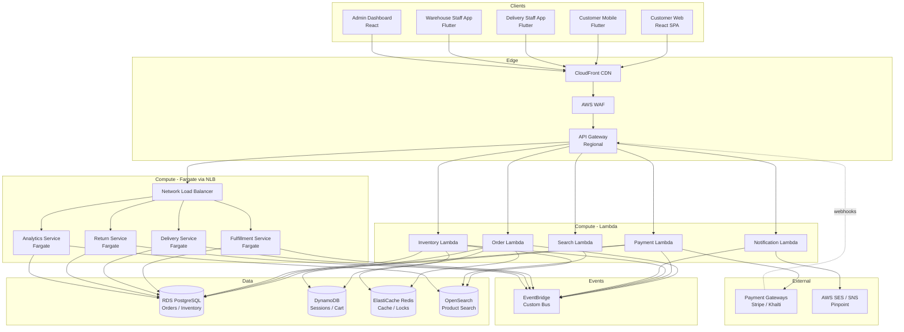

# API Design

## Overview

RESTful API design for the Order Management and Delivery System. All endpoints follow OpenAPI 3.1 conventions with JSON request/response bodies, JWT authentication via Cognito, and `Idempotency-Key` headers on all mutating operations.

---

## API Architecture



---

## API Conventions

| Convention | Behavior |
|---|---|
| Versioning | All endpoints under `/v1`; breaking changes get `/v2` |
| Resource IDs | UUID v4 format; no sequential integer IDs in public API |
| Authentication | JWT bearer token via Cognito; role claims in `cognito:groups` |
| Idempotency | All POST/PATCH endpoints require `Idempotency-Key` header (UUID); cached 24 hours |
| Error format | `{ "error": "ERROR_CODE", "message": "...", "details": {...}, "trace_id": "..." }` |
| Pagination | Cursor-based; `cursor` + `limit` query params; response includes `next_cursor`, `has_more` |
| Timestamps | ISO 8601 with timezone offset; all UTC internally |
| Soft deletes | Resources are archived, not hard-deleted; `status: "archived"` |
| Rate limiting | 1000 req/min for authenticated, 100 req/min for public endpoints |
| Webhooks | Gateway HMAC-signed webhook callbacks for payment events |

---

## Base URL

```
https://api.oms.example.com/v1
```

## Authentication

All endpoints require a valid JWT in the `Authorization: Bearer <token>` header. Tokens are issued by Amazon Cognito. Role-based access is enforced via Cognito groups mapped to API Gateway authorizer.

## Rate Limiting

| Endpoint Group | Limit | Window | Response |
|---|---|---|---|
| POST /auth/* | 20 requests | 5 minutes per IP | 429 with `retry_after` |
| POST /orders/checkout | 5 requests | 1 minute per user | 429 |
| GET /products | 1000 requests | 1 minute per IP | 429 |
| POST /deliveries/*/pod | 10 requests | 1 minute per staff | 429 |
| Global authenticated | 1000 requests | 1 minute per user | 429 |
| Global public | 100 requests | 1 minute per IP | 429 |

## Common Headers

| Header | Required | Description |
|---|---|---|
| `Authorization` | Yes | `Bearer <JWT>` |
| `Content-Type` | Yes (mutations) | `application/json` |
| `Idempotency-Key` | Yes (POST/PUT/PATCH) | Client-generated UUID for deduplication |
| `X-Correlation-Id` | Optional | Propagated through all services for tracing |

## Common Error Codes

| Code | Meaning | Body |
|---|---|---|
| 400 | Bad Request | `{ "error": "VALIDATION_ERROR", "details": [...] }` |
| 401 | Unauthorized | `{ "error": "UNAUTHORIZED" }` |
| 403 | Forbidden | `{ "error": "FORBIDDEN" }` |
| 404 | Not Found | `{ "error": "NOT_FOUND", "resource": "..." }` |
| 409 | Conflict | `{ "error": "CONFLICT", "reason": "..." }` |
| 429 | Rate Limited | `{ "error": "RATE_LIMITED", "retry_after": 30 }` |
| 500 | Internal Error | `{ "error": "INTERNAL_ERROR", "trace_id": "..." }` |

## Pagination

All list endpoints support cursor-based pagination:
```
GET /orders?cursor=eyJ...&limit=20
```
Response includes: `{ "items": [...], "next_cursor": "eyJ...", "has_more": true }`

---

## Endpoints

### Products

| Method | Path | Auth Role | Description |
|---|---|---|---|
| GET | /products | Public | List/search products with filters |
| GET | /products/{id} | Public | Get product details with variants |
| POST | /products | Admin | Create product |
| PUT | /products/{id} | Admin | Update product |
| DELETE | /products/{id} | Admin | Archive product (soft delete) |
| POST | /products/bulk-import | Admin | Bulk import via CSV upload URL |

### Categories

| Method | Path | Auth Role | Description |
|---|---|---|---|
| GET | /categories | Public | List category tree |
| POST | /categories | Admin | Create category |
| PUT | /categories/{id} | Admin | Update category |

### Cart

| Method | Path | Auth Role | Description |
|---|---|---|---|
| GET | /cart | Customer | Get current cart |
| POST | /cart/items | Customer | Add item to cart |
| PATCH | /cart/items/{id} | Customer | Update item quantity |
| DELETE | /cart/items/{id} | Customer | Remove item from cart |

### Orders

| Method | Path | Auth Role | Description |
|---|---|---|---|
| POST | /orders/checkout | Customer | Create order from cart |
| GET | /orders | Customer/Admin | List orders (filtered by role) |
| GET | /orders/{id} | Customer/Admin | Get order details with milestones |
| PATCH | /orders/{id}/cancel | Customer | Cancel order |
| PATCH | /orders/{id}/address | Customer | Update delivery address |

### Payments

| Method | Path | Auth Role | Description |
|---|---|---|---|
| GET | /payments/{order_id} | Customer/Finance | Get payment details |
| POST | /payments/refund | Finance | Initiate manual refund |
| GET | /payments/reconciliation | Finance | Get reconciliation report |

### Fulfillment

| Method | Path | Auth Role | Description |
|---|---|---|---|
| GET | /fulfillment/tasks | Warehouse | List assigned tasks |
| POST | /fulfillment/tasks/{id}/start | Warehouse | Start picking task |
| POST | /fulfillment/tasks/{id}/scan | Warehouse | Scan item barcode |
| POST | /fulfillment/tasks/{id}/pack | Warehouse | Record packing complete |
| GET | /fulfillment/manifests | Warehouse/Ops | List delivery manifests |

### Deliveries

| Method | Path | Auth Role | Description |
|---|---|---|---|
| GET | /deliveries/assignments | Delivery | List my assignments |
| GET | /deliveries/assignments/{id} | Delivery/Ops | Get assignment details |
| PATCH | /deliveries/assignments/{id}/status | Delivery | Update delivery status |
| POST | /deliveries/assignments/{id}/pod | Delivery | Upload proof of delivery |
| POST | /deliveries/assignments/{id}/fail | Delivery | Record failed delivery |
| PATCH | /deliveries/assignments/{id}/reassign | Ops Manager | Reassign to different staff |

### Returns

| Method | Path | Auth Role | Description |
|---|---|---|---|
| POST | /returns | Customer | Initiate return request |
| GET | /returns/{id} | Customer/Admin | Get return details |
| PATCH | /returns/{id}/pickup | Delivery | Confirm return pickup |
| POST | /returns/{id}/inspect | Warehouse | Record inspection result |

### Delivery Zones

| Method | Path | Auth Role | Description |
|---|---|---|---|
| GET | /delivery-zones | Ops Manager/Admin | List delivery zones |
| POST | /delivery-zones | Ops Manager | Create delivery zone |
| PUT | /delivery-zones/{id} | Ops Manager | Update delivery zone |
| PATCH | /delivery-zones/{id}/deactivate | Ops Manager | Deactivate zone |

### Staff

| Method | Path | Auth Role | Description |
|---|---|---|---|
| GET | /staff | Admin | List staff members |
| POST | /staff | Admin | Create staff account |
| PUT | /staff/{id} | Admin | Update staff details |
| PATCH | /staff/{id}/deactivate | Admin | Deactivate staff account |

### Notifications

| Method | Path | Auth Role | Description |
|---|---|---|---|
| GET | /notifications/templates | Admin | List notification templates |
| POST | /notifications/templates | Admin | Create template |
| PUT | /notifications/templates/{id} | Admin | Update template |
| GET | /notifications/preferences | Customer | Get notification preferences |
| PUT | /notifications/preferences | Customer | Update preferences |

### Analytics

| Method | Path | Auth Role | Description |
|---|---|---|---|
| GET | /analytics/sales | Admin/Ops | Sales dashboard data |
| GET | /analytics/delivery | Ops Manager | Delivery performance KPIs |
| GET | /analytics/inventory | Admin/Ops | Inventory reports |
| GET | /analytics/staff/{id} | Ops Manager | Staff performance metrics |
| POST | /analytics/reports/export | Admin | Generate and export report |

### Configuration

| Method | Path | Auth Role | Description |
|---|---|---|---|
| GET | /config | Admin | Get platform configuration |
| PUT | /config/{key} | Admin | Update configuration value |
| GET | /config/history | Admin | Get configuration change history |

### Audit

| Method | Path | Auth Role | Description |
|---|---|---|---|
| GET | /audit-logs | Admin | Search audit logs (filtered) |

---

## Sample Request / Response

### POST /orders/checkout

**Request:**
```json
{
  "cart_id": "cart-abc123",
  "delivery_address_id": "addr-def456",
  "payment_method": {
    "type": "card",
    "token": "tok_stripe_xyz"
  },
  "coupon_code": "SAVE10"
}
```

**Response (201):**
```json
{
  "order_id": "ord-9f8e7d6c",
  "order_number": "ORD-20260404-0023",
  "status": "Confirmed",
  "subtotal": 2500.00,
  "tax_amount": 325.00,
  "shipping_fee": 100.00,
  "discount_amount": 250.00,
  "total_amount": 2675.00,
  "estimated_delivery": "2026-04-06T18:00:00+05:45",
  "created_at": "2026-04-04T14:30:00+05:45"
}
```

### POST /deliveries/assignments/{id}/pod

**Request (multipart/form-data):**
```
signature: <binary image file>
photo: <binary image file>
delivery_notes: "Left with security guard"
```

**Response (200):**
```json
{
  "pod_id": "pod-abc123",
  "order_id": "ord-9f8e7d6c",
  "status": "Delivered",
  "captured_at": "2026-04-05T15:30:00+05:45"
}
```

---

### GET /products?q=laptop&category=electronics&maxPrice=50000&limit=10

**Response (200):**
```json
{
  "items": [
    {
      "id": "prod-1a2b3c4d",
      "title": "Laptop Pro 15",
      "slug": "laptop-pro-15",
      "price": 48999.00,
      "compare_at_price": 54999.00,
      "availability": "IN_STOCK",
      "category": {
        "id": "cat-electronics",
        "name": "Electronics"
      },
      "thumbnail_url": "https://cdn.oms.example.com/products/laptop-pro-15/thumb.jpg",
      "variants_preview": [
        { "id": "var-001", "label": "8GB / 256GB SSD", "price": 48999.00, "stock": 12 },
        { "id": "var-002", "label": "16GB / 512GB SSD", "price": 54999.00, "stock": 5 }
      ],
      "rating": { "average": 4.3, "count": 128 }
    },
    {
      "id": "prod-2b3c4d5e",
      "title": "UltraBook Air 13",
      "slug": "ultrabook-air-13",
      "price": 42500.00,
      "compare_at_price": null,
      "availability": "IN_STOCK",
      "category": {
        "id": "cat-electronics",
        "name": "Electronics"
      },
      "thumbnail_url": "https://cdn.oms.example.com/products/ultrabook-air-13/thumb.jpg",
      "variants_preview": [
        { "id": "var-010", "label": "4GB / 128GB SSD", "price": 42500.00, "stock": 20 }
      ],
      "rating": { "average": 4.0, "count": 74 }
    }
  ],
  "total_count": 2,
  "next_cursor": null,
  "has_more": false
}
```

---

### POST /cart/items

**Request:**
```json
{
  "variant_id": "var-001",
  "quantity": 2
}
```

**Response (200):**
```json
{
  "cart_id": "cart-abc123",
  "items": [
    {
      "id": "ci-001",
      "variant_id": "var-001",
      "product_title": "Laptop Pro 15",
      "variant_label": "8GB / 256GB SSD",
      "unit_price": 48999.00,
      "quantity": 2,
      "line_total": 97998.00,
      "thumbnail_url": "https://cdn.oms.example.com/products/laptop-pro-15/thumb.jpg"
    }
  ],
  "subtotal": 97998.00,
  "tax": 12739.74,
  "shipping_estimate": 200.00,
  "discount": 0.00,
  "total": 110937.74,
  "item_count": 2,
  "updated_at": "2026-04-04T10:15:00+05:45"
}
```

---

### PATCH /orders/{id}/cancel

**Request:**
```json
{
  "reason_code": "CHANGED_MIND",
  "notes": "Customer decided not to purchase"
}
```

**Response (200):**
```json
{
  "order_id": "ord-9f8e7d6c",
  "order_number": "ORD-20260404-0023",
  "status": "CANCELLED",
  "cancelled_at": "2026-04-04T11:00:00+05:45",
  "cancellation_reason": "CHANGED_MIND",
  "refund_initiated": true,
  "refund": {
    "refund_id": "ref-xyz789",
    "amount": 2675.00,
    "method": "ORIGINAL_PAYMENT",
    "estimated_credit_days": 5,
    "status": "PENDING"
  },
  "milestones": [
    { "event": "ORDER_PLACED",   "timestamp": "2026-04-04T09:00:00+05:45" },
    { "event": "ORDER_CANCELLED","timestamp": "2026-04-04T11:00:00+05:45" }
  ]
}
```

---

### POST /fulfillment/tasks/{id}/scan

**Request:**
```json
{
  "barcode": "SKU-001234",
  "quantity": 1
}
```

**Response (200):**
```json
{
  "task_id": "task-f1e2d3c4",
  "scan_result": {
    "status": "MATCHED",
    "barcode": "SKU-001234",
    "product_title": "Laptop Pro 15",
    "variant_label": "8GB / 256GB SSD",
    "expected_qty": 2,
    "scanned_so_far": 1,
    "remaining_qty": 1,
    "flagged": false
  },
  "task_progress": {
    "total_lines": 3,
    "lines_complete": 1,
    "lines_pending": 2
  },
  "scanned_at": "2026-04-05T08:45:00+05:45"
}
```

---

### PATCH /deliveries/assignments/{id}/status

**Request:**
```json
{
  "status": "OUT_FOR_DELIVERY",
  "notes": "Started delivery run",
  "location": {
    "lat": 27.7172,
    "lng": 85.3240
  }
}
```

**Response (200):**
```json
{
  "assignment_id": "asgn-a1b2c3d4",
  "order_id": "ord-9f8e7d6c",
  "status": "OUT_FOR_DELIVERY",
  "staff": {
    "id": "staff-s1t2u3v4",
    "name": "Rajan Shrestha",
    "phone": "+977-9801234567"
  },
  "milestone": {
    "event": "OUT_FOR_DELIVERY",
    "notes": "Started delivery run",
    "location": { "lat": 27.7172, "lng": 85.3240 },
    "recorded_at": "2026-04-05T09:00:00+05:45"
  },
  "milestones": [
    { "event": "ASSIGNED",         "recorded_at": "2026-04-04T20:00:00+05:45" },
    { "event": "OUT_FOR_DELIVERY", "recorded_at": "2026-04-05T09:00:00+05:45" }
  ],
  "estimated_delivery": "2026-04-05T14:00:00+05:45",
  "updated_at": "2026-04-05T09:00:00+05:45"
}
```

---

### GET /analytics/delivery?from=2026-04-01&to=2026-04-07

**Response (200):**
```json
{
  "period": {
    "from": "2026-04-01",
    "to": "2026-04-07"
  },
  "delivery_performance": {
    "total_deliveries": 348,
    "successful_deliveries": 321,
    "failed_deliveries": 19,
    "rescheduled_deliveries": 8,
    "on_time_rate": 0.912,
    "failed_rate": 0.055,
    "avg_delivery_time_hours": 26.4,
    "avg_attempts_per_delivery": 1.1,
    "first_attempt_success_rate": 0.923
  },
  "staff_rankings": [
    {
      "rank": 1,
      "staff_id": "staff-s1t2u3v4",
      "name": "Rajan Shrestha",
      "deliveries": 52,
      "on_time_rate": 0.96,
      "avg_delivery_time_hours": 22.1
    },
    {
      "rank": 2,
      "staff_id": "staff-a5b6c7d8",
      "name": "Sita Karki",
      "deliveries": 48,
      "on_time_rate": 0.94,
      "avg_delivery_time_hours": 24.7
    },
    {
      "rank": 3,
      "staff_id": "staff-e9f0g1h2",
      "name": "Bikash Tamang",
      "deliveries": 45,
      "on_time_rate": 0.91,
      "avg_delivery_time_hours": 27.0
    }
  ],
  "zone_breakdown": [
    { "zone": "Kathmandu Core", "deliveries": 180, "on_time_rate": 0.94 },
    { "zone": "Lalitpur",       "deliveries": 98,  "on_time_rate": 0.89 },
    { "zone": "Bhaktapur",      "deliveries": 70,  "on_time_rate": 0.87 }
  ],
  "generated_at": "2026-04-07T23:59:59+05:45"
}
```

---

### GET /audit-logs?actor_role=ADMIN&action=UPDATE_CONFIG&from=2026-04-01&limit=20

**Response (200):**
```json
{
  "items": [
    {
      "log_id": "log-00001a2b",
      "actor": {
        "id": "staff-admin-001",
        "name": "Anita Pradhan",
        "role": "ADMIN"
      },
      "action": "UPDATE_CONFIG",
      "resource": {
        "type": "config",
        "id": "delivery_fee_flat"
      },
      "before": { "value": "80" },
      "after":  { "value": "100" },
      "ip_address": "203.0.113.45",
      "user_agent": "Mozilla/5.0 (Macintosh; Intel Mac OS X 10_15_7)",
      "trace_id": "trace-abc123def456",
      "timestamp": "2026-04-03T11:22:00+05:45"
    },
    {
      "log_id": "log-00002c3d",
      "actor": {
        "id": "staff-admin-002",
        "name": "Deepak Rai",
        "role": "ADMIN"
      },
      "action": "UPDATE_CONFIG",
      "resource": {
        "type": "config",
        "id": "max_cod_order_value"
      },
      "before": { "value": "5000" },
      "after":  { "value": "10000" },
      "ip_address": "203.0.113.62",
      "user_agent": "Mozilla/5.0 (Windows NT 10.0; Win64; x64)",
      "trace_id": "trace-def789ghi012",
      "timestamp": "2026-04-02T09:05:00+05:45"
    }
  ],
  "next_cursor": null,
  "has_more": false
}
```

---

## Webhook Events

All webhooks are delivered via HTTPS POST to the endpoint registered in the payment gateway dashboard. Every request is verified with **HMAC-SHA256** using a gateway-specific secret stored in AWS Secrets Manager. Requests that fail signature verification return `401` and are not processed.

| Event | Source | Handler | Description |
|---|---|---|---|
| `payment.authorized` | Stripe / Khalti | Payment Lambda | Updates payment record status to `AUTHORIZED`; reserves inventory |
| `payment.captured` | Stripe / Khalti | Payment Lambda | Marks payment `CAPTURED`; triggers order confirmation email and fulfillment task creation |
| `payment.failed` | Stripe / Khalti | Payment Lambda | Releases reserved inventory; notifies customer via SES/SNS; marks order `PAYMENT_FAILED` |
| `refund.processed` | Stripe / Khalti | Payment Lambda | Updates refund record status to `COMPLETED`; emits `refund.completed` event to EventBridge |

**Verification header example (Stripe):**
```
Stripe-Signature: t=1712230800,v1=<hmac_sha256_hex>
```

**Verification header example (Khalti):**
```
X-Khalti-Signature: <hmac_sha256_hex>
```

Webhook retry policy: up to **5 attempts** with exponential backoff (10 s → 30 s → 2 min → 10 min → 30 min). After 5 failures the event is sent to a dead-letter queue (SQS DLQ) for manual investigation.
