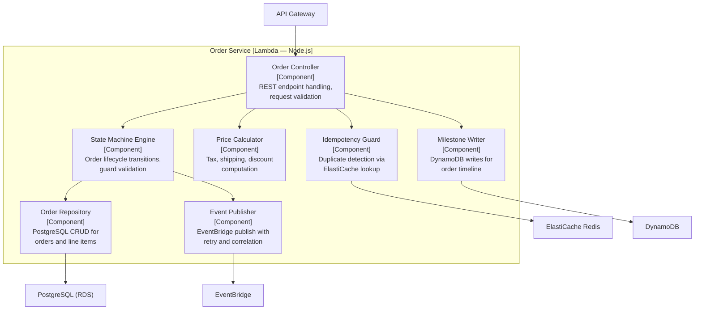
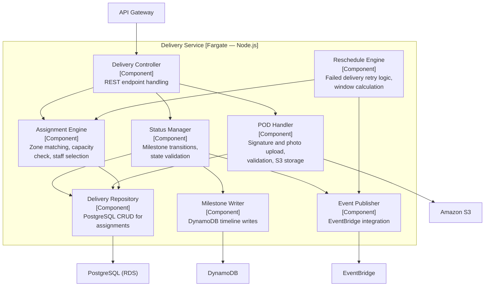
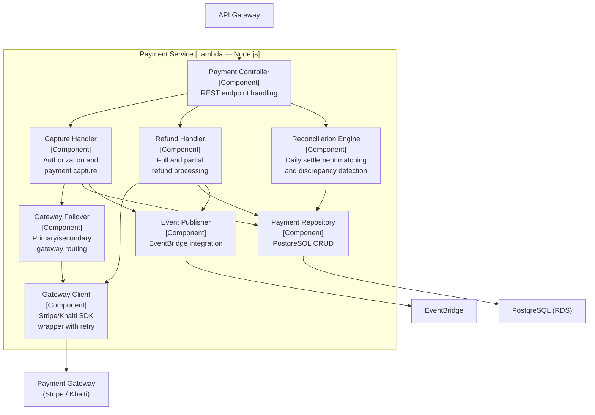
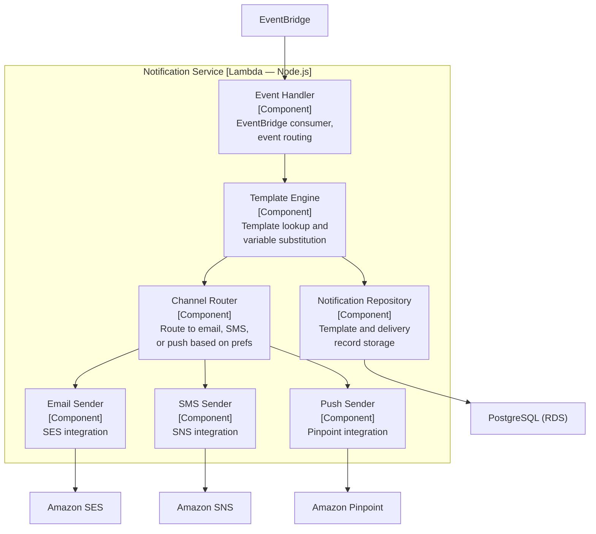

# C4 Component Diagram

## Overview

C4 Component-level diagrams for the most critical services, showing their internal components and interactions.

## Order Service — Component View

## Delivery Service — Component View

## Payment Service — Component View

## Notification Service — Component View

