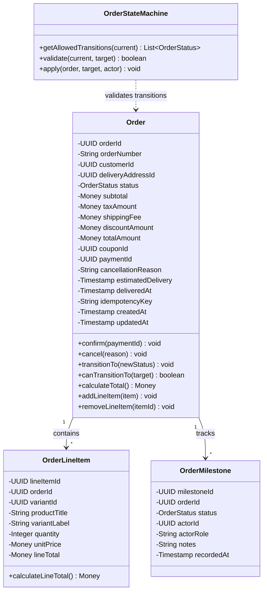
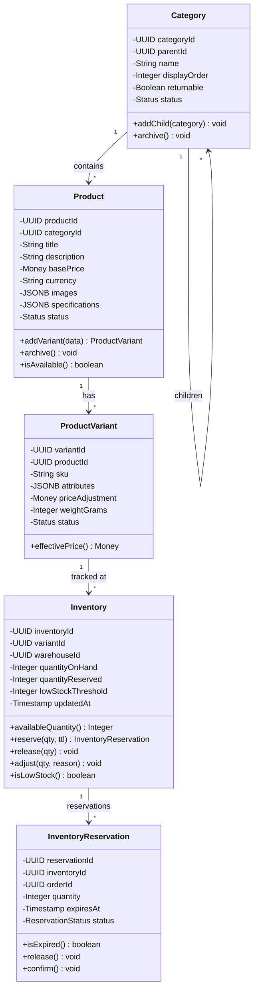
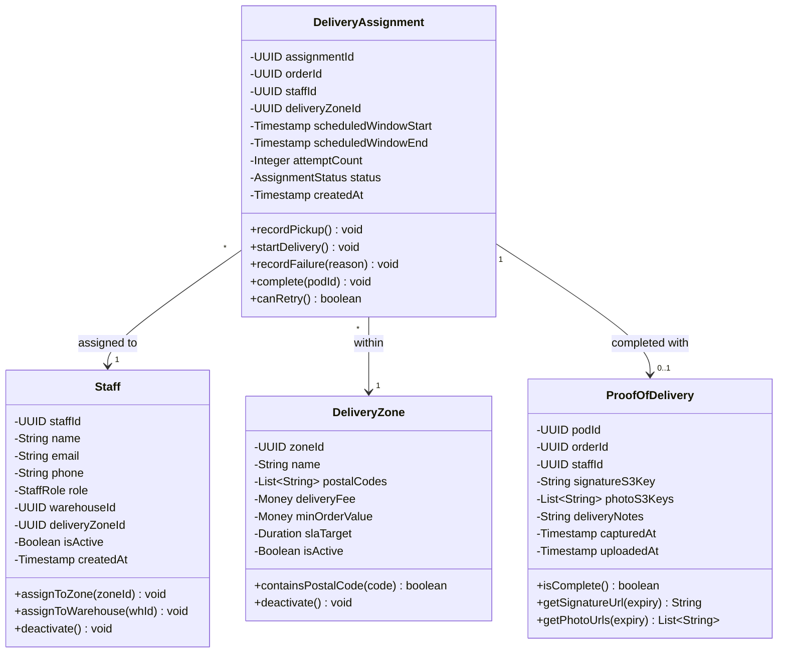
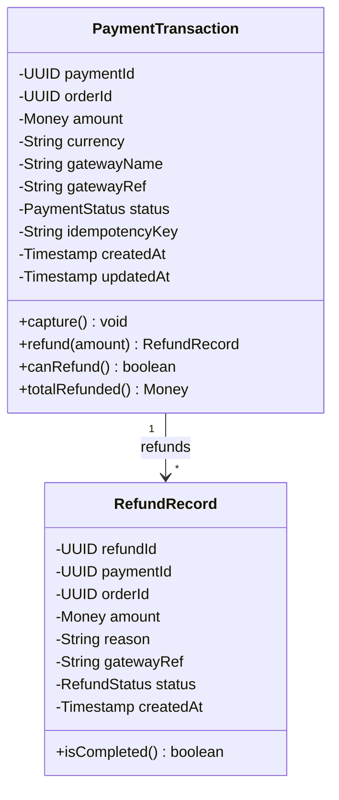
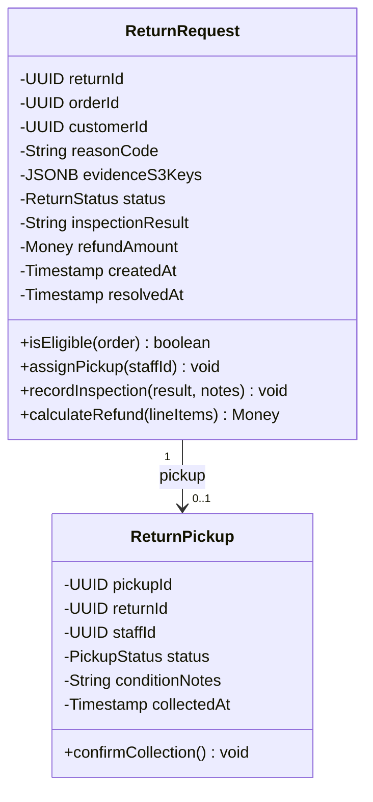

# Class Diagram

## Overview

Detailed UML class diagrams for the Order Management and Delivery System, covering all bounded contexts with attributes, methods, and relationships.

## Order Bounded Context

## Product and Inventory Context

## Delivery and POD Context

## Payment Context

## Return Context

