# Class Diagram

## Overview

Detailed UML class diagrams for the Order Management and Delivery System, covering all bounded contexts with attributes, methods, and relationships.

---

## Customer Domain

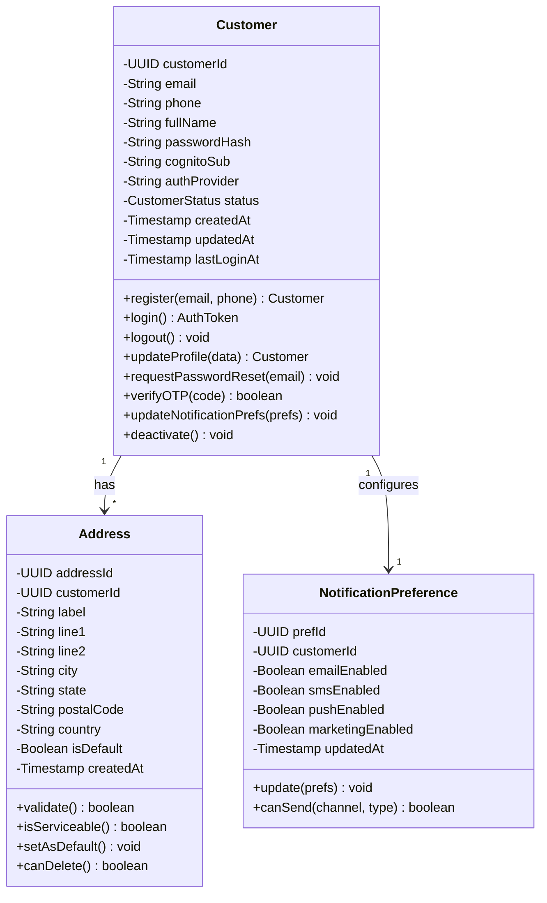

---

## Cart and Coupon Context

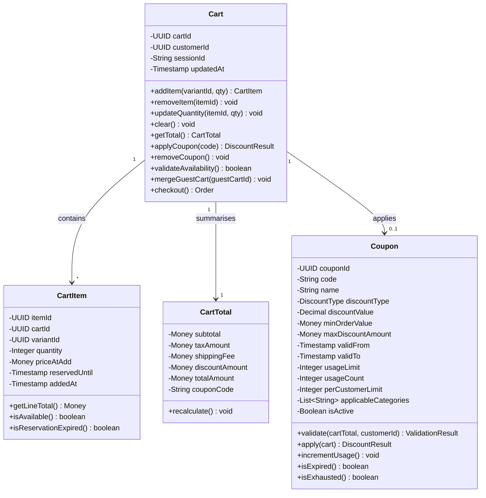

---

## Order Bounded Context

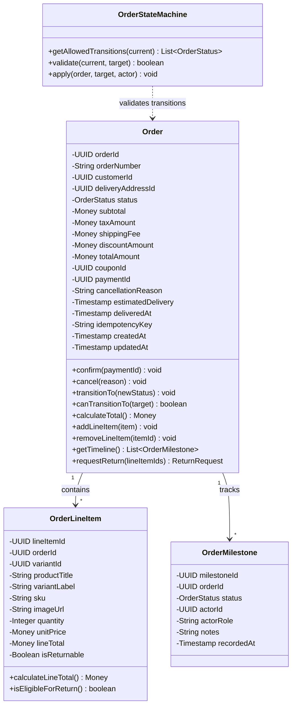

---

## Product and Inventory Context

```mermaid
classDiagram
    class Category {
        -UUID categoryId
        -UUID parentId
        -String name
        -String slug
        -String description
        -String imageUrl
        -Integer displayOrder
        -Boolean returnable
        -Status status
        -Timestamp createdAt
        +addChild(category) void
        +getSubcategories() List~Category~
        +getProducts(filters) List~Product~
        +archive() void
    }

    class Product {
        -UUID productId
        -UUID categoryId
        -String title
        -String slug
        -String description
        -String shortDescription
        -Money basePrice
        -String currency
        -JSONB images
        -JSONB specifications
        -Decimal avgRating
        -Integer reviewCount
        -Status status
        -Timestamp createdAt
        -Timestamp updatedAt
        +addVariant(data) ProductVariant
        +removeVariant(variantId) void
        +archive() void
        +publish() void
        +isAvailable() boolean
        +getPriceRange() PriceRange
    }

    class ProductVariant {
        -UUID variantId
        -UUID productId
        -String sku
        -String name
        -JSONB attributes
        -Money mrp
        -Money sellingPrice
        -Money costPrice
        -Integer weightGrams
        -JSONB dimensions
        -Boolean isDefault
        -Status status
        -Timestamp createdAt
        +effectivePrice() Money
        +getDiscountPercent() Decimal
        +getAvailableStock() Integer
    }

    class Inventory {
        -UUID inventoryId
        -UUID variantId
        -UUID warehouseId
        -Integer quantityOnHand
        -Integer quantityReserved
        -Integer lowStockThreshold
        -Integer reorderLevel
        -Integer reorderQuantity
        -Timestamp lastRestockedAt
        -Timestamp updatedAt
        +availableQuantity() Integer
        +reserve(qty, ttl) InventoryReservation
        +release(qty) void
        +adjust(qty, reason) void
        +deduct(qty) void
        +restock(qty) void
        +isLowStock() boolean
    }

    class InventoryReservation {
        -UUID reservationId
        -UUID inventoryId
        -UUID orderId
        -Integer quantity
        -Timestamp expiresAt
        -ReservationStatus status
        +isExpired() boolean
        +release() void
        +confirm() void
    }

    Category "1" --> "*" Category : children
    Category "1" --> "*" Product : contains
    Product "1" --> "*" ProductVariant : has
    ProductVariant "1" --> "*" Inventory : tracked at
    Inventory "1" --> "*" InventoryReservation : reservations
```

---

## Fulfillment Context

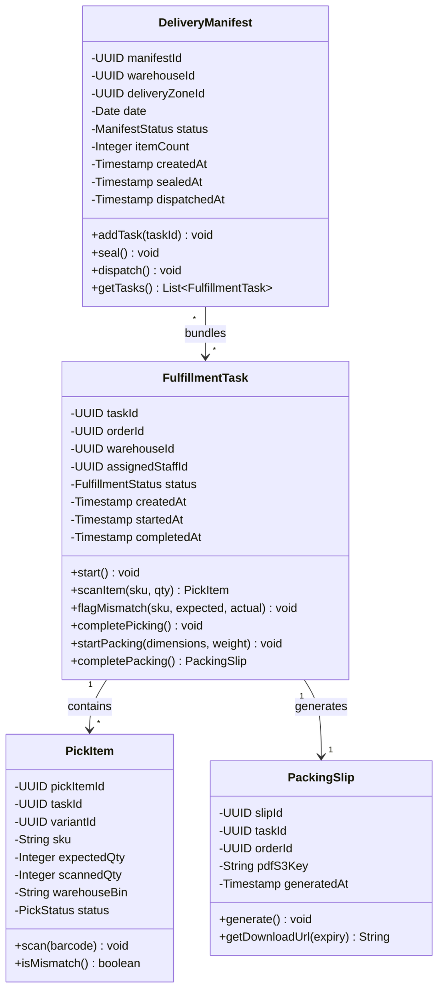

---

## Delivery and POD Context

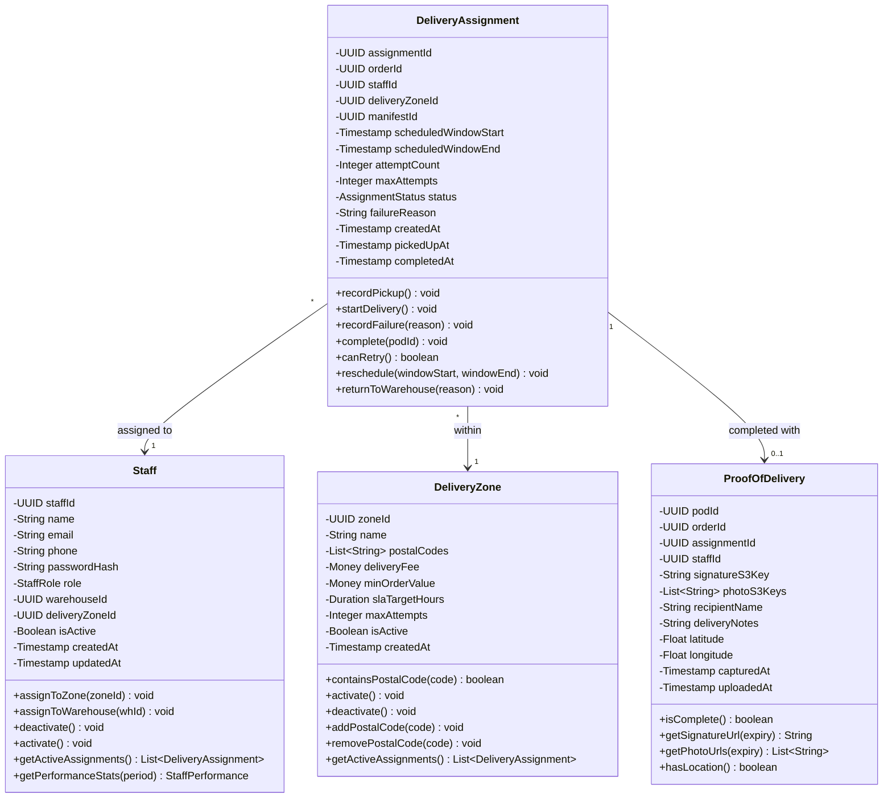

---

## Payment Context

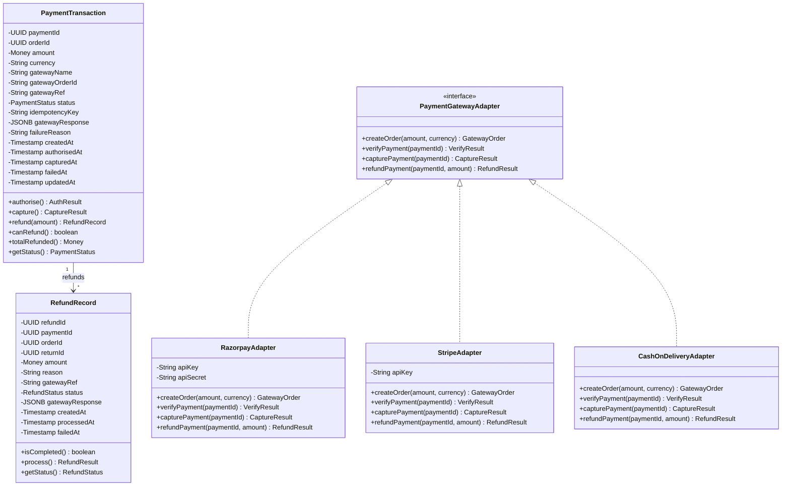

---

## Return Context

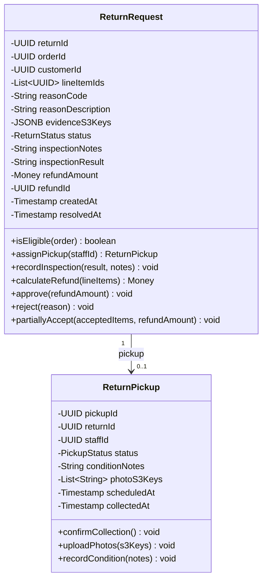

---

## Notification Context

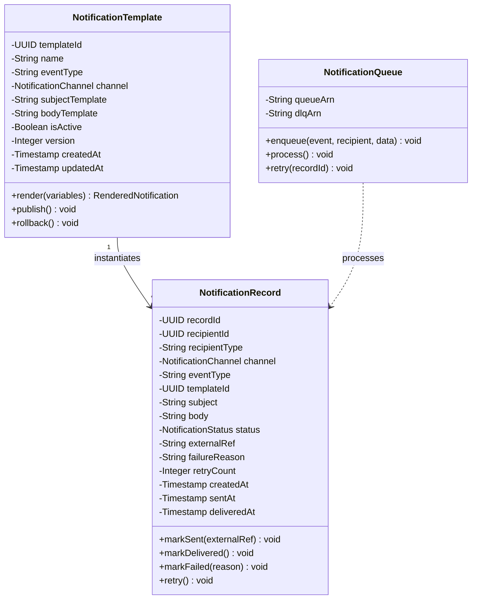

---

## Admin and Audit Context

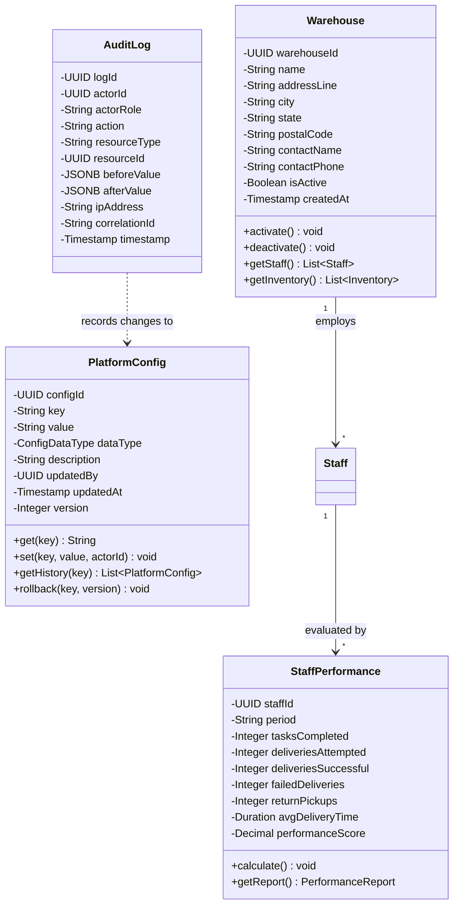

---

## Enumeration Types

```mermaid
classDiagram
    class OrderStatus {
        <<enumeration>>
        CONFIRMED
        READY_FOR_DISPATCH
        PICKED_UP
        OUT_FOR_DELIVERY
        DELIVERED
        CANCELLED
        RETURNED_TO_WAREHOUSE
    }

    class PaymentStatus {
        <<enumeration>>
        PENDING
        AUTHORIZED
        CAPTURED
        FAILED
        REFUNDED
        PARTIALLY_REFUNDED
    }

    class ReturnStatus {
        <<enumeration>>
        REQUESTED
        PICKUP_ASSIGNED
        PICKED_UP
        INSPECTING
        ACCEPTED
        REJECTED
        PARTIALLY_ACCEPTED
        REFUNDED
    }

    class StaffRole {
        <<enumeration>>
        WAREHOUSE_STAFF
        DELIVERY_STAFF
        OPERATIONS_MANAGER
        FINANCE
        ADMIN
    }

    class AssignmentStatus {
        <<enumeration>>
        ASSIGNED
        PICKED_UP
        OUT_FOR_DELIVERY
        DELIVERED
        FAILED
        RETURNED_TO_WAREHOUSE
    }

    class DiscountType {
        <<enumeration>>
        PERCENTAGE
        FIXED
        FREE_SHIPPING
    }

    class NotificationChannel {
        <<enumeration>>
        EMAIL
        SMS
        PUSH
    }

    class NotificationStatus {
        <<enumeration>>
        PENDING
        SENT
        DELIVERED
        FAILED
        BOUNCED
    }

    class FulfillmentStatus {
        <<enumeration>>
        PENDING
        IN_PROGRESS
        PICKED
        PACKED
        DISPATCHED
    }

    class ManifestStatus {
        <<enumeration>>
        DRAFT
        SEALED
        DISPATCHED
    }

    class ConfigDataType {
        <<enumeration>>
        STRING
        NUMBER
        BOOLEAN
        JSON
    }
```
