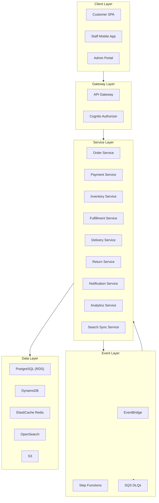
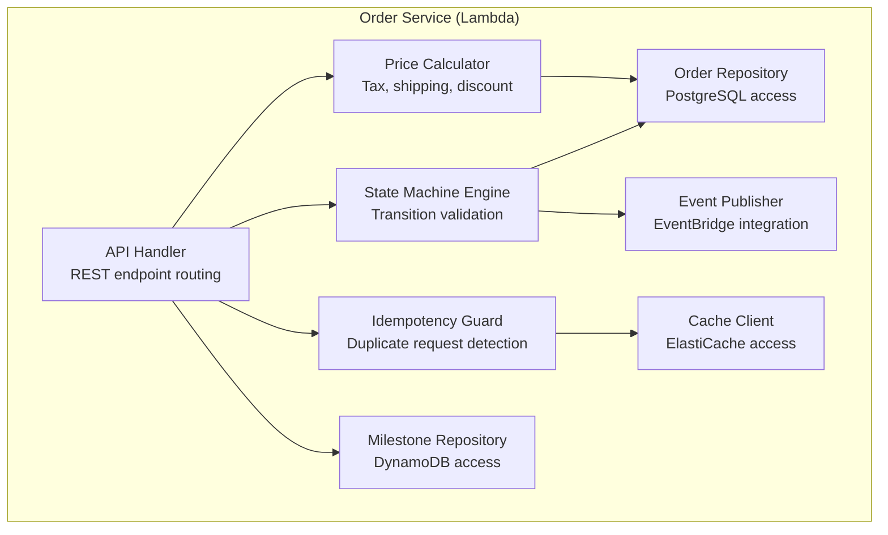
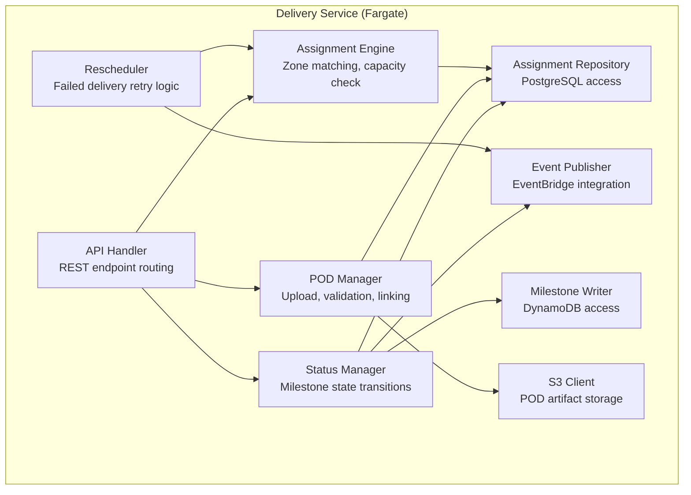
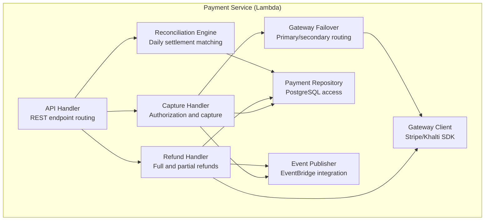

# Component Diagram

## Overview

UML component diagrams showing the internal structure and dependencies of each microservice in the Order Management and Delivery System.

## System-Level Component View

## Order Service Components

## Delivery Service Components

## Payment Service Components

## Component Dependencies Matrix

| Service | Depends On | Communication | Data Owned |
|---|---|---|---|
| Order Service | Inventory Service, Payment Service, EventBridge, RDS, DynamoDB, Redis | Sync (API) + Async (events) | orders, order_line_items, order_milestones |
| Payment Service | Payment Gateway, EventBridge, RDS | Sync (API + gateway) + Async (events) | payment_transactions, refund_records |
| Inventory Service | EventBridge, RDS, Redis | Sync (API) + Async (events) | inventory, inventory_reservations |
| Fulfillment Service | Order Service, EventBridge, Step Functions, RDS | Sync (API) + Async (events + workflows) | fulfillment_tasks |
| Delivery Service | EventBridge, RDS, DynamoDB, S3 | Sync (API) + Async (events) | delivery_assignments, proof_of_delivery |
| Return Service | Payment Service, Inventory Service, EventBridge, RDS | Sync (API) + Async (events) | return_requests, return_pickups |
| Notification Service | SES, SNS, Pinpoint, EventBridge, RDS | Async (events) | notification_records, notification_templates |
| Analytics Service | RDS (read replica), OpenSearch | Sync (API read-only) | Materialized views, report exports |
| Search Sync | OpenSearch, EventBridge | Async (events) | OpenSearch index (mirror) |
