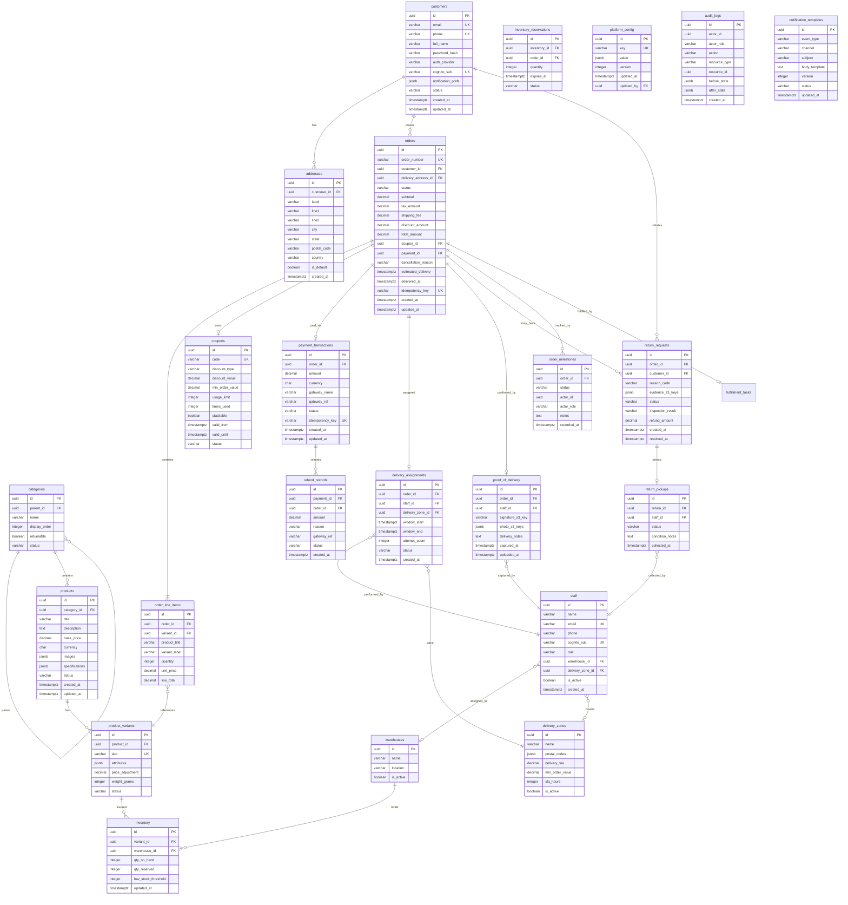

# ERD / Database Schema

## Entity Relationship Diagram

## Indexes

| Table | Index | Columns | Type | Purpose |
|---|---|---|---|---|
| orders | idx_orders_customer | customer_id, created_at DESC | B-tree | Customer order history queries |
| orders | idx_orders_status | status | B-tree | Status-based filtering |
| orders | idx_orders_number | order_number | Unique | Human-readable order lookup |
| order_line_items | idx_oli_order | order_id | B-tree | Order → line items join |
| inventory | idx_inv_variant_wh | variant_id, warehouse_id | Unique | Stock lookup per variant per warehouse |
| delivery_assignments | idx_da_staff_date | staff_id, created_at DESC | B-tree | Staff assignment queries |
| delivery_assignments | idx_da_zone_status | delivery_zone_id, status | B-tree | Zone-based assignment filtering |
| order_milestones | idx_milestones_order | order_id, recorded_at | B-tree | Milestone timeline queries |
| payment_transactions | idx_pt_order | order_id | B-tree | Payment lookup by order |
| return_requests | idx_rr_order | order_id | B-tree | Return lookup by order |
| audit_logs | idx_al_actor_date | actor_id, created_at DESC | B-tree | Actor-based audit queries |
| audit_logs | idx_al_resource | resource_type, resource_id | B-tree | Resource-based audit queries |

## Partitioning Strategy

| Table | Strategy | Partition Key | Retention |
|---|---|---|---|
| order_milestones | Range (monthly) | recorded_at | 2 years active, then archive |
| audit_logs | Range (monthly) | created_at | 1 year active, then S3 Glacier |
| orders | None (indexed) | — | 2 years active, then cold archive |
| inventory_reservations | None (TTL cleanup) | — | Expired records purged daily |
