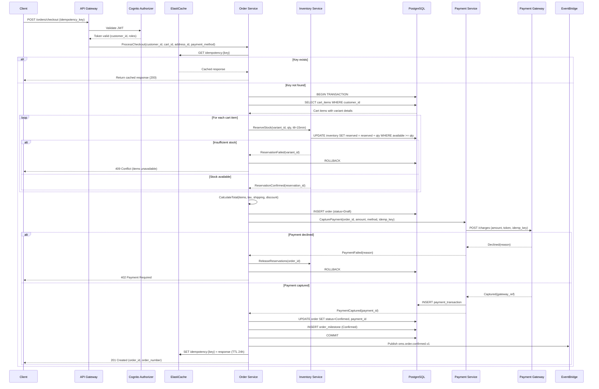
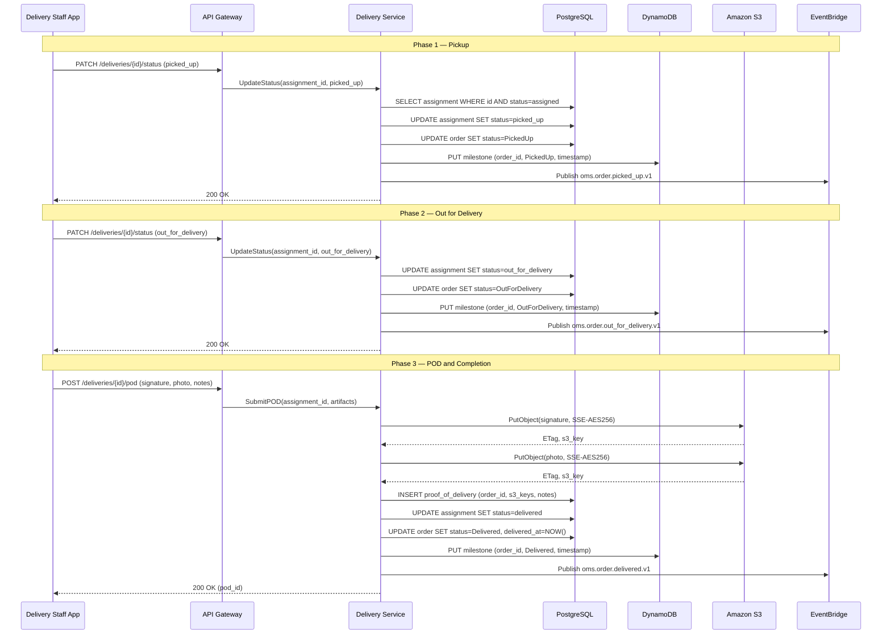
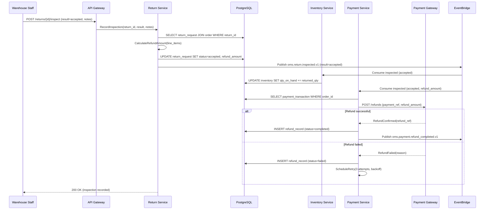

# Sequence Diagram

## Overview

Detailed inter-service sequence diagrams showing internal object interactions for the most complex flows in the system.

## 1. Checkout with Inventory Reservation and Payment

## 2. Three-Phase Delivery with POD Upload

## 3. Return Inspection to Refund

