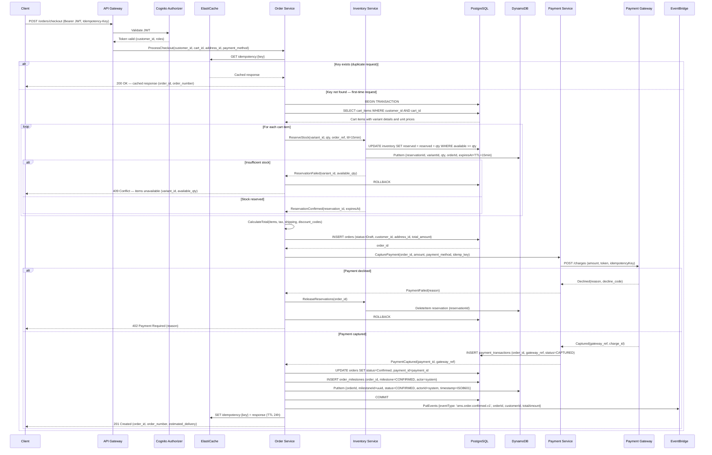
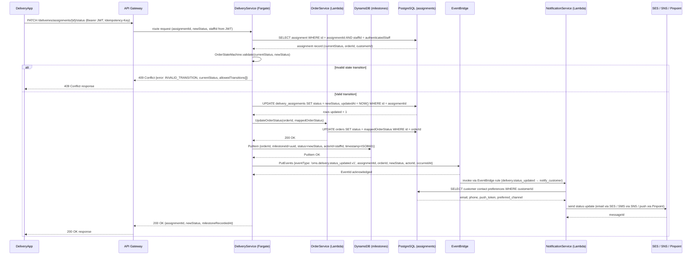
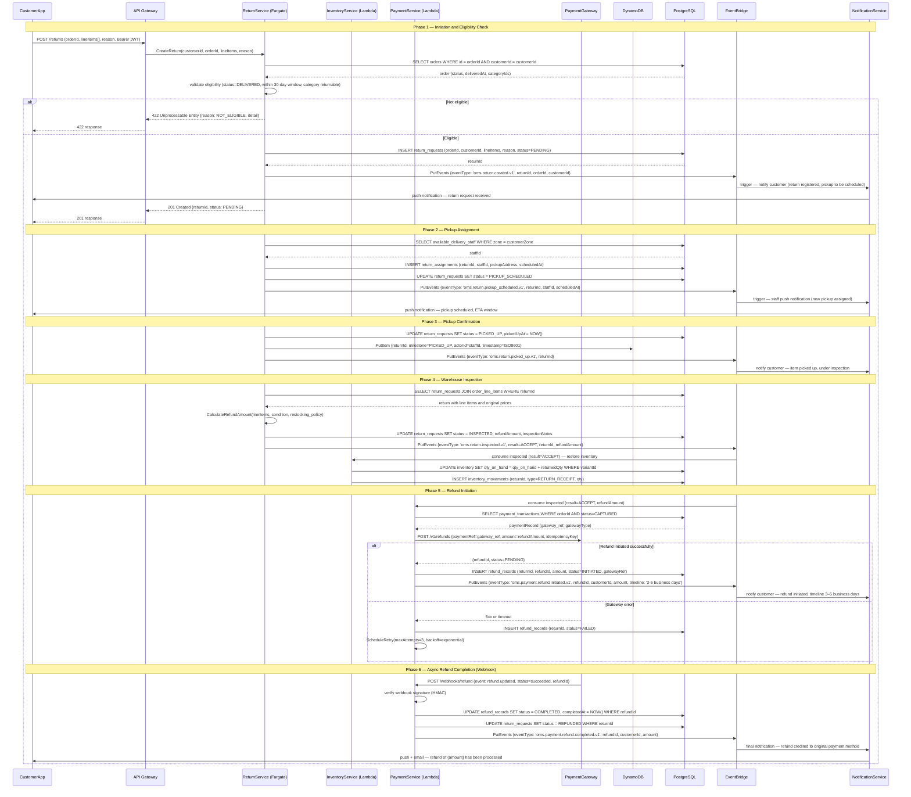
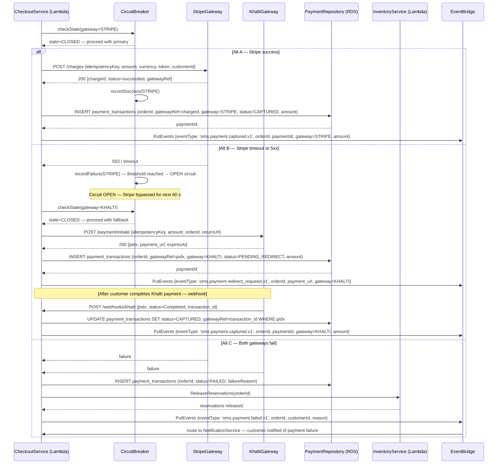
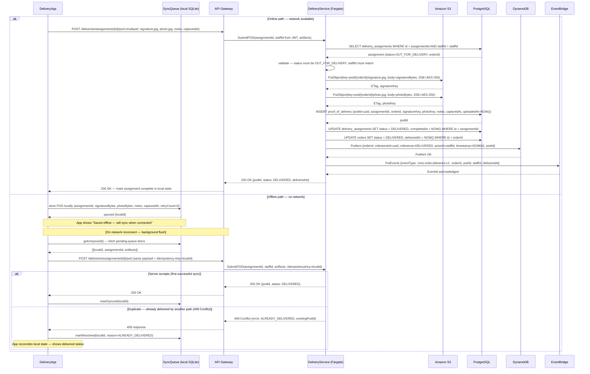

# Sequence Diagram

## Overview

Detailed inter-service sequence diagrams showing internal object interactions for the most complex flows in the system.

## 1. Checkout with Inventory Reservation and Payment

## 2. Delivery Status Update

## 3. Return and Refund Processing

## 4. Payment Capture with Gateway Failover

> **Note:** The same `idempotencyKey` is forwarded to both the primary and fallback gateway calls. Each gateway treats it independently via its own idempotency header, ensuring no duplicate charge even if the client retries the checkout request.

## 5. POD Upload with Offline Sync

