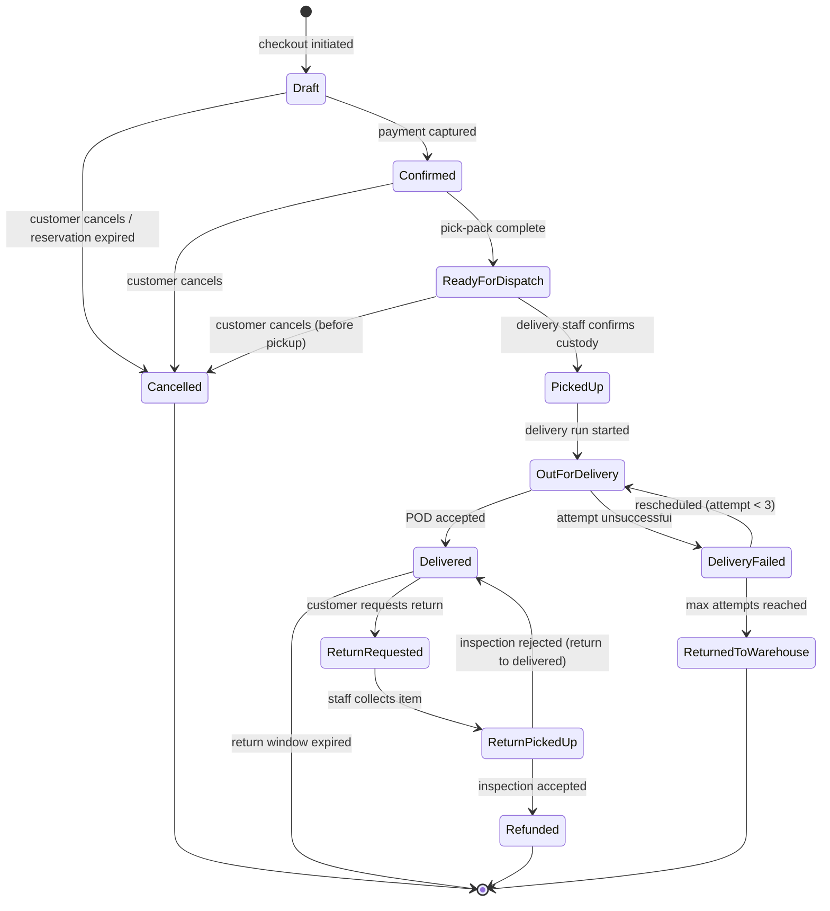
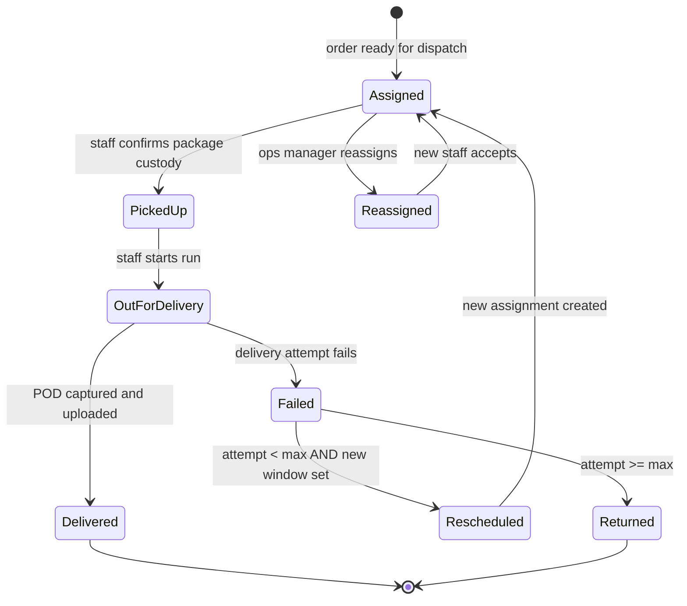
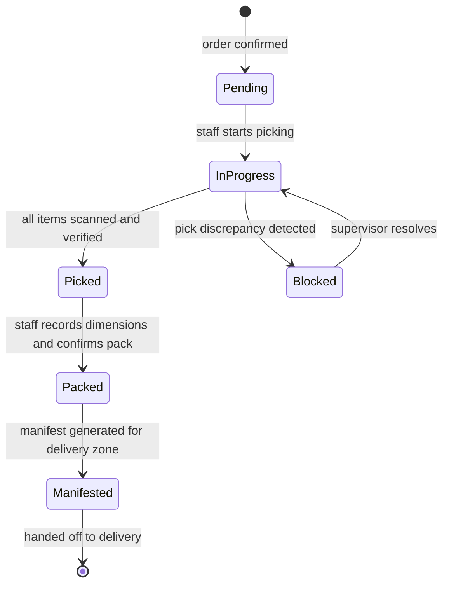
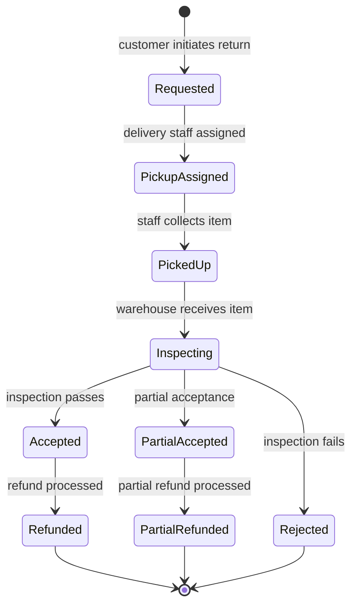

# State Machine Diagram

## Overview

Complete finite state machines for the Order lifecycle and Delivery Assignment lifecycle, with guards, actions, and side-effects.

## Order Lifecycle State Machine

## Order State Transition Details

| From | To | Guard | Action | Side Effects |
|---|---|---|---|---|
| Draft | Confirmed | Payment status = captured | Set payment_id, update status | Emit `order.confirmed.v1`; create fulfillment task; send confirmation notification |
| Draft | Cancelled | Reservation expired OR customer requests cancel | Set cancellation_reason | Release inventory; emit `order.cancelled.v1`; send cancellation notification |
| Confirmed | ReadyForDispatch | Fulfillment task status = packed AND manifest generated | Update status | Emit `order.ready_for_dispatch.v1`; trigger delivery assignment; notify customer |
| Confirmed | Cancelled | Customer requests cancel AND status = Confirmed | Set cancellation_reason | Release inventory; initiate refund; emit `order.cancelled.v1` |
| ReadyForDispatch | PickedUp | Delivery staff scans/confirms package | Record staff_id, pickup_timestamp | Emit `order.picked_up.v1`; record milestone |
| ReadyForDispatch | Cancelled | Customer requests cancel AND not yet picked up | Set cancellation_reason | Release inventory; initiate refund; emit `order.cancelled.v1`; cancel assignment |
| PickedUp | OutForDelivery | Staff starts delivery run | Record timestamp | Emit `order.out_for_delivery.v1`; notify customer with delivery window |
| OutForDelivery | Delivered | POD captured (signature + photo) AND uploaded | Set delivered_at, pod_id | Emit `order.delivered.v1`; send delivery confirmation with POD link |
| OutForDelivery | DeliveryFailed | Staff records failure reason | Increment attempt_count, record reason | Emit `order.delivery_failed.v1`; notify customer |
| DeliveryFailed | OutForDelivery | attempt_count < 3 AND rescheduled | New delivery window set | Emit `order.delivery_rescheduled.v1`; create new assignment; notify customer |
| DeliveryFailed | ReturnedToWarehouse | attempt_count >= 3 | Update status | Emit `order.returned_to_warehouse.v1`; restore inventory; notify customer |
| Delivered | ReturnRequested | Within return window AND category allows returns | Create return request | Emit `return.requested.v1`; assign return pickup |
| ReturnRequested | ReturnPickedUp | Staff confirms collection from customer | Record collection timestamp | Emit `return.picked_up.v1`; generate return manifest |
| ReturnPickedUp | Refunded | Inspection result = accepted | Calculate and process refund | Emit `return.inspected.v1`; restore inventory; initiate refund; notify customer |
| ReturnPickedUp | Delivered | Inspection result = rejected | Return order to Delivered state | Notify customer of rejection with reason |

## Delivery Assignment State Machine

## Fulfillment Task State Machine

## Return Request State Machine

