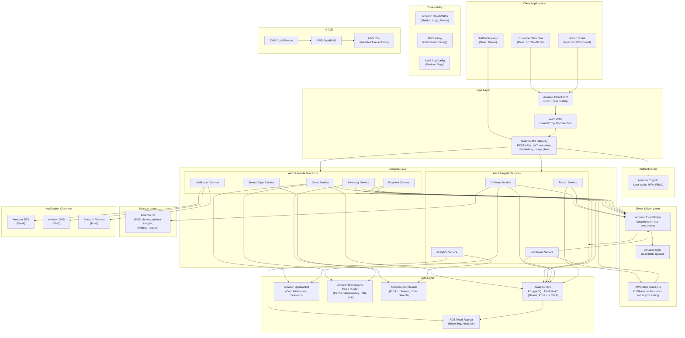

# Architecture Diagram

## Overview

This document presents the AWS solution architecture for the Order Management and Delivery System, showing all major components, their interactions, and the technology choices.

## Solution Architecture

## Component Responsibilities

| Component | Technology | Responsibilities |
|---|---|---|
| API Gateway | Amazon API Gateway | Request routing, JWT validation via Cognito authorizer, rate limiting, request/response transformation |
| Order Service | Lambda | Order CRUD, state machine transitions, idempotency enforcement, milestone recording |
| Payment Service | Lambda | Payment capture via gateway, refund processing, reconciliation report generation |
| Inventory Service | Lambda | Stock reservation/release, quantity adjustments, low-stock alerting |
| Notification Service | Lambda | Template rendering, multi-channel dispatch (SES/SNS/Pinpoint), delivery tracking |
| Search Sync Service | Lambda | DynamoDB Streams / EventBridge consumer syncing product data to OpenSearch |
| Fulfillment Service | Fargate | Pick-pack workflow management, barcode validation, manifest generation |
| Delivery Service | Fargate | Delivery assignment, status tracking, POD management, failed delivery handling |
| Return Service | Fargate | Return eligibility, pickup assignment, inspection result processing |
| Analytics Service | Fargate | Dashboard aggregation, report generation, KPI calculation |

## Cross-Cutting Concerns

| Concern | Implementation |
|---|---|
| Authentication | Cognito user pools with JWT; separate pools for customers and staff |
| Authorization | Cognito groups mapped to IAM roles; API Gateway authorizer enforces RBAC |
| Encryption in Transit | TLS 1.3 everywhere; API Gateway terminates TLS; internal calls use VPC endpoints |
| Encryption at Rest | RDS encryption (KMS), DynamoDB encryption, S3 SSE-S3, ElastiCache encryption |
| Logging | Structured JSON via CloudWatch Logs; correlation_id propagated across services |
| Tracing | X-Ray SDK in all Lambda/Fargate; trace segments for external calls |
| Feature Flags | AppConfig with deployment strategy for gradual rollouts |
| Secrets | AWS Secrets Manager for database credentials and API keys |
