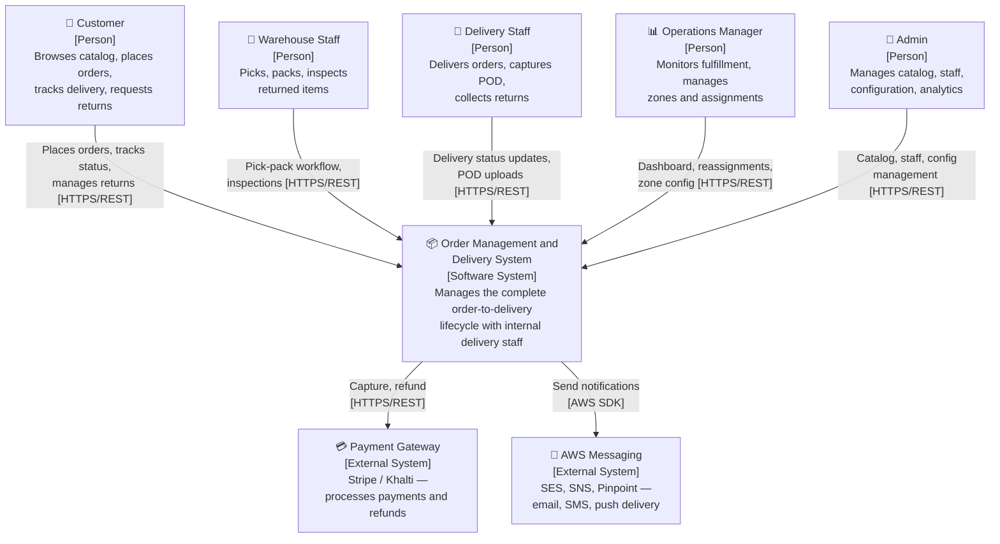
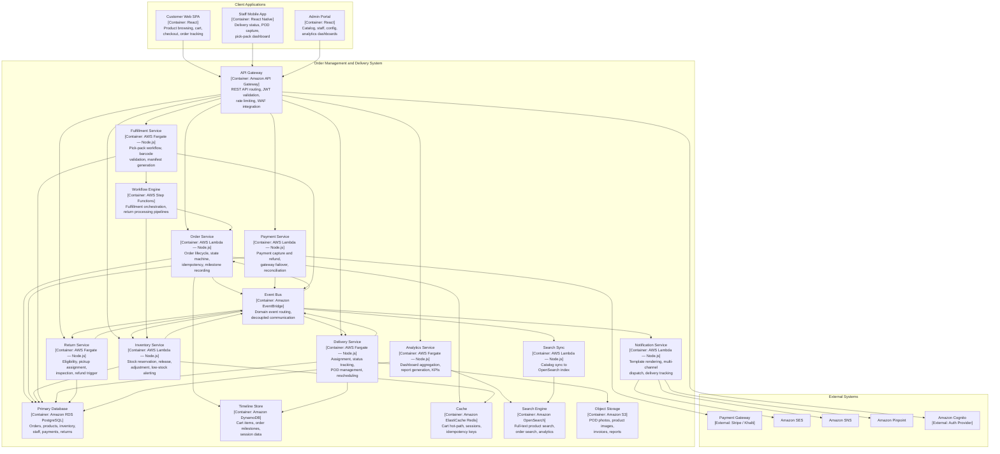

# C4 Context and Container Diagrams

## C4 Context Diagram

## C4 Container Diagram

## Container Responsibilities and Communication

| Container | Runtime | Communication Style | Data Owned |
|---|---|---|---|
| API Gateway | Managed | Synchronous REST | None (stateless proxy) |
| Order Service | Lambda | Sync (API) + Async (EventBridge) | orders, order_line_items, order_milestones |
| Payment Service | Lambda | Sync (API + Gateway) + Async (EventBridge) | payment_transactions, refund_records |
| Inventory Service | Lambda | Sync (API) + Async (EventBridge) | inventory, inventory_reservations |
| Notification Service | Lambda | Async (EventBridge consumer) | notification_records, notification_templates |
| Fulfillment Service | Fargate | Sync (API) + Async (EventBridge + Step Functions) | fulfillment_tasks, packing_slips |
| Delivery Service | Fargate | Sync (API) + Async (EventBridge) | delivery_assignments, proof_of_delivery |
| Return Service | Fargate | Sync (API) + Async (EventBridge) | return_requests, return_inspections |
| Analytics Service | Fargate | Sync (API, read-only) | Derived metrics (materialized views) |
| Search Sync | Lambda | Async (EventBridge consumer) | OpenSearch index (mirror) |
