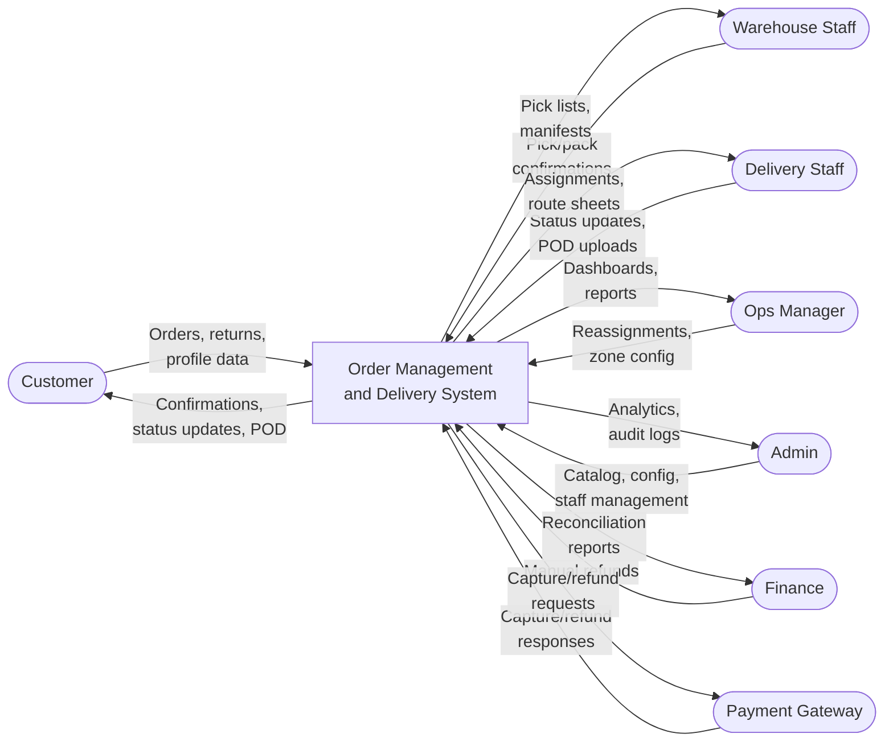
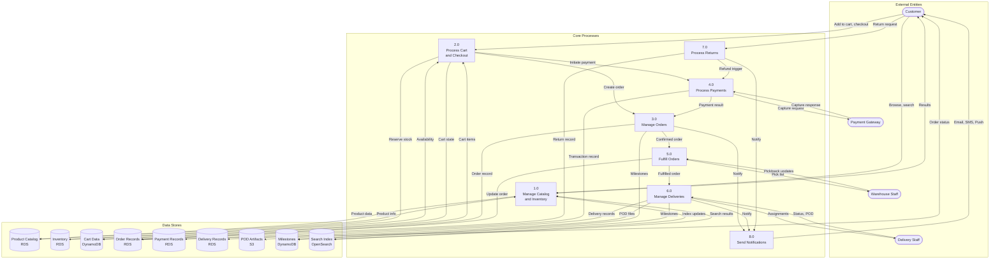

# Data Flow Diagram

## Overview

This document presents DFD Level-0 and Level-1 diagrams showing data inputs, processing, data stores, and outputs for the Order Management and Delivery System.

## DFD Level 0 — Context

## DFD Level 1 — Major Processes

## Data Store Details

| Store | Technology | Data | Access Pattern | Retention |
|---|---|---|---|---|
| Product Catalog | RDS (PostgreSQL) | Products, variants, categories | Read-heavy; cached in ElastiCache | Indefinite (soft delete) |
| Inventory | RDS (PostgreSQL) | Stock levels, reservations | Read-write; optimistic locking | Indefinite |
| Cart Data | DynamoDB | Cart items, session state | Key-value by customer_id | 30 days TTL for abandoned carts |
| Order Records | RDS (PostgreSQL) | Orders, line items, return requests | Primary key + status index lookups | 2 years active; then S3 archive |
| Payment Records | RDS (PostgreSQL) | Transactions, refunds | Primary key + order_id lookups | 7 years (regulatory) |
| Delivery Records | RDS (PostgreSQL) | Assignments, attempt logs | Zone + staff + date range queries | 2 years active |
| POD Artifacts | S3 | Signature images, delivery photos | Object key by order_id | 5 years; lifecycle to Glacier |
| Milestones | DynamoDB | Status timeline per order | order_id sort key by timestamp | 2 years TTL |
| Search Index | OpenSearch | Product search index | Full-text + structured queries | Mirrors catalog (real-time sync) |

## Data Privacy and Retention

- **PII fields** (customer name, email, phone, addresses) are encrypted at rest in RDS and can be purged on account deletion (right to erasure).
- **Payment tokens** are stored; raw card numbers are never persisted (PCI-DSS).
- **POD photos** may contain identifiable information; access is restricted to order owner, admin, and finance roles via signed S3 URLs with 1-hour expiry.
- **Audit logs** are immutable and retained for 1 year in CloudWatch Logs, then archived to S3 Glacier for long-term compliance.
