# Domain Model

## Overview

This document presents the high-level domain model for the Order Management and Delivery System, identifying core aggregates, value objects, and their relationships.

## Bounded Contexts

| Context | Responsibility | Core Aggregates |
|---|---|---|
| Customer Management | Registration, profiles, addresses, auth | Customer, Address |
| Product Catalog | Categories, products, variants, search | Category, Product, ProductVariant |
| Inventory | Stock tracking, reservations, adjustments | Inventory, InventoryReservation |
| Order | Order lifecycle, line items, state machine | Order, OrderLineItem, OrderMilestone |
| Payment | Capture, refund, reconciliation | PaymentTransaction, RefundRecord |
| Fulfillment | Pick, pack, manifest generation | FulfillmentTask, PackingSlip |
| Delivery | Assignment, status tracking, POD | DeliveryAssignment, ProofOfDelivery |
| Returns | Return requests, pickup, inspection | ReturnRequest, ReturnPickup, ReturnInspection |
| Notification | Template management, dispatch, tracking | NotificationTemplate, NotificationRecord |
| Analytics | Dashboards, reports, KPIs | SalesMetric, DeliveryMetric, InventoryMetric |
| Administration | RBAC, config, staff, audit | Staff, DeliveryZone, Warehouse, AuditLog, PlatformConfig |

## Domain Model Diagram

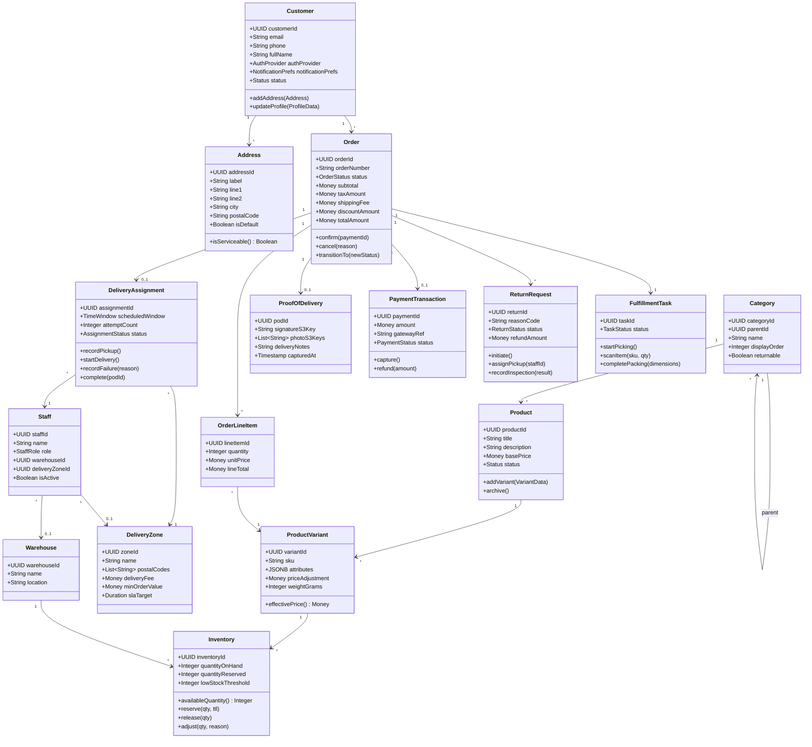

## Customer Management Domain

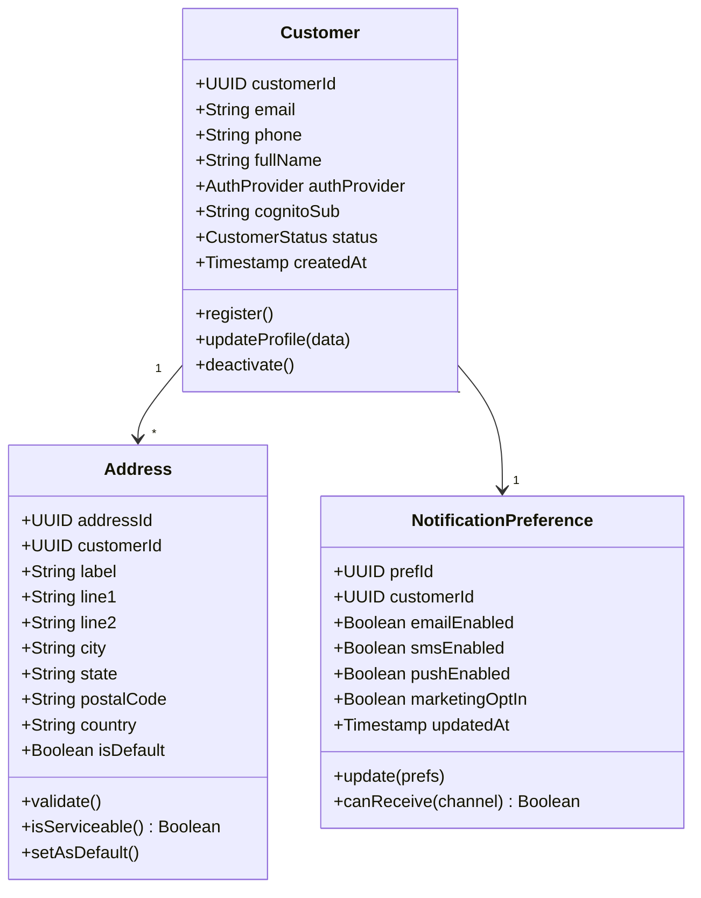

## Product Catalog Domain

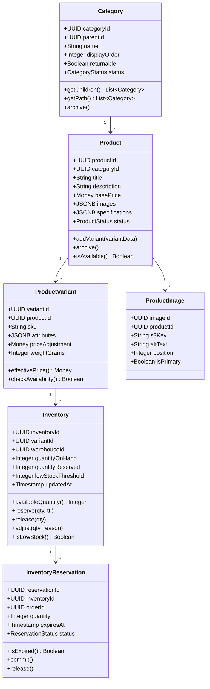

## Cart and Order Domain

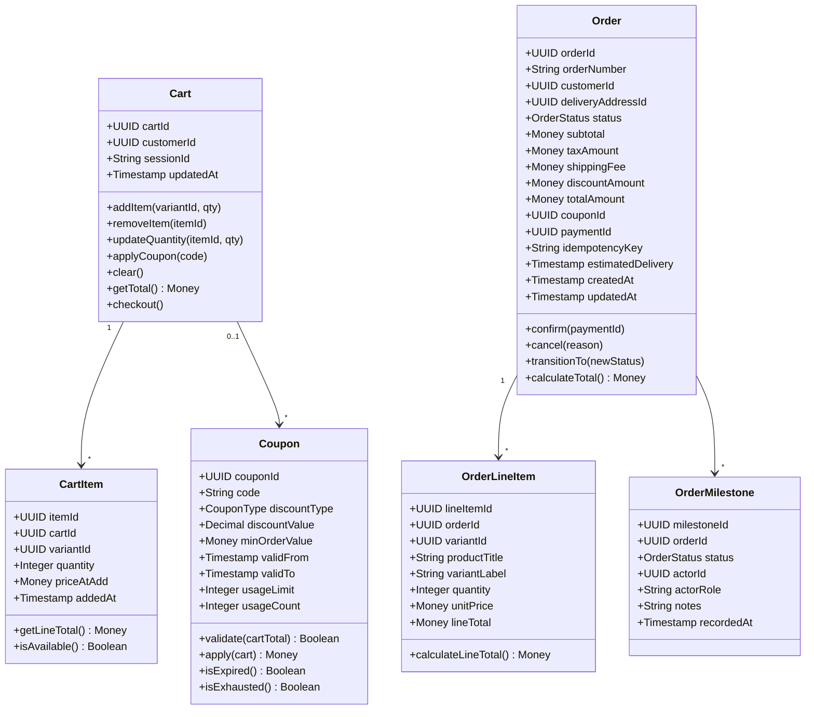

## Payment Domain

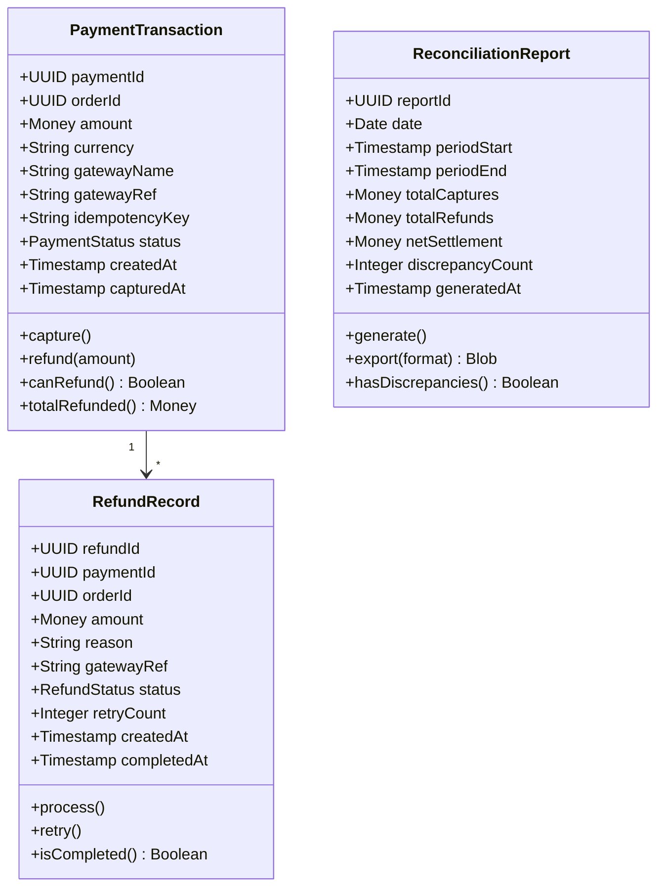

## Fulfillment Domain

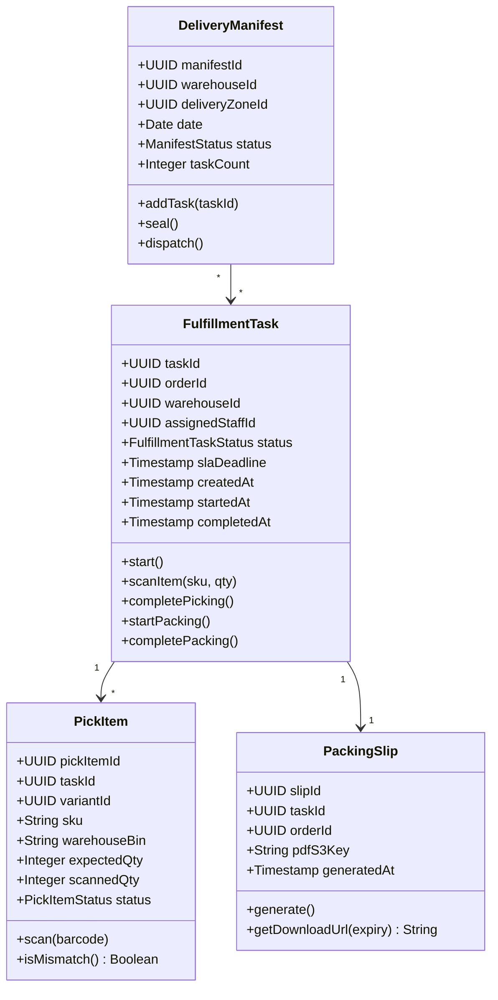

## Delivery Domain

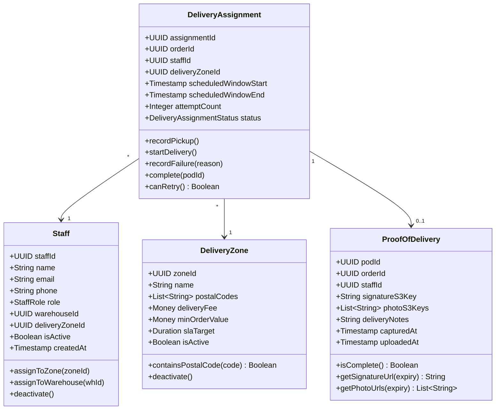

## Returns Domain

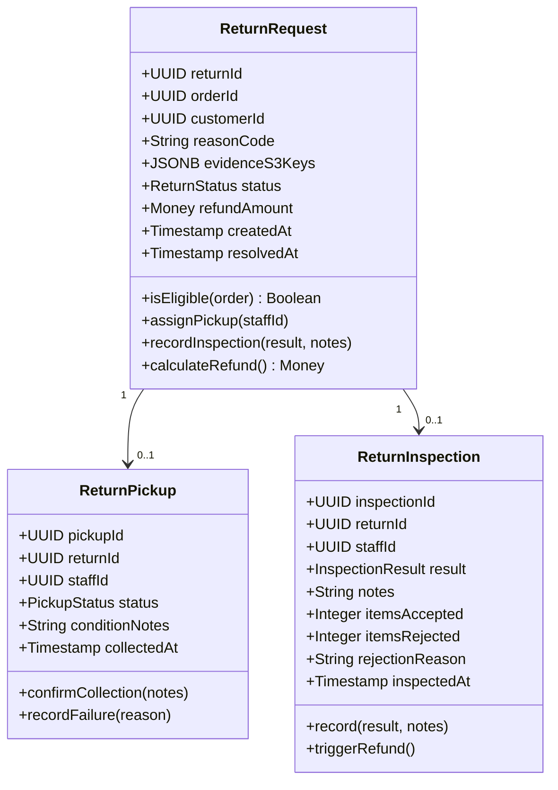

## Notification Domain

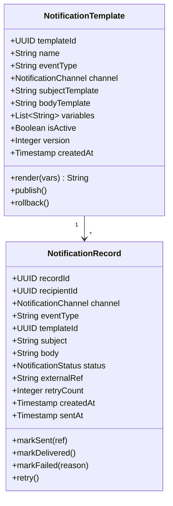

## Admin and Audit Domain

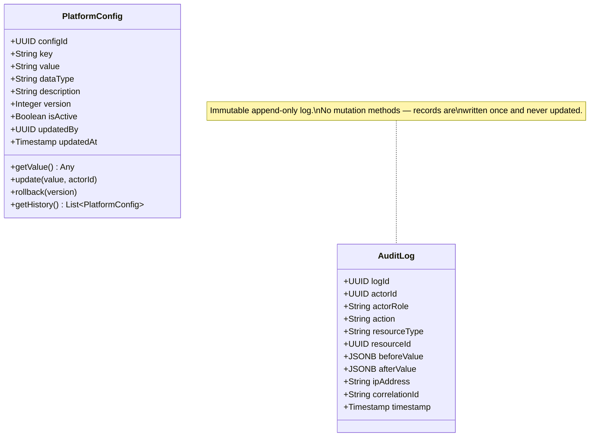

## Enumeration Types

```mermaid
classDiagram
    class OrderStatus {
        <<enumeration>>
        CONFIRMED
        READY_FOR_DISPATCH
        PICKED_UP
        OUT_FOR_DELIVERY
        DELIVERED
        CANCELLED
        RETURNED_TO_WAREHOUSE
    }

    class PaymentStatus {
        <<enumeration>>
        PENDING
        AUTHORIZED
        CAPTURED
        FAILED
        REFUNDED
        PARTIALLY_REFUNDED
    }

    class ReturnStatus {
        <<enumeration>>
        REQUESTED
        PICKUP_ASSIGNED
        PICKED_UP
        INSPECTING
        ACCEPTED
        REJECTED
        PARTIALLY_ACCEPTED
    }

    class StaffRole {
        <<enumeration>>
        WAREHOUSE_STAFF
        DELIVERY_STAFF
        OPERATIONS_MANAGER
        FINANCE
        ADMIN
    }

    class DeliveryAssignmentStatus {
        <<enumeration>>
        ASSIGNED
        PICKED_UP
        OUT_FOR_DELIVERY
        DELIVERED
        FAILED
        RETURNED_TO_WAREHOUSE
    }

    class FulfillmentTaskStatus {
        <<enumeration>>
        PENDING
        IN_PROGRESS
        PICKED
        PACKED
        DISPATCHED
    }

    class CouponType {
        <<enumeration>>
        PERCENTAGE
        FIXED_AMOUNT
        FREE_SHIPPING
    }

    class NotificationChannel {
        <<enumeration>>
        EMAIL
        SMS
        PUSH
    }
```

## Aggregate Boundaries

| Aggregate Root | Entities Inside Boundary | Invariants |
|---|---|---|
| Order | OrderLineItem, OrderMilestone | Total = sum(line_totals) + tax + shipping - discount; state transitions follow FSM |
| Product | ProductVariant | At least one variant per product; SKU globally unique |
| Inventory | InventoryReservation | qty_on_hand >= 0; qty_reserved <= qty_on_hand; reservation has TTL |
| DeliveryAssignment | (standalone) | attempt_count <= max_attempts; zone must match address zone |
| ReturnRequest | ReturnPickup, ReturnInspection | Return within window; refund_amount <= original payment |
| PaymentTransaction | RefundRecord | Refund total <= capture amount; idempotent operations |
| FulfillmentTask | (standalone) | All items scanned before pack complete; one active task per staff |
