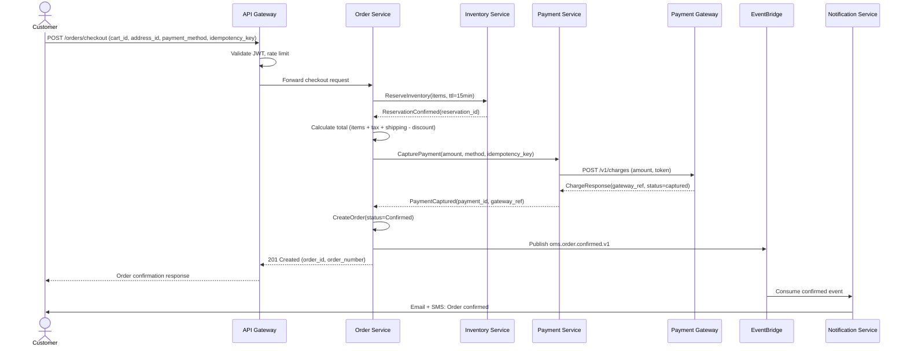
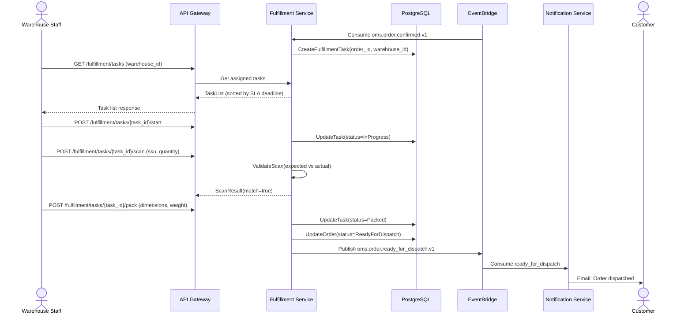
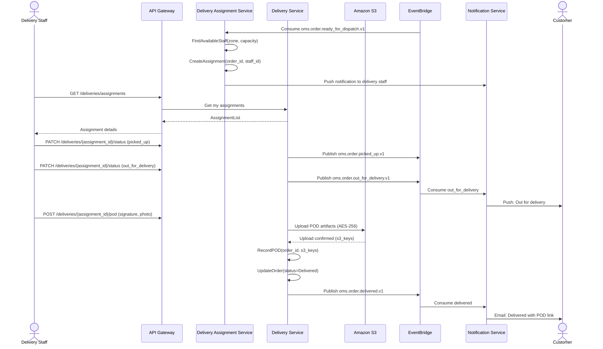
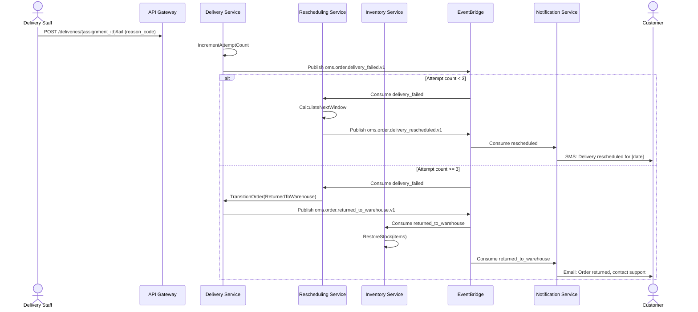
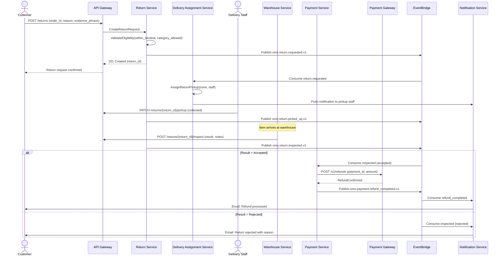

# System Sequence Diagram

## Overview

This document presents system-level sequence diagrams showing the key interactions between actors, the Order Management and Delivery System, and external services.

## 1. Order Placement and Payment

## 2. Fulfillment — Pick, Pack, Manifest

## 3. Delivery Assignment and Execution

## 4. Failed Delivery and Rescheduling

## 5. Return and Refund

