# System Sequence Diagram

## Overview

System Sequence Diagrams (SSD) show the key interactions between actors and the Order Management and Delivery System. Diagrams 1–5 show internal service-level flows; diagrams 6–11 treat OMS as a black box to highlight actor-facing behaviour.

---

## 1. Customer: Order Placement and Payment

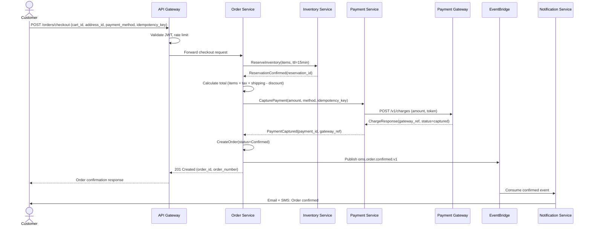

## 2. Warehouse Staff: Fulfillment — Pick, Pack, Manifest

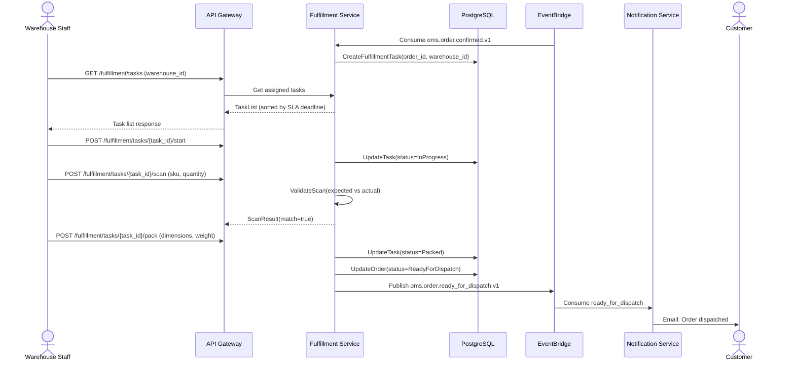

## 3. Delivery Staff: Delivery Assignment and Execution

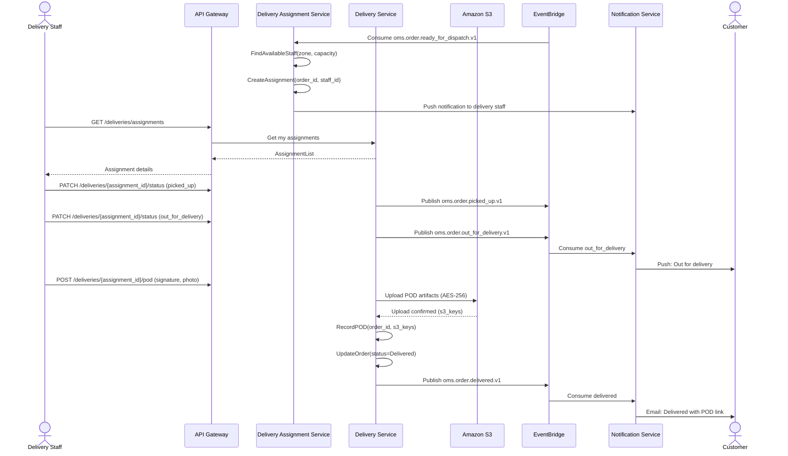

## 4. Customer and Delivery Staff: Failed Delivery and Rescheduling

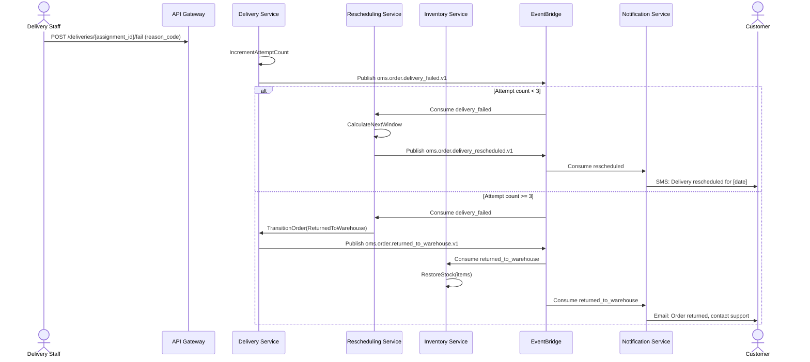

## 5. Customer: Return and Refund

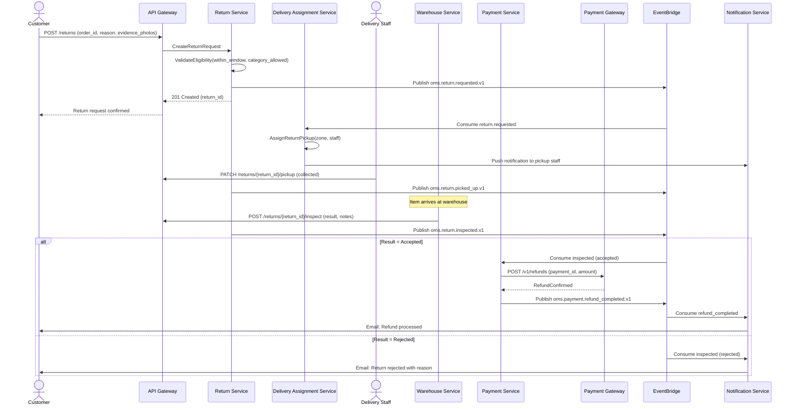

---

## 6. Warehouse Staff: Fulfill Order

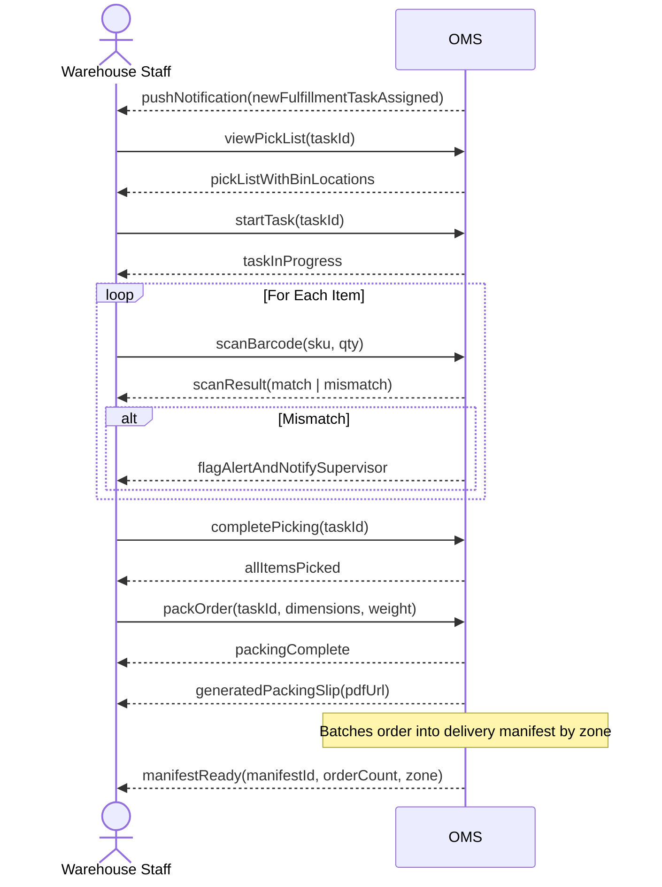

---

## 7. Operations Manager: Manage Delivery Operations

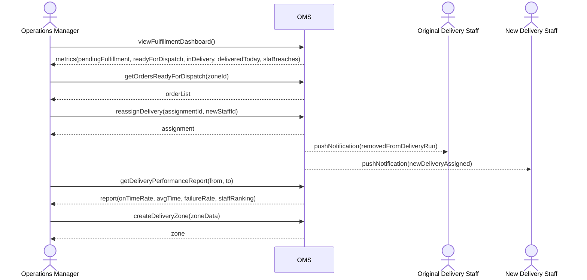

---

## 8. Admin: Configure Platform and View Audit Logs

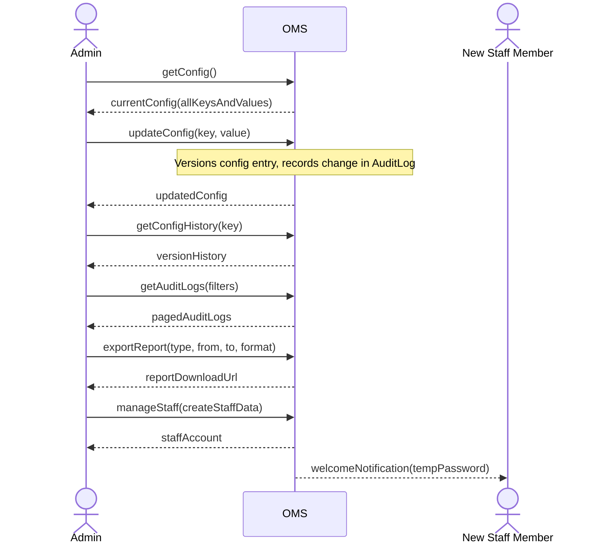

---

## 9. Finance: Payment Reconciliation

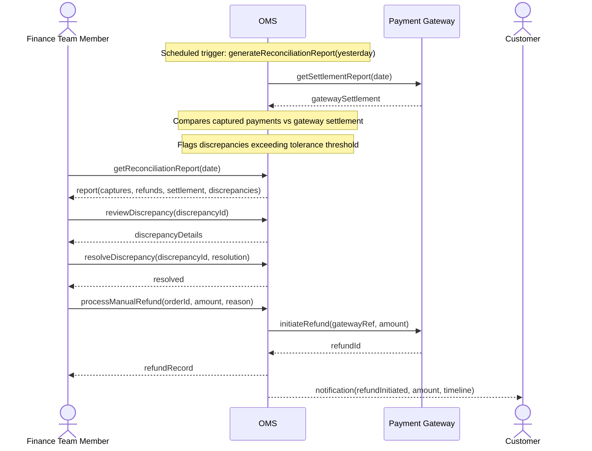

---

## 10. System: Inventory Reservation Expiry

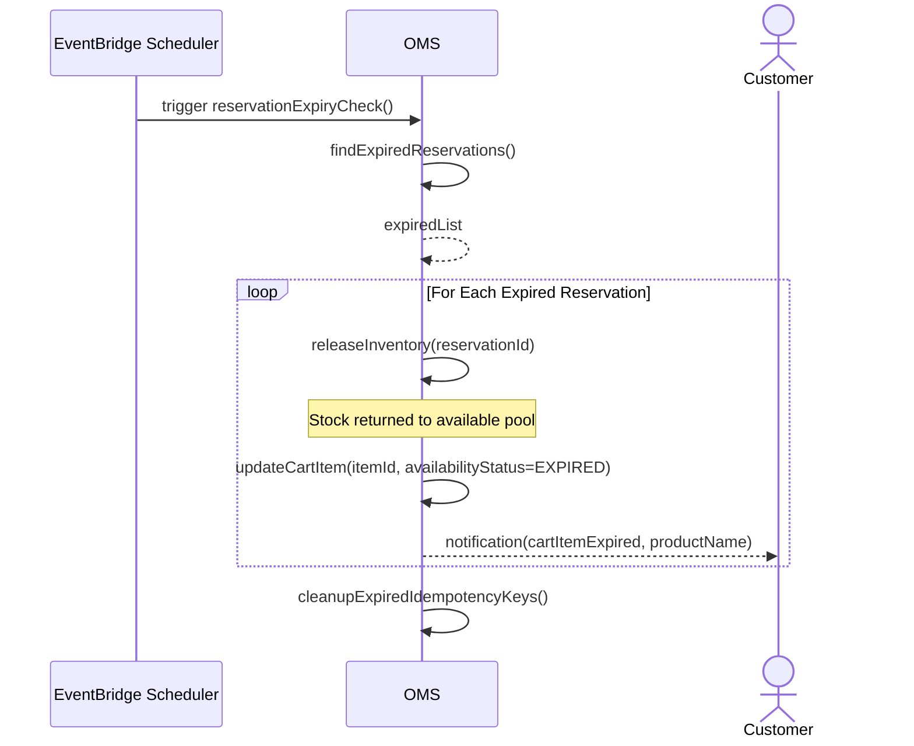

---

## 11. Customer: Failed Delivery and Reschedule

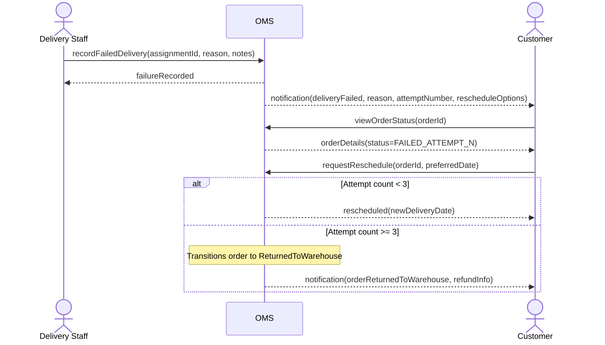
