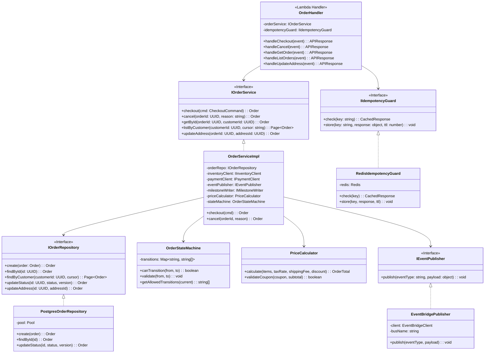
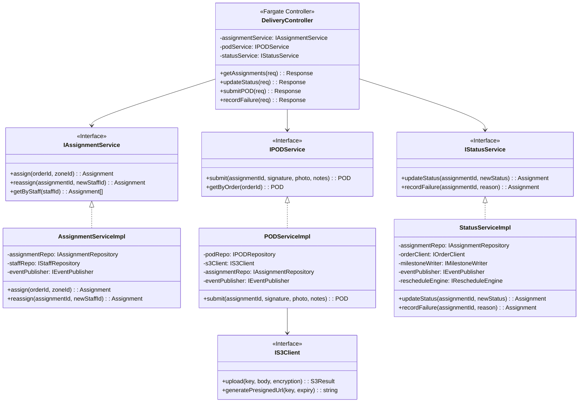
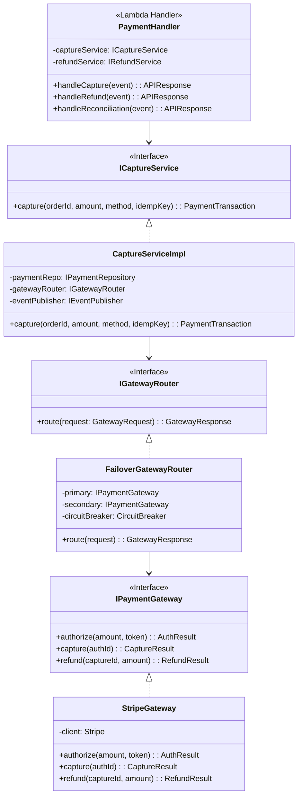

# C4 Code Diagram

## Overview

C4 Code-level diagrams showing the internal class structure and key code-level relationships for the most critical service implementations.

## Order Service — Code Level

## Delivery Service — Code Level

## Payment Service — Code Level

