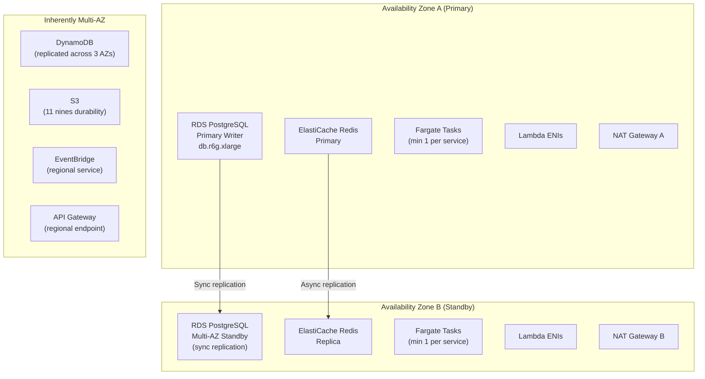
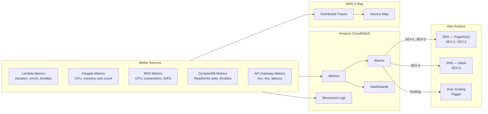

# Cloud Architecture

## Overview

Multi-AZ disaster recovery, backup strategy, and operational procedures for the Order Management and Delivery System on AWS.

## Multi-AZ High Availability

## Backup Strategy

| Component | Backup Method | Schedule | Retention | Recovery |
|---|---|---|---|---|
| RDS PostgreSQL | Automated snapshots | Daily at 02:00 UTC | 30 days | Point-in-time recovery (5-min granularity) |
| RDS PostgreSQL | Manual snapshot | Before major deployments | Until manually deleted | Full instance restore |
| DynamoDB | Continuous backups (PITR) | Continuous | 35 days | Point-in-time restore to any second |
| DynamoDB | On-demand backups | Weekly | 90 days | Full table restore |
| ElastiCache Redis | RDB snapshots | Daily at 03:00 UTC | 7 days | Cluster restore from snapshot |
| S3 (POD) | Versioning + replication | Continuous | All versions retained | Version rollback |
| S3 (POD) | Cross-region replication | Continuous | Same as source | DR failover |
| OpenSearch | Automated snapshots | Hourly | 14 days | Index restore |
| CloudWatch Logs | Log export to S3 | Daily | 1 year CW, then S3 Glacier | S3 retrieval |

## Disaster Recovery

| Scenario | RPO | RTO | Recovery Procedure |
|---|---|---|---|
| Single AZ failure | 0 (sync replication) | < 5 minutes | RDS auto-failover; Fargate reschedules to healthy AZ; Redis failover |
| RDS primary failure | 0 | < 2 minutes | Multi-AZ automatic failover; DNS endpoint unchanged |
| ElastiCache failure | < 1 second | < 5 minutes | Automatic failover to replica; application reconnects |
| Lambda throttling | N/A | < 1 minute | Reserved concurrency prevents starvation; provisioned concurrency for hot-path |
| S3 data corruption | 0 (versioned) | < 10 minutes | Restore previous version of affected objects |
| DynamoDB table corruption | < 5 minutes | < 30 minutes | PITR restore to timestamp before corruption |
| Full region outage | < 1 hour | < 4 hours | Manual failover to DR region using S3 CRR + RDS cross-region snapshot |

## Cost Optimisation

| Strategy | Implementation | Estimated Savings |
|---|---|---|
| Lambda right-sizing | Memory profiled per function; 256-512 MB range | 20-30 % compute cost |
| Fargate Spot | Analytics and non-critical Fargate tasks on Spot | 50-70 % for eligible tasks |
| DynamoDB on-demand | Pay-per-request for unpredictable workloads | Avoids over-provisioning |
| S3 lifecycle | POD to IA after 90 days, Glacier after 1 year | 60 % storage cost |
| Reserved Instances | RDS and ElastiCache 1-year reservations | 30-40 % compute cost |
| CloudFront caching | Static assets cached at edge; TTL 24 hours | Reduced origin traffic |
| NAT Gateway optimisation | VPC endpoints for S3, DynamoDB, CloudWatch | 80 % NAT data cost |

## Monitoring and Alerting

## Key CloudWatch Alarms

| Alarm | Metric | Threshold | Period | Severity |
|---|---|---|---|---|
| API 5xx Error Rate | API Gateway 5XXError | > 5 % | 5 minutes | SEV-1 |
| Lambda Error Rate | Lambda Errors | > 5 % | 5 minutes | SEV-2 |
| Lambda Duration P95 | Lambda Duration | > 10 s | 5 minutes | SEV-2 |
| RDS CPU | RDS CPUUtilization | > 80 % | 10 minutes | SEV-2 |
| RDS Connections | RDS DatabaseConnections | > 80 % max | 5 minutes | SEV-2 |
| DynamoDB Throttles | DDB ThrottledRequests | > 0 sustained | 5 minutes | SEV-2 |
| DLQ Depth | SQS ApproximateNumberOfMessages | > 10 | 15 minutes | SEV-2 |
| ElastiCache Memory | Redis DatabaseMemoryUsagePercentage | > 80 % | 10 minutes | SEV-3 |
| S3 Error Rate | S3 5xxErrors | > 1 % | 15 minutes | SEV-3 |
