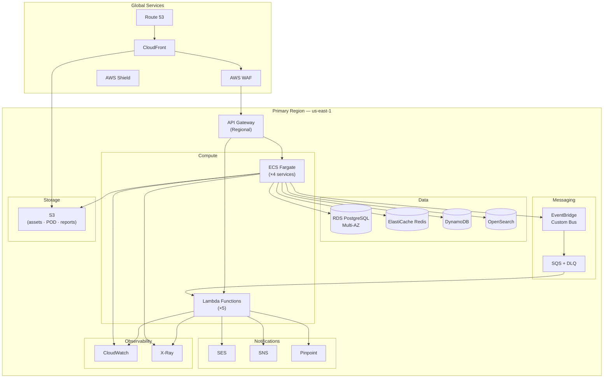
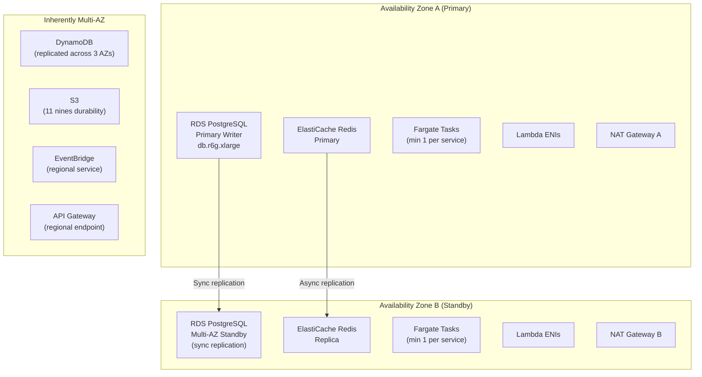
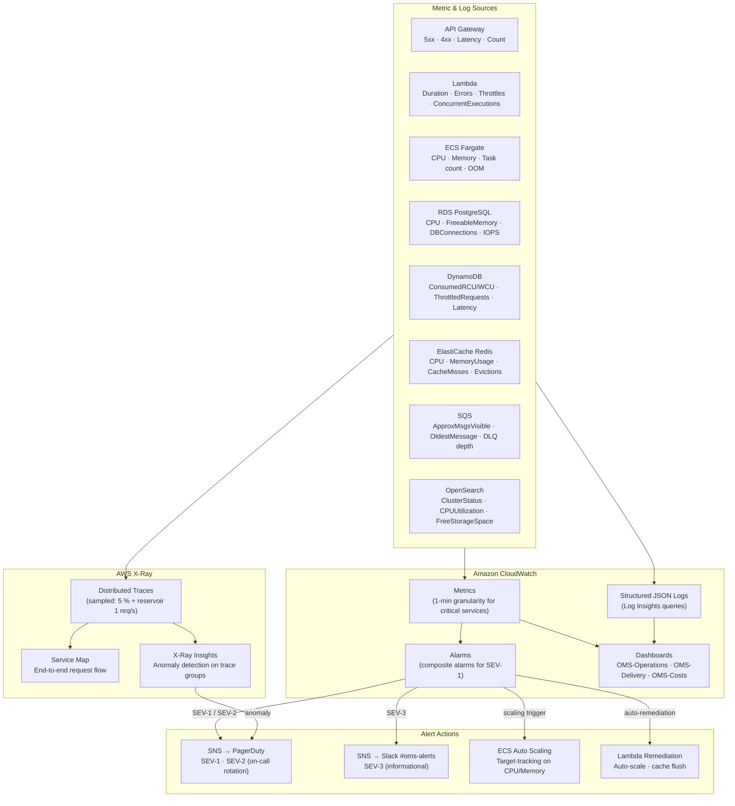

# Cloud Architecture

## Overview

AWS cloud architecture for the Order Management and Delivery System — a serverless-first, fully AWS-native deployment using Lambda, ECS Fargate, RDS PostgreSQL, DynamoDB, ElastiCache Redis, EventBridge, OpenSearch, and supporting services. No self-managed Kubernetes or Kafka.

---

## AWS Architecture Overview



---

## Detailed AWS Service Architecture

```mermaid
graph TB
    Users(["Users / Mobile Apps / Partners"])

    subgraph Edge["Edge Layer"]
        R53["Route 53\nDNS + Health Checks"]
        CF["CloudFront\nGlobal CDN · Static Cache\nTTL 24 h for assets"]
        WAF["AWS WAF\nOWASP Top 10 · Rate Limiting\nGeo-blocking · IP reputation"]
        Shield["AWS Shield Standard\nDDoS Protection (L3/L4)"]
    end

    subgraph API["API Layer"]
        APIGW["API Gateway (Regional)\nREST + WebSocket\nThrottling · Usage Plans · API Keys"]
        Cognito["Cognito\nCustomer Pool (JWT)\nStaff Pool (JWT + MFA)"]
    end

    subgraph LambdaGroup["Lambda Functions"]
        L1["Order Fulfillment\nProcessor"]
        L2["Delivery Status\nUpdater"]
        L3["Notification\nDispatcher"]
        L4["Analytics\nAggregator"]
        L5["Report\nGenerator"]
    end

    subgraph FargateGroup["ECS Fargate Cluster"]
        F1["Order Service\n0.5 vCPU · 1 GB\nmin 2 tasks"]
        F2["Delivery Service\n0.5 vCPU · 1 GB\nmin 2 tasks"]
        F3["Customer Service\n0.25 vCPU · 512 MB\nmin 1 task"]
        F4["Admin Service\n0.25 vCPU · 512 MB\nmin 1 task"]
        ECR["Amazon ECR\nContainer Registry"]
    end

    subgraph DataStores["Data Layer"]
        RDS[("RDS PostgreSQL\ndb.r6g.xlarge · Multi-AZ\nOrders · Customers · Routes")]
        Redis[("ElastiCache Redis\ncache.r6g.large · Primary + Replica\nSession · Rate Limit · Hot Data")]
        DDB[("DynamoDB\nOn-Demand\nTracking Events · Driver Locations")]
        OS[("OpenSearch\n2-node t3.medium.search\nOrder Search · Analytics")]
    end

    subgraph S3Buckets["Object Storage"]
        S3A["S3 — Static Assets\nCF origin · versioned"]
        S3P["S3 — Proof of Delivery\nVersioned · CRR to DR region"]
        S3R["S3 — Reports\nLifecycle: IA 90 d → Glacier 1 yr"]
    end

    subgraph MessagingGroup["Event & Messaging"]
        EB["EventBridge\nCustom Bus (oms.events)\nOrder · Delivery · Payment rules"]
        SQS1["SQS — Fulfillment Queue\n+ DLQ"]
        SQS2["SQS — Notification Queue\n+ DLQ"]
    end

    subgraph NotifyGroup["Notification Channels"]
        SES["SES\nOrder confirmations\nDelivery receipts"]
        SNS_N["SNS\nSMS alerts\nDriver notifications"]
        PP["Pinpoint\nPush notifications\nCampaign messaging"]
    end

    subgraph Security["Security & Config"]
        SecretsM["Secrets Manager\nDB credentials · API keys"]
        KMS["KMS\nRDS · S3 · DDB encryption"]
        ACM["ACM\nTLS certificates"]
        AppConfig["AWS AppConfig\nFeature flags · Runtime config"]
    end

    subgraph CICD["CI/CD Pipeline"]
        GHA["GitHub Actions\nBuild · Test · Push"]
        CP["CodePipeline\nDeploy orchestration"]
        ECR2["ECR\nContainer images"]
        LambdaDeploy["Lambda Deployment\n(zip / container image)"]
    end

    subgraph ObsGroup["Observability"]
        CW["CloudWatch\nMetrics · Logs · Alarms\nDashboards"]
        XR["X-Ray\nDistributed Tracing\nService Map"]
    end

    Users --> R53
    R53 --> CF
    CF --> Shield
    Shield --> WAF
    WAF --> APIGW
    Cognito -->|"JWT authoriser"| APIGW

    APIGW --> F1
    APIGW --> F2
    APIGW --> F3
    APIGW --> F4
    APIGW --> L1

    ECR --> F1 & F2 & F3 & F4

    F1 & F2 & F3 & F4 --> RDS
    F1 & F2 & F3 & F4 --> Redis
    F1 & F2 --> DDB
    F1 & F2 --> OS
    F1 & F2 --> EB
    F3 --> EB
    F4 --> S3R

    CF --> S3A
    F2 -->|"photo upload"| S3P

    EB -->|"order.placed"| SQS1
    EB -->|"delivery.updated"| SQS2
    SQS1 --> L1
    SQS1 --> L2
    SQS2 --> L3
    EB --> L4
    L4 --> DDB
    L5 --> S3R

    L3 --> SES
    L3 --> SNS_N
    L3 --> PP

    SecretsM --> F1 & F2 & F3 & F4
    SecretsM --> L1 & L2 & L3 & L4 & L5
    KMS --> RDS & S3P & DDB
    AppConfig --> F1 & F2 & F3 & F4

    GHA --> ECR2
    GHA --> LambdaDeploy
    ECR2 --> CP
    CP --> F1 & F2 & F3 & F4

    F1 & F2 & F3 & F4 --> CW
    L1 & L2 & L3 & L4 & L5 --> CW
    F1 & F2 & F3 & F4 --> XR
    L1 & L2 & L3 & L4 & L5 --> XR
```



---

## Multi-Region Architecture

Active primary in **us-east-1** with passive warm-standby DR in **us-west-2**. Failover is manual via Route 53 health-check policy.

```mermaid
graph TB
    subgraph GlobalLayer["Global"]
        R53["Route 53\nFailover routing policy\nHealth check → primary endpoint"]
        CF["CloudFront\nMulti-origin failover\nPrimary: us-east-1 · Fallback: us-west-2"]
    end

    subgraph Primary["Primary Region — us-east-1 (Active)"]
        subgraph VPC_P["VPC — 10.0.0.0/16"]
            APIGW_P["API Gateway\n(Regional)"]
            Fargate_P["ECS Fargate\nOrder · Delivery · Customer · Admin"]
            Lambda_P["Lambda Functions ×5"]
            RDS_P[("RDS PostgreSQL\nPrimary Writer\ndb.r6g.xlarge Multi-AZ")]
            Redis_P[("ElastiCache Redis\nPrimary + Replica")]
            DDB_P[("DynamoDB Global Table\nPrimary replica")]
            OS_P[("OpenSearch\n2-node cluster")]
        end
        S3_P["S3 Buckets\n(assets · POD · reports)"]
        EB_P["EventBridge Custom Bus"]
    end

    subgraph DR["DR Region — us-west-2 (Warm Standby)"]
        subgraph VPC_DR["VPC — 10.1.0.0/16"]
            APIGW_DR["API Gateway\n(Regional — standby)"]
            Fargate_DR["ECS Fargate\n(0 tasks — scale on failover)"]
            RDS_DR[("RDS PostgreSQL\nCross-Region Read Replica\n→ promoted on failover)"]
            Redis_DR[("ElastiCache Redis\n(restored from snapshot)")]
            DDB_DR[("DynamoDB Global Table\nDR replica — auto-sync)")]
            OS_DR[("OpenSearch\n(restored from snapshot)")]
        end
        S3_DR["S3 Buckets\n(CRR from us-east-1)"]
    end

    R53 -->|"Primary (healthy)"| APIGW_P
    R53 -->|"Failover (health check fails)"| APIGW_DR
    CF -->|"Primary origin"| S3_P
    CF -->|"Failover origin"| S3_DR

    RDS_P -.->|"Async cross-region replication"| RDS_DR
    S3_P -.->|"Cross-Region Replication (CRR)"| S3_DR
    DDB_P -.->|"Global Table auto-replication"| DDB_DR
```

---

## Security Architecture

```mermaid
graph TB
    subgraph Perimeter["Perimeter Security"]
        WAF["AWS WAF\nOWASP Top 10 managed rules\nRate limiting: 2 000 req/5 min per IP\nGeo-blocking · SQL injection rules"]
        Shield["AWS Shield Standard\nL3/L4 DDoS mitigation\nAlways-on network flow monitoring"]
        R53HC["Route 53 Health Checks\nEndpoint probing every 30 s\nAutomatic DNS failover"]
    end

    subgraph Identity["Identity & Access"]
        CognitoC["Cognito — Customer Pool\nEmail/social sign-in\nJWT (access + refresh + ID tokens)"]
        CognitoS["Cognito — Staff Pool\nUsername + password + MFA\nGroups: dispatcher · driver · admin"]
        IAM["IAM Roles\nTask execution role (ECS)\nLambda execution roles\nLeast-privilege per service"]
        STS["STS\nAssumed roles for cross-service\nTemporary credentials only"]
    end

    subgraph DataProtection["Data Protection"]
        KMS["KMS (CMKs)\nRDS storage encryption\nS3 SSE-KMS (POD bucket)\nDynamoDB encryption at rest\nKey rotation: annual"]
        SecretsM["Secrets Manager\nDB master credentials\nThird-party API keys\nAuto-rotation every 30 days"]
        ACM["ACM\nTLS 1.2+ enforced on CF + APIGW\nCertificate auto-renewal"]
    end

    subgraph Detection["Detection & Response"]
        GuardDuty["GuardDuty\nThreat detection: unusual API calls\nCrypto-mining, exfiltration signals\nFindings → Security Hub"]
        CloudTrail["CloudTrail\nAll management + data events\nLog integrity validation\nS3 log archive + CloudWatch Logs"]
        Config["AWS Config\nCIS benchmark conformance pack\nDrift detection on security groups\nAuto-remediation for public S3 buckets"]
        SecurityHub["Security Hub\nAggregated findings dashboard\nCIS AWS Foundations standard\nEventBridge → SNS for critical findings"]
    end

    subgraph Network["Network Security"]
        VPC["VPC — 3-tier subnet model\nPublic (NAT/ALB) · Private (app) · Isolated (data)"]
        SG["Security Groups\nECS tasks: 443 from APIGW VPC endpoint only\nRDS: 5432 from ECS SG only\nRedis: 6379 from ECS SG only"]
        NACL["NACLs\nDeny all ingress to data subnets\nexcept from app subnet CIDR"]
        VPCEndpoints["VPC Endpoints (Gateway)\nS3 · DynamoDB — no NAT Gateway\nVPC Endpoints (Interface)\nSecrets Manager · CloudWatch · ECR · SQS"]
    end

    WAF -->|"filtered traffic"| APIGW_node["API Gateway"]
    Shield -->|"DDoS-scrubbed"| WAF
    CognitoC -->|"JWT authoriser"| APIGW_node
    CognitoS -->|"JWT authoriser"| APIGW_node
    IAM -->|"ECS task role"| AppServices["Fargate + Lambda"]
    STS -->|"cross-service calls"| AppServices

    KMS -->|"encrypt"| DataStores["RDS · S3 · DynamoDB"]
    SecretsM -->|"inject at runtime"| AppServices
    ACM -->|"TLS termination"| CF_node["CloudFront + API Gateway"]

    GuardDuty --> SecurityHub
    CloudTrail --> SecurityHub
    Config --> SecurityHub
    SecurityHub -->|"critical finding"| AlertSNS["SNS → PagerDuty"]

    VPC --> SG
    SG --> NACL
    NACL --> VPCEndpoints
```



---

## Multi-AZ High Availability



---

## Backup Strategy

| Component | Backup Method | Schedule | Retention | Recovery |
|---|---|---|---|---|
| RDS PostgreSQL | Automated snapshots | Daily at 02:00 UTC | 30 days | Point-in-time recovery (5-min granularity) |
| RDS PostgreSQL | Manual snapshot | Before major deployments | Until manually deleted | Full instance restore |
| DynamoDB | Continuous backups (PITR) | Continuous | 35 days | Point-in-time restore to any second |
| DynamoDB | On-demand backups | Weekly | 90 days | Full table restore |
| ElastiCache Redis | RDB snapshots | Daily at 03:00 UTC | 7 days | Cluster restore from snapshot |
| S3 (POD) | Versioning + replication | Continuous | All versions retained | Version rollback |
| S3 (POD) | Cross-region replication | Continuous | Same as source | DR failover |
| OpenSearch | Automated snapshots | Hourly | 14 days | Index restore |
| CloudWatch Logs | Log export to S3 | Daily | 1 year CW, then S3 Glacier | S3 retrieval |

---

## Disaster Recovery

| Scenario | RPO | RTO | Recovery Procedure |
|---|---|---|---|
| Single AZ failure | 0 (sync replication) | < 5 minutes | RDS auto-failover; Fargate reschedules to healthy AZ; Redis failover |
| RDS primary failure | 0 | < 2 minutes | Multi-AZ automatic failover; DNS endpoint unchanged |
| ElastiCache failure | < 1 second | < 5 minutes | Automatic failover to replica; application reconnects |
| Lambda throttling | N/A | < 1 minute | Reserved concurrency prevents starvation; provisioned concurrency for hot-path |
| S3 data corruption | 0 (versioned) | < 10 minutes | Restore previous version of affected objects |
| DynamoDB table corruption | < 5 minutes | < 30 minutes | PITR restore to timestamp before corruption |
| Full region outage | < 1 hour | < 4 hours | Manual failover to DR region: promote RDS replica, scale Fargate to min 1, update Route 53 failover record |

---

## Cost Optimisation

| Strategy | Implementation | Estimated Savings |
|---|---|---|
| Lambda right-sizing | Memory profiled per function; 256–512 MB range | 20–30 % compute cost |
| Fargate Spot | Analytics (L4/L5) and non-critical tasks on Fargate Spot | 50–70 % for eligible tasks |
| DynamoDB on-demand | Pay-per-request for unpredictable tracking event workloads | Avoids over-provisioning |
| S3 lifecycle | POD to S3-IA after 90 days, Glacier Deep Archive after 1 year | ~60 % storage cost |
| Reserved Instances | RDS and ElastiCache 1-year no-upfront reservations | 30–40 % compute cost |
| CloudFront caching | Static assets cached at edge; TTL 24 hours | Reduces origin requests and data transfer |
| VPC endpoints | Gateway endpoints for S3 + DynamoDB; interface endpoints for Secrets Manager, SQS, ECR, CloudWatch | ~80 % NAT Gateway data cost |
| AppConfig | Feature flags prevent costly rollbacks; gradual rollouts reduce blast radius | Ops cost reduction |

---

## Monitoring and Alerting



---

## Key CloudWatch Alarms

| Alarm | Metric | Threshold | Period | Severity |
|---|---|---|---|---|
| API 5xx Error Rate | API Gateway 5XXError | > 5 % | 5 minutes | SEV-1 |
| API Latency P99 | API Gateway IntegrationLatency | > 5 000 ms | 5 minutes | SEV-1 |
| Lambda Error Rate | Lambda Errors | > 5 % | 5 minutes | SEV-2 |
| Lambda Duration P95 | Lambda Duration | > 10 s | 5 minutes | SEV-2 |
| Lambda Throttles | Lambda Throttles | > 0 sustained | 5 minutes | SEV-2 |
| Fargate CPU High | ECS CPUUtilization | > 80 % | 5 minutes | SEV-2 |
| Fargate Memory High | ECS MemoryUtilization | > 85 % | 5 minutes | SEV-2 |
| RDS CPU | RDS CPUUtilization | > 80 % | 10 minutes | SEV-2 |
| RDS Connections | RDS DatabaseConnections | > 80 % max | 5 minutes | SEV-2 |
| RDS Free Storage | RDS FreeStorageSpace | < 10 GB | 15 minutes | SEV-2 |
| DynamoDB Throttles | DDB ThrottledRequests | > 0 sustained | 5 minutes | SEV-2 |
| DLQ Depth (Fulfillment) | SQS ApproximateNumberOfMessages | > 10 | 15 minutes | SEV-2 |
| DLQ Depth (Notification) | SQS ApproximateNumberOfMessages | > 10 | 15 minutes | SEV-3 |
| ElastiCache Memory | Redis DatabaseMemoryUsagePercentage | > 80 % | 10 minutes | SEV-3 |
| ElastiCache Evictions | Redis Evictions | > 100 / min | 5 minutes | SEV-3 |
| OpenSearch Red Status | OpenSearch ClusterStatus.red | >= 1 | 1 minute | SEV-1 |
| OpenSearch Free Storage | OpenSearch FreeStorageSpace | < 5 GB | 15 minutes | SEV-2 |
| S3 Error Rate | S3 5xxErrors | > 1 % | 15 minutes | SEV-3 |

---

## AWS Services Summary

| Category | Service | Purpose in OMS |
|---|---|---|
| **Edge** | Route 53 | DNS resolution, health-check-based failover routing |
| | CloudFront | CDN for static assets, POD image delivery, edge caching |
| | AWS WAF | OWASP rules, rate limiting, IP reputation filtering |
| | AWS Shield Standard | Automatic L3/L4 DDoS protection |
| **API** | API Gateway (REST + WebSocket) | Managed API layer, throttling, usage plans, JWT authorisation |
| **Compute** | Lambda (×5 functions) | Fulfillment processing, delivery updates, notification dispatch, analytics aggregation, report generation |
| | ECS Fargate (×4 services) | Long-running order, delivery, customer, and admin services |
| | Amazon ECR | Container image registry for Fargate services |
| **Database** | RDS PostgreSQL (Multi-AZ) | Primary OLTP store — orders, customers, routes, payments |
| | ElastiCache Redis | Session store, rate-limit counters, hot-data cache |
| | DynamoDB (on-demand) | High-frequency tracking events, driver location history |
| | OpenSearch | Full-text order search, operational analytics dashboards |
| **Storage** | S3 (3 buckets) | Static assets, proof-of-delivery photos, generated reports |
| **Messaging** | EventBridge (custom bus) | Domain event routing: order.placed, delivery.updated, payment.captured |
| | SQS + DLQ (×2 queues) | Decoupled processing for fulfillment and notification pipelines |
| **Notifications** | SES | Transactional email (order confirmations, receipts) |
| | SNS | SMS notifications for drivers and customers |
| | Pinpoint | Push notifications, campaign messaging |
| **Identity** | Cognito (×2 user pools) | Customer authentication (email/social) and staff authentication (MFA) |
| **Security** | KMS (CMKs) | Encryption at rest for RDS, S3 POD bucket, DynamoDB |
| | Secrets Manager | DB credentials, API keys — auto-rotated every 30 days |
| | ACM | TLS certificates for CloudFront and API Gateway |
| | GuardDuty | Continuous threat detection, anomalous API call detection |
| | CloudTrail | Full API audit trail, log integrity validation |
| | AWS Config | Compliance drift detection, CIS benchmark conformance |
| | Security Hub | Aggregated security findings from GuardDuty, Config, CloudTrail |
| **Observability** | CloudWatch | Metrics (1-min), structured logs, alarms, dashboards |
| | X-Ray | Distributed tracing, service map, anomaly insights |
| | AWS AppConfig | Feature flags, runtime configuration, gradual rollouts |
| **CI/CD** | GitHub Actions | Build, test, containerise, push to ECR; deploy Lambda zip |
| | CodePipeline | Orchestrate ECS blue/green deployments |
| **Networking** | VPC (3-tier) | Network isolation — public, private app, isolated data subnets |
| | VPC Endpoints | Private access to S3, DynamoDB, Secrets Manager, SQS, ECR, CloudWatch |
| | NAT Gateway (×2 AZs) | Outbound internet for private subnets (third-party APIs) |

---

## Estimated Monthly Costs

> Estimates based on **us-east-1** on-demand pricing, moderate production traffic (5 M API requests/month, 10 M DynamoDB ops/month, 1 TB CloudFront transfer). Reserved Instance discounts applied to RDS and ElastiCache.

| Component | Specification | Est. Monthly Cost |
|---|---|---|
| **API Gateway** | REST API · 5 M requests/month + caching | ~$20 |
| **Lambda** | 5 functions · 50 M invocations total · avg 300 ms · 512 MB | ~$30 |
| **ECS Fargate** | 4 services · avg 3 tasks · 0.5 vCPU + 1 GB · 24×7 | ~$150 |
| **ECR** | 10 GB image storage | ~$10 |
| **RDS PostgreSQL** | db.r6g.xlarge · Multi-AZ · 1-yr no-upfront RI · 200 GB storage | ~$380 |
| **ElastiCache Redis** | cache.r6g.large · Primary + 1 replica · 1-yr no-upfront RI | ~$170 |
| **DynamoDB** | On-demand · 10 M reads + 10 M writes/month · 50 GB storage | ~$30 |
| **OpenSearch** | 2 × t3.medium.search · 100 GB gp3 storage | ~$120 |
| **S3** | 500 GB storage · 1 M PUT/GET requests | ~$15 |
| **CloudFront** | 1 TB data transfer out · 10 M HTTPS requests | ~$90 |
| **EventBridge** | 10 M custom events/month | ~$10 |
| **SQS** | 50 M requests/month (2 queues + DLQs) | ~$10 |
| **SES** | 1 M emails/month | ~$10 |
| **SNS** | 500 K SMS + 5 M API calls | ~$25 |
| **Pinpoint** | 100 K push notifications/month | ~$5 |
| **Cognito** | 50 K MAU (customer pool) | ~$30 |
| **Secrets Manager** | 15 secrets · API calls | ~$10 |
| **KMS** | 5 CMKs + 1 M API calls | ~$10 |
| **CloudWatch** | Metrics · logs · dashboards · alarms | ~$40 |
| **X-Ray** | 500 K traces recorded (5 % sampling) | ~$5 |
| **WAF** | 1 web ACL · 5 rules · 5 M requests | ~$15 |
| **Route 53** | 2 hosted zones · health checks · DNS queries | ~$10 |
| **NAT Gateway** | 2 AZs · 500 GB processed (reduced by VPC endpoints) | ~$50 |
| **VPC Endpoints** | 4 interface endpoints × 720 h | ~$30 |
| **Data Transfer** | Inter-AZ + cross-service | ~$20 |
| **Total** | | **~$1,295 / month** |

> **Cost levers:** Committing to 1-year RDS + ElastiCache RIs saves ~$180/month. Fargate Spot for analytics tasks saves ~$50/month. At full production scale with 3-year RIs the total can drop to **~$900/month**.
