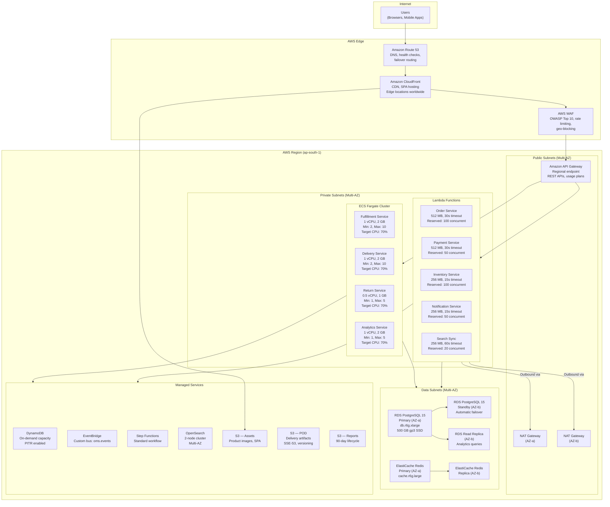

# Deployment Diagram

## Overview

AWS deployment topology for the Order Management and Delivery System, showing compute placement, scaling policies, and load balancing.

## Deployment Architecture

## Scaling Policies

| Component | Metric | Target | Min | Max | Cooldown |
|---|---|---|---|---|---|
| Lambda (Order) | Concurrent executions | N/A (auto) | 0 | 100 (reserved) | N/A |
| Lambda (Payment) | Concurrent executions | N/A (auto) | 0 | 50 (reserved) | N/A |
| Fargate (Fulfillment) | CPU utilisation | 70 % | 2 | 10 | 300 s |
| Fargate (Delivery) | CPU utilisation | 70 % | 2 | 10 | 300 s |
| Fargate (Return) | CPU utilisation | 70 % | 1 | 5 | 300 s |
| Fargate (Analytics) | CPU utilisation | 70 % | 1 | 5 | 300 s |
| DynamoDB | On-demand | Auto | — | — | — |
| RDS | Read Replica count | Manual | 1 | 3 | — |
| ElastiCache | Cluster mode | Manual | 1 primary + 1 replica | 1 primary + 2 replicas | — |
| OpenSearch | Instance count | Manual | 2 | 4 | — |

## Deployment Strategy

| Environment | Strategy | Details |
|---|---|---|
| Development | Direct deploy | CDK deploy from developer workstation |
| Staging | Blue/Green | Full stack clone; smoke tests before cutover |
| Production | Canary | 10% traffic → canary for 10 min; auto-rollback on error rate > 1% |
| Hotfix | Rolling | Skip canary for critical patches; manual approval gate |
