# Network Infrastructure — Order Management and Delivery System

## Overview

This document defines the complete network infrastructure for the Order Management and Delivery System (OMS) deployed on AWS ap-south-1 (Mumbai). The design enforces strict network segmentation across three tiers: public, private application, and private data. All inter-tier communication is controlled via Security Groups and Network ACLs with least-privilege rules. Compute workloads run exclusively on Lambda (ENIs in private subnets) and Fargate tasks; there are no EC2 instances or EKS clusters.

---

## VPC Design

| Parameter          | Value                                      |
|--------------------|--------------------------------------------|
| VPC Name           | oms-vpc-prod                               |
| CIDR Block         | 10.0.0.0/16                                |
| Region             | ap-south-1 (Mumbai) — configurable         |
| Availability Zones | ap-south-1a (AZ-A), ap-south-1b (AZ-B)    |
| DNS Hostnames      | Enabled (`enableDnsHostnames = true`)      |
| DNS Resolution     | Enabled (`enableDnsSupport = true`)        |
| Tenancy            | Default                                    |
| IPv6 CIDR          | Disabled                                   |
| Flow Logs          | Enabled (CloudWatch Logs + S3)             |
| Flow Log Filter    | ALL (ACCEPT + REJECT)                      |

---

## VPC Architecture

```mermaid
graph TB
    subgraph INTERNET["Internet"]
        USERS["API Clients / Mobile Apps"]
    end

    subgraph VPC["AWS VPC — oms-vpc-prod — 10.0.0.0/16 — ap-south-1"]
        IGW["Internet Gateway\noms-igw"]

        subgraph PUBLIC_TIER["Public Tier"]
            subgraph PUB_A["Public Subnet A — 10.0.1.0/24 — AZ-A"]
                NATGW_A["NAT Gateway A\noms-nat-az-a\nElastic IP: EIP-A"]
            end
            subgraph PUB_B["Public Subnet B — 10.0.2.0/24 — AZ-B"]
                NATGW_B["NAT Gateway B\noms-nat-az-b\nElastic IP: EIP-B"]
            end
        end

        subgraph APP_TIER["Private Application Tier"]
            subgraph PRIV_A["Private Subnet A — 10.0.10.0/24 — AZ-A"]
                LAMBDA_A["Lambda ENIs\nOrder, Delivery, Notification\nsg-lambda"]
                FARGATE_A["Fargate Tasks\nTracking Service\nsg-fargate"]
                NLB_A["NLB Node (AZ-A)\noms-nlb-internal"]
            end
            subgraph PRIV_B["Private Subnet B — 10.0.11.0/24 — AZ-B"]
                LAMBDA_B["Lambda ENIs\nOrder, Delivery, Notification\nsg-lambda"]
                FARGATE_B["Fargate Tasks\nTracking Service\nsg-fargate"]
                NLB_B["NLB Node (AZ-B)\noms-nlb-internal"]
            end
        end

        subgraph DATA_TIER["Private Data Tier"]
            subgraph DATA_A["Data Subnet A — 10.0.20.0/24 — AZ-A"]
                RDS_A["RDS PostgreSQL Primary\nsg-rds"]
                REDIS_A["ElastiCache Redis Primary\nsg-redis"]
            end
            subgraph DATA_B["Data Subnet B — 10.0.21.0/24 — AZ-B"]
                RDS_B["RDS PostgreSQL Standby\nsg-rds"]
                REDIS_B["ElastiCache Redis Replica\nsg-redis"]
            end
        end

        subgraph ENDPOINTS["VPC Endpoints"]
            EP_S3["S3 Gateway Endpoint\ncom.amazonaws.ap-south-1.s3"]
            EP_DDB["DynamoDB Gateway Endpoint\ncom.amazonaws.ap-south-1.dynamodb"]
            EP_SM["Secrets Manager\ncom.amazonaws.ap-south-1.secretsmanager"]
            EP_SQS["SQS Interface Endpoint\ncom.amazonaws.ap-south-1.sqs"]
            EP_EVENTS["EventBridge Endpoint\ncom.amazonaws.ap-south-1.events"]
            EP_XRAY["X-Ray Endpoint\ncom.amazonaws.ap-south-1.xray"]
            EP_LOGS["CloudWatch Logs\ncom.amazonaws.ap-south-1.logs"]
            EP_MON["CloudWatch Metrics\ncom.amazonaws.ap-south-1.monitoring"]
            EP_ECR_API["ECR API Endpoint\ncom.amazonaws.ap-south-1.ecr.api"]
            EP_ECR_DKR["ECR Docker Endpoint\ncom.amazonaws.ap-south-1.ecr.dkr"]
        end

        APIGW["API Gateway\n(REST / HTTP API)\nRegional endpoint"]
        VPCLINK["API Gateway VPC Link\noms-vpc-link → NLB"]
    end

    USERS --> IGW
    IGW --> PUB_A
    IGW --> PUB_B
    USERS --> APIGW
    APIGW --> LAMBDA_A
    APIGW --> VPCLINK
    VPCLINK --> NLB_A
    VPCLINK --> NLB_B
    NLB_A --> FARGATE_A
    NLB_B --> FARGATE_B
    LAMBDA_A --> NATGW_A
    LAMBDA_B --> NATGW_B
    FARGATE_A --> NATGW_A
    FARGATE_B --> NATGW_B
    NATGW_A --> IGW
    NATGW_B --> IGW
    LAMBDA_A --> RDS_A
    LAMBDA_A --> REDIS_A
    FARGATE_A --> RDS_A
    FARGATE_A --> REDIS_A
    LAMBDA_A --> EP_S3
    LAMBDA_A --> EP_EVENTS
    LAMBDA_A --> EP_SM
    LAMBDA_A --> EP_SQS
    FARGATE_A --> EP_ECR_API
    FARGATE_A --> EP_ECR_DKR
    RDS_A -.->|"Multi-AZ sync"| RDS_B
    REDIS_A -.->|"async replication"| REDIS_B
```



---

## Subnet Allocation

| Subnet    | CIDR          | AZ    | Purpose                                  | Route Table        |
|-----------|---------------|-------|------------------------------------------|--------------------|
| Public A  | 10.0.1.0/24   | az-a  | NAT Gateway A, API Gateway VPC Link EIP  | rtb-public         |
| Public B  | 10.0.2.0/24   | az-b  | NAT Gateway B                            | rtb-public         |
| Private A | 10.0.10.0/24  | az-a  | Lambda ENIs, Fargate tasks, NLB nodes    | rtb-private-az-a   |
| Private B | 10.0.11.0/24  | az-b  | Lambda ENIs, Fargate tasks, NLB nodes    | rtb-private-az-b   |
| Data A    | 10.0.20.0/24  | az-a  | RDS Primary, ElastiCache Redis Primary   | rtb-data           |
| Data B    | 10.0.21.0/24  | az-b  | RDS Standby/Read Replica, Redis Replica  | rtb-data           |

Public subnets have `map_public_ip_on_launch = false`; only the NAT Gateway EIPs are public. Private and data subnets never assign public IPs. The DB subnet group for RDS and the ElastiCache subnet group each span both data subnets for Multi-AZ support.

---

## Route Tables

### Public Route Table (`rtb-public`)

Attached to: Public Subnet A (10.0.1.0/24), Public Subnet B (10.0.2.0/24)

| Destination  | Target        | Purpose                           |
|--------------|---------------|-----------------------------------|
| 10.0.0.0/16  | local         | VPC-local routing                 |
| 0.0.0.0/0    | igw-xxxxxxxx  | Internet Gateway — inbound/outbound |

### Private Route Table AZ-A (`rtb-private-az-a`)

Attached to: Private Subnet A (10.0.10.0/24)

| Destination  | Target              | Purpose                                        |
|--------------|---------------------|------------------------------------------------|
| 10.0.0.0/16  | local               | VPC-local routing                              |
| 0.0.0.0/0    | nat-az-a (EIP-A)    | Outbound internet via NAT Gateway A            |
| s3 prefix    | vpce-s3 (Gateway)   | S3 traffic stays on AWS backbone               |
| dynamodb prefix | vpce-dynamodb (Gateway) | DynamoDB traffic stays on AWS backbone |

### Private Route Table AZ-B (`rtb-private-az-b`)

Attached to: Private Subnet B (10.0.11.0/24)

| Destination  | Target              | Purpose                                        |
|--------------|---------------------|------------------------------------------------|
| 10.0.0.0/16  | local               | VPC-local routing                              |
| 0.0.0.0/0    | nat-az-b (EIP-B)    | Outbound internet via NAT Gateway B            |
| s3 prefix    | vpce-s3 (Gateway)   | S3 traffic stays on AWS backbone               |
| dynamodb prefix | vpce-dynamodb (Gateway) | DynamoDB traffic stays on AWS backbone |

Each AZ's private route table points exclusively to its own NAT Gateway. This prevents cross-AZ NAT traffic charges and ensures AZ-A failures do not affect AZ-B outbound connectivity.

### Data Route Table (`rtb-data`)

Attached to: Data Subnet A (10.0.20.0/24), Data Subnet B (10.0.21.0/24)

| Destination  | Target  | Purpose                                          |
|--------------|---------|--------------------------------------------------|
| 10.0.0.0/16  | local   | VPC-local routing only — no internet route       |

Data subnets have **no default route** (`0.0.0.0/0`). RDS and ElastiCache have no outbound internet path. All AWS API calls from data-tier agents (e.g., RDS Enhanced Monitoring) are routed through VPC Interface Endpoints only.

---

## NAT Gateway High Availability

| NAT Gateway   | AZ    | Subnet       | Elastic IP |
|---------------|-------|--------------|------------|
| oms-nat-az-a  | az-a  | 10.0.1.0/24  | EIP-A      |
| oms-nat-az-b  | az-b  | 10.0.2.0/24  | EIP-B      |

NAT Gateways are used by Lambda ENIs and Fargate tasks for outbound internet calls that cannot use VPC endpoints (e.g., third-party carrier APIs, payment webhooks). All intra-AWS service calls use VPC endpoints to avoid NAT charges.

---

## Security Groups

### API Gateway VPC Link Security Group (`sg-apigw`)

| Direction | Protocol | Port | Source / Destination | Description                          |
|-----------|----------|------|----------------------|--------------------------------------|
| Inbound   | TCP      | 443  | 0.0.0.0/0            | HTTPS from API Gateway managed IPs   |
| Outbound  | TCP      | 8080 | sg-fargate           | Forward to Fargate via NLB           |
| Outbound  | TCP      | 443  | 10.0.0.0/16          | Health check callbacks within VPC    |

### Lambda Security Group (`sg-lambda`)

Lambda functions are invoked by API Gateway natively (no VPC needed for the invocation path) but run ENIs in private subnets for data plane access.

| Direction | Protocol | Port | Source / Destination   | Description                              |
|-----------|----------|------|------------------------|------------------------------------------|
| Inbound   | —        | —    | —                      | No inbound rules (Lambda is not a server)|
| Outbound  | TCP      | 5432 | sg-rds                 | PostgreSQL to RDS                        |
| Outbound  | TCP      | 6379 | sg-redis               | Redis to ElastiCache                     |
| Outbound  | TCP      | 443  | sg-vpce                | HTTPS to all VPC Interface Endpoints     |
| Outbound  | TCP      | 443  | 0.0.0.0/0              | HTTPS egress via NAT (carrier APIs etc.) |
| Outbound  | UDP      | 53   | 10.0.0.0/16            | DNS resolution                           |
| Outbound  | TCP      | 53   | 10.0.0.0/16            | DNS over TCP fallback                    |

### Fargate Security Group (`sg-fargate`)

| Direction | Protocol | Port | Source / Destination   | Description                              |
|-----------|----------|------|------------------------|------------------------------------------|
| Inbound   | TCP      | 8080 | sg-nlb                 | HTTP traffic from NLB target group       |
| Inbound   | TCP      | 8080 | sg-fargate             | Container-to-container sidecar comms     |
| Outbound  | TCP      | 5432 | sg-rds                 | PostgreSQL to RDS                        |
| Outbound  | TCP      | 6379 | sg-redis               | Redis to ElastiCache                     |
| Outbound  | TCP      | 443  | sg-vpce                | HTTPS to VPC Interface Endpoints         |
| Outbound  | TCP      | 443  | 0.0.0.0/0              | HTTPS egress via NAT                     |
| Outbound  | UDP      | 53   | 10.0.0.0/16            | DNS resolution                           |
| Outbound  | TCP      | 53   | 10.0.0.0/16            | DNS over TCP fallback                    |

### Network Load Balancer Security Group (`sg-nlb`)

| Direction | Protocol | Port | Source / Destination   | Description                              |
|-----------|----------|------|------------------------|------------------------------------------|
| Inbound   | TCP      | 8080 | sg-apigw               | Traffic from API Gateway VPC Link        |
| Outbound  | TCP      | 8080 | sg-fargate             | Forward to Fargate target group          |

### RDS Security Group (`sg-rds`)

RDS enforces SSL via `rds.force_ssl = 1` in the parameter group. The DB subnet group spans both data subnets for Multi-AZ failover.

| Direction | Protocol | Port | Source / Destination   | Description                              |
|-----------|----------|------|------------------------|------------------------------------------|
| Inbound   | TCP      | 5432 | sg-lambda              | PostgreSQL from Lambda functions         |
| Inbound   | TCP      | 5432 | sg-fargate             | PostgreSQL from Fargate tasks            |
| Outbound  | ALL      | ALL  | —                      | No outbound (deny all)                   |

### ElastiCache Security Group (`sg-redis`)

| Direction | Protocol | Port | Source / Destination   | Description                              |
|-----------|----------|------|------------------------|------------------------------------------|
| Inbound   | TCP      | 6379 | sg-lambda              | Redis from Lambda functions              |
| Inbound   | TCP      | 6379 | sg-fargate             | Redis from Fargate tasks                 |
| Outbound  | ALL      | ALL  | —                      | No outbound (deny all)                   |

### OpenSearch Security Group (`sg-opensearch`)

| Direction | Protocol | Port | Source / Destination   | Description                              |
|-----------|----------|------|------------------------|------------------------------------------|
| Inbound   | TCP      | 443  | sg-lambda              | HTTPS REST API from Lambda               |
| Inbound   | TCP      | 443  | sg-fargate             | HTTPS REST API from Fargate              |
| Outbound  | ALL      | ALL  | —                      | No outbound (deny all)                   |

### VPC Endpoints Security Group (`sg-vpce`)

Shared security group applied to all Interface-type VPC Endpoints.

| Direction | Protocol | Port | Source / Destination   | Description                              |
|-----------|----------|------|------------------------|------------------------------------------|
| Inbound   | TCP      | 443  | sg-lambda              | HTTPS from Lambda ENIs                   |
| Inbound   | TCP      | 443  | sg-fargate             | HTTPS from Fargate tasks                 |
| Outbound  | ALL      | ALL  | —                      | AWS backbone (no internet path)          |

---

## VPC Endpoints

Gateway endpoints (S3, DynamoDB) are free and route traffic through the AWS backbone without NAT Gateway charges. Interface endpoints (PrivateLink) incur hourly per-AZ costs but are required for services without gateway support. All interface endpoints are deployed in both private subnets (AZ-A and AZ-B) for high availability.

| Endpoint Name       | Service                                      | Type      | Attached Subnets   | Purpose                                  |
|---------------------|----------------------------------------------|-----------|--------------------|------------------------------------------|
| vpce-s3             | com.amazonaws.ap-south-1.s3                  | Gateway   | Private + Data     | S3 object storage without NAT            |
| vpce-dynamodb       | com.amazonaws.ap-south-1.dynamodb            | Gateway   | Private            | DynamoDB (idempotency keys) without NAT  |
| vpce-secretsmanager | com.amazonaws.ap-south-1.secretsmanager      | Interface | Private            | DB credentials, API keys at startup      |
| vpce-sqs            | com.amazonaws.ap-south-1.sqs                 | Interface | Private            | Dead-letter queue access                 |
| vpce-events         | com.amazonaws.ap-south-1.events              | Interface | Private            | EventBridge event publishing             |
| vpce-xray           | com.amazonaws.ap-south-1.xray                | Interface | Private            | Distributed trace segment submission     |
| vpce-logs           | com.amazonaws.ap-south-1.logs                | Interface | Private + Data     | CloudWatch Logs (Lambda, Fargate, RDS)   |
| vpce-monitoring     | com.amazonaws.ap-south-1.monitoring          | Interface | Private            | CloudWatch Metrics publishing            |
| vpce-ecr-api        | com.amazonaws.ap-south-1.ecr.api             | Interface | Private            | ECR image metadata (Fargate pull)        |
| vpce-ecr-dkr        | com.amazonaws.ap-south-1.ecr.dkr             | Interface | Private            | ECR Docker layer pull (Fargate)          |
| vpce-ssm            | com.amazonaws.ap-south-1.ssm                 | Interface | Private            | SSM Parameter Store (non-secret config)  |
| vpce-kms            | com.amazonaws.ap-south-1.kms                 | Interface | Private + Data     | KMS envelope encryption/decryption       |

---

## Network Access Control Lists (NACLs)

NACLs are stateless and evaluated at the subnet boundary before Security Groups. Rules are processed in ascending rule-number order; the first match wins.

### Public Subnet NACL (`nacl-public`)

| Rule # | Direction | Protocol | Port Range  | Source / Destination | Action |
|--------|-----------|----------|-------------|----------------------|--------|
| 100    | Inbound   | TCP      | 443         | 0.0.0.0/0            | ALLOW  |
| 110    | Inbound   | TCP      | 80          | 0.0.0.0/0            | ALLOW  |
| 120    | Inbound   | TCP      | 1024–65535  | 0.0.0.0/0            | ALLOW  |
| 32766  | Inbound   | ALL      | ALL         | 0.0.0.0/0            | DENY   |
| 100    | Outbound  | TCP      | 443         | 0.0.0.0/0            | ALLOW  |
| 110    | Outbound  | TCP      | 80          | 0.0.0.0/0            | ALLOW  |
| 120    | Outbound  | TCP      | 1024–65535  | 0.0.0.0/0            | ALLOW  |
| 130    | Outbound  | TCP      | 8080        | 10.0.10.0/23         | ALLOW  |
| 32766  | Outbound  | ALL      | ALL         | 0.0.0.0/0            | DENY   |

### Private Subnet NACL (`nacl-private`)

| Rule # | Direction | Protocol | Port Range  | Source / Destination | Action |
|--------|-----------|----------|-------------|----------------------|--------|
| 100    | Inbound   | TCP      | 8080        | 10.0.1.0/23          | ALLOW  |
| 110    | Inbound   | TCP      | 1024–65535  | 0.0.0.0/0            | ALLOW  |
| 120    | Inbound   | TCP      | 8080        | 10.0.10.0/23         | ALLOW  |
| 32766  | Inbound   | ALL      | ALL         | 0.0.0.0/0            | DENY   |
| 100    | Outbound  | TCP      | 5432        | 10.0.20.0/23         | ALLOW  |
| 110    | Outbound  | TCP      | 6379        | 10.0.20.0/23         | ALLOW  |
| 120    | Outbound  | TCP      | 443         | 10.0.20.0/23         | ALLOW  |
| 130    | Outbound  | TCP      | 443         | 0.0.0.0/0            | ALLOW  |
| 140    | Outbound  | TCP      | 1024–65535  | 0.0.0.0/0            | ALLOW  |
| 150    | Outbound  | UDP      | 53          | 10.0.0.0/16          | ALLOW  |
| 160    | Outbound  | TCP      | 53          | 10.0.0.0/16          | ALLOW  |
| 32766  | Outbound  | ALL      | ALL         | 0.0.0.0/0            | DENY   |

### Data Subnet NACL (`nacl-data`)

| Rule # | Direction | Protocol | Port Range  | Source / Destination | Action |
|--------|-----------|----------|-------------|----------------------|--------|
| 100    | Inbound   | TCP      | 5432        | 10.0.10.0/23         | ALLOW  |
| 110    | Inbound   | TCP      | 6379        | 10.0.10.0/23         | ALLOW  |
| 120    | Inbound   | TCP      | 443         | 10.0.10.0/23         | ALLOW  |
| 130    | Inbound   | TCP      | 1024–65535  | 0.0.0.0/0            | ALLOW  |
| 32766  | Inbound   | ALL      | ALL         | 0.0.0.0/0            | DENY   |
| 100    | Outbound  | TCP      | 1024–65535  | 10.0.10.0/23         | ALLOW  |
| 32766  | Outbound  | ALL      | ALL         | 0.0.0.0/0            | DENY   |

Data subnets have no outbound rule to 0.0.0.0/0. All outbound traffic from data services (e.g., RDS Enhanced Monitoring Lambda) is blocked at the NACL layer; it must route through the VPC Endpoint for CloudWatch Logs.

---

## Network Load Balancer (Fargate Ingress)

The internal NLB bridges API Gateway's VPC Link to Fargate target groups. It is deployed in private subnets (not public) because API Gateway VPC Link connects to it internally.

| Property            | Value                                             |
|---------------------|---------------------------------------------------|
| Name                | oms-nlb-internal                                  |
| Scheme              | Internal                                          |
| Type                | Network Load Balancer                             |
| Subnets             | Private Subnet A (10.0.10.0/24), Private Subnet B (10.0.11.0/24) |
| IP address type     | IPv4                                              |
| Cross-zone LB       | Enabled                                           |
| Deletion protection | Enabled (production)                              |

### NLB Target Groups

| Target Group             | Protocol | Port | Health Check Path | Deregistration Delay |
|--------------------------|----------|------|-------------------|----------------------|
| tg-tracking-fargate      | TCP      | 8080 | HTTP /health      | 30 s                 |
| tg-delivery-worker       | TCP      | 8080 | HTTP /health      | 30 s                 |

Health checks use HTTP (not HTTPS) on port 8080 with a `/health` path. Targets are considered healthy after 3 consecutive successes (threshold interval: 10 s) and unhealthy after 3 failures.

### API Gateway VPC Link

| Property   | Value                             |
|------------|-----------------------------------|
| Name       | oms-vpc-link                      |
| Type       | VPC Link for REST API (v1) or HTTP API (v2) |
| Target NLB | oms-nlb-internal                  |
| Status     | Available                         |

API Gateway integrations for Fargate-backed routes use `HTTP_PROXY` integration type with the VPC Link, forwarding `{proxy+}` path segments to the NLB listener on port 8080.

---

## Inter-Service Communication

All service-to-service calls stay within the VPC or transit the AWS backbone. No service communicates with another over the public internet.

| Source            | Destination      | Path                                         | Port  | Security Control                           |
|-------------------|------------------|----------------------------------------------|-------|--------------------------------------------|
| API Gateway       | Lambda           | Native Lambda integration (no VPC required)  | N/A   | IAM resource policy on Lambda              |
| API Gateway       | Fargate          | VPC Link → NLB → Fargate                     | 8080  | sg-apigw → sg-nlb → sg-fargate            |
| Lambda            | RDS              | ENI in private subnet → data subnet          | 5432  | sg-lambda → sg-rds                         |
| Lambda            | ElastiCache      | ENI in private subnet → data subnet          | 6379  | sg-lambda → sg-redis                       |
| Lambda            | EventBridge      | ENI → vpce-events (Interface)                | 443   | sg-lambda → sg-vpce; IAM policy            |
| Lambda            | S3               | ENI → vpce-s3 (Gateway)                      | 443   | Gateway endpoint policy; IAM policy        |
| Lambda            | SQS (DLQ)        | ENI → vpce-sqs (Interface)                   | 443   | sg-lambda → sg-vpce; IAM policy            |
| Lambda            | Secrets Manager  | ENI → vpce-secretsmanager (Interface)        | 443   | sg-lambda → sg-vpce; IAM + resource policy |
| Fargate           | RDS              | Task ENI in private subnet → data subnet     | 5432  | sg-fargate → sg-rds                        |
| Fargate           | ElastiCache      | Task ENI in private subnet → data subnet     | 6379  | sg-fargate → sg-redis                      |
| Fargate           | S3               | Task ENI → vpce-s3 (Gateway)                 | 443   | Gateway endpoint policy; IAM task role     |
| Fargate           | Secrets Manager  | Task ENI → vpce-secretsmanager (Interface)   | 443   | sg-fargate → sg-vpce; IAM task role        |
| Fargate           | ECR              | Task ENI → vpce-ecr-api + vpce-ecr-dkr       | 443   | sg-fargate → sg-vpce; task execution role  |
| Lambda / Fargate  | CloudWatch Logs  | ENI → vpce-logs (Interface)                  | 443   | sg-lambda/sg-fargate → sg-vpce             |
| Lambda / Fargate  | X-Ray            | ENI → vpce-xray (Interface)                  | 443   | sg-lambda/sg-fargate → sg-vpce             |

---

## DNS Configuration

### VPC DNS Settings

| Setting                | Value   |
|------------------------|---------|
| `enableDnsHostnames`   | `true`  |
| `enableDnsSupport`     | `true`  |
| VPC DNS resolver       | 10.0.0.2 (AmazonProvidedDNS) |

### Private Hosted Zone: `oms.internal`

The private hosted zone is associated with `oms-vpc-prod` and is not resolvable outside the VPC. It enables stable, human-readable names for internal endpoints that can be updated without changing application configuration.

| Record Name                    | Type  | TTL   | Value / Target                                       |
|--------------------------------|-------|-------|------------------------------------------------------|
| `api.oms.internal`             | A     | 60 s  | Alias → API Gateway regional endpoint                |
| `rds.oms.internal`             | CNAME | 60 s  | RDS cluster endpoint (writer; auto-updates on failover) |
| `rds-read.oms.internal`        | CNAME | 60 s  | RDS reader endpoint (read replicas)                  |
| `redis.oms.internal`           | CNAME | 60 s  | ElastiCache primary endpoint                         |
| `redis-reader.oms.internal`    | CNAME | 60 s  | ElastiCache reader endpoint (replica reads)          |
| `nlb.oms.internal`             | A     | 60 s  | Alias → oms-nlb-internal (NLB DNS name)              |
| `opensearch.oms.internal`      | CNAME | 300 s | OpenSearch domain endpoint                           |

### Public Hosted Zone: `oms.example.com`

| Record Name                    | Type  | TTL   | Value / Target                                       |
|--------------------------------|-------|-------|------------------------------------------------------|
| `api.oms.example.com`          | A     | 60 s  | Alias → API Gateway custom domain                    |
| `tracking.oms.example.com`     | CNAME | 300 s | API Gateway custom domain (tracking subpath)         |

---

## TLS Certificate Management

All external HTTPS traffic is terminated at API Gateway using ACM-managed certificates. Internal service calls within the VPC use private endpoints; TLS is enforced for RDS (`rds.force_ssl = 1`) and ElastiCache (TLS in-transit enabled).

### ACM Certificates

| Certificate Domain         | Scope    | Region      | Validation Method | Auto-Renewal |
|----------------------------|----------|-------------|-------------------|--------------|
| `api.oms.example.com`      | Regional | ap-south-1  | DNS (CNAME in Route 53 public zone) | Yes (ACM)  |
| `*.oms.example.com`        | Regional | ap-south-1  | DNS (CNAME in Route 53 public zone) | Yes (ACM)  |
| `api.oms.example.com` (CF) | Global   | us-east-1   | DNS (CNAME in Route 53 public zone) | Yes (ACM)  |

> **Note:** CloudFront requires its ACM certificate to be issued in `us-east-1` regardless of the origin region. The regional certificate in `ap-south-1` is used by API Gateway's custom domain name.

### Certificate Validation Records (Route 53)

ACM creates CNAME records in the public hosted zone during validation. Once validated, these records must remain in place for automated renewal.

```
_acme-challenge.api.oms.example.com.  CNAME  <ACM-generated-value>.acm-validations.aws.
_acme-challenge.oms.example.com.       CNAME  <ACM-generated-value>.acm-validations.aws.
```

### TLS Policy

| Endpoint            | Minimum TLS Version | Cipher Policy                              |
|---------------------|---------------------|--------------------------------------------|
| API Gateway         | TLS 1.2             | `TLS_1_2` (AWS managed policy)             |
| CloudFront          | TLS 1.2             | `TLSv1.2_2021`                             |
| RDS PostgreSQL      | TLS 1.2             | `rds.force_ssl = 1` in parameter group     |
| ElastiCache Redis   | TLS 1.2             | `in-transit-encryption-enabled = true`     |
| NLB → Fargate       | Plain TCP (8080)    | TLS terminated at API Gateway; internal only |

---

## WAF Rules

The WAF Web ACL (`oms-waf-prod`) is attached to the API Gateway stage in `ap-south-1`. Rules are evaluated in priority order; first match applies.

| Priority | Rule Group Name                          | Type               | Action | WCU  | Description                                         |
|----------|------------------------------------------|--------------------|--------|------|-----------------------------------------------------|
| 1        | AWSManagedRulesCommonRuleSet             | Managed            | Block  | 700  | OWASP Top 10 core protections (XSS, path traversal) |
| 2        | AWSManagedRulesKnownBadInputsRuleSet     | Managed            | Block  | 200  | Log4j, SSRF, bad user-agent patterns                |
| 3        | AWSManagedRulesSQLiRuleSet               | Managed            | Block  | 200  | SQL injection in query strings, headers, body       |
| 4        | AWSManagedRulesAmazonIpReputationList    | Managed IP Rep     | Block  | 25   | AWS threat intelligence: botnets, scrapers, TOR     |
| 5        | AWSManagedRulesBotControlRuleSet         | Managed Bot        | Block  | 1500 | Bot detection; allow verified search engines        |
| 6        | oms-rate-limit-global                    | Custom Rate-based  | Block  | 2    | 2000 requests per 5 min per IP (all endpoints)      |
| 7        | oms-rate-limit-auth                      | Custom Rate-based  | Block  | 2    | 20 auth attempts per 5 min per IP                   |
| 8        | oms-rate-limit-orders                    | Custom Rate-based  | Block  | 2    | 100 order-create requests per 1 min per IP          |
| 9        | oms-geo-block                            | Custom Geo         | Block  | 1    | Block traffic from non-serviced countries           |
| 10       | oms-ip-allowlist-internal                | Custom IP Set      | Allow  | 1    | Bypass WAF for trusted internal CIDR ranges         |
| 11       | CustomHeader-Idempotency                 | Custom             | Count  | 1    | Log POST/PUT requests missing `Idempotency-Key`     |
| Default  | —                                        | —                  | Allow  | —    | Pass all other traffic                              |

### Custom Rate-Limiting Rules Detail

#### Global Rate Limit

```
Rule: oms-rate-limit-global
Scope: API Gateway regional WAF ACL
Rate-based statement:
  - Evaluate over: 5 minutes
  - Request limit: 2000 per IP
  - Scope-down: ALL requests
Action: BLOCK (HTTP 429)
Custom response body: {"error": "rate_limit_exceeded", "retry_after": 300}
```

#### Auth Rate Limit

```
Rule: oms-rate-limit-auth
Scope: API Gateway regional WAF ACL
Rate-based statement:
  - Evaluate over: 5 minutes
  - Request limit: 20 per IP
  - Scope-down: URI path starts with /auth
Action: BLOCK (HTTP 429)
Custom response body: {"error": "too_many_auth_attempts"}
```

#### Order Creation Rate Limit

```
Rule: oms-rate-limit-orders
Scope: API Gateway regional WAF ACL
Rate-based statement:
  - Evaluate over: 1 minute
  - Request limit: 100 per IP
  - Scope-down: URI path starts with /orders AND method = POST
Action: BLOCK (HTTP 429)
Custom response body: {"error": "order_rate_limit_exceeded"}
```

### Bot Control Configuration

```
AWS Managed Rules Bot Control:
  - Inspection level: COMMON
  - Block category: MONITORING_BOTS, SCRAPERS, VULNERABILITY_SCANNERS, HTTP_LIBRARY
  - Allow category: SEARCH_ENGINE (Google, Bing, DuckDuckGo)
  - Challenge category: LINK_CHECKERS, FEED_FETCHERS
  - Custom signal: honeypot path /api/v1/trap → Block source IP for 24 h
```

### Idempotency Header Rule

```
Rule: CustomHeader-Idempotency
Match condition: HTTP method in {POST, PUT, PATCH}
  AND header Idempotency-Key is absent
Action: COUNT (logs to CloudWatch metric oms-waf-missing-idempotency-key)
Note: COUNT only — does not block. Used for observability and alerting.
      Future: promote to BLOCK once all clients are updated.
```

---

## VPC Flow Logs

VPC Flow Logs are enabled at the VPC level and deliver to both CloudWatch Logs (short-term, operational) and S3 (long-term, analytical).

```
Flow Log Configuration:
  - Log destination:        CloudWatch Logs + S3
  - CloudWatch log group:   /aws/vpc/flowlogs/oms-vpc-prod
  - CloudWatch retention:   30 days
  - S3 bucket:              oms-logs-prod/vpc-flow-logs/
  - S3 lifecycle:           30 days standard → Glacier Instant Retrieval → 1 year delete
  - Log format:             ${version} ${account-id} ${interface-id}
                            ${srcaddr} ${dstaddr} ${srcport} ${dstport}
                            ${protocol} ${packets} ${bytes} ${start} ${end}
                            ${action} ${log-status} ${vpc-id} ${subnet-id}
  - Traffic type:           ALL (ACCEPT + REJECT)
  - Aggregation interval:   1 minute
```

### CloudWatch Insights Anomaly Detection Queries

The following queries run on a scheduled basis (every 15 minutes) via CloudWatch Insights to detect anomalous traffic patterns:

**Rejected traffic spike (potential port scan):**

```
fields @timestamp, srcAddr, dstPort, action
| filter action = "REJECT"
| stats count() as rejectCount by srcAddr, dstPort
| filter rejectCount > 100
| sort rejectCount desc
```

**Unusual data exfiltration (high outbound bytes from data subnets):**

```
fields @timestamp, srcAddr, dstAddr, bytes
| filter srcAddr like "10.0.20."
| stats sum(bytes) as totalBytes by srcAddr, dstAddr
| filter totalBytes > 104857600
| sort totalBytes desc
```

**New source IP contacting RDS port (lateral movement detection):**

```
fields @timestamp, srcAddr, dstPort, action
| filter dstPort = 5432 and action = "ACCEPT"
| stats count() as connections by srcAddr
| filter connections > 50
```

Alerts from these queries trigger SNS notifications to the security team and create CloudWatch alarms for automated response.

---

## Appendix: IP Address Summary

| Resource                     | CIDR / IP           | Notes                                 |
|------------------------------|---------------------|---------------------------------------|
| VPC                          | 10.0.0.0/16         | All OMS resources                     |
| Public Subnet A              | 10.0.1.0/24         | AZ-A, NAT Gateway A                   |
| Public Subnet B              | 10.0.2.0/24         | AZ-B, NAT Gateway B                   |
| Private Subnet A             | 10.0.10.0/24        | AZ-A, Lambda ENIs, Fargate, NLB       |
| Private Subnet B             | 10.0.11.0/24        | AZ-B, Lambda ENIs, Fargate, NLB       |
| Data Subnet A                | 10.0.20.0/24        | AZ-A, RDS Primary, Redis Primary      |
| Data Subnet B                | 10.0.21.0/24        | AZ-B, RDS Standby, Redis Replica      |
| VPC DNS Resolver             | 10.0.0.2            | AmazonProvidedDNS                     |
| NAT Gateway A EIP            | EIP-A (dynamic)     | Outbound internet from AZ-A           |
| NAT Gateway B EIP            | EIP-B (dynamic)     | Outbound internet from AZ-B           |
