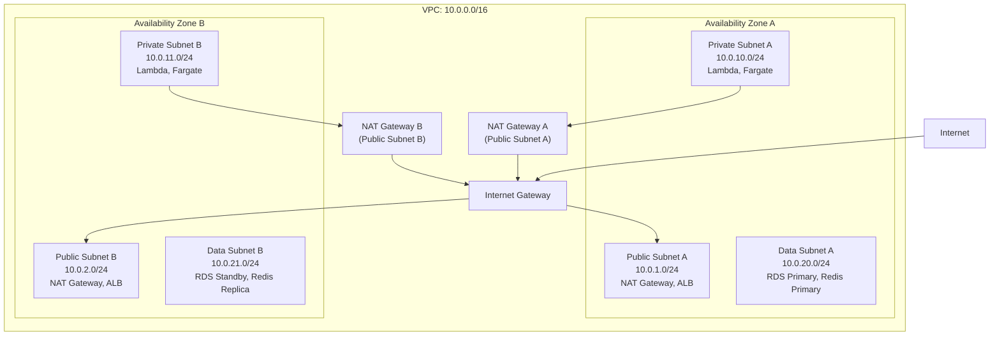

# Network Infrastructure

## Overview

VPC design, subnet layout, security groups, NACLs, and connectivity for the Order Management and Delivery System on AWS.

## VPC Architecture

## Subnet Allocation

| Subnet | CIDR | AZ | Purpose | Route Table |
|---|---|---|---|---|
| Public A | 10.0.1.0/24 | az-a | NAT Gateway, API Gateway endpoints | IGW default |
| Public B | 10.0.2.0/24 | az-b | NAT Gateway | IGW default |
| Private A | 10.0.10.0/24 | az-a | Lambda ENIs, Fargate tasks | NAT-A |
| Private B | 10.0.11.0/24 | az-b | Lambda ENIs, Fargate tasks | NAT-B |
| Data A | 10.0.20.0/24 | az-a | RDS Primary, Redis Primary | No internet |
| Data B | 10.0.21.0/24 | az-b | RDS Standby/Read Replica, Redis Replica | No internet |

## Security Groups

| SG Name | Inbound Rules | Outbound Rules | Attached To |
|---|---|---|---|
| sg-apigw | 443/TCP from 0.0.0.0/0 | All to VPC CIDR | API Gateway VPC Link |
| sg-lambda | None (initiated outbound) | 5432/TCP to sg-rds; 6379/TCP to sg-redis; 443/TCP to VPC endpoints | Lambda ENIs |
| sg-fargate | 8080/TCP from sg-apigw | 5432/TCP to sg-rds; 6379/TCP to sg-redis; 443/TCP to VPC endpoints | Fargate tasks |
| sg-rds | 5432/TCP from sg-lambda, sg-fargate | None | RDS instances |
| sg-redis | 6379/TCP from sg-lambda, sg-fargate | None | ElastiCache nodes |
| sg-opensearch | 443/TCP from sg-lambda, sg-fargate | None | OpenSearch domain |
| sg-vpce | 443/TCP from sg-lambda, sg-fargate | None | VPC Endpoints |

## VPC Endpoints

| Endpoint | Type | Service | Purpose |
|---|---|---|---|
| vpce-s3 | Gateway | com.amazonaws.*.s3 | S3 access without NAT |
| vpce-dynamodb | Gateway | com.amazonaws.*.dynamodb | DynamoDB access without NAT |
| vpce-secretsmanager | Interface | com.amazonaws.*.secretsmanager | Credential retrieval |
| vpce-sqs | Interface | com.amazonaws.*.sqs | DLQ access |
| vpce-events | Interface | com.amazonaws.*.events | EventBridge publish |
| vpce-xray | Interface | com.amazonaws.*.xray | Trace submission |
| vpce-logs | Interface | com.amazonaws.*.logs | CloudWatch Logs |
| vpce-monitoring | Interface | com.amazonaws.*.monitoring | CloudWatch Metrics |

## Network ACLs

| NACL | Subnet Tier | Inbound Allow | Outbound Allow | Deny |
|---|---|---|---|---|
| nacl-public | Public | 443/TCP from 0.0.0.0/0; ephemeral ports from VPC | All to VPC; 443/TCP to 0.0.0.0/0 | All else |
| nacl-private | Private | All from Public subnets; all from Data subnets | All to VPC; 443/TCP to 0.0.0.0/0 via NAT | All else |
| nacl-data | Data | 5432/TCP from Private; 6379/TCP from Private | Ephemeral ports to Private | All else |

## WAF Rules

| Rule | Priority | Action | Description |
|---|---|---|---|
| AWSManagedRulesCommonRuleSet | 1 | Block | OWASP Top 10 core protections |
| AWSManagedRulesKnownBadInputsRuleSet | 2 | Block | Log4j, SSRF, path traversal |
| AWSManagedRulesSQLiRuleSet | 3 | Block | SQL injection patterns |
| RateLimit-Global | 4 | Block | 2000 requests per 5 min per IP |
| RateLimit-Auth | 5 | Block | 20 login attempts per 5 min per IP |
| GeoBlock | 6 | Block | Block traffic from non-serviced countries |
| CustomHeader-Idempotency | 7 | Count | Log requests missing Idempotency-Key on POST/PUT |
