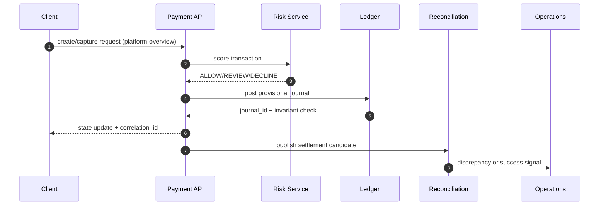

# Payment Orchestration and Wallet Platform Design Documentation

> Comprehensive system design documentation for payment routing, double-entry wallet ledgering, settlement, refunds, and payouts.

## Documentation Structure

| Phase | Folder | Description |
|---|---|---|
| 1 | [requirements](./requirements/) | Scope, FR/NFR, acceptance criteria, and user stories |
| 2 | [analysis](./analysis/) | Actors, use cases, context boundaries, activity/swimlane flows |
| 3 | [high-level-design](./high-level-design/) | Architecture decisions, domain model, sequence and DFD views |
| 4 | [detailed-design](./detailed-design/) | Internal components, data models, APIs, lifecycle/state behavior |
| 5 | [infrastructure](./infrastructure/) | Deployment topology, networking, security, cloud primitives |
| 6 | [implementation](./implementation/) | Delivery plan, code organization, and backend capability matrix |

## System Overview

### Actors
- **Merchant Operator** - participates in Payments workflows
- **Treasury Analyst** - participates in Payments workflows
- **Risk Analyst** - participates in Payments workflows
- **Compliance Officer** - participates in Payments workflows
- **Platform Admin** - participates in Payments workflows

### Key Features
- Provider routing decisioning with auditability and operational controls
- Authorization and capture lifecycle with auditability and operational controls
- Wallet posting and balance controls with auditability and operational controls
- Settlement and reconciliation with auditability and operational controls
- Refunds, disputes, and payout releases with auditability and operational controls

## Diagram Generation

Diagrams are authored in Mermaid where applicable; export via VS Code Mermaid preview, mermaid.live, or Mermaid CLI.

## Getting Started

1. Read `requirements/requirements.md` and `requirements/user-stories.md` to confirm scope and release boundaries.
2. Follow `analysis/` and `high-level-design/` to understand system boundaries, dependencies, and architecture choices.
3. Use `detailed-design/` and `implementation/` to plan engineering breakdown, milestones, and readiness checks.
4. Review `edge-cases/` before implementation to include detection and recovery logic in initial delivery.

## Documentation Status

- ✅ Full Wave 1 documentation scaffold is present for this project.
- ✅ Includes domain deep-dive (`detailed-design/ledger-and-settlement.md`) and operational edge-case pack.
- ⏳ Keep diagrams and status matrix synchronized with implementation changes.

## Artifact-Specific Deep Dive: Lifecycle, Reconciliation, Disputes, Fraud, and Ledger Safety

### Why this artifact matters
This document now defines **platform-overview** behavior and explicitly maps architecture intent to API contracts, diagrammed flows, and day-2 operations owned by **Product, Payments Eng, Finance Ops, Risk Ops**.

### Transaction state transitions required in this artifact
- `INITIATED -> AUTHORIZING -> AUTHORIZED -> CAPTURE_PENDING -> CAPTURED` for card and wallet charges.
- `CAPTURED -> SETTLEMENT_PENDING -> SETTLED` after provider clearing confirmation.
- `CAPTURED|SETTLED -> REFUND_PENDING -> PARTIALLY_REFUNDED|REFUNDED` for merchant-initiated refunds.
- `SETTLED -> CHARGEBACK_OPEN -> CHARGEBACK_WON|CHARGEBACK_LOST` for issuer disputes.
- Each transition MUST include: actor, triggering API/event, timeout, retry policy, and compensating action.

### API contracts this artifact must keep consistent
- `POST /payments`: documented here with required request ids, idempotency keys, and failure reason codes for **platform-overview**.
- `POST /payments/{id}/capture`: documented here with required request ids, idempotency keys, and failure reason codes for **platform-overview**.
- `POST /payments/{id}/refunds`: documented here with required request ids, idempotency keys, and failure reason codes for **platform-overview**.
- `GET /reconciliation/runs/{runId}`: documented here with required request ids, idempotency keys, and failure reason codes for **platform-overview**.
- All mutating calls MUST return `correlation_id`, `idempotency_key`, `previous_state`, `new_state`, and `transition_reason`.

### In-depth flow diagram for README

### Reconciliation, dispute/refund, and fraud controls
- Reconciliation: three-way match (ledger vs PSP file vs bank statement) with tolerance thresholds and auto-classification into `timing`, `amount`, `missing`, `duplicate` breaks.
- Disputes/Refunds: evidence chain-of-custody, SLA timers, and automatic ledger reversals when disputes are lost.
- Fraud: pre-auth risk decisioning, post-auth anomaly detection, and payout velocity controls tied to case management.

### Ledger invariants and operational hooks
- Invariants enforced here: double-entry balance, append-only journal, exactly-once posting per business event, and currency-safe postings.
- Operational process: if any invariant fails, move transaction to `OPERATIONS_HOLD`, page on-call + finance, and block payout release until compensating journals are approved.
- Runbooks must include: replay commands, manual override approvals (dual control), and incident-close reconciliation attestation.

