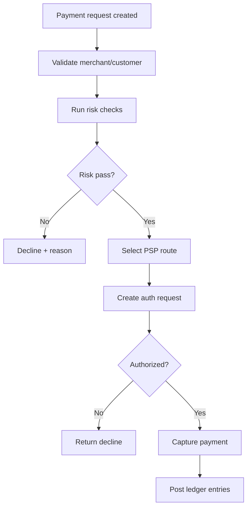
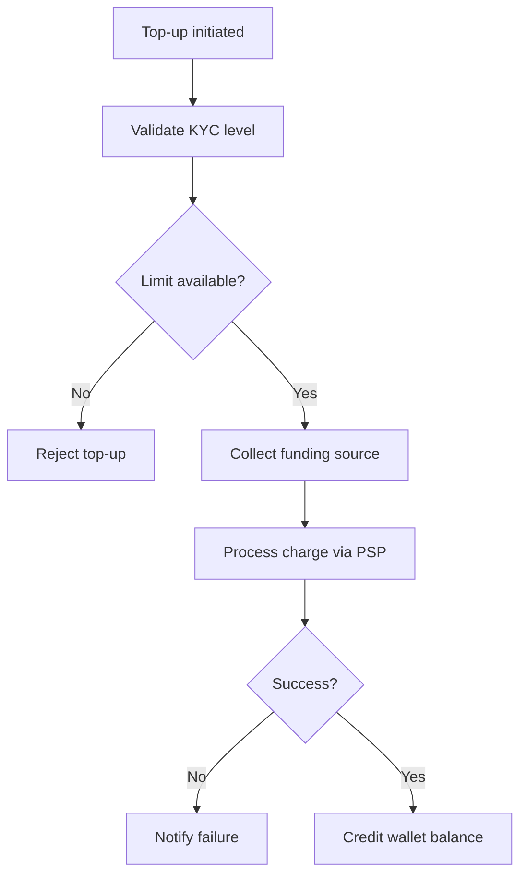
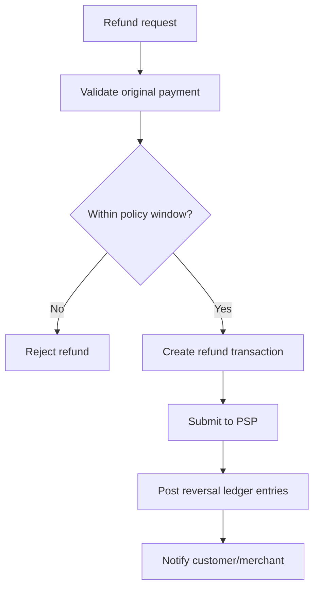

# Activity Diagrams

## Card Payment Flow

```mermaid
flowchart TD
    A[Payment request created] --> B[Validate merchant/customer]
    B --> C[Run risk checks]
    C --> D{Risk pass?}
    D -- No --> E[Decline + reason]
    D -- Yes --> F[Select PSP route]
    F --> G[Create auth request]
    G --> H{Authorized?}
    H -- No --> I[Return decline]
    H -- Yes --> J[Capture payment]
    J --> K[Post ledger entries]
```

## Wallet Top-up

```mermaid
flowchart TD
    A[Top-up initiated] --> B[Validate KYC level]
    B --> C{Limit available?}
    C -- No --> D[Reject top-up]
    C -- Yes --> E[Collect funding source]
    E --> F[Process charge via PSP]
    F --> G{Success?}
    G -- No --> H[Notify failure]
    G -- Yes --> I[Credit wallet balance]
```

## Refund Flow

```mermaid
flowchart TD
    A[Refund request] --> B[Validate original payment]
    B --> C{Within policy window?}
    C -- No --> D[Reject refund]
    C -- Yes --> E[Create refund transaction]
    E --> F[Submit to PSP]
    F --> G[Post reversal ledger entries]
    G --> H[Notify customer/merchant]
```
