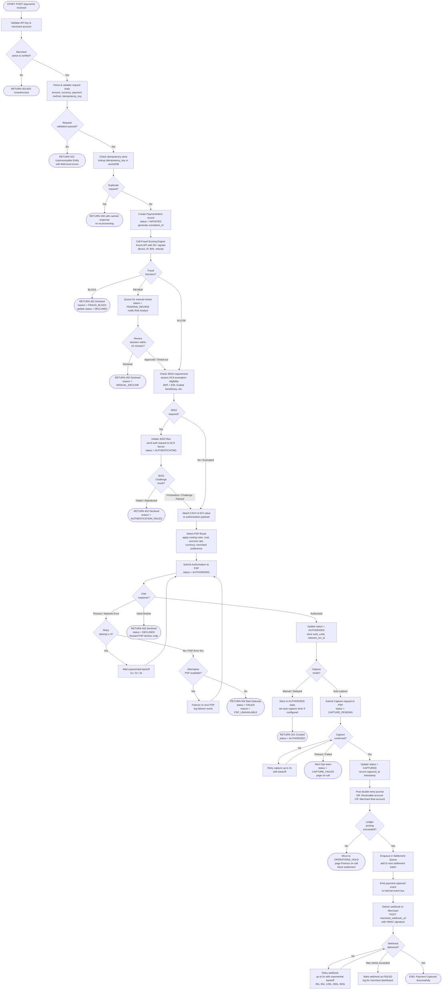
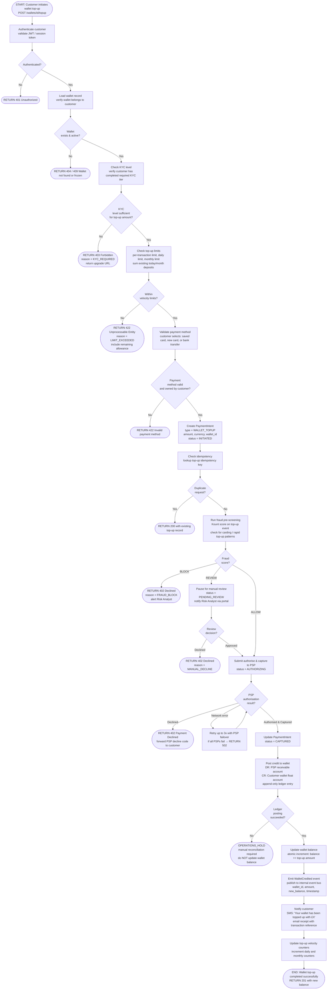

# Activity Diagrams — Payment Orchestration and Wallet Platform

This document provides detailed activity diagrams for the five core operational flows in the Payment Orchestration and Wallet Platform. Each diagram uses Mermaid flowcharts with explicit decision branches, retry paths, and terminal states, matching production-level process fidelity.

---

## 3.1 Payment Authorization and Capture Flow

This flow covers the complete lifecycle from an inbound API request through fraud scoring, 3DS2 authentication, PSP routing with failover, authorisation, optional auto-capture, ledger posting, webhook delivery, and settlement queue enqueue.



---

## 3.2 Refund Processing Flow

This flow handles merchant- or customer-initiated refunds, from request validation through PSP refund execution, ledger reversal, optional wallet credit, and settlement adjustment.

```mermaid
flowchart TD
    A([START: POST /payments/id/refunds received]) --> B[Authenticate request\nvalidate merchant API key]
    B --> C{Authenticated?}
    C -- No --> Z1([RETURN 401 Unauthorized])
    C -- Yes --> D[Load original payment\nfetch PaymentIntent by ID]
    D --> E{Payment\nfound?}
    E -- No --> Z2([RETURN 404 Not Found])
    E -- Yes --> F{Payment\nstatus is\nCAPTURED or SETTLED?}
    F -- No --> Z3([RETURN 409 Conflict\nreason = INVALID_STATE_FOR_REFUND])
    F -- Yes --> G[Check refund amount ceiling\nsum of existing refunds + requested amount]
    G --> H{Requested\namount ≤\noriginal captured amount?}
    H -- No --> Z4([RETURN 422 Unprocessable Entity\nreason = REFUND_EXCEEDS_ORIGINAL])
    H -- Yes --> I[Check refund policy window\ncompare payment.captured_at vs now]
    I --> J{Within\nrefund window?\ndefault: 180 days}
    J -- No --> Z5([RETURN 422 Unprocessable Entity\nreason = REFUND_WINDOW_EXPIRED])
    J -- Yes --> K[Check idempotency key\nlookup refund_idempotency_key]
    K --> L{Duplicate\nrefund request?}
    L -- Yes --> Z6([RETURN 200 with existing refund record])
    L -- No --> M[Create Refund record\nstatus = REFUND_PENDING\namount, currency, reason_code]
    M --> N[Call PSP Refund API\nsubmit refund to original PSP\nusing stored PSP transaction reference]
    N --> O{PSP\nresponse?}
    O -- Timeout --> P{Retry\nattempt ≤ 3?}
    P -- Yes --> Q[Backoff and retry\n2s / 4s / 8s]
    Q --> N
    P -- No --> Z7([Move refund to FAILED\nAlert Ops\nrequire manual processing])
    O -- PSP Error / Declined --> Z8([RETURN 502\nstatus = REFUND_FAILED\ninclude PSP error code])
    O -- Accepted / Pending --> R[Update refund status = REFUND_IN_PROGRESS\nstore PSP refund reference ID]
    R --> S{PSP refund\nconfirmation\nreceived?]
    S -- Poll / Webhook awaited --> T[Wait for PSP webhook\nor poll every 60s up to 24h]
    T --> S
    S -- Confirmed --> U[Update refund status = REFUNDED\nupdate payment.refunded_amount]
    U --> V{Full refund\nor partial?}
    V -- Full --> W[Update payment status = REFUNDED]
    V -- Partial --> X[Update payment status = PARTIALLY_REFUNDED\nrecalculate remaining refundable amount]
    W --> Y
    X --> Y[Post reversal journal entry\nDR: Merchant float account\nCR: Receivable account]
    Y --> Z{Funded via\nWallet balance?}
    Z -- Yes --> AA[Credit customer wallet\npost WalletCredited event\nupdate wallet balance]
    Z -- No / Card funding --> AB[PSP issues direct card refund\nno wallet action required]
    AA --> AC
    AB --> AC[Emit refund.completed event\nto internal event bus]
    AC --> AD[Notify customer\nSMS via Twilio + email via SendGrid]
    AD --> AE[Flag transaction in Settlement Adjustment queue\nadjust net settlement amount for batch]
    AE --> AF([END: Refund Processed Successfully])
```

---

## 3.3 Chargeback Dispute Flow

This flow models the full chargeback lifecycle from the moment the platform receives a dispute notification through evidence collection, representment, issuer decision, and ledger finalisation.

```mermaid
flowchart TD
    A([START: Chargeback webhook received from PSP]) --> B[Parse dispute notification\nextract chargeback_id, reason_code,\namount, deadline from payload]
    B --> C[Validate webhook signature\nHMAC verification against PSP secret]
    C --> D{Signature\nvalid?}
    D -- No --> Z1([Discard event\nlog security alert])
    D -- Yes --> E[Look up original payment\nby PSP transaction reference]
    E --> F{Payment\nfound?}
    F -- No --> Z2([Log orphaned chargeback\nalert Ops team\nmanual investigation required])
    F -- Yes --> G[Create Dispute record\nstatus = CHARGEBACK_OPEN\nreason_code, amount, chargeback_deadline]
    G --> H[Debit provisional hold\nDR: Merchant float account\nCR: Chargeback reserve account\nfor disputed amount + fees]
    H --> I[Update payment status = CHARGEBACK_OPEN]
    I --> J[Notify Merchant immediately\nPOST webhook: dispute.opened\nemail alert with deadline]
    J --> K[Start evidence collection countdown\nset deadline = chargeback_deadline - 2 days\nbuffer for upload processing]
    K --> L{Merchant\nresponds with\nevidence before deadline?}
    L -- No response / Withdrawal --> M[Merchant concedes dispute\nupdate status = CHARGEBACK_LOST]
    M --> N[Finalise debit\nDR: Merchant float account\nCR: Chargeback reserve account\nnote: provisional → confirmed]
    N --> O[Notify merchant of loss\nemit dispute.lost event]
    O --> P
    L -- Evidence submitted --> Q[Validate evidence package\ncheck file types, sizes, completeness]
    Q --> R{Evidence\npackage valid?}
    R -- No --> S[Return validation errors to merchant\nremaining time to resubmit]
    S --> L
    R -- Yes --> T[Relay evidence to PSP\nPOST /disputes/id/evidence\nattach documents, transaction logs]
    T --> U{PSP\naccepted\nevidence?}
    U -- No --> V[PSP rejection — resubmit or escalate\nnotify merchant]
    V --> L
    U -- Yes --> W[Update status = EVIDENCE_SUBMITTED\nstore submission timestamp]
    W --> X[Await issuer decision\npoll PSP every 24h or await webhook\ntypical window: 20-45 days]
    X --> Y{Issuer\ndecision?}
    Y -- Still pending --> X
    Y -- Dispute WON\nRepresentment successful --> Z[Update status = CHARGEBACK_WON]
    Z --> AA[Reverse provisional hold\nDR: Chargeback reserve account\nCR: Merchant float account]
    AA --> AB[Return funds to merchant\nnet of any chargeback processing fees]
    AB --> AC[Notify merchant of win\nemit dispute.won event]
    AC --> P
    Y -- Dispute LOST --> M
    P[Post final journal entry\nclose chargeback reserve balance\nrecord outcome and fees] --> Q2[Update compliance records\nlog reason code, outcome for reporting]
    Q2 --> R2([END: Dispute closed])
```



---

## 3.4 Settlement Batch Run Flow

This flow describes the end-of-day settlement process, from batch trigger through PSP file collection, three-way reconciliation, net amount calculation, bank submission, and batch closure.

```mermaid
flowchart TD
    A([START: Settlement batch triggered\nscheduled T+1 22:00 UTC or manual]) --> B[Acquire batch lock\nprevent concurrent batch runs\nuse distributed lock with TTL = 4h]
    B --> C{Lock\nacquired?}
    C -- No --> Z1([RETURN: Batch already running\nlog and exit])
    C -- Yes --> D[Set batch status = RUNNING\nrecord batch_start_time, triggered_by]
    D --> E[Collect all CAPTURED transactions\nsince last settlement cutoff\ngroup by merchant, currency, PSP]
    E --> F{Any transactions\nto settle?}
    F -- No --> Z2[Release lock\nclose empty batch\nlog: no transactions]
    F -- Yes --> G[For each PSP group:\ncalculate gross settlement amount\nin settlement currency]
    G --> H[Apply fee rules\nplatform fee %\nPSP interchange fee\ncurrency conversion spread]
    H --> I[Calculate net settlement amount\ngross - platform fees - PSP fees\n± FX conversion if needed]
    I --> J[Fetch latest FX rates\nfrom Bloomberg / OER for cross-currency nets]
    J --> K[Generate PSP settlement file\nISO 20022 / CSV per PSP format]
    K --> L[Transmit settlement file to bank\nvia SFTP or bank API\nfor each acquiring bank account]
    L --> M{File\ntransmission\nsucceeded?}
    M -- No --> N[Retry transmission up to 3x\n5 min intervals]
    N --> M
    M -- Max retries failed --> Z3([Alert Finance on-call\nbatch status = TRANSMISSION_FAILED\nblock merchant payouts])
    M -- Yes --> O[Update transactions status = SETTLEMENT_PENDING\nrecord batch_id on each transaction]
    O --> P[Await bank acknowledgment\npoll bank API or await SFTP response\ntimeout: 4 hours]
    P --> Q{Bank\nconfirmation\nreceived?}
    Q -- Timeout --> R{Retry\ncheck?}
    R -- Yes --> P
    R -- No --> Z4([Escalate to Finance team\nbatch status = CONFIRMATION_TIMEOUT])
    Q -- Rejected --> Z5([Alert Finance team\nbatch status = REJECTED_BY_BANK\ninclude rejection reason code])
    Q -- Confirmed --> S[Update transactions status = SETTLED\nrecord settlement_date, bank_reference]
    S --> T[Reconcile against PSP settlement report\ndownload PSP settlement file from SFTP/API]
    T --> U[Three-way match\nledger amount vs PSP file vs bank statement\nfor each transaction line]
    U --> V{All lines\nmatched?}
    V -- No --> W[Classify breaks:\nTIMING, AMOUNT, MISSING, DUPLICATE\nauto-resolve TIMING breaks within tolerance]
    W --> X{Breaks\nresolved?}
    X -- No --> Y[Create reconciliation exceptions\nassign to Finance team for manual review\nstatus = RECON_EXCEPTION]
    Y --> Z[Generate exception report\nemail to Finance Manager]
    X -- Yes / After manual resolution --> Z[Generate exception report\nemail to Finance Manager]
    V -- Yes --> AA
    Z --> AA[Post final settlement journal entries\nDR: PSP receivable\nCR: Merchant bank account]
    AA --> AB[Calculate platform revenue\nsum of all fees collected]
    AB --> AC[Update batch status = COMPLETED\nrecord batch_end_time, total_settled_amount]
    AC --> AD[Release distributed lock]
    AD --> AE[Emit settlement.batch.completed event\nnotify merchants of individual payouts]
    AE --> AF([END: Settlement batch closed successfully])
```



---

## 3.5 Wallet Top-Up Flow

This flow covers the complete wallet funding journey, from customer-initiated top-up through payment intent creation, card authorisation, wallet credit posting, and customer notification.



---

## 3.6 Activity Diagram Notes

### Decision Node Conventions
- **Diamond nodes** (`{...}`) represent decision points with explicit Yes/No or labelled branches.
- **Rounded rectangles** (`([...])`) represent terminal states (success or failure endpoints).
- **Rectangles** (`[...]`) represent processing steps.

### Error State Conventions
All terminal failure states (`Z1`, `Z2`, etc.) follow the pattern:
1. Return appropriate HTTP status code to caller
2. Update internal transaction status to reflect failure type
3. Emit failure event for monitoring / alerting
4. Log correlation ID, failure reason, and timestamp

### Retry Policies Summary

| Flow | Operation | Max Retries | Backoff Strategy | Failover |
|---|---|---|---|---|
| Auth & Capture | PSP Authorisation | 3 | Exponential (1s/2s/4s) | Yes — next PSP |
| Auth & Capture | Webhook delivery | 5 | Exponential (30s→600s) | No |
| Auth & Capture | Capture | 3 | Linear (5s) | No |
| Refund | PSP refund submission | 3 | Exponential (2s/4s/8s) | No |
| Settlement | File transmission | 3 | Linear (5 min) | No |
| Settlement | Bank confirmation poll | 12 | Linear (20 min) | No |
| Wallet Top-up | PSP authorisation | 3 | Exponential (1s/2s/4s) | Yes — next PSP |

