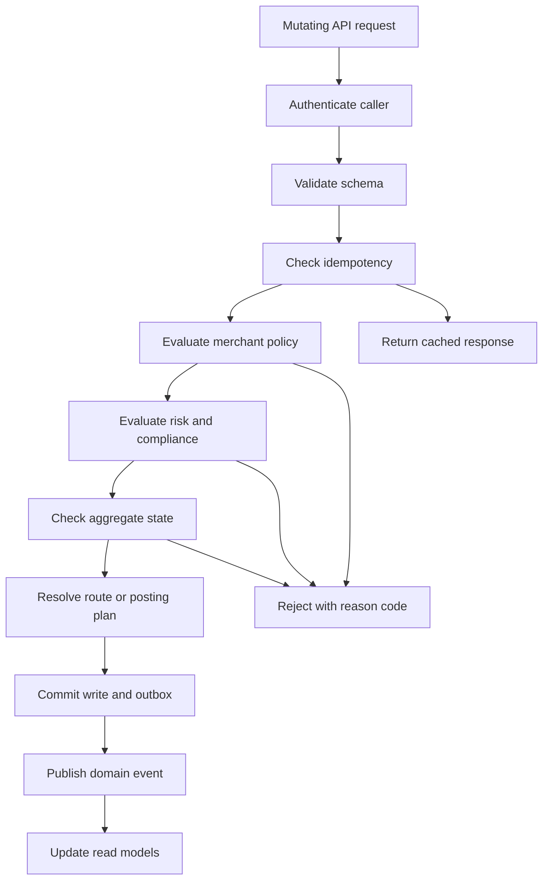

# Business Rules — Payment Orchestration and Wallet Platform

This document defines the enforceable business rules for payment orchestration, wallet movements, ledger posting, settlement, reconciliation, refunds, chargebacks, payouts, and regulated operations. These rules are intended to be implemented in API handlers, saga coordinators, policy engines, background workers, and operations tooling.

## 1. Authoritative Aggregates and Ownership

| Aggregate | System of Record | Key Fields | Notes |
|---|---|---|---|
| Payment Intent | Payment Orchestration Service | `payment_intent_id`, merchant, amount, currency, lifecycle status, routing decision | One logical customer charge. May contain multiple PSP attempts. |
| Payment Attempt | PSP Adapter + Orchestration | `attempt_id`, `provider`, `provider_reference`, `attempt_status`, timeout metadata | Used to prevent duplicate authorizations during failover. |
| Wallet | Wallet Service | `wallet_id`, owner, sub-wallet currency, balance buckets, freeze flags | All spendable balances are derived from immutable journals. |
| Journal | Ledger Service | `journal_id`, `business_event_id`, debit lines, credit lines, posting state | Append-only. Corrections use reversal journals. |
| Settlement Batch | Settlement Service | `batch_id`, merchant, PSP, business date, gross, fees, net, batch state | Idempotent by `merchant + provider + settlement_date`. |
| Reconciliation Run | Reconciliation Service | `run_id`, scope, file versions, break summary, attestation | Performs three-way matching. |
| Payout | Payout Service | `payout_id`, merchant, amount, currency, destination, hold reason, payout state | Cannot leave `SCHEDULED` without KYC, AML, and liquidity checks. |
| Chargeback Case | Dispute Service | `chargeback_id`, network case, response deadline, reserve state | Linked to the originating payment intent and journal chain. |

## Enforceable Rules

## 2. Payment Lifecycle Rules

| Rule ID | Rule | Enforcement |
|---|---|---|
| BR-001 | `POST /v1/payment-intents` requires merchant identity, amount, currency, payment source, and `Idempotency-Key`. | API Gateway and Payment API reject missing or malformed requests before orchestration starts. |
| BR-002 | A payment intent represents one customer obligation. Multiple PSP attempts MAY exist, but only one successful authorization may survive. | Saga coordinator stores an intent-level lock and attempt history before any PSP call. |
| BR-003 | Allowed state path is `CREATED -> REVIEW_REQUIRED? -> AUTHORIZING -> AUTHORIZED -> CAPTURE_PENDING -> PARTIALLY_CAPTURED|CAPTURED -> SETTLEMENT_PENDING -> SETTLED`. | State machine is validated server side. Any non-listed transition returns `409 Conflict`. |
| BR-004 | Fallback routing is allowed only for transport errors, HTTP 5xx, PSP maintenance responses, and issuer soft-decline codes explicitly marked reroutable. | Routing rules engine keeps a provider-specific allowlist of retryable outcomes. |
| BR-005 | Fallback routing is forbidden after an issuer hard decline, 3DS challenge failure, fraud decline, or any provider response that includes a confirmed authorization reference. | Prevents double charging and inconsistent liability. |
| BR-006 | When PSP outcome is ambiguous, the attempt moves to `PSP_RESULT_UNKNOWN`. The platform must poll provider status or attempt a provider-side void before retrying elsewhere. | No second authorization may be submitted while outcome is unresolved. |
| BR-007 | Partial capture amount must be `0 < amount <= authorized_amount - already_captured_amount`. Remaining authorized amount must be released or allowed to expire by scheme rules. | Capture endpoint enforces arithmetic and provider capabilities. |
| BR-008 | Merchant-initiated captures are rejected after authorization expiry. Auto-void must run when expiry threshold is crossed and no capture exists. | Scheduler emits `authorization.expiring` and `authorization.expired` events. |
| BR-009 | All PSP callbacks and webhooks are append-only inputs. Duplicate provider event IDs must not change business outcome twice. | Provider event store has a unique key on `(provider, provider_event_id)`. |
| BR-010 | Every lifecycle mutation must emit a domain event with `correlation_id`, `causation_id`, `actor_type`, and `actor_id`. | Outbox relay publishes only after DB commit succeeds. |

### PSP Routing Policy

Routing rank is computed from the following ordered inputs:

1. Merchant hard overrides such as forced PSP or geography restrictions.
2. Payment method support, currency support, and merchant PSP contract status.
3. BIN-country compatibility, card network support, and 3DS2 capability.
4. Real-time provider health score including latency, error rate, and timeout rate.
5. Rolling authorization rate by merchant, BIN range, MCC, and amount band.
6. Effective processing cost including interchange-like provider fees and FX markup.

Additional routing rules:

- Routing decisions are immutable per attempt and stored with the rule snapshot version used.
- A PSP adapter must pass the platform idempotency key or a deterministic derivative to the provider whenever the provider supports idempotency headers.
- Retry budget for online authorization is 5 seconds end to end. The platform may spend this budget on one primary attempt and one fallback attempt, not unbounded retries.
- Risk decisions override routing. `DECLINE` ends the flow immediately. `REVIEW` pauses the flow until analyst decision or SLA expiry.

## 3. Wallet and Balance Rules

Wallet balances are split into explicit buckets:

| Bucket | Meaning | Debit Allowed | Credit Allowed |
|---|---|---|---|
| `available` | Funds spendable or releasable for payout | Yes | Yes |
| `pending_in` | Funds recognized but not yet cleared or settled | No | Yes |
| `pending_out` | Funds committed to outbound payout or transfer but not completed | No | No |
| `reserved` | Funds held for dispute, risk reserve, or payout hold | No | Yes |
| `frozen` | Administrative state preventing outbound movement | No | Configurable |

Wallet rules:

- BR-011: Every wallet mutation must create a balanced journal before the read model balance changes.
- BR-012: `available >= 0` for wallets without overdraft permission. Overdraft permission is merchant-tier configuration, not an operator override.
- BR-013: Wallet-to-wallet transfers are atomic across source and destination sub-wallets. Either both journal legs commit or neither does.
- BR-014: A freeze blocks debits, transfers, and payouts. Credits are still allowed unless `full_freeze = true`.
- BR-015: FX conversion between sub-wallets must record source amount, target amount, mid-market rate, markup bps, and rounding delta in the journal metadata.
- BR-016: A payout request can only draw from `available` balance. Funds are first moved to `pending_out`; they are released to bank dispatch only after compliance and liquidity checks pass.

## 4. Ledger Rules and Double-Entry Invariants

| Rule ID | Rule | Outcome if Violated |
|---|---|---|
| BR-017 | Sum of debit lines equals sum of credit lines per currency within a journal. | Journal rejected and incident raised. |
| BR-018 | One business event posts at most one effective journal version. Corrections are new reversal or adjustment journals referencing the original. | Duplicate event rejected by unique constraint on `business_event_type + business_event_id + posting_version`. |
| BR-019 | Ledger entries are immutable. Update and delete operations are prohibited in production paths. | Any correction uses `reversal_of_journal_id`. |
| BR-020 | Accounts are tenant-aware and currency-aware. Cross-currency journals require explicit FX bridge lines. | Prevents hidden gains or losses. |
| BR-021 | Every ledger journal must include `correlation_id`, `business_event_id`, `source_service`, and `approved_by` for manual entries. | Missing metadata rejects the journal. |
| BR-022 | High-value manual adjustments above the configured threshold require two approvers who are not the original requester. | Finance UI enforces dual control. |

Core posting policies:

- Authorization holds do not credit merchant available funds. They create memo or pending positions only.
- Capture recognition creates a receivable from the PSP and a liability to the merchant or customer wallet.
- Fees must be posted as distinct lines and never netted invisibly into gross merchant amounts.
- Refunds, chargebacks, and payout returns use compensating journals; original journals remain intact.

## 5. Settlement, Reconciliation, and Payout Rules

- BR-023: Settlement batches are keyed by merchant, PSP, settlement date, and currency. Re-running a batch with the same key must return the existing batch unless a supervised rebuild is requested.
- BR-024: Net settlement equals captured gross minus refunds, chargebacks, provider fees, reserve movements, and payout adjustments recognized for that batch window.
- BR-025: Three-way reconciliation compares internal ledger, PSP clearing file, and bank statement. A record is not considered reconciled until all three views agree or an approved timing exception exists.
- BR-026: Break categories are limited to `TIMING`, `AMOUNT_MISMATCH`, `MISSING_FROM_PSP`, `MISSING_FROM_LEDGER`, `MISSING_FROM_BANK`, `DUPLICATE`, and `UNMAPPED_FEE`.
- BR-027: `TIMING` breaks automatically expire only if they clear inside the configured aging window. Aged timing breaks escalate to finance review.
- BR-028: Payout release requires `merchant_kyc_status = VERIFIED`, `aml_status != BLOCKED`, no active critical reconciliation break, and sufficient liquidity in the merchant wallet.
- BR-029: Instant payouts apply a configurable risk reserve. The reserve remains in `reserved` balance until payout clearing confirmation or return timeout expiry.

## 6. Refund, Chargeback, Fraud, and Compliance Rules

| Area | Rule |
|---|---|
| Refunds | Refund total may not exceed captured amount less prior successful refunds. Refunds use the original PSP unless the provider contract explicitly supports off-platform refund rails. |
| Chargebacks | On chargeback open, the platform creates a dispute reserve or wallet hold immediately if merchant funds are already available. On chargeback lost, reserve converts into a finalized debit and fee journal. |
| Evidence | Evidence submission is locked after provider response deadline minus a safety buffer of 2 hours. Operators cannot override the lock without compliance approval. |
| Fraud | Risk `REVIEW` creates a queue item with SLA timer. If the SLA expires, default decision is merchant-configurable but must be explicit per merchant. |
| AML/KYC | Wallet creation above configured thresholds and all payouts above sanction threshold must pass AML screening. Failed or stale KYC blocks payout release but not inbound settlement credits. |
| PCI | Raw PAN, CVV, and full track data may only exist inside the vault or PSP-hosted field context. Any appearance outside the PCI boundary is a Sev-1 incident. |

## Exception and Override Handling

## 7. Manual Override and Auditability Rules

Manual actions are permitted only for documented exception classes:

- force-closing an aged reconciliation break after evidence review
- releasing a payout on sanctioned false positive after compliance approval
- reversing a wrong manual adjustment
- reopening a dispute after an erroneous provider webhook mapping

Every override must record:

- requester and approver identities
- original state and target state
- free-text reason and structured reason code
- evidence links
- expiry timestamp for temporary overrides
- related incident or ticket ID

## Rule Evaluation Pipeline

## 8. Rule Evaluation Flow

## 9. Implementation Notes

- Business rule evaluation must be deterministic for a given request payload and policy snapshot.
- Provider-specific behavior belongs in adapters, but business outcome mapping belongs in the orchestration domain.
- Read models may lag, but write-path rules must always use authoritative stores.
