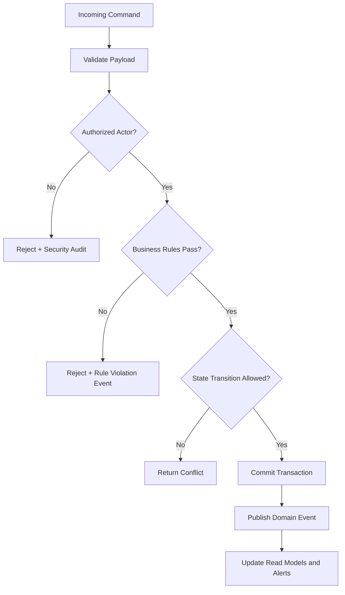
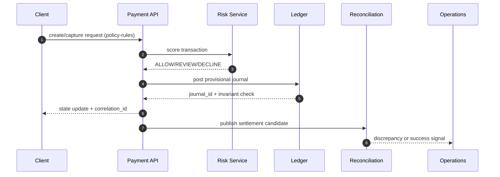

# Business Rules

This document defines enforceable policy rules for **Payment Orchestration and Wallet Platform** so command processing, asynchronous jobs, and operational actions behave consistently under normal and exceptional conditions.

## Context
- Domain focus: payment orchestration and wallet workflows.
- Rule categories: lifecycle transitions, authorization, compliance, and resilience.
- Enforcement points: APIs, workflow/state engines, background processors, and administrative consoles.

## Enforceable Rules
1. Every state-changing command must pass authentication, authorization, and schema validation before processing.
2. Lifecycle transitions must follow the configured state graph; invalid transitions are rejected with explicit reason codes.
3. High-impact operations (financial, security, or regulated data actions) require additional approval evidence.
4. Manual overrides must include approver identity, rationale, and expiration timestamp.
5. Retries and compensations must be idempotent and must not create duplicate business effects.

## Rule Evaluation Pipeline

## Exception and Override Handling
- Overrides are restricted to approved exception classes and require dual logging (business + security audit).
- Override windows automatically expire and trigger follow-up verification tasks.
- Repeated override patterns are reviewed for policy redesign and automation improvements.

## Artifact-Specific Deep Dive: Lifecycle, Reconciliation, Disputes, Fraud, and Ledger Safety

### Why this artifact matters
This document now defines **policy-rules** behavior and explicitly maps architecture intent to API contracts, diagrammed flows, and day-2 operations owned by **Product, Risk Policy**.

### Transaction state transitions required in this artifact
- `INITIATED -> AUTHORIZING -> AUTHORIZED -> CAPTURE_PENDING -> CAPTURED` for card and wallet charges.
- `CAPTURED -> SETTLEMENT_PENDING -> SETTLED` after provider clearing confirmation.
- `CAPTURED|SETTLED -> REFUND_PENDING -> PARTIALLY_REFUNDED|REFUNDED` for merchant-initiated refunds.
- `SETTLED -> CHARGEBACK_OPEN -> CHARGEBACK_WON|CHARGEBACK_LOST` for issuer disputes.
- Each transition MUST include: actor, triggering API/event, timeout, retry policy, and compensating action.

### API contracts this artifact must keep consistent
- `POST /payments`: documented here with required request ids, idempotency keys, and failure reason codes for **policy-rules**.
- `POST /payments/{id}/void`: documented here with required request ids, idempotency keys, and failure reason codes for **policy-rules**.
- `POST /payments/{id}/refunds`: documented here with required request ids, idempotency keys, and failure reason codes for **policy-rules**.
- `POST /ledger/journals`: documented here with required request ids, idempotency keys, and failure reason codes for **policy-rules**.
- All mutating calls MUST return `correlation_id`, `idempotency_key`, `previous_state`, `new_state`, and `transition_reason`.

### In-depth flow diagram for business-rules

### Reconciliation, dispute/refund, and fraud controls
- Reconciliation: three-way match (ledger vs PSP file vs bank statement) with tolerance thresholds and auto-classification into `timing`, `amount`, `missing`, `duplicate` breaks.
- Disputes/Refunds: evidence chain-of-custody, SLA timers, and automatic ledger reversals when disputes are lost.
- Fraud: pre-auth risk decisioning, post-auth anomaly detection, and payout velocity controls tied to case management.

### Ledger invariants and operational hooks
- Invariants enforced here: double-entry balance, append-only journal, exactly-once posting per business event, and currency-safe postings.
- Operational process: if any invariant fails, move transaction to `OPERATIONS_HOLD`, page on-call + finance, and block payout release until compensating journals are approved.
- Runbooks must include: replay commands, manual override approvals (dual control), and incident-close reconciliation attestation.

