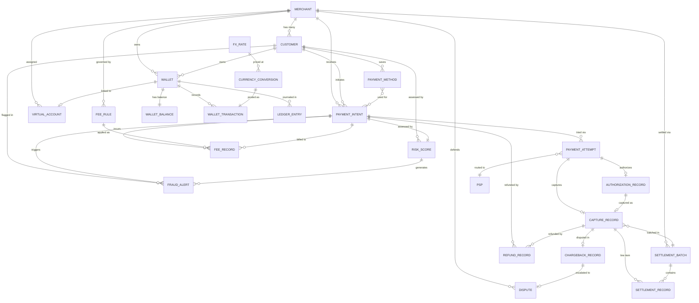

# Data Dictionary — Payment Orchestration and Wallet Platform

**Version:** 1.0  
**Status:** Approved  
**Last Updated:** 2025-01-01  
**Owner:** Platform Engineering · Payments Core  

---

## Table of Contents

1. [Merchant](#1-merchant)
2. [Customer](#2-customer)
3. [Wallet](#3-wallet)
4. [WalletBalance](#4-walletbalance)
5. [WalletTransaction](#5-wallettransaction)
6. [PaymentIntent](#6-paymentintent)
7. [PaymentAttempt](#7-paymentattempt)
8. [AuthorizationRecord](#8-authorizationrecord)
9. [CaptureRecord](#9-capturerecord)
10. [RefundRecord](#10-refundrecord)
11. [ChargebackRecord](#11-chargebackrecord)
12. [Dispute](#12-dispute)
13. [PaymentMethod](#13-paymentmethod)
14. [VirtualAccount](#14-virtualaccount)
15. [FXRate](#15-fxrate)
16. [CurrencyConversion](#16-currencyconversion)
17. [SettlementBatch](#17-settlementbatch)
18. [SettlementRecord](#18-settlementrecord)
19. [LedgerEntry](#19-ledgerentry)
20. [RiskScore](#20-riskscore)
21. [FraudAlert](#21-fraudalert)
22. [FeeRule](#22-feerule)
23. [FeeRecord](#23-feerecord)
24. [Canonical Relationship Diagram](#canonical-relationship-diagram)
25. [Data Quality Controls](#data-quality-controls)

---

## Core Entities

The table below is the top-level map of every domain object managed by the platform. All entities live inside the `payments` PostgreSQL schema unless otherwise noted.

| Entity | Table | Primary Concern | Critical Constraints |
|---|---|---|---|
| Merchant | `merchants` | Registered business accepting payments | `status`, `risk_tier`, `kyc_verified_at` drive routing and settlement eligibility |
| Customer | `customers` | End-user or payer whose card/wallet is charged | `kyc_status` must be `verified` before high-value transactions; PII encryption required |
| Wallet | `wallets` | Virtual store of value for a merchant or customer | Exactly one `WalletBalance` per (wallet_id, currency); balance never goes negative |
| PaymentIntent | `payment_intents` | Merchant-initiated intent to collect funds | `idempotency_key` must be unique per merchant; `client_secret` never logged |
| PaymentAttempt | `payment_attempts` | Single routing attempt against a PSP | Immutable once `status` reaches terminal state; PSP raw response retained for audit |
| AuthorizationRecord | `authorization_records` | Network authorization from issuing bank | `auth_code` and `acquirer_reference_number` required for capture and dispute evidence |
| CaptureRecord | `capture_records` | Confirmed fund capture after authorization | Links to `settlement_batches`; triggers ledger posting via `WalletTransaction` |
| RefundRecord | `refund_records` | Reversal of a captured payment | `idempotency_key` prevents duplicate refunds; amount ≤ captured amount |
| ChargebackRecord | `chargeback_records` | Network-initiated dispute (ISO 8583) | Deadline-driven; triggers automatic evidence assembly workflow |
| Dispute | `disputes` | Internal case record wrapping a chargeback | `response_evidence` must be submitted before `deadline_at`; GDPR data-subject scoped |
| PaymentMethod | `payment_methods` | Tokenised instrument (card, bank, UPI) | Raw PAN never stored; `vault_token` references external PCI vault |
| VirtualAccount | `virtual_accounts` | Bank account number assigned to a merchant | `account_number` sourced from bank partner; scoped to single currency |
| FXRate | `fx_rates` | Spot rate snapshot from a rate source | `valid_until` enforced before use; spread_bps audited against SLA |
| CurrencyConversion | `currency_conversions` | Double-entry FX conversion event | Links `fx_rate_id` and `wallet_transaction_id` for full traceability |
| SettlementBatch | `settlement_batches` | Daily/weekly merchant payout batch | `net_amount` = `gross_amount` - `fee_amount`; immutable once `completed` |
| SettlementRecord | `settlement_records` | Line-item inside a settlement batch | `reconciliation_status` drives finance exception workflow |
| LedgerEntry | `ledger_entries` | Double-entry bookkeeping line | Immutable; reversals create new entries referencing `reversal_entry_id` |
| RiskScore | `risk_scores` | ML + rules risk assessment per payment | `decision` gates payment continuation; score 0-100 scale |
| FraudAlert | `fraud_alerts` | Actionable fraud signal for review queue | SLA: `critical` alerts must be reviewed within 15 minutes |
| FeeRule | `fee_rules` | Merchant fee configuration | Priority-ordered; first matching rule wins; supports tiered pricing |
| FeeRecord | `fee_records` | Calculated fee applied to a payment | Immutable once posted; links to `fee_rule_id` for audit trail |
| WalletBalance | `wallet_balances` | Materialized balance per wallet+currency | Optimistic locking via `version`; updated atomically with `LedgerEntry` |
| WalletTransaction | `wallet_transactions` | High-level wallet debit/credit event | `balance_before` + `amount` = `balance_after` enforced at application layer |

---

## Canonical Relationship Diagram

The diagram below shows cardinality between every entity. Read `||--o{` as "one-to-zero-or-many" and `||--||` as "one-to-one".

---

## 1. Merchant

**Description:** The top-level business entity that integrates with the platform to accept payments. A Merchant is the unit of configuration for routing, fees, settlement, and risk policy. Every Merchant must complete KYC before live-mode transactions are permitted. `risk_tier` is recalculated weekly by the risk engine based on chargeback ratio, fraud rate, and transaction volume. `settlement_currency` and `payout_schedule` control how and when funds flow to the merchant's bank account.

**Table:** `payments.merchants`

| Attribute | Type | Nullable | Default | Constraints | Description |
|---|---|---|---|---|---|
| `id` | `UUID` | No | `gen_random_uuid()` | PK | Globally unique merchant identifier. Immutable after creation. |
| `tenant_id` | `UUID` | No | — | FK → `tenants.id` | Multi-tenancy partition key. All queries must scope to `tenant_id`. |
| `legal_name` | `VARCHAR(255)` | No | — | NOT NULL | Legal registered business name as per incorporation documents. |
| `trading_name` | `VARCHAR(255)` | Yes | NULL | — | DBA / trading name displayed on payment pages and statements. |
| `mcc` | `VARCHAR(4)` | No | — | CHECK (`mcc` ~ '^[0-9]{4}$') | ISO 18245 Merchant Category Code. Drives interchange optimisation and risk policy. |
| `registration_number` | `VARCHAR(100)` | Yes | NULL | UNIQUE per tenant | Company registration number issued by the national authority. |
| `tax_id` | `VARCHAR(50)` | Yes | NULL | Encrypted at rest | VAT / EIN / GST tax identifier. Subject to PII controls. |
| `status` | `VARCHAR(20)` | No | `'active'` | ENUM(`active`,`suspended`,`offboarded`) | Lifecycle state. Only `active` merchants can process live payments. |
| `risk_tier` | `VARCHAR(10)` | No | `'low'` | ENUM(`low`,`medium`,`high`) | Risk classification. Recalculated weekly by risk engine. Drives reserve requirements. |
| `settlement_currency` | `CHAR(3)` | No | — | ISO 4217 | Target currency for merchant settlement payouts. |
| `payout_schedule` | `VARCHAR(10)` | No | `'daily'` | ENUM(`daily`,`weekly`,`monthly`) | Frequency at which net settlement batches are triggered. |
| `webhook_url` | `VARCHAR(2048)` | Yes | NULL | Valid HTTPS URL | Endpoint to receive payment lifecycle event notifications. |
| `kyc_verified_at` | `TIMESTAMPTZ` | Yes | NULL | — | Timestamp when KYC passed. NULL means KYC incomplete; blocks live-mode. |
| `kyc_provider` | `VARCHAR(50)` | Yes | NULL | — | KYC vendor used (e.g., `jumio`, `onfido`, `persona`). |
| `kyc_reference_id` | `VARCHAR(255)` | Yes | NULL | — | External reference ID from the KYC provider for audit trail. |
| `created_at` | `TIMESTAMPTZ` | No | `NOW()` | Immutable | UTC timestamp of record creation. |
| `updated_at` | `TIMESTAMPTZ` | No | `NOW()` | Auto-updated | UTC timestamp of last modification. |
| `metadata` | `JSONB` | Yes | `'{}'` | Valid JSON object | Arbitrary key-value pairs for platform extensions (e.g., account manager, region tags). |

**Indexes:**
- `UNIQUE (tenant_id, registration_number)` — prevents duplicate business registration within a tenant
- `INDEX (tenant_id, status)` — fast filtering of active merchants
- `INDEX (risk_tier, status)` — risk engine batch queries
- `INDEX (kyc_verified_at) WHERE kyc_verified_at IS NULL` — partial index for KYC queue

**Relationships:**
- `1:N → customers` via `customers.merchant_id`
- `1:N → payment_intents` via `payment_intents.merchant_id`
- `1:N → wallets` (owner_type = merchant) via `wallets.owner_id`
- `1:N → settlement_batches` via `settlement_batches.merchant_id`
- `1:N → fee_rules` via `fee_rules.merchant_id`

---

## 2. Customer

**Description:** An end-user or payer whose payment instruments are charged on behalf of a Merchant. Customers are scoped to a single Merchant but may hold multiple saved payment methods and wallets. `external_ref` allows Merchants to correlate the platform's customer record with their own user database. KYC status gates high-value transactions and wallet funding above configurable thresholds. Device fingerprint and IP address are captured at account creation for fraud baseline and velocity analysis.

**Table:** `payments.customers`

| Attribute | Type | Nullable | Default | Constraints | Description |
|---|---|---|---|---|---|
| `id` | `UUID` | No | `gen_random_uuid()` | PK | Platform-generated customer identifier. |
| `merchant_id` | `UUID` | No | — | FK → `merchants.id` | Owning merchant. Customer is scoped entirely to this merchant. |
| `external_ref` | `VARCHAR(255)` | Yes | NULL | UNIQUE per merchant | Merchant's own user ID for bi-directional lookup. |
| `email` | `VARCHAR(320)` | Yes | NULL | Encrypted; RFC 5321 | Customer email. Encrypted at rest; used for fraud velocity checks. |
| `phone_e164` | `VARCHAR(20)` | Yes | NULL | E.164 format | Phone number in E.164 format (e.g., `+14155552671`). Encrypted at rest. |
| `full_name` | `VARCHAR(255)` | Yes | NULL | Encrypted | Full legal name. PII — subject to GDPR right-to-erasure tokenisation. |
| `date_of_birth` | `DATE` | Yes | NULL | Encrypted | Date of birth. Used for KYC age verification. Encrypted at rest. |
| `country_code` | `CHAR(2)` | Yes | NULL | ISO 3166-1 alpha-2 | Customer country of residence. Drives tax and regulatory treatment. |
| `kyc_status` | `VARCHAR(20)` | No | `'none'` | ENUM(`none`,`pending`,`verified`,`rejected`) | KYC state. `verified` required for transactions above merchant-configured threshold. |
| `risk_level` | `VARCHAR(10)` | No | `'low'` | ENUM(`low`,`medium`,`high`,`blocked`) | Platform-assigned risk classification. Updated by risk engine on each scored transaction. |
| `ip_address` | `INET` | Yes | NULL | — | IP address captured at customer creation. Used for geo-velocity fraud rules. |
| `device_fingerprint` | `VARCHAR(255)` | Yes | NULL | — | Client-side device fingerprint hash. Used for device velocity rules. |
| `created_at` | `TIMESTAMPTZ` | No | `NOW()` | Immutable | UTC timestamp of record creation. |
| `updated_at` | `TIMESTAMPTZ` | No | `NOW()` | Auto-updated | UTC timestamp of last update. |
| `metadata` | `JSONB` | Yes | `'{}'` | Valid JSON object | Merchant-supplied arbitrary customer attributes. |

**Indexes:**
- `UNIQUE (merchant_id, external_ref)` — bi-directional merchant lookup
- `INDEX (merchant_id, kyc_status)` — KYC queue filtering
- `INDEX (merchant_id, risk_level)` — risk engine queries
- `INDEX (email_hash)` — hashed email for cross-merchant fraud correlation (separate hash column)

**Relationships:**
- `N:1 → merchants` via `merchant_id`
- `1:N → payment_methods` via `payment_methods.customer_id`
- `1:N → wallets` (owner_type = customer)
- `1:N → payment_intents` via `payment_intents.customer_id`
- `1:N → risk_scores` via `risk_scores.customer_id`

---

## 3. Wallet

**Description:** A virtual account that holds a balance in a single currency on behalf of a Merchant or Customer (`owner_type`). The platform supports four wallet types: `stored_value` (general purpose consumer wallet), `escrow` (funds held pending delivery confirmation), `settlement` (merchant settlement account before payout), and `payout` (staging wallet for outbound disbursements). A wallet may be frozen for compliance reasons, in which case debits and credits are rejected until unfrozen. Wallet status transitions are append-only in the audit log.

**Table:** `payments.wallets`

| Attribute | Type | Nullable | Default | Constraints | Description |
|---|---|---|---|---|---|
| `id` | `UUID` | No | `gen_random_uuid()` | PK | Globally unique wallet identifier. |
| `owner_type` | `VARCHAR(10)` | No | — | ENUM(`merchant`,`customer`) | Whether this wallet belongs to a merchant or customer. |
| `owner_id` | `UUID` | No | — | FK → owner entity | References `merchants.id` or `customers.id` depending on `owner_type`. |
| `wallet_type` | `VARCHAR(20)` | No | — | ENUM(`stored_value`,`escrow`,`settlement`,`payout`) | Functional classification governing allowed transaction types. |
| `status` | `VARCHAR(10)` | No | `'active'` | ENUM(`active`,`frozen`,`closed`) | Lifecycle state. Frozen wallets reject all debit and credit operations. |
| `currency` | `CHAR(3)` | No | — | ISO 4217 | Single currency denomination for this wallet. Immutable after creation. |
| `created_at` | `TIMESTAMPTZ` | No | `NOW()` | Immutable | UTC timestamp of wallet creation. |
| `updated_at` | `TIMESTAMPTZ` | No | `NOW()` | Auto-updated | UTC timestamp of last update. |
| `frozen_at` | `TIMESTAMPTZ` | Yes | NULL | — | Timestamp when the wallet was frozen. NULL if not frozen. |
| `frozen_reason` | `TEXT` | Yes | NULL | — | Human-readable explanation for freeze (e.g., `AML_REVIEW`, `SANCTIONS_HIT`). |
| `metadata` | `JSONB` | Yes | `'{}'` | — | Extensible attributes for wallet tagging and product-level overrides. |

**Indexes:**
- `INDEX (owner_type, owner_id)` — all wallets for an owner
- `INDEX (owner_id, currency, status)` — active wallet lookup by currency
- `INDEX (status) WHERE status = 'frozen'` — compliance freeze queue

**Relationships:**
- `N:1 → merchants or customers` (polymorphic via `owner_type`, `owner_id`)
- `1:1 → wallet_balances` (one balance record per wallet)
- `1:N → wallet_transactions`
- `1:N → ledger_entries`
- `0:1 → virtual_accounts` via `virtual_accounts.linked_wallet_id`

---

## 4. WalletBalance

**Description:** The materialised, authoritative balance snapshot for a single Wallet. It is the source of truth for available and reserved funds and is updated atomically within the same database transaction as the corresponding `LedgerEntry`. `available_balance` represents funds that can be freely debited. `reserved_balance` represents funds placed on hold (e.g., pending capture). `total_balance` is a computed column enforced as `available_balance + reserved_balance`. Optimistic concurrency is enforced via the `version` column to prevent double-spend under concurrent updates.

**Table:** `payments.wallet_balances`

| Attribute | Type | Nullable | Default | Constraints | Description |
|---|---|---|---|---|---|
| `id` | `UUID` | No | `gen_random_uuid()` | PK | Unique balance record identifier. |
| `wallet_id` | `UUID` | No | — | FK → `wallets.id`; UNIQUE | One balance record per wallet. Enforced by unique constraint. |
| `currency` | `CHAR(3)` | No | — | ISO 4217; matches `wallets.currency` | Currency denomination. Must match parent wallet currency. |
| `available_balance` | `NUMERIC(20,6)` | No | `0.000000` | CHECK ≥ 0 | Spendable balance. Updated on debit, credit, reserve, and release operations. |
| `reserved_balance` | `NUMERIC(20,6)` | No | `0.000000` | CHECK ≥ 0 | Funds on hold pending authorization or escrow release. |
| `total_balance` | `NUMERIC(20,6)` | No | `GENERATED ALWAYS` | Computed: `available + reserved` | Convenience total. Enforced as a generated column; not directly writable. |
| `last_updated_at` | `TIMESTAMPTZ` | No | `NOW()` | Auto-updated | Timestamp of last balance mutation. |
| `version` | `BIGINT` | No | `1` | CHECK > 0; optimistic lock | Incremented on every write. Used for optimistic concurrency control. |

**Indexes:**
- `UNIQUE (wallet_id)` — one balance per wallet
- `INDEX (wallet_id, currency)` — currency-specific balance lookup

**Relationships:**
- `N:1 → wallets` via `wallet_id`

---

## 5. WalletTransaction

**Description:** A single debit, credit, reserve, release, or conversion event posted to a Wallet. Every mutation of `WalletBalance` must be backed by exactly one `WalletTransaction`. `balance_before` and `balance_after` are snapshot values at the time of posting for independent reconciliation. The `reference_type` / `reference_id` pair links the transaction back to the originating domain event (e.g., a captured `PaymentIntent` or a `Refund`). `idempotency_key` prevents double-posting under retry scenarios.

**Table:** `payments.wallet_transactions`

| Attribute | Type | Nullable | Default | Constraints | Description |
|---|---|---|---|---|---|
| `id` | `UUID` | No | `gen_random_uuid()` | PK | Unique wallet transaction identifier. |
| `wallet_id` | `UUID` | No | — | FK → `wallets.id` | Wallet being debited or credited. |
| `transaction_type` | `VARCHAR(20)` | No | — | ENUM(`credit`,`debit`,`reserve`,`release`,`conversion`) | Type of balance movement. |
| `amount` | `NUMERIC(20,6)` | No | — | CHECK > 0 | Absolute value of the movement. Direction determined by `transaction_type`. |
| `currency` | `CHAR(3)` | No | — | ISO 4217 | Currency of the amount. Must match wallet currency. |
| `reference_type` | `VARCHAR(50)` | No | — | ENUM(`payment_intent`,`refund`,`payout`,`fx_conversion`,`manual_adjustment`) | Domain entity type that triggered this transaction. |
| `reference_id` | `UUID` | No | — | FK (polymorphic) | ID of the triggering domain entity. |
| `balance_before` | `NUMERIC(20,6)` | No | — | — | Available balance immediately before this transaction. Audit snapshot. |
| `balance_after` | `NUMERIC(20,6)` | No | — | — | Available balance immediately after this transaction. Audit snapshot. |
| `idempotency_key` | `VARCHAR(255)` | No | — | UNIQUE per wallet | Prevents duplicate postings under retry. |
| `occurred_at` | `TIMESTAMPTZ` | No | `NOW()` | Immutable | Business timestamp of when the transaction occurred. |
| `description` | `TEXT` | Yes | NULL | Max 1,000 chars | Human-readable description for statements and reconciliation. |
| `metadata` | `JSONB` | Yes | `'{}'` | — | Additional context (e.g., psp_reference, batch_id). |

**Indexes:**
- `INDEX (wallet_id, occurred_at DESC)` — chronological transaction history
- `UNIQUE (wallet_id, idempotency_key)` — idempotency enforcement
- `INDEX (reference_type, reference_id)` — reverse lookup from domain event

**Relationships:**
- `N:1 → wallets` via `wallet_id`
- `1:N → ledger_entries` (one wallet transaction may generate two ledger lines)
- `1:1 → currency_conversions` (when `transaction_type = conversion`)

---

## 6. PaymentIntent

**Description:** The central lifecycle object representing a Merchant's intent to collect a specific amount from a Customer. A PaymentIntent drives the entire payment flow from method selection through authorization, capture, and settlement. Its `status` field is a state machine with strict transitions enforced at the service layer. The `client_secret` is a single-use token returned to the frontend for SDK-driven confirmation — it must never be logged or stored in analytics systems. `capture_method = manual` means the authorization is placed but funds are not captured until an explicit capture API call. `expires_at` governs automatic cancellation of uncaptured intents.

**Table:** `payments.payment_intents`

| Attribute | Type | Nullable | Default | Constraints | Description |
|---|---|---|---|---|---|
| `id` | `UUID` | No | `gen_random_uuid()` | PK | Globally unique payment intent identifier (prefixed `pi_` in API). |
| `merchant_id` | `UUID` | No | — | FK → `merchants.id` | Merchant that created this intent. |
| `customer_id` | `UUID` | Yes | NULL | FK → `customers.id` | Optional — guest checkout does not require a customer record. |
| `amount` | `NUMERIC(20,6)` | No | — | CHECK > 0 | Amount to collect in the smallest currency unit (e.g., cents). |
| `currency` | `CHAR(3)` | No | — | ISO 4217 | Currency of the payment. Immutable after creation. |
| `status` | `VARCHAR(40)` | No | `'requires_payment_method'` | ENUM (see below) | State machine status. Transitions are append-logged to `audit_log`. |
| `capture_method` | `VARCHAR(10)` | No | `'automatic'` | ENUM(`automatic`,`manual`) | `automatic` captures immediately on authorization; `manual` requires explicit capture. |
| `confirmation_method` | `VARCHAR(10)` | No | `'automatic'` | ENUM(`automatic`,`manual`) | `automatic` confirms without client interaction; `manual` requires client confirmation. |
| `payment_method_types` | `TEXT[]` | No | `'{}'` | Array of allowed types | Allowed payment method types (e.g., `{card,upi,wallet}`). |
| `selected_payment_method_id` | `UUID` | Yes | NULL | FK → `payment_methods.id` | Resolved payment method used for the attempt. |
| `idempotency_key` | `VARCHAR(255)` | No | — | UNIQUE per merchant | Prevents duplicate intents from merchant retries. |
| `client_secret` | `VARCHAR(255)` | No | — | Encrypted; never logged | Single-use secret returned to the SDK for frontend confirmation. |
| `description` | `TEXT` | Yes | NULL | Max 1,000 chars | Merchant-provided description shown on receipts. |
| `statement_descriptor` | `VARCHAR(22)` | Yes | NULL | Max 22 chars | Dynamic statement descriptor shown on cardholder statement. |
| `shipping_address` | `JSONB` | Yes | NULL | Address schema | Shipping address for fraud scoring and tax calculation. |
| `billing_address` | `JSONB` | Yes | NULL | Address schema | Billing address for AVS matching. |
| `created_at` | `TIMESTAMPTZ` | No | `NOW()` | Immutable | UTC timestamp of intent creation. |
| `expires_at` | `TIMESTAMPTZ` | No | `NOW() + INTERVAL '24h'` | Must be future | Auto-cancellation deadline for uncaptured intents. |
| `cancelled_at` | `TIMESTAMPTZ` | Yes | NULL | — | Timestamp of cancellation. NULL if not cancelled. |
| `cancellation_reason` | `VARCHAR(100)` | Yes | NULL | — | Reason for cancellation (e.g., `duplicate`, `abandoned`, `fraudulent`). |
| `metadata` | `JSONB` | Yes | `'{}'` | — | Merchant-supplied key-value pairs passed through to webhooks and reports. |

**`status` state machine values:** `requires_payment_method` → `requires_confirmation` → `requires_action` → `processing` → `requires_capture` (manual only) → `captured` | `cancelled` | `failed`

**Indexes:**
- `UNIQUE (merchant_id, idempotency_key)` — idempotency gate
- `INDEX (merchant_id, status, created_at DESC)` — merchant dashboard queries
- `INDEX (customer_id, status)` — customer payment history
- `INDEX (expires_at) WHERE status NOT IN ('captured','cancelled','failed')` — expiry sweep job
- `INDEX (created_at DESC)` — global time-series analytics

**Relationships:**
- `N:1 → merchants`
- `N:1 → customers` (optional)
- `N:1 → payment_methods` via `selected_payment_method_id`
- `1:N → payment_attempts`
- `1:1 → risk_scores`
- `1:N → refund_records`
- `1:N → fee_records`
- `1:N → fraud_alerts`

---

## 7. PaymentAttempt

**Description:** A single routing attempt made for a `PaymentIntent` against a specific Payment Service Provider (PSP). A PaymentIntent may have multiple attempts if earlier attempts fail (e.g., PSP timeout → retry with backup PSP). `attempt_number` is monotonically increasing per intent. Once a terminal status is reached (`captured`, `failed`, `cancelled`), the record is immutable. `psp_raw_response` stores the full provider JSON for forensic replay. `routing_reason` captures the decision made by the PSP routing engine (e.g., `lowest_cost`, `best_auth_rate`, `fallback`).

**Table:** `payments.payment_attempts`

| Attribute | Type | Nullable | Default | Constraints | Description |
|---|---|---|---|---|---|
| `id` | `UUID` | No | `gen_random_uuid()` | PK | Unique attempt identifier. |
| `payment_intent_id` | `UUID` | No | — | FK → `payment_intents.id` | Parent intent being attempted. |
| `psp_id` | `UUID` | No | — | FK → `psp_configs.id` | PSP configuration used for this attempt. |
| `psp_name` | `VARCHAR(50)` | No | — | — | Human-readable PSP name (e.g., `stripe`, `adyen`, `braintree`). Denormalised for queries. |
| `attempt_number` | `SMALLINT` | No | — | CHECK > 0 | Sequence number. First attempt = 1; incremented on retry. |
| `status` | `VARCHAR(20)` | No | `'pending'` | ENUM(`pending`,`authorized`,`captured`,`failed`,`cancelled`) | Attempt lifecycle state. |
| `error_code` | `VARCHAR(50)` | Yes | NULL | — | Standardised platform error code (e.g., `INSUFFICIENT_FUNDS`, `DO_NOT_HONOR`). |
| `error_message` | `TEXT` | Yes | NULL | — | Human-readable error description. Not exposed to end-users. |
| `psp_transaction_id` | `VARCHAR(255)` | Yes | NULL | UNIQUE per psp | PSP-assigned transaction reference. |
| `psp_raw_response` | `JSONB` | Yes | NULL | — | Full response payload from PSP. Retained for forensic audit. |
| `risk_score_id` | `UUID` | Yes | NULL | FK → `risk_scores.id` | Risk score evaluated before this attempt. |
| `started_at` | `TIMESTAMPTZ` | No | `NOW()` | Immutable | Timestamp when the PSP request was dispatched. |
| `completed_at` | `TIMESTAMPTZ` | Yes | NULL | — | Timestamp when the PSP response was received. |
| `latency_ms` | `INT` | Yes | NULL | CHECK ≥ 0 | End-to-end PSP latency in milliseconds. Used for SLA dashboards. |
| `routing_reason` | `VARCHAR(100)` | Yes | NULL | — | Routing engine decision rationale (e.g., `lowest_cost`, `failover`, `direct`). |

**Indexes:**
- `INDEX (payment_intent_id, attempt_number)` — ordered attempt history per intent
- `INDEX (psp_id, started_at DESC)` — PSP performance monitoring
- `INDEX (status, started_at DESC) WHERE status = 'pending'` — in-flight attempt monitoring
- `UNIQUE (psp_name, psp_transaction_id)` — prevents duplicate PSP transaction recording

**Relationships:**
- `N:1 → payment_intents`
- `1:1 → authorization_records` (if authorized)
- `1:1 → capture_records` (if captured)
- `N:1 → risk_scores`

---

## 8. AuthorizationRecord

**Description:** The network authorization response received from the issuing bank, captured after a successful `PaymentAttempt` reaches an `authorized` state. Contains the full set of card-network verification results (AVS, CVV, 3DS) and the acquirer reference number required for downstream capture and dispute management. `expiry_at` reflects the authorization window (typically 7 days for card-present, 30 days for e-commerce). Authorizations not captured before `expiry_at` are automatically voided.

**Table:** `payments.authorization_records`

| Attribute | Type | Nullable | Default | Constraints | Description |
|---|---|---|---|---|---|
| `id` | `UUID` | No | `gen_random_uuid()` | PK | Unique authorization record identifier. |
| `payment_attempt_id` | `UUID` | No | — | FK → `payment_attempts.id`; UNIQUE | One authorization per attempt. |
| `auth_code` | `VARCHAR(10)` | No | — | — | 6-character authorization code returned by issuer. Required for capture. |
| `avs_result_code` | `CHAR(1)` | Yes | NULL | — | Address Verification Service result code (e.g., `Y`, `N`, `A`, `Z`). |
| `cvv_result_code` | `CHAR(1)` | Yes | NULL | — | CVV/CVC verification result code (e.g., `M` = match, `N` = no match). |
| `eci_indicator` | `VARCHAR(2)` | Yes | NULL | — | Electronic Commerce Indicator from 3DS flow (e.g., `05`, `06`, `07`). |
| `three_ds_version` | `VARCHAR(10)` | Yes | NULL | — | 3DS protocol version used (e.g., `1.0.2`, `2.1.0`, `2.2.0`). |
| `three_ds_status` | `VARCHAR(20)` | Yes | NULL | ENUM(`Y`,`N`,`U`,`A`,`C`,`R`) | 3DS authentication result. `Y` = fully authenticated. |
| `three_ds_authentication_id` | `VARCHAR(36)` | Yes | NULL | — | 3DS server transaction ID (XID / authenticationId) for liability shift evidence. |
| `authorized_amount` | `NUMERIC(20,6)` | No | — | CHECK > 0 | Amount approved by the issuer. May differ from requested amount in partial auths. |
| `authorized_currency` | `CHAR(3)` | No | — | ISO 4217 | Currency of the authorization. Must match the payment intent currency. |
| `authorized_at` | `TIMESTAMPTZ` | No | — | Immutable | Network timestamp of authorization approval. |
| `expiry_at` | `TIMESTAMPTZ` | No | — | Must be future at creation | Authorization window deadline. Auto-void triggered after this time. |
| `acquirer_reference_number` | `VARCHAR(23)` | Yes | NULL | — | ARN from the acquiring bank. Required for dispute evidence. |

**Indexes:**
- `UNIQUE (payment_attempt_id)` — one auth per attempt
- `INDEX (expiry_at) WHERE expiry_at > NOW()` — auto-void sweep
- `INDEX (auth_code)` — dispute investigation lookup

**Relationships:**
- `N:1 → payment_attempts`
- `1:1 → capture_records` (when captured)

---

## 9. CaptureRecord

**Description:** Records the confirmed capture of funds following a successful authorization. Capture may be for the full `authorized_amount` or a lesser partial amount (supported by most networks). `settlement_batch_id` is populated when the platform includes this capture in a settlement batch. `settled_at` marks confirmation of receipt of funds from the acquirer. Capture records are immutable once `captured_at` is set.

**Table:** `payments.capture_records`

| Attribute | Type | Nullable | Default | Constraints | Description |
|---|---|---|---|---|---|
| `id` | `UUID` | No | `gen_random_uuid()` | PK | Unique capture record identifier. |
| `payment_attempt_id` | `UUID` | No | — | FK → `payment_attempts.id`; UNIQUE | One capture per payment attempt. |
| `authorization_record_id` | `UUID` | No | — | FK → `authorization_records.id` | Authorization being captured. |
| `captured_amount` | `NUMERIC(20,6)` | No | — | CHECK > 0; ≤ `authorized_amount` | Amount actually captured. May be less than authorized (partial capture). |
| `captured_currency` | `CHAR(3)` | No | — | ISO 4217 | Currency of the capture. Must match authorization currency. |
| `capture_method` | `VARCHAR(10)` | No | — | ENUM(`automatic`,`manual`) | Whether capture was triggered automatically or by an explicit API call. |
| `psp_capture_id` | `VARCHAR(255)` | Yes | NULL | UNIQUE per psp | PSP-assigned capture reference for reconciliation. |
| `captured_at` | `TIMESTAMPTZ` | No | — | Immutable | Timestamp of capture confirmation from PSP. |
| `settlement_batch_id` | `UUID` | Yes | NULL | FK → `settlement_batches.id` | Populated when this capture is included in a settlement batch. |
| `settled_at` | `TIMESTAMPTZ` | Yes | NULL | — | Timestamp when funds were confirmed received from acquirer. |

**Indexes:**
- `UNIQUE (payment_attempt_id)` — one capture per attempt
- `INDEX (settlement_batch_id)` — batch membership lookup
- `INDEX (captured_at DESC)` — reconciliation time-series queries
- `INDEX (settled_at) WHERE settled_at IS NULL` — outstanding settlements

**Relationships:**
- `N:1 → payment_attempts`
- `N:1 → authorization_records`
- `N:1 → settlement_batches`
- `1:N → refund_records`
- `1:1 → chargeback_records`
- `1:N → settlement_records`

---

## 10. RefundRecord

**Description:** Represents a full or partial reversal of a previously captured payment. Refunds are initiated by Merchants, platform admins, or automated workflows (e.g., SLA-breach refunds). `amount` must not exceed the captured amount minus any previous refunds on the same capture. `idempotency_key` prevents duplicate refunds from retry storms. `psp_refund_id` is populated once the PSP confirms the refund submission. `processed_at` marks the timestamp of PSP confirmation, not bank credit (which may take 3–5 business days).

**Table:** `payments.refund_records`

| Attribute | Type | Nullable | Default | Constraints | Description |
|---|---|---|---|---|---|
| `id` | `UUID` | No | `gen_random_uuid()` | PK | Unique refund identifier. |
| `payment_intent_id` | `UUID` | No | — | FK → `payment_intents.id` | Parent payment being refunded. |
| `capture_record_id` | `UUID` | No | — | FK → `capture_records.id` | Specific capture being reversed (supports partial refund tracking). |
| `amount` | `NUMERIC(20,6)` | No | — | CHECK > 0 | Refund amount. Cannot exceed net refundable balance. |
| `currency` | `CHAR(3)` | No | — | ISO 4217 | Currency of the refund. Must match capture currency. |
| `reason` | `VARCHAR(50)` | No | — | ENUM(`duplicate`,`fraudulent`,`requested_by_customer`,`product_not_received`,`other`) | Standardised refund reason. Reported to card networks. |
| `status` | `VARCHAR(20)` | No | `'pending'` | ENUM(`pending`,`processing`,`succeeded`,`failed`,`cancelled`) | Lifecycle state. |
| `psp_refund_id` | `VARCHAR(255)` | Yes | NULL | UNIQUE per psp | PSP-assigned refund reference. Populated after PSP acknowledgement. |
| `initiator_type` | `VARCHAR(20)` | No | — | ENUM(`merchant`,`admin`,`automated`) | Who initiated the refund. |
| `initiator_id` | `UUID` | No | — | FK (polymorphic) | ID of the initiating entity (user_id or system_id). |
| `idempotency_key` | `VARCHAR(255)` | No | — | UNIQUE per intent | Prevents duplicate refunds under retry. |
| `created_at` | `TIMESTAMPTZ` | No | `NOW()` | Immutable | UTC timestamp of refund creation. |
| `processed_at` | `TIMESTAMPTZ` | Yes | NULL | — | Timestamp of PSP confirmation. NULL until PSP responds. |
| `failure_reason` | `TEXT` | Yes | NULL | — | Explanation if status = `failed` (e.g., `refund_window_expired`). |

**Indexes:**
- `INDEX (payment_intent_id, status)` — refund history per intent
- `UNIQUE (payment_intent_id, idempotency_key)` — idempotency gate
- `INDEX (capture_record_id)` — refundable balance calculation
- `INDEX (status, created_at DESC) WHERE status = 'pending'` — refund processing queue

**Relationships:**
- `N:1 → payment_intents`
- `N:1 → capture_records`

---

## 11. ChargebackRecord

**Description:** A network-initiated dispute raised by a cardholder or issuing bank via the card scheme (Visa, Mastercard, Amex, Discover). `reason_code` follows ISO 8583 / card-network reason code taxonomy. The `deadline_at` field is critical — failure to respond with evidence before this timestamp results in an automatic loss. `status` tracks the dispute through network-defined phases. `response_evidence` is a structured JSONB blob containing uploaded documents, transaction records, and delivery confirmations assembled for submission.

**Table:** `payments.chargeback_records`

| Attribute | Type | Nullable | Default | Constraints | Description |
|---|---|---|---|---|---|
| `id` | `UUID` | No | `gen_random_uuid()` | PK | Unique chargeback identifier. |
| `payment_intent_id` | `UUID` | No | — | FK → `payment_intents.id` | Payment being disputed. |
| `capture_record_id` | `UUID` | No | — | FK → `capture_records.id` | Specific capture being charged back. |
| `amount` | `NUMERIC(20,6)` | No | — | CHECK > 0 | Disputed amount (may differ from captured amount). |
| `currency` | `CHAR(3)` | No | — | ISO 4217 | Currency of the chargeback. |
| `reason_code` | `VARCHAR(4)` | No | — | ISO 8583 code | Card-network reason code (e.g., `4853`, `UA02`, `10.4`). |
| `network` | `VARCHAR(20)` | No | — | ENUM(`visa`,`mastercard`,`amex`,`discover`) | Card scheme that raised the chargeback. |
| `status` | `VARCHAR(30)` | No | `'received'` | ENUM (see below) | Dispute workflow state. |
| `dispute_id` | `UUID` | Yes | NULL | FK → `disputes.id` | Internal dispute case, if escalated for manual review. |
| `received_at` | `TIMESTAMPTZ` | No | — | Immutable | Timestamp when the chargeback notification was received. |
| `deadline_at` | `TIMESTAMPTZ` | No | — | — | Network-imposed response deadline. SLA alert fires 48h before. |
| `responded_at` | `TIMESTAMPTZ` | Yes | NULL | — | Timestamp when evidence was submitted to the network. |
| `response_evidence` | `JSONB` | Yes | NULL | Evidence schema | Structured evidence package (documents, auth data, delivery proof). |

**`status` values:** `received` → `under_review` → `responded` → `won` | `lost` | `pre_arbitration` → `arbitration` → `won` | `lost`

**Indexes:**
- `INDEX (payment_intent_id)` — lookup chargebacks by payment
- `INDEX (deadline_at, status) WHERE status NOT IN ('won','lost')` — deadline SLA monitoring
- `INDEX (network, reason_code)` — chargeback pattern analytics
- `INDEX (received_at DESC)` — operations queue

**Relationships:**
- `N:1 → payment_intents`
- `N:1 → capture_records`
- `1:1 → disputes`

---

## 12. Dispute

**Description:** An internal case record wrapping a `ChargebackRecord` to track the full lifecycle of the merchant's response effort. Disputes may also be opened proactively for pre-arbitration escalation. `evidence_submitted` mirrors the evidence package sent to the network. `internal_notes` is a free-text audit trail for the disputes team. `assigned_to` references the platform staff member responsible for the case. `outcome` is only populated once the network renders a final decision.

**Table:** `payments.disputes`

| Attribute | Type | Nullable | Default | Constraints | Description |
|---|---|---|---|---|---|
| `id` | `UUID` | No | `gen_random_uuid()` | PK | Unique dispute case identifier. |
| `chargeback_id` | `UUID` | No | — | FK → `chargeback_records.id`; UNIQUE | The network chargeback this dispute responds to. |
| `merchant_id` | `UUID` | No | — | FK → `merchants.id` | Merchant that owns the disputed transaction. |
| `status` | `VARCHAR(30)` | No | `'open'` | ENUM(`open`,`investigating`,`evidence_submitted`,`resolved`) | Internal case workflow status. |
| `outcome` | `VARCHAR(10)` | Yes | NULL | ENUM(`won`,`lost`,`accepted`) | Final network outcome. NULL until resolution. |
| `evidence_submitted` | `JSONB` | Yes | NULL | Evidence schema | Copy of the evidence package sent to the card network. |
| `internal_notes` | `TEXT` | Yes | NULL | — | Append-only notes from the disputes team for audit purposes. |
| `assigned_to` | `UUID` | Yes | NULL | FK → `staff_users.id` | Staff member assigned to investigate and respond. |
| `created_at` | `TIMESTAMPTZ` | No | `NOW()` | Immutable | Timestamp of dispute case creation. |
| `updated_at` | `TIMESTAMPTZ` | No | `NOW()` | Auto-updated | Timestamp of last update. |
| `resolved_at` | `TIMESTAMPTZ` | Yes | NULL | — | Timestamp when the dispute outcome was received and case closed. |

**Indexes:**
- `INDEX (merchant_id, status)` — merchant dispute dashboard
- `INDEX (assigned_to, status)` — staff workqueue
- `INDEX (resolved_at DESC)` — resolved disputes history
- `UNIQUE (chargeback_id)` — one dispute per chargeback

**Relationships:**
- `N:1 → chargeback_records`
- `N:1 → merchants`

---

## 13. PaymentMethod

**Description:** A tokenised payment instrument belonging to a Customer and usable for payment by a specific Merchant. Raw sensitive data (PAN, full card number, bank account number) is never stored in this table — it is vaulted with a PCI-compliant external token vault, and only the `vault_token` reference is held here. `card_fingerprint` is a stable hash of the PAN that enables cross-merchant duplicate detection without storing the PAN. `is_default` is a boolean convenience flag maintained per (customer, merchant) pair.

**Table:** `payments.payment_methods`

| Attribute | Type | Nullable | Default | Constraints | Description |
|---|---|---|---|---|---|
| `id` | `UUID` | No | `gen_random_uuid()` | PK | Unique payment method identifier. |
| `customer_id` | `UUID` | Yes | NULL | FK → `customers.id` | Owning customer. NULL for merchant-on-file methods. |
| `merchant_id` | `UUID` | No | — | FK → `merchants.id` | Merchant scope for this payment method. |
| `method_type` | `VARCHAR(20)` | No | — | ENUM(`card`,`bank_account`,`upi`,`crypto`,`wallet`) | Type of payment instrument. |
| `status` | `VARCHAR(10)` | No | `'active'` | ENUM(`active`,`expired`,`removed`) | Lifecycle state. Expired methods cannot be used for new intents. |
| `vault_token` | `VARCHAR(255)` | No | — | UNIQUE; Encrypted ref | External PCI vault token. Exchanged for actual PAN at charge time. |
| `card_brand` | `VARCHAR(20)` | Yes | NULL | ENUM(`visa`,`mastercard`,`amex`,`discover`,`unionpay`,`jcb`) | Card network. NULL for non-card methods. |
| `card_last4` | `CHAR(4)` | Yes | NULL | — | Last four digits of the card PAN for display purposes. |
| `card_exp_month` | `SMALLINT` | Yes | NULL | CHECK 1-12 | Card expiry month. |
| `card_exp_year` | `SMALLINT` | Yes | NULL | CHECK ≥ current year | Card expiry year (4-digit). |
| `card_fingerprint` | `VARCHAR(64)` | Yes | NULL | Hashed | Stable hash of PAN (SHA-256 with pepper). Used for duplicate detection. |
| `billing_address` | `JSONB` | Yes | NULL | Address schema | Billing address for AVS matching. |
| `bank_account_last4` | `CHAR(4)` | Yes | NULL | — | Last four digits of bank account for display. NULL for non-bank methods. |
| `bank_routing_number_hash` | `VARCHAR(64)` | Yes | NULL | Hashed | SHA-256 hash of routing number. Never stored in plaintext. |
| `upi_vpa` | `VARCHAR(255)` | Yes | NULL | — | UPI Virtual Payment Address (e.g., `user@okaxis`). Only for `method_type = upi`. |
| `is_default` | `BOOLEAN` | No | `FALSE` | — | Whether this is the customer's default method for this merchant. |
| `created_at` | `TIMESTAMPTZ` | No | `NOW()` | Immutable | UTC timestamp of method creation/tokenisation. |
| `updated_at` | `TIMESTAMPTZ` | No | `NOW()` | Auto-updated | UTC timestamp of last update (e.g., expiry update). |
| `metadata` | `JSONB` | Yes | `'{}'` | — | Extensible attributes (e.g., `network_token_id`, billing_agreement_id). |

**Indexes:**
- `INDEX (customer_id, status)` — customer's active payment methods
- `INDEX (merchant_id, customer_id)` — merchant-scoped customer methods
- `INDEX (card_fingerprint)` — cross-merchant duplicate card detection
- `UNIQUE (vault_token)` — vault reference integrity
- `INDEX (customer_id, is_default) WHERE is_default = TRUE` — default method lookup

**Relationships:**
- `N:1 → customers`
- `N:1 → merchants`
- `M:N → payment_intents` (via `selected_payment_method_id`)

---

## 14. VirtualAccount

**Description:** A real bank account number (or virtual IBAN) issued to a Merchant by a banking partner, used to receive inbound payments via bank transfer or FX receipt. `account_number` and `routing_number` / `iban` are sourced from the banking partner and uniquely identify the merchant's receiving account. Inbound credits to the virtual account trigger automatic wallet postings via the `linked_wallet_id`. Accounts expire after a configurable window and must be rotated. `purpose` distinguishes collection accounts (where customers pay) from FX receipt accounts.

**Table:** `payments.virtual_accounts`

| Attribute | Type | Nullable | Default | Constraints | Description |
|---|---|---|---|---|---|
| `id` | `UUID` | No | `gen_random_uuid()` | PK | Unique virtual account identifier. |
| `merchant_id` | `UUID` | No | — | FK → `merchants.id` | Merchant that owns this virtual account. |
| `currency` | `CHAR(3)` | No | — | ISO 4217 | Currency denomination of the virtual account. |
| `bank_id` | `UUID` | No | — | FK → `bank_partner_configs.id` | Banking partner that issued this account. |
| `account_number` | `VARCHAR(34)` | No | — | Encrypted at rest | Virtual account number. Encrypted; masked in logs. |
| `routing_number` | `VARCHAR(9)` | Yes | NULL | — | ABA routing number (US). NULL for non-US accounts. |
| `iban` | `VARCHAR(34)` | Yes | NULL | — | International Bank Account Number. NULL for non-SEPA accounts. |
| `swift_code` | `VARCHAR(11)` | Yes | NULL | — | BIC/SWIFT code of the issuing bank. Required for international wires. |
| `status` | `VARCHAR(10)` | No | `'active'` | ENUM(`active`,`expired`,`closed`) | Lifecycle state. Expired accounts can receive but not post credits. |
| `purpose` | `VARCHAR(25)` | No | — | ENUM(`payment_collection`,`fx_receipt`) | Functional purpose. Drives routing of inbound credits. |
| `expires_at` | `TIMESTAMPTZ` | Yes | NULL | — | Account expiry timestamp. NULL for permanent accounts. |
| `linked_wallet_id` | `UUID` | No | — | FK → `wallets.id` | Wallet credited when inbound payment is received. |
| `created_at` | `TIMESTAMPTZ` | No | `NOW()` | Immutable | UTC timestamp of account creation. |
| `metadata` | `JSONB` | Yes | `'{}'` | — | Banking partner metadata (e.g., `bank_reference`, `product_code`). |

**Indexes:**
- `INDEX (merchant_id, status)` — active accounts per merchant
- `UNIQUE (account_number, bank_id)` — uniqueness within a bank
- `INDEX (expires_at) WHERE expires_at IS NOT NULL` — expiry notification sweep

**Relationships:**
- `N:1 → merchants`
- `N:1 → wallets` via `linked_wallet_id`

---

## 15. FXRate

**Description:** A point-in-time snapshot of a currency exchange rate obtained from a market data provider. Rates are fetched at configurable intervals (e.g., every 5 minutes for major pairs) and cached with a `valid_until` TTL. The platform refuses FX conversions if the applicable rate has expired. `bid_rate` and `ask_rate` reflect the market spread; `mid_rate` is the midpoint used for customer-facing conversions. `spread_bps` captures the platform's applied markup in basis points for transparency and audit.

**Table:** `payments.fx_rates`

| Attribute | Type | Nullable | Default | Constraints | Description |
|---|---|---|---|---|---|
| `id` | `UUID` | No | `gen_random_uuid()` | PK | Unique rate snapshot identifier. |
| `base_currency` | `CHAR(3)` | No | — | ISO 4217 | Base currency of the pair (e.g., `USD` in `USD/EUR`). |
| `quote_currency` | `CHAR(3)` | No | — | ISO 4217 | Quote currency of the pair (e.g., `EUR` in `USD/EUR`). |
| `bid_rate` | `NUMERIC(20,10)` | No | — | CHECK > 0 | Market bid rate (what the platform receives when selling base). |
| `ask_rate` | `NUMERIC(20,10)` | No | — | CHECK > 0 | Market ask rate (what the platform pays when buying base). |
| `mid_rate` | `NUMERIC(20,10)` | No | — | CHECK > 0 | Midpoint rate: `(bid + ask) / 2`. Used for customer-facing conversions. |
| `source` | `VARCHAR(30)` | No | — | ENUM(`ecb`,`bloomberg`,`openexchangerates`,`manual`) | Rate data provider. `manual` rates require dual-control approval. |
| `fetched_at` | `TIMESTAMPTZ` | No | `NOW()` | Immutable | Timestamp when rate was retrieved from the source. |
| `valid_until` | `TIMESTAMPTZ` | No | — | Must be > `fetched_at` | Rate expiry. Platform rejects conversion attempts after this time. |
| `spread_bps` | `INT` | No | `0` | CHECK ≥ 0 | Platform markup in basis points added on top of mid_rate. |

**Indexes:**
- `INDEX (base_currency, quote_currency, fetched_at DESC)` — latest rate lookup
- `INDEX (valid_until) WHERE valid_until > NOW()` — active rate set
- `INDEX (source, fetched_at DESC)` — rate source monitoring

**Relationships:**
- `1:N → currency_conversions`

---

## 16. CurrencyConversion

**Description:** Records a completed FX conversion event between two wallet currencies. A conversion atomically debits `from_amount` from the source wallet and credits `to_amount` to the destination wallet, using the locked `rate_applied`. The `fx_rate_id` provides full audit traceability back to the rate snapshot used. `fee_amount` is the platform's FX margin revenue. Both sides of the conversion must be posted as `WalletTransactions` to maintain double-entry integrity.

**Table:** `payments.currency_conversions`

| Attribute | Type | Nullable | Default | Constraints | Description |
|---|---|---|---|---|---|
| `id` | `UUID` | No | `gen_random_uuid()` | PK | Unique conversion identifier. |
| `from_currency` | `CHAR(3)` | No | — | ISO 4217 | Source currency being sold. |
| `to_currency` | `CHAR(3)` | No | — | ISO 4217 | Target currency being purchased. |
| `from_amount` | `NUMERIC(20,6)` | No | — | CHECK > 0 | Amount debited from source wallet. |
| `to_amount` | `NUMERIC(20,6)` | No | — | CHECK > 0 | Amount credited to target wallet. |
| `fx_rate_id` | `UUID` | No | — | FK → `fx_rates.id` | Rate snapshot used for this conversion. Immutable after conversion. |
| `rate_applied` | `NUMERIC(20,10)` | No | — | CHECK > 0 | Actual rate applied including spread (snapshot of `mid_rate + spread`). |
| `fee_amount` | `NUMERIC(20,6)` | No | `0.000000` | CHECK ≥ 0 | Platform FX fee charged to the merchant/customer. |
| `fee_currency` | `CHAR(3)` | No | — | ISO 4217 | Currency in which the fee is denominated. |
| `wallet_transaction_id` | `UUID` | No | — | FK → `wallet_transactions.id` | Wallet debit transaction backing this conversion. |
| `created_at` | `TIMESTAMPTZ` | No | `NOW()` | Immutable | Timestamp of the conversion. |

**Indexes:**
- `INDEX (from_currency, to_currency, created_at DESC)` — conversion history
- `INDEX (fx_rate_id)` — rate usage audit

**Relationships:**
- `N:1 → fx_rates`
- `N:1 → wallet_transactions`

---

## 17. SettlementBatch

**Description:** Aggregates all captured transactions for a Merchant within a settlement window (daily/weekly/monthly per `payout_schedule`) into a single batch for payout. `gross_amount` is the sum of all `captured_amount` values; `fee_amount` is the sum of all applicable processing fees; `net_amount = gross_amount - fee_amount`. Batches are initiated automatically by the settlement scheduler. Once a batch reaches `completed` status, it is immutable. `batch_reference` is the PSP or banking partner's reference for reconciliation.

**Table:** `payments.settlement_batches`

| Attribute | Type | Nullable | Default | Constraints | Description |
|---|---|---|---|---|---|
| `id` | `UUID` | No | `gen_random_uuid()` | PK | Unique settlement batch identifier. |
| `merchant_id` | `UUID` | No | — | FK → `merchants.id` | Merchant being settled. |
| `batch_date` | `DATE` | No | — | — | Business date of the settlement window (ISO 8601 date). |
| `currency` | `CHAR(3)` | No | — | ISO 4217 | Settlement currency. Must match merchant `settlement_currency`. |
| `gross_amount` | `NUMERIC(20,6)` | No | `0.000000` | CHECK ≥ 0 | Sum of all captured amounts in this batch. |
| `fee_amount` | `NUMERIC(20,6)` | No | `0.000000` | CHECK ≥ 0 | Sum of all applicable processing fees. |
| `net_amount` | `NUMERIC(20,6)` | No | `GENERATED ALWAYS` | `gross - fee` | Net amount payable to merchant. Computed column. |
| `status` | `VARCHAR(20)` | No | `'pending'` | ENUM(`pending`,`processing`,`completed`,`failed`,`cancelled`) | Batch lifecycle state. |
| `psp_id` | `UUID` | Yes | NULL | FK → `psp_configs.id` | PSP via which settlement was processed. NULL for direct bank settlement. |
| `batch_reference` | `VARCHAR(255)` | Yes | NULL | UNIQUE per psp | PSP or bank partner's reference number for this batch. |
| `initiated_at` | `TIMESTAMPTZ` | Yes | NULL | — | Timestamp when the payout was submitted to the bank/PSP. |
| `completed_at` | `TIMESTAMPTZ` | Yes | NULL | — | Timestamp when the payout was confirmed received by merchant's bank. |
| `failure_reason` | `TEXT` | Yes | NULL | — | Explanation if status = `failed`. |

**Indexes:**
- `UNIQUE (merchant_id, batch_date, currency)` — one batch per merchant per date per currency
- `INDEX (status, batch_date DESC)` — settlement processing queue
- `INDEX (merchant_id, batch_date DESC)` — merchant settlement history

**Relationships:**
- `N:1 → merchants`
- `1:N → settlement_records`
- `1:N → capture_records`

---

## 18. SettlementRecord

**Description:** A line-item within a `SettlementBatch` representing a single captured payment's contribution to the batch. Provides the granular capture-to-settlement mapping needed for finance reconciliation. `reconciliation_status` tracks whether the platform's record has been matched against the PSP's settlement file. `unmatched` records trigger the finance exception workflow.

**Table:** `payments.settlement_records`

| Attribute | Type | Nullable | Default | Constraints | Description |
|---|---|---|---|---|---|
| `id` | `UUID` | No | `gen_random_uuid()` | PK | Unique settlement record identifier. |
| `batch_id` | `UUID` | No | — | FK → `settlement_batches.id` | Parent settlement batch. |
| `capture_record_id` | `UUID` | No | — | FK → `capture_records.id`; UNIQUE | The capture being settled. One record per capture. |
| `amount` | `NUMERIC(20,6)` | No | — | CHECK > 0 | Gross captured amount for this line item. |
| `currency` | `CHAR(3)` | No | — | ISO 4217 | Currency of this settlement line. |
| `fee_amount` | `NUMERIC(20,6)` | No | `0.000000` | CHECK ≥ 0 | Processing fee deducted from this line. |
| `net_amount` | `NUMERIC(20,6)` | No | — | CHECK > 0 | Net amount: `amount - fee_amount`. |
| `psp_reference` | `VARCHAR(255)` | Yes | NULL | — | PSP's reference for this line in their settlement report. |
| `reconciliation_status` | `VARCHAR(20)` | No | `'pending'` | ENUM(`pending`,`matched`,`unmatched`,`disputed`) | Reconciliation state. `unmatched` triggers finance exception. |

**Indexes:**
- `UNIQUE (capture_record_id)` — one settlement record per capture
- `INDEX (batch_id)` — all records in a batch
- `INDEX (reconciliation_status) WHERE reconciliation_status != 'matched'` — exception queue

**Relationships:**
- `N:1 → settlement_batches`
- `N:1 → capture_records`

---

## 19. LedgerEntry

**Description:** The double-entry bookkeeping primitive. Every financial movement on the platform generates at least two ledger entries (debit + credit) that must balance to zero. Entries are immutable once posted — corrections are made by posting a reversal entry that references `reversal_entry_id`. `journal_id` groups the two legs of a double-entry posting. `balance_after` is the running balance snapshot for independent audit reconciliation without replaying the full ledger. `posted_at` is the business effective date, which may differ from `created_at` in batch-posted scenarios.

**Table:** `payments.ledger_entries`

| Attribute | Type | Nullable | Default | Constraints | Description |
|---|---|---|---|---|---|
| `id` | `UUID` | No | `gen_random_uuid()` | PK | Unique ledger entry identifier. |
| `wallet_id` | `UUID` | No | — | FK → `wallets.id` | Wallet account being debited or credited. |
| `entry_type` | `VARCHAR(10)` | No | — | ENUM(`debit`,`credit`) | Direction of the posting. |
| `amount` | `NUMERIC(20,6)` | No | — | CHECK > 0 | Absolute value of the posting. |
| `currency` | `CHAR(3)` | No | — | ISO 4217 | Currency of the posting. Must match wallet currency. |
| `balance_after` | `NUMERIC(20,6)` | No | — | — | Running balance snapshot after this entry. |
| `journal_id` | `UUID` | No | — | — | Groups debit + credit legs of the same double-entry posting. |
| `reference_type` | `VARCHAR(50)` | No | — | ENUM (see wallet_transactions) | Domain entity type that triggered this entry. |
| `reference_id` | `UUID` | No | — | FK (polymorphic) | ID of the triggering domain event. |
| `description` | `TEXT` | Yes | NULL | Max 500 chars | Human-readable posting description for statements. |
| `posted_at` | `TIMESTAMPTZ` | No | `NOW()` | — | Business effective date/time of the posting. |
| `reversed_at` | `TIMESTAMPTZ` | Yes | NULL | — | Timestamp of reversal. NULL for active entries. |
| `reversal_entry_id` | `UUID` | Yes | NULL | FK → `ledger_entries.id` (self) | References the reversing entry if this entry was reversed. |
| `idempotency_key` | `VARCHAR(255)` | No | — | UNIQUE per wallet | Prevents duplicate postings. |

**Indexes:**
- `INDEX (wallet_id, posted_at DESC)` — account statement queries
- `INDEX (journal_id)` — double-entry pair lookup
- `UNIQUE (wallet_id, idempotency_key)` — idempotency enforcement
- `INDEX (reference_type, reference_id)` — reverse lookup from domain event
- `INDEX (reversed_at) WHERE reversed_at IS NULL` — active (non-reversed) entries

**Relationships:**
- `N:1 → wallets`
- `1:1 → ledger_entries` (self-referential via `reversal_entry_id`)

---

## 20. RiskScore

**Description:** An ML and rules-based risk assessment generated for a `PaymentIntent` before the first payment attempt is dispatched to a PSP. `score` ranges from 0 (no risk) to 100 (maximum risk). `decision` is the actionable output: `allow` (proceed), `review` (flag for manual review but allow), or `block` (reject immediately). `velocity_flags` captures triggered velocity rules (e.g., `5_cards_in_1h`). `ml_features` stores the feature vector used by the ML model for model monitoring and retraining. Scores expire after `expires_at` and must be re-evaluated for delayed captures.

**Table:** `payments.risk_scores`

| Attribute | Type | Nullable | Default | Constraints | Description |
|---|---|---|---|---|---|
| `id` | `UUID` | No | `gen_random_uuid()` | PK | Unique risk score identifier. |
| `payment_intent_id` | `UUID` | No | — | FK → `payment_intents.id`; UNIQUE | One score per payment intent. |
| `customer_id` | `UUID` | Yes | NULL | FK → `customers.id` | Associated customer. NULL for guest checkout. |
| `score` | `SMALLINT` | No | — | CHECK 0-100 | Composite risk score. 0 = no risk, 100 = highest risk. |
| `decision` | `VARCHAR(10)` | No | — | ENUM(`allow`,`review`,`block`) | Actionable risk decision. Determines payment flow path. |
| `model_version` | `VARCHAR(20)` | No | — | — | ML model version that produced this score (e.g., `rf-v2.3.1`). |
| `ip_address` | `INET` | Yes | NULL | — | IP address of the transaction originator. |
| `ip_country` | `CHAR(2)` | Yes | NULL | ISO 3166-1 | Country resolved from IP geolocation. |
| `device_fingerprint` | `VARCHAR(255)` | Yes | NULL | — | Device fingerprint captured at payment initiation. |
| `velocity_flags` | `JSONB` | Yes | `'[]'` | Array of flag objects | Triggered velocity rule identifiers with counts and windows. |
| `ml_features` | `JSONB` | Yes | NULL | Feature vector | ML model input features. Retained for model monitoring and retraining. |
| `scored_at` | `TIMESTAMPTZ` | No | `NOW()` | Immutable | Timestamp when the score was generated. |
| `expires_at` | `TIMESTAMPTZ` | No | — | Must be > `scored_at` | Score validity window. Expired scores require re-evaluation. |

**Indexes:**
- `UNIQUE (payment_intent_id)` — one score per intent
- `INDEX (customer_id, scored_at DESC)` — customer risk history
- `INDEX (decision, scored_at DESC)` — risk queue monitoring
- `INDEX (score DESC) WHERE decision = 'review'` — review queue priority ordering

**Relationships:**
- `N:1 → payment_intents`
- `N:1 → customers` (optional)
- `1:N → fraud_alerts`
- `1:N → payment_attempts`

---

## 21. FraudAlert

**Description:** An actionable signal generated by the risk engine, triggered by a velocity breach, ML model threshold crossing, rule-based detection, or manual flag. Alerts enter the review queue with a `severity`-based SLA: `critical` alerts require acknowledgement within 15 minutes, `high` within 1 hour, `medium` within 4 hours. `status` tracks the alert through the investigation lifecycle. `false_positive` resolution feeds back into model calibration.

**Table:** `payments.fraud_alerts`

| Attribute | Type | Nullable | Default | Constraints | Description |
|---|---|---|---|---|---|
| `id` | `UUID` | No | `gen_random_uuid()` | PK | Unique fraud alert identifier. |
| `risk_score_id` | `UUID` | No | — | FK → `risk_scores.id` | Risk score that generated this alert. |
| `payment_intent_id` | `UUID` | No | — | FK → `payment_intents.id` | Payment intent associated with the alert. |
| `customer_id` | `UUID` | Yes | NULL | FK → `customers.id` | Customer associated with the alert (if identified). |
| `alert_type` | `VARCHAR(30)` | No | — | ENUM(`velocity_breach`,`ml_model`,`rule_based`,`manual`) | Detection mechanism that triggered the alert. |
| `severity` | `VARCHAR(10)` | No | — | ENUM(`low`,`medium`,`high`,`critical`) | Alert severity determining SLA response time. |
| `description` | `TEXT` | No | — | Max 2,000 chars | Human-readable description of the fraud signal. |
| `status` | `VARCHAR(20)` | No | `'open'` | ENUM(`open`,`investigating`,`resolved`,`false_positive`) | Alert lifecycle state. |
| `assigned_to` | `UUID` | Yes | NULL | FK → `staff_users.id` | Staff analyst assigned to investigate. |
| `created_at` | `TIMESTAMPTZ` | No | `NOW()` | Immutable | Timestamp of alert creation. |
| `resolved_at` | `TIMESTAMPTZ` | Yes | NULL | — | Timestamp when alert was resolved or marked false positive. |

**Indexes:**
- `INDEX (status, severity, created_at DESC)` — priority-ordered review queue
- `INDEX (customer_id, created_at DESC)` — customer fraud history
- `INDEX (assigned_to, status)` — analyst workqueue
- `INDEX (payment_intent_id)` — alerts per payment

**Relationships:**
- `N:1 → risk_scores`
- `N:1 → payment_intents`
- `N:1 → customers` (optional)

---

## 22. FeeRule

**Description:** Configures the fee structure for a specific Merchant, payment method type, and currency. The platform supports three fee models: `flat` (fixed amount per transaction), `percentage` (basis-points percentage of transaction amount), and `tiered` (volume-based brackets). `priority` determines which rule wins when multiple rules match; the lowest priority integer wins. Rules have explicit `effective_from` / `effective_to` validity windows to support scheduled fee changes without downtime.

**Table:** `payments.fee_rules`

| Attribute | Type | Nullable | Default | Constraints | Description |
|---|---|---|---|---|---|
| `id` | `UUID` | No | `gen_random_uuid()` | PK | Unique fee rule identifier. |
| `merchant_id` | `UUID` | Yes | NULL | FK → `merchants.id` | Merchant this rule applies to. NULL = global default rule. |
| `payment_method_type` | `VARCHAR(20)` | Yes | NULL | ENUM (see PaymentMethod) | Payment method this rule applies to. NULL = applies to all types. |
| `currency` | `CHAR(3)` | Yes | NULL | ISO 4217 | Currency this rule applies to. NULL = applies to all currencies. |
| `fee_model` | `VARCHAR(15)` | No | — | ENUM(`flat`,`percentage`,`tiered`) | Fee calculation model. |
| `flat_fee_amount` | `NUMERIC(20,6)` | Yes | NULL | CHECK ≥ 0 | Fixed fee per transaction. Required when `fee_model = flat`. |
| `percentage_bps` | `INT` | Yes | NULL | CHECK 0-10000 | Fee in basis points (1 bps = 0.01%). Required when `fee_model = percentage`. |
| `min_fee` | `NUMERIC(20,6)` | Yes | NULL | CHECK ≥ 0 | Minimum fee floor. Applied after percentage calculation. |
| `max_fee` | `NUMERIC(20,6)` | Yes | NULL | CHECK > 0 | Maximum fee cap. Applied after percentage calculation. |
| `effective_from` | `TIMESTAMPTZ` | No | `NOW()` | — | Rule validity start timestamp. |
| `effective_to` | `TIMESTAMPTZ` | Yes | NULL | Must be > `effective_from` | Rule validity end. NULL = no expiry. |
| `priority` | `INT` | No | `100` | CHECK ≥ 1 | Rule matching priority. Lower integer wins. |
| `metadata` | `JSONB` | Yes | `'{}'` | — | Additional rule context (e.g., promotional tags, contract reference). |

**Indexes:**
- `INDEX (merchant_id, payment_method_type, currency, effective_from DESC)` — rule resolution query
- `INDEX (priority, effective_from, effective_to)` — active rule evaluation
- `INDEX (effective_to) WHERE effective_to IS NOT NULL` — rule expiry sweep

**Relationships:**
- `N:1 → merchants` (optional for global rules)
- `1:N → fee_records`

---

## 23. FeeRecord

**Description:** An immutable record of the fee calculated and applied to a specific `PaymentIntent`, derived from the highest-priority matching `FeeRule`. A single PaymentIntent may produce multiple `FeeRecord` rows if different fee types apply (e.g., a processing fee plus an FX fee). Fee records are used by the settlement engine to compute `fee_amount` in `SettlementBatch` and `SettlementRecord`. Once posted, fee records cannot be modified — corrections require a reversal + repost.

**Table:** `payments.fee_records`

| Attribute | Type | Nullable | Default | Constraints | Description |
|---|---|---|---|---|---|
| `id` | `UUID` | No | `gen_random_uuid()` | PK | Unique fee record identifier. |
| `payment_intent_id` | `UUID` | No | — | FK → `payment_intents.id` | Payment intent this fee was calculated for. |
| `fee_rule_id` | `UUID` | No | — | FK → `fee_rules.id` | Fee rule that was applied to calculate this fee. |
| `fee_type` | `VARCHAR(20)` | No | — | ENUM(`processing`,`fx`,`chargeback`,`refund`,`payout`) | Category of fee for reporting and GL coding. |
| `amount` | `NUMERIC(20,6)` | No | — | CHECK ≥ 0 | Calculated fee amount. |
| `currency` | `CHAR(3)` | No | — | ISO 4217 | Currency of the fee amount. |
| `calculated_at` | `TIMESTAMPTZ` | No | `NOW()` | Immutable | Timestamp when the fee was calculated. |

**Indexes:**
- `INDEX (payment_intent_id)` — fees per payment
- `INDEX (fee_type, calculated_at DESC)` — fee type reporting

**Relationships:**
- `N:1 → payment_intents`
- `N:1 → fee_rules`

---

## Data Quality Controls

### Validation Rules

| Category | Rule | Enforcement Layer | Severity |
|---|---|---|---|
| Currency codes | All `currency` fields must be valid ISO 4217 alpha-3 codes | Database CHECK constraint + API validation | CRITICAL |
| Positive amounts | All monetary `amount`, `balance`, `fee` fields must be ≥ 0 | Database CHECK constraint | CRITICAL |
| Balance invariant | `available_balance + reserved_balance = total_balance` | Generated column + trigger | CRITICAL |
| Idempotency keys | All idempotency keys must be globally unique per merchant | Database UNIQUE constraint | CRITICAL |
| Status transitions | State machine transitions enforced; no backward transitions | Application service layer | HIGH |
| PSP transaction IDs | `psp_transaction_id` must be unique per PSP | Database UNIQUE constraint | HIGH |
| FX rate expiry | `fx_rate.valid_until` must be in the future at point of use | Application-layer pre-check | HIGH |
| Vault tokens | Raw PANs, full account numbers never stored in DB | Application-layer enforcement + DLP scanning | CRITICAL |
| Email format | `email` fields validated against RFC 5321 regex | API validation layer | MEDIUM |
| Phone format | `phone_e164` must match `^\+[1-9]\d{6,14}$` | API validation layer | MEDIUM |
| Double-entry balance | Sum of all journal entries per `journal_id` must equal zero | Application service + nightly reconciliation job | CRITICAL |
| Capture ≤ Authorization | `captured_amount` must not exceed `authorized_amount` | Application-layer enforcement | CRITICAL |
| Refund ≤ Capture | Sum of refund amounts per capture must not exceed `captured_amount` | Application-layer enforcement | CRITICAL |

### PII Classification

| Field | Entity | Classification | Treatment |
|---|---|---|---|
| `email` | Customer | PII — Contact | Encrypted at rest (AES-256-GCM); hashed for indexing |
| `phone_e164` | Customer | PII — Contact | Encrypted at rest; masked in logs (`+1415****671`) |
| `full_name` | Customer | PII — Identity | Encrypted at rest; tokenised for GDPR erasure |
| `date_of_birth` | Customer | PII — Sensitive | Encrypted at rest; access logged |
| `tax_id` | Merchant | PII — Financial | Encrypted at rest; access restricted to finance role |
| `card_last4` | PaymentMethod | PCI — PAN Surrogate | Stored plaintext (non-sensitive); full PAN never stored |
| `vault_token` | PaymentMethod | PCI — Token | Encrypted reference; exchanged for PAN only in PCI-scoped services |
| `account_number` | VirtualAccount | PII — Financial | Encrypted at rest; masked in API responses |
| `ip_address` | Customer, RiskScore | PII — Technical | Pseudonymised after 90 days |
| `device_fingerprint` | Customer, RiskScore | PII — Technical | Hashed; not reversible to device identity |
| `billing_address` | PaymentIntent, PaymentMethod | PII — Address | Encrypted in JSONB; subject to GDPR right-of-access |
| `shipping_address` | PaymentIntent | PII — Address | Encrypted in JSONB; subject to GDPR right-of-access |
| `internal_notes` | Dispute | Operational | Access restricted to disputes team role |
| `response_evidence` | ChargebackRecord | Operational + PII | May contain PII documents; access restricted + audit-logged |

### GDPR Data Subject Controls

| Right | Implementation | Entities Affected |
|---|---|---|
| Right of Access | API endpoint returns all personal data for a `customer_id` | Customer, PaymentMethod, PaymentIntent, RiskScore, FraudAlert |
| Right to Erasure | Tokenisation: PII fields replaced with irreversible tokens; financial records retained per PSD2 / AML retention obligations | Customer (email, phone, name, DOB), PaymentMethod (billing_address) |
| Right to Portability | Machine-readable export (JSON/CSV) of all customer data | Customer, PaymentIntent, WalletTransaction |
| Right to Rectification | Update API for non-financial PII fields only; immutable financial records cannot be altered | Customer profile fields |
| Consent Management | Explicit consent recorded for marketing communications; separate from transaction processing consent | Customer metadata |
| Data Minimisation | Device fingerprint hashed immediately; raw IP pseudonymised after 90 days | RiskScore, Customer |

### Retention Policies

| Data Category | Online Retention | Archive Retention | Deletion Trigger |
|---|---|---|---|
| Payment transaction records | 2 years (hot storage) | 7 years (cold storage) | Regulatory retention period expiry |
| Ledger entries | 7 years (immutable) | 10 years (immutable archive) | Never deleted — regulatory requirement |
| Settlement records | 7 years | 10 years | Regulatory retention period expiry |
| Chargeback / dispute records | 5 years from resolution | 7 years | Regulatory retention period expiry |
| Risk scores and fraud alerts | 1 year (hot) | 3 years (cold) | Model retraining and audit period |
| Customer PII (active) | Duration of merchant relationship | 2 years post-offboarding | GDPR erasure request (subject to AML override) |
| PII post-erasure (tokenised) | Pseudonymised indefinitely | N/A | Financial record integrity maintained |
| PSP raw responses | 2 years | 5 years | Dispute window + regulatory minimum |
| Webhook delivery logs | 90 days | 1 year | Log retention policy |

### Audit and Change Control

1. All `INSERT`, `UPDATE`, and logical-`DELETE` operations on financial entities (`payment_intents`, `capture_records`, `ledger_entries`, `settlement_batches`) are written to an append-only `audit_log` table with `actor_id`, `action`, `old_values`, `new_values`, and `occurred_at`.
2. Financial records (`ledger_entries`, `capture_records`, `settlement_records`) are immutable after reaching their terminal state. Corrections are made exclusively through compensating transactions, never direct UPDATE/DELETE.
3. Schema migrations require dual-control approval and are applied through a peer-reviewed migration pipeline. No ad-hoc DDL in production.
4. Access to PII fields is logged at the data layer and reviewed monthly by the DPO.
5. All `client_secret` values are single-use tokens that expire after confirmation or 24 hours. They are never written to application logs, analytics, or APM traces.
6. `vault_token` exchange (token → PAN) is restricted to the PCI DSS-scoped payment execution service and logged with cardholder-data access controls.
7. Cross-merchant data access is prevented by mandatory `tenant_id` / `merchant_id` scoping on every query, enforced via Row-Level Security (RLS) policies in PostgreSQL.
8. The nightly reconciliation job validates: ledger entry sums balance per journal, settlement records match PSP clearing files, and wallet balances match the sum of ledger entries.
