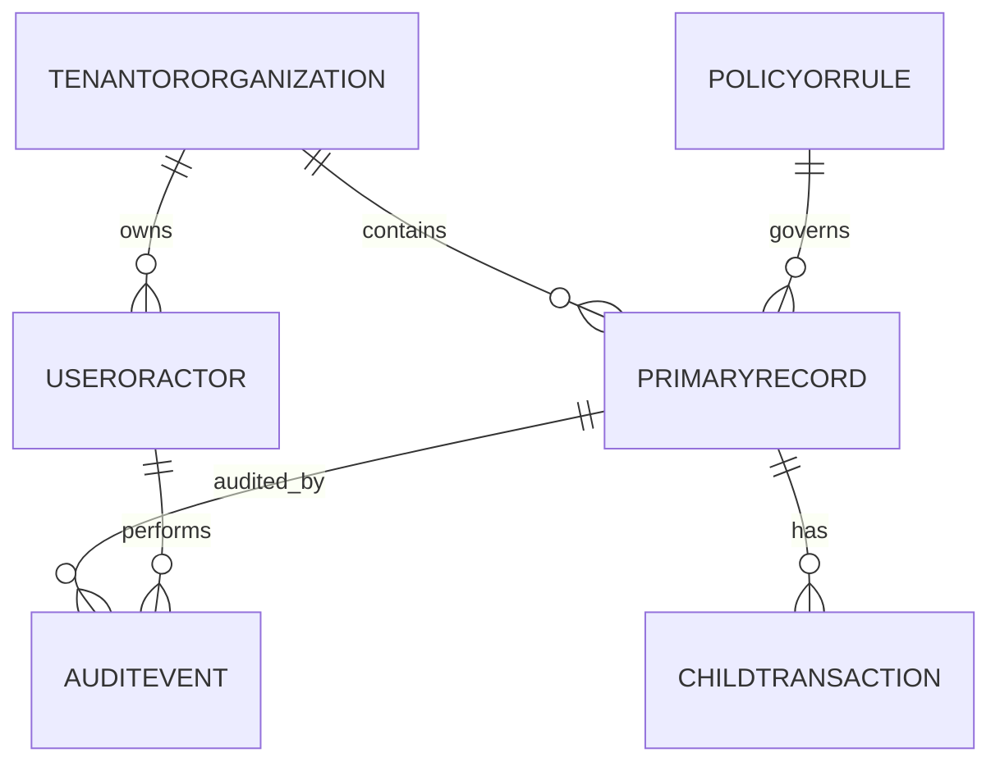
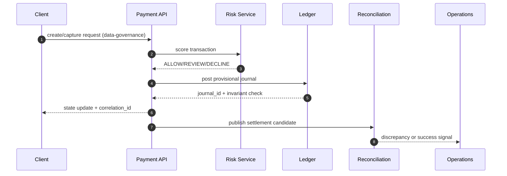

# Data Dictionary

This data dictionary is the canonical reference for **Payment Orchestration and Wallet Platform**. It defines shared terminology, entity semantics, and governance controls required to keep payment orchestration and wallet workflows consistent across teams and services.

## Scope and Goals
- Establish a stable vocabulary for architecture, API, analytics, and operations teams.
- Define minimum required fields for core entities and expected relationship boundaries.
- Document data quality and retention controls needed for production readiness.

## Core Entities
| Entity | Description | Required Attributes |
|---|---|---|
| TenantOrOrganization | Top-level ownership boundary for data segregation | `org_id, name, status, region, created_at` |
| UserOrActor | Human/system principal that performs actions | `actor_id, org_id, role, status, last_active_at` |
| PrimaryRecord | Main lifecycle object handled by the platform | `record_id, org_id, state, owner_id, created_at, updated_at` |
| ChildTransaction | Operational transaction or sub-step linked to primary record | `txn_id, record_id, txn_type, amount_or_value, occurred_at` |
| PolicyOrRule | Versioned policy configuration that influences decisions | `policy_id, scope, version, effective_from, effective_to` |
| AuditEvent | Append-only evidence for state changes and controls | `audit_id, record_id, actor_id, action, reason_code, occurred_at` |

## Canonical Relationship Diagram

## Data Quality Controls
1. All write paths enforce required-field validation and referential integrity for mandatory foreign keys.
2. External imports must include provenance metadata (`source_system`, `source_ref`, `ingested_at`).
3. Status/state fields use controlled vocabularies and reject unknown values.
4. Duplicate detection runs on natural keys where business identity collisions are likely.
5. Sensitive fields carry classification tags to drive masking, encryption, and export behavior.

## Retention and Audit
- Operational records remain online for active workflow windows and support forensic queries.
- Historical records move to archive tiers by policy without breaking traceability.
- Audit events are immutable and linked through correlation ids for incident analysis.

## Artifact-Specific Deep Dive: Lifecycle, Reconciliation, Disputes, Fraud, and Ledger Safety

### Why this artifact matters
This document now defines **data-governance** behavior and explicitly maps architecture intent to API contracts, diagrammed flows, and day-2 operations owned by **Data Eng, Finance**.

### Transaction state transitions required in this artifact
- `INITIATED -> AUTHORIZING -> AUTHORIZED -> CAPTURE_PENDING -> CAPTURED` for card and wallet charges.
- `CAPTURED -> SETTLEMENT_PENDING -> SETTLED` after provider clearing confirmation.
- `CAPTURED|SETTLED -> REFUND_PENDING -> PARTIALLY_REFUNDED|REFUNDED` for merchant-initiated refunds.
- `SETTLED -> CHARGEBACK_OPEN -> CHARGEBACK_WON|CHARGEBACK_LOST` for issuer disputes.
- Each transition MUST include: actor, triggering API/event, timeout, retry policy, and compensating action.

### API contracts this artifact must keep consistent
- `GET /payments/{id}`: documented here with required request ids, idempotency keys, and failure reason codes for **data-governance**.
- `GET /ledger/accounts/{id}/entries`: documented here with required request ids, idempotency keys, and failure reason codes for **data-governance**.
- `GET /reconciliation/discrepancies`: documented here with required request ids, idempotency keys, and failure reason codes for **data-governance**.
- `GET /risk/cases/{id}`: documented here with required request ids, idempotency keys, and failure reason codes for **data-governance**.
- All mutating calls MUST return `correlation_id`, `idempotency_key`, `previous_state`, `new_state`, and `transition_reason`.

### In-depth flow diagram for data-dictionary

### Reconciliation, dispute/refund, and fraud controls
- Reconciliation: three-way match (ledger vs PSP file vs bank statement) with tolerance thresholds and auto-classification into `timing`, `amount`, `missing`, `duplicate` breaks.
- Disputes/Refunds: evidence chain-of-custody, SLA timers, and automatic ledger reversals when disputes are lost.
- Fraud: pre-auth risk decisioning, post-auth anomaly detection, and payout velocity controls tied to case management.

### Ledger invariants and operational hooks
- Invariants enforced here: double-entry balance, append-only journal, exactly-once posting per business event, and currency-safe postings.
- Operational process: if any invariant fails, move transaction to `OPERATIONS_HOLD`, page on-call + finance, and block payout release until compensating journals are approved.
- Runbooks must include: replay commands, manual override approvals (dual control), and incident-close reconciliation attestation.

