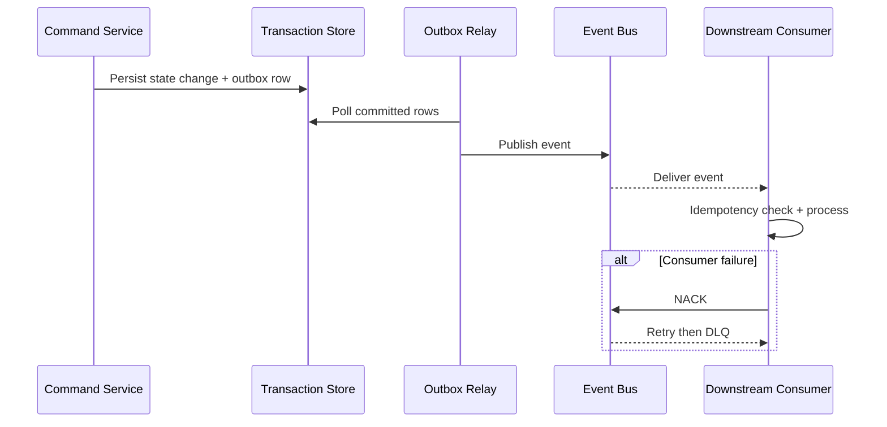
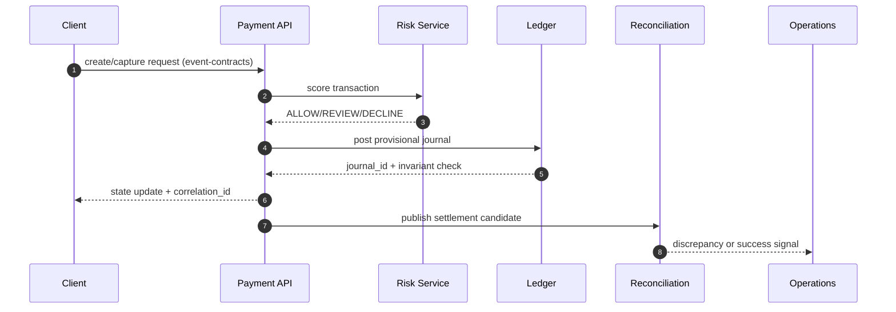

# Event Catalog

This catalog defines stable event contracts for **Payment Orchestration and Wallet Platform** to support event-driven integrations, auditability, and analytics across payment orchestration and wallet workflows.

## Contract Conventions
- Event naming: `<domain>.<aggregate>.<action>.v1`.
- Required metadata: `event_id`, `occurred_at`, `correlation_id`, `producer`, `schema_version`, `tenant_context`.
- Delivery mode: at-least-once with mandatory consumer idempotency.
- Ordering guarantee: per aggregate key; no global ordering assumption.

## Domain Events
| Event Name | Payload Highlights | Typical Consumers |
|---|---|---|
| `domain.record.created.v1` | record_id, actor_id, initial_state, occurred_at | orchestration, analytics |
| `domain.record.state_changed.v1` | record_id, old_state, new_state, reason_code | notifications, reporting |
| `domain.record.validation_failed.v1` | record_id, violated_rules, correlation_id | operations, quality dashboards |
| `domain.record.override_applied.v1` | record_id, override_type, approver_id, expires_at | compliance, audit |
| `domain.record.closed.v1` | record_id, terminal_state, closed_at | billing/settlement, archives |

## Publish and Consumption Sequence

## Operational SLOs
- P95 commit-to-publish latency below 5 seconds for tier-1 events.
- DLQ triage acknowledgement within 15 minutes for production incidents.
- Schema changes remain backward compatible within the same major version.

## Artifact-Specific Deep Dive: Lifecycle, Reconciliation, Disputes, Fraud, and Ledger Safety

### Why this artifact matters
This document now defines **event-contracts** behavior and explicitly maps architecture intent to API contracts, diagrammed flows, and day-2 operations owned by **Event Platform, Payments Eng**.

### Transaction state transitions required in this artifact
- `INITIATED -> AUTHORIZING -> AUTHORIZED -> CAPTURE_PENDING -> CAPTURED` for card and wallet charges.
- `CAPTURED -> SETTLEMENT_PENDING -> SETTLED` after provider clearing confirmation.
- `CAPTURED|SETTLED -> REFUND_PENDING -> PARTIALLY_REFUNDED|REFUNDED` for merchant-initiated refunds.
- `SETTLED -> CHARGEBACK_OPEN -> CHARGEBACK_WON|CHARGEBACK_LOST` for issuer disputes.
- Each transition MUST include: actor, triggering API/event, timeout, retry policy, and compensating action.

### API contracts this artifact must keep consistent
- `POST /payments`: documented here with required request ids, idempotency keys, and failure reason codes for **event-contracts**.
- `POST /ledger/journals`: documented here with required request ids, idempotency keys, and failure reason codes for **event-contracts**.
- `POST /disputes/webhooks`: documented here with required request ids, idempotency keys, and failure reason codes for **event-contracts**.
- `POST /risk/screen`: documented here with required request ids, idempotency keys, and failure reason codes for **event-contracts**.
- All mutating calls MUST return `correlation_id`, `idempotency_key`, `previous_state`, `new_state`, and `transition_reason`.

### In-depth flow diagram for event-catalog

### Reconciliation, dispute/refund, and fraud controls
- Reconciliation: three-way match (ledger vs PSP file vs bank statement) with tolerance thresholds and auto-classification into `timing`, `amount`, `missing`, `duplicate` breaks.
- Disputes/Refunds: evidence chain-of-custody, SLA timers, and automatic ledger reversals when disputes are lost.
- Fraud: pre-auth risk decisioning, post-auth anomaly detection, and payout velocity controls tied to case management.

### Ledger invariants and operational hooks
- Invariants enforced here: double-entry balance, append-only journal, exactly-once posting per business event, and currency-safe postings.
- Operational process: if any invariant fails, move transaction to `OPERATIONS_HOLD`, page on-call + finance, and block payout release until compensating journals are approved.
- Runbooks must include: replay commands, manual override approvals (dual control), and incident-close reconciliation attestation.

