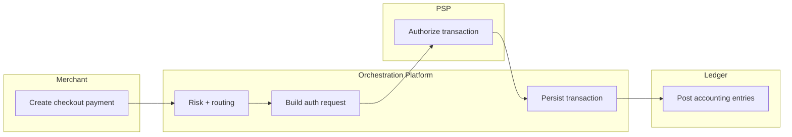
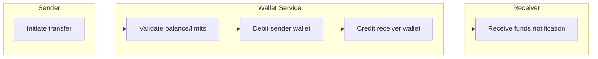

# Swimlane Diagrams

## Payment Authorization Swimlane

```mermaid
flowchart LR
    subgraph Merchant
      A[Create checkout payment]
    end

    subgraph Platform[Orchestration Platform]
      B[Risk + routing]
      C[Build auth request]
      D[Persist transaction]
    end

    subgraph PSP
      E[Authorize transaction]
    end

    subgraph Ledger
      F[Post accounting entries]
    end

    A --> B --> C --> E --> D --> F
```

## Wallet Transfer Swimlane

```mermaid
flowchart LR
    subgraph Sender
      A[Initiate transfer]
    end

    subgraph Wallet[Wallet Service]
      B[Validate balance/limits]
      C[Debit sender wallet]
      D[Credit receiver wallet]
    end

    subgraph Receiver
      E[Receive funds notification]
    end

    A --> B --> C --> D --> E
```
