# System Context Diagram — Payment Orchestration and Wallet Platform

## 1. Introduction

This document defines the **system context** for the Payment Orchestration and Wallet Platform (POWP). A system context diagram shows the platform as a single black box and identifies all external actors, systems, and integrations that interact with it — along with the direction and nature of each data exchange.

### 1.1 System Boundary

The **Payment Orchestration and Wallet Platform** encompasses:
- Payment intent creation, routing, authorisation, and capture
- Wallet lifecycle management (top-up, debit, transfer, balance)
- Fraud scoring and risk decisioning
- Settlement batch execution and reconciliation
- Dispute and chargeback management
- Merchant/customer onboarding and KYC

Everything outside that boundary — card networks, PSPs, banks, notification gateways, KYC vendors, FX providers — is an external system connected via well-defined integration points.

### 1.2 PCI DSS Boundary Note

The POWP handles raw PANs only in the tokenisation service. All other components interact exclusively with network tokens and payment intent IDs. The PCI DSS Cardholder Data Environment (CDE) boundary wraps: the Tokenisation Service, the HSM, and the secure vault. All external integrations use TLS 1.2+ and token-only payloads.

---

## 2. System Context Diagram

```mermaid
flowchart TD
    %% ── Human Actors ──────────────────────────────────────────────
    CUST["👤 Customer / Cardholder\n(Browser / Mobile App)"]
    MERCH["🏪 Merchant\n(Web / Mobile App)"]
    FIN["👩‍💼 Finance Manager\n(Internal Portal)"]
    RISK["🔍 Risk Analyst\n(Internal Portal)"]
    ADMIN["🔧 Platform Admin\n(Internal Portal)"]

    %% ── Core System ───────────────────────────────────────────────
    POWP["🏦 Payment Orchestration\nand Wallet Platform\n━━━━━━━━━━━━━━━━━━━━\n• Payment API Gateway\n• Wallet Service\n• Fraud & Risk Engine\n• Settlement Engine\n• Reconciliation Service\n• Dispute Manager\n• Notification Service\n• Tokenisation Service"]

    %% ── PSPs ──────────────────────────────────────────────────────
    STRIPE["💳 Stripe\n(PSP / Acquirer)"]
    ADYEN["💳 Adyen\n(PSP / Acquirer)"]
    BRAINTREE["💳 Braintree\n(PSP / Acquirer)"]
    PAYPAL["💳 PayPal\n(PSP / Acquirer)"]
    WORLDPAY["💳 Worldpay\n(PSP / Acquirer)"]

    %% ── Card Networks ─────────────────────────────────────────────
    VISA["🌐 Visa Network"]
    MC["🌐 Mastercard Network"]
    AMEX["🌐 American Express"]
    UNION["🌐 UnionPay"]

    %% ── Banks ─────────────────────────────────────────────────────
    ISSUER["🏛️ Issuing Bank\n(Customer's Bank)"]
    ACQUIRER["🏛️ Acquiring Bank\n(Merchant's Bank)"]
    CENTRAL["🏛️ Central Bank /\nNostro Account"]

    %% ── 3DS2 ACS Servers ──────────────────────────────────────────
    ACS["🔐 3DS2 ACS Servers\n(Visa, MC, Amex)"]

    %% ── KYC / AML Providers ───────────────────────────────────────
    ONFIDO["🪪 Onfido\n(KYC / KYB)"]
    JUMIO["🪪 Jumio\n(Document Verification)"]
    REFINITIV["🕵️ Refinitiv\n(AML / Sanctions)"]

    %% ── Fraud Detection ───────────────────────────────────────────
    KOUNT["🚨 Kount\n(Fraud Detection)"]
    SIFT["🚨 Sift Science\n(Fraud Detection)"]

    %% ── FX Rate Providers ─────────────────────────────────────────
    ECB["📈 ECB\n(FX Rates)"]
    BLOOMBERG["📈 Bloomberg\n(FX Rates)"]
    OER["📈 OpenExchangeRates\n(FX Rates)"]

    %% ── Notification Gateways ─────────────────────────────────────
    TWILIO["📱 Twilio\n(SMS / WhatsApp)"]
    SENDGRID["📧 SendGrid\n(Email)"]

    %% ── Internal Systems ──────────────────────────────────────────
    GL["📒 General Ledger\n(ERP / SAP)"]
    BI["📊 BI / Analytics\n(Snowflake / Redshift)"]
    COMPLY["📋 Compliance Reporting\n(Regulatory Engine)"]

    %% ── Human Actor ↔ Platform ────────────────────────────────────
    CUST -- "Payment requests, wallet ops,\ndispute filing (HTTPS/REST)" --> POWP
    MERCH -- "Payment intents, refunds,\nwebhook config (REST/SDK)" --> POWP
    POWP -- "Payment status, webhook events,\nreceipts" --> MERCH
    POWP -- "Wallet balance, tx history,\nnotifications" --> CUST
    FIN -- "Settlement runs, fee config,\nreports (Portal)" --> POWP
    RISK -- "Fraud rule config, alert review\n(Portal)" --> POWP
    ADMIN -- "Tenant config, API keys,\nPSP routing rules" --> POWP

    %% ── Platform ↔ PSPs ───────────────────────────────────────────
    POWP -- "Auth/capture/refund requests\n(REST API, TLS 1.3)" --> STRIPE
    STRIPE -- "Auth response, settlement files\n(Webhook + SFTP)" --> POWP
    POWP -- "Auth/capture/refund requests\n(REST API)" --> ADYEN
    ADYEN -- "Auth response, settlement files" --> POWP
    POWP -- "Auth/capture requests\n(REST API)" --> BRAINTREE
    BRAINTREE -- "Auth response" --> POWP
    POWP -- "Auth/capture requests" --> PAYPAL
    PAYPAL -- "Auth response, settlement" --> POWP
    POWP -- "Auth/capture requests" --> WORLDPAY
    WORLDPAY -- "Auth response, settlement" --> POWP

    %% ── PSPs ↔ Card Networks ──────────────────────────────────────
    STRIPE -- "ISO 8583 / VisaNet" --> VISA
    ADYEN -- "ISO 8583 / Banknet" --> MC
    WORLDPAY -- "ISO 8583" --> AMEX
    ADYEN -- "ISO 8583" --> UNION

    %% ── Card Networks ↔ Banks ─────────────────────────────────────
    VISA -- "Auth request" --> ISSUER
    MC -- "Auth request" --> ISSUER
    ISSUER -- "Auth approval/decline" --> VISA
    VISA -- "Clearing file" --> ACQUIRER
    ACQUIRER -- "Settlement funds" --> CENTRAL

    %% ── Platform ↔ 3DS2 ACS ───────────────────────────────────────
    POWP -- "3DS2 authentication request\n(3DS SDK / JSON)" --> ACS
    ACS -- "Challenge result, CAVV\n(JSON)" --> POWP

    %% ── Platform ↔ KYC / AML ──────────────────────────────────────
    POWP -- "Identity verification request\n(REST API)" --> ONFIDO
    ONFIDO -- "Verification result + risk score" --> POWP
    POWP -- "Document check request" --> JUMIO
    JUMIO -- "Verification decision" --> POWP
    POWP -- "AML / sanctions screening\n(REST API)" --> REFINITIV
    REFINITIV -- "Screening result, PEP flags" --> POWP

    %% ── Platform ↔ Fraud Engines ──────────────────────────────────
    POWP -- "Transaction attributes\n(REST API, real-time)" --> KOUNT
    KOUNT -- "Fraud score, decision (ALLOW/REVIEW/BLOCK)" --> POWP
    POWP -- "Event stream\n(REST API)" --> SIFT
    SIFT -- "Risk score, labels" --> POWP

    %% ── Platform ↔ FX Providers ───────────────────────────────────
    POWP -- "Rate request (currency pair)" --> ECB
    ECB -- "Daily exchange rates (XML)" --> POWP
    POWP -- "Rate request (real-time)" --> BLOOMBERG
    BLOOMBERG -- "Live FX rates (API)" --> POWP
    OER -- "Hourly FX rates (JSON REST)" --> POWP

    %% ── Platform ↔ Notification Gateways ─────────────────────────
    POWP -- "SMS payload\n(REST API)" --> TWILIO
    POWP -- "Email payload\n(REST API / SMTP)" --> SENDGRID

    %% ── Platform ↔ Internal Systems ──────────────────────────────
    POWP -- "Journal entries (double-entry)\n(REST / MQ)" --> GL
    POWP -- "Event stream, tx data\n(Kafka / CDC)" --> BI
    POWP -- "Regulatory reports\n(REST API / file export)" --> COMPLY
```

---

## 3. External System Integration Details

| System | Integration Type | Protocol | Data Exchanged | SLA | Auth Method |
|---|---|---|---|---|---|
| Stripe | Synchronous API + Webhooks | REST / HTTPS | Auth request, capture, refund, settlement webhook | Auth: < 2 s p99 | API Secret Key + Webhook Signature |
| Adyen | Synchronous API + SFTP | REST / HTTPS + SFTP | Auth, capture, settlement file (CSV) | Auth: < 2 s p99 | HMAC API Key |
| Braintree | Synchronous API | REST / HTTPS | Auth, capture, void, refund | Auth: < 3 s p99 | Public/Private Key pair |
| PayPal | Synchronous API + Webhooks | REST / HTTPS | Auth, capture, refund, disputes | Auth: < 3 s p99 | OAuth 2.0 Client Credentials |
| Worldpay | Synchronous API | REST / HTTPS | Auth, capture, refund | Auth: < 2 s p99 | API Key + HMAC |
| Visa Network | Via PSP (ISO 8583) | ISO 8583 / VisaNet | Auth request/response, clearing records | < 1.5 s p95 | PSP-managed |
| Mastercard | Via PSP (ISO 8583) | ISO 8583 / Banknet | Auth request/response, clearing | < 1.5 s p95 | PSP-managed |
| 3DS2 ACS Server | Synchronous API | JSON / HTTPS (EMV 3DS) | Authentication request, challenge, CAVV | < 3 s total | SDK-based mutual TLS |
| Onfido | Synchronous API | REST / HTTPS | Identity doc + selfie, verification result | < 30 s async | API Token (Bearer) |
| Jumio | Async Webhook | REST + Webhook | Document images, verification decision | < 5 min async | API Key + Secret |
| Refinitiv | Synchronous API | REST / HTTPS | Name, DOB, country → sanctions/PEP result | < 2 s p99 | OAuth 2.0 |
| Kount | Synchronous API | REST / HTTPS | 50+ transaction signals → fraud score | < 200 ms p99 | API Key |
| Sift Science | Async Event Stream | REST / HTTPS | Behavioural events → risk labels | < 500 ms p95 | API Key |
| ECB | Pull (daily batch) | XML over HTTPS | Daily EUR reference rates | Daily 16:00 CET | No auth (public) |
| Bloomberg | Synchronous API | REST / HTTPS | Real-time FX rates (150+ pairs) | < 100 ms p99 | API Key + IP whitelist |
| OpenExchangeRates | Pull (hourly) | REST / HTTPS | Hourly FX rates (170+ currencies) | Hourly | App ID key |
| Twilio | Synchronous API | REST / HTTPS | SMS/WhatsApp message delivery | < 5 s delivery | Account SID + Auth Token |
| SendGrid | Synchronous API | REST / HTTPS + SMTP | Transactional email (receipts, alerts) | < 10 s delivery | API Key |
| General Ledger (ERP) | Async / Near-real-time | REST API / Message Queue | Double-entry journal entries | < 5 min lag | OAuth 2.0 / mTLS |
| BI / Analytics Platform | CDC + Batch | Kafka + S3 | Raw event stream, daily snapshots | 15 min lag | IAM Role / Kafka ACL |
| Compliance Reporting | Async Batch | REST + File export | STR/SAR reports, transaction exports | Daily | mTLS + API Key |

---

## 4. Data Flow Descriptions

### 4.1 Inbound Payment Flow
A **Merchant** sends a `POST /payments` request to the POWP API Gateway. The platform validates the request, performs a fraud score via **Kount**, checks the 3DS2 requirement, and routes the authorisation to the selected **PSP**. The PSP forwards to the **Card Network**, which routes to the **Issuing Bank**. The approval or decline travels back through the same chain. The platform posts journal entries to the **General Ledger** and emits a webhook to the Merchant.

### 4.2 3DS2 Authentication Flow
When the issuer requires Strong Customer Authentication (SCA), the POWP 3DS2 module initiates a device fingerprint and, if required, a challenge via the **3DS ACS Server**. The ACS returns a Cardholder Authentication Verification Value (CAVV) which is included in the authorisation request to the PSP.

### 4.3 Settlement Flow
At end-of-day, the **Settlement Engine** triggers a batch run, grouping all `CAPTURED` transactions by PSP. The engine fetches settlement files from PSPs via **SFTP or webhook**, performs a three-way match (ledger vs PSP file vs bank statement), and marks reconciled transactions as `SETTLED`. Net settlement amounts are posted to the **Acquiring Bank** via the **Nostro Account**.

### 4.4 KYC / AML Onboarding Flow
When a new merchant or customer is onboarded, the platform calls **Onfido** (identity document check) and **Refinitiv** (sanctions/PEP screening) in parallel. Verification results are stored in the KYC record. Merchants below a risk threshold are auto-approved; others are queued for manual review by the **Platform Admin**.

### 4.5 Fraud Scoring Flow
Every payment intent triggers a synchronous call to **Kount** with 50+ transaction signals (device fingerprint, IP, velocity, BIN data). The score and decision (ALLOW / REVIEW / BLOCK) are cached per transaction. High-score transactions trigger a **Risk Analyst** alert in the internal portal and may pause the authorisation pending review.

### 4.6 FX Conversion Flow
Cross-currency payments request a live FX rate from **Bloomberg** (real-time) with **OpenExchangeRates** as fallback. The locked rate is valid for 30 seconds. Conversion is applied at the payment intent level and the exchange gain/loss is posted to a dedicated ledger account in the **General Ledger**.

### 4.7 Notification Flow
Payment events (authorised, captured, refunded, failed) are published to an internal event bus. The **Notification Service** subscribes and dispatches SMS via **Twilio** and transactional email via **SendGrid** based on customer and merchant preferences.

### 4.8 Dispute / Chargeback Flow
Chargebacks are received as webhooks from the **PSP**, which forwards the dispute notification from the **Card Network**. The Dispute Manager creates a dispute record, notifies the **Merchant**, and starts an evidence collection countdown. If evidence is submitted, the platform relays it to the PSP who forwards it to the **Issuing Bank** for representment.

---

## 5. Compliance Boundary Notes

### 5.1 PCI DSS Scope (Cardholder Data Environment)

| Component | In CDE Scope | Reason |
|---|---|---|
| Tokenisation Service | ✅ Yes | Handles raw PAN, CVV at entry point |
| Hardware Security Module (HSM) | ✅ Yes | Stores encryption keys |
| Payment API Gateway | ✅ Yes | Receives card data before tokenisation |
| Fraud Engine | ❌ No | Operates on tokens only |
| Settlement Engine | ❌ No | Uses masked PANs and transaction IDs |
| Wallet Service | ❌ No | No card data stored |
| General Ledger | ❌ No | Receives amounts and masked references only |

### 5.2 GDPR / Data Residency
- All customer PII (name, email, address) is stored in the EU West region by default.
- KYC document images are stored at **Onfido/Jumio** — not retained by POWP beyond verification.
- Data subject deletion requests propagate to all internal datastores within 30 days.

### 5.3 PSD2 / Open Banking
- All merchant API integrations require OAuth 2.0 with scopes.
- SCA is enforced for all card payments > €30 in the EEA.
- Transaction history APIs comply with the PSD2 AIS (Account Information Service) interface.

