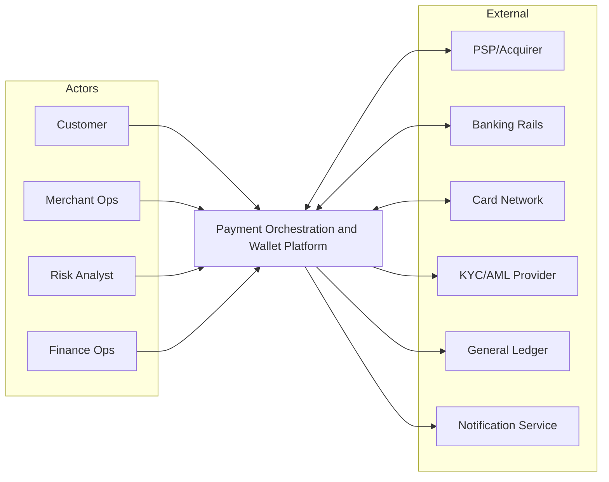

# System Context Diagram

```mermaid
flowchart LR
    subgraph Actors
      Customer
      MerchantOps[Merchant Ops]
      RiskAnalyst[Risk Analyst]
      FinanceOps[Finance Ops]
    end

    POWP[Payment Orchestration and Wallet Platform]

    subgraph External
      PSP[PSP/Acquirer]
      Bank[Banking Rails]
      Card[Card Network]
      KYC[KYC/AML Provider]
      Ledger[General Ledger]
      Notify[Notification Service]
    end

    Customer --> POWP
    MerchantOps --> POWP
    RiskAnalyst --> POWP
    FinanceOps --> POWP

    POWP <--> PSP
    POWP <--> Bank
    POWP <--> Card
    POWP --> KYC
    POWP --> Ledger
    POWP --> Notify
```
