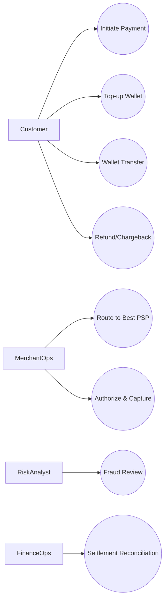

# Use Case Diagram

```mermaid
flowchart LR
    Customer
    MerchantOps
    RiskAnalyst
    FinanceOps

    UC1((Initiate Payment))
    UC2((Authorize & Capture))
    UC3((Top-up Wallet))
    UC4((Wallet Transfer))
    UC5((Refund/Chargeback))
    UC6((Route to Best PSP))
    UC7((Fraud Review))
    UC8((Settlement Reconciliation))

    Customer --> UC1
    Customer --> UC3
    Customer --> UC4
    Customer --> UC5
    MerchantOps --> UC6
    RiskAnalyst --> UC7
    FinanceOps --> UC8
    MerchantOps --> UC2
```
