# Use Case Diagram — Payment Orchestration and Wallet Platform

## 1. Introduction

This document captures all functional use cases for the **Payment Orchestration and Wallet Platform (POWP)**. It identifies every human and system actor that interacts with the platform, maps actors to use cases, and provides traceability from business intent to system behaviour.

The platform sits at the intersection of payments, wallets, fraud risk, settlement, and platform operations. Use cases span the full payment lifecycle—from the moment a customer clicks "Pay" through authorisation, capture, settlement, dispute handling, and financial reconciliation.

### 1.1 Scope

| Domain | Use Case Count |
|---|---|
| Payment Processing | 8 |
| Wallet Operations | 5 |
| PSP & Network Integration | 4 |
| Fraud & Risk Management | 4 |
| Settlement & Finance | 5 |
| Platform & Integration Config | 5 |
| Dispute Management | 2 |
| Currency & Virtual Accounts | 3 |
| **Total** | **36** |

### 1.2 Actor Overview

**Human Actors**
- **Customer / Cardholder** — End-user initiating payments, managing wallet, raising disputes.
- **Merchant** — Business accepting payments; manages payment methods, webhooks, refunds, sandbox.
- **Finance Manager** — Internal operator responsible for settlement batches, fee rules, revenue reporting.
- **Risk Analyst** — Internal operator managing fraud models, velocity rules, alert triage.
- **Integration Engineer** — Developer/technical operator integrating merchant systems via API and sandbox.
- **Platform Admin** — Super-user managing tenants, API keys, configuration, and platform health.

**System Actors**
- **PSP / Acquirer** — Payment Service Providers (Stripe, Adyen, Braintree, etc.) that process authorisations and settlements.
- **Card Network** — Visa, Mastercard, Amex, UnionPay routing and clearing infrastructure.
- **Issuing Bank** — Customer's bank that approves or declines the authorisation request.
- **3DS ACS Server** — Access Control Server operated by card networks/issuers for 3DS2 challenge flows.

---

## 2. Use Case Diagram

```mermaid
flowchart LR
    %% ── Human Actors ──────────────────────────────────────────────
    CUST([Customer / Cardholder])
    MERCH([Merchant])
    FIN([Finance Manager])
    RISK([Risk Analyst])
    INTEG([Integration Engineer])
    ADMIN([Platform Admin])

    %% ── System Actors ─────────────────────────────────────────────
    PSP([PSP / Acquirer])
    CNET([Card Network])
    BANK([Issuing Bank])
    ACS([3DS ACS Server])

    %% ── Payment Processing Use Cases ─────────────────────────────
    UC01(["UC-01\nInitiate Payment"])
    UC02(["UC-02\nSelect Payment Method"])
    UC03(["UC-03\nComplete 3DS2 Challenge"])
    UC04(["UC-04\nAuthorise & Capture"])
    UC05(["UC-05\nCancel Payment"])
    UC06(["UC-06\nRequest Refund"])
    UC07(["UC-07\nFile Dispute"])
    UC08(["UC-08\nTrack Payment Status"])

    %% ── Wallet Operations Use Cases ──────────────────────────────
    UC09(["UC-09\nTop-up Wallet"])
    UC10(["UC-10\nDebit Wallet"])
    UC11(["UC-11\nWallet-to-Wallet Transfer"])
    UC12(["UC-12\nCheck Balance"])
    UC13(["UC-13\nFreeze / Unfreeze Wallet"])

    %% ── PSP & Network Integration Use Cases ──────────────────────
    UC14(["UC-14\nRoute Payment to PSP"])
    UC15(["UC-15\nPSP Failover"])
    UC16(["UC-16\nSubmit to Card Network"])
    UC17(["UC-17\nReceive Settlement File"])

    %% ── Fraud & Risk Management Use Cases ────────────────────────
    UC18(["UC-18\nRun Fraud Scoring"])
    UC19(["UC-19\nReview Fraud Alert"])
    UC20(["UC-20\nManage Velocity Rules"])
    UC21(["UC-21\nBlock / Unblock Customer"])

    %% ── Settlement & Finance Use Cases ───────────────────────────
    UC22(["UC-22\nRun Settlement Batch"])
    UC23(["UC-23\nReconcile PSP Report"])
    UC24(["UC-24\nManage Fee Rules"])
    UC25(["UC-25\nGenerate Revenue Report"])
    UC26(["UC-26\nConvert Currency"])

    %% ── Platform & Integration Config Use Cases ──────────────────
    UC27(["UC-27\nConfigure Webhooks"])
    UC28(["UC-28\nTest in Sandbox"])
    UC29(["UC-29\nRotate API Keys"])
    UC30(["UC-30\nManage Payment Methods"])
    UC31(["UC-31\nCreate Virtual Account"])

    %% ── Dispute Management Use Cases ─────────────────────────────
    UC32(["UC-32\nProcess Chargeback"])
    UC33(["UC-33\nSubmit Dispute Evidence"])

    %% ── Additional Use Cases ─────────────────────────────────────
    UC34(["UC-34\nManage KYC / KYB Onboarding"])
    UC35(["UC-35\nGenerate Compliance Report"])
    UC36(["UC-36\nMonitor PSP Health"])

    %% ── Customer connections ──────────────────────────────────────
    CUST --> UC01
    CUST --> UC02
    CUST --> UC03
    CUST --> UC05
    CUST --> UC06
    CUST --> UC07
    CUST --> UC08
    CUST --> UC09
    CUST --> UC10
    CUST --> UC11
    CUST --> UC12

    %% ── Merchant connections ──────────────────────────────────────
    MERCH --> UC01
    MERCH --> UC04
    MERCH --> UC06
    MERCH --> UC08
    MERCH --> UC27
    MERCH --> UC28
    MERCH --> UC29
    MERCH --> UC30
    MERCH --> UC33

    %% ── Finance Manager connections ───────────────────────────────
    FIN --> UC22
    FIN --> UC23
    FIN --> UC24
    FIN --> UC25
    FIN --> UC26
    FIN --> UC35

    %% ── Risk Analyst connections ──────────────────────────────────
    RISK --> UC18
    RISK --> UC19
    RISK --> UC20
    RISK --> UC21

    %% ── Integration Engineer connections ──────────────────────────
    INTEG --> UC27
    INTEG --> UC28
    INTEG --> UC29
    INTEG --> UC31

    %% ── Platform Admin connections ────────────────────────────────
    ADMIN --> UC13
    ADMIN --> UC21
    ADMIN --> UC29
    ADMIN --> UC34
    ADMIN --> UC35
    ADMIN --> UC36

    %% ── PSP connections ───────────────────────────────────────────
    PSP --> UC14
    PSP --> UC15
    PSP --> UC17
    UC04 --> PSP
    UC22 --> PSP

    %% ── Card Network connections ──────────────────────────────────
    CNET --> UC16
    UC16 --> BANK
    UC32 --> CNET

    %% ── 3DS ACS Server connections ────────────────────────────────
    ACS --> UC03
    UC03 --> ACS

    %% ── Issuing Bank connections ──────────────────────────────────
    BANK --> UC04
    BANK --> UC32
```

---

## 3. Actor Descriptions

| Actor | Type | Role | Primary Use Cases |
|---|---|---|---|
| Customer / Cardholder | Human — External | Pays for goods/services; manages their wallet and disputes | UC-01 to UC-12 |
| Merchant | Human — External | Accepts payments; configures platform integration | UC-01, UC-04, UC-06, UC-08, UC-27 to UC-30, UC-33 |
| Finance Manager | Human — Internal | Oversees settlement, reconciliation, fee rules, reporting | UC-22 to UC-26, UC-35 |
| Risk Analyst | Human — Internal | Manages fraud models, reviews alerts, controls velocity | UC-18 to UC-21 |
| Integration Engineer | Human — External/Internal | Integrates merchant systems; tests in sandbox | UC-27 to UC-29, UC-31 |
| Platform Admin | Human — Internal | Manages tenants, API security, compliance, PSP health | UC-13, UC-21, UC-29, UC-34 to UC-36 |
| PSP / Acquirer | System — External | Processes card authorisations; provides settlement files | UC-14, UC-15, UC-17 |
| Card Network | System — External | Routes transactions between acquiring and issuing banks | UC-16, UC-32 |
| Issuing Bank | System — External | Approves or declines authorisation; initiates chargebacks | UC-04, UC-32 |
| 3DS ACS Server | System — External | Challenges cardholder identity during 3DS2 authentication | UC-03 |

---

## 4. Use Case Summary Table

| UC-ID | Name | Primary Actor | Secondary Actors | Trigger | Priority |
|---|---|---|---|---|---|
| UC-01 | Initiate Payment | Customer | Merchant | Customer clicks "Pay" | P0 |
| UC-02 | Select Payment Method | Customer | — | Payment flow step | P0 |
| UC-03 | Complete 3DS2 Challenge | Customer | 3DS ACS Server | Issuer requires SCA | P0 |
| UC-04 | Authorise & Capture | Merchant | PSP, Card Network, Issuing Bank | Payment intent created | P0 |
| UC-05 | Cancel Payment | Customer | Merchant | Customer cancels before capture | P1 |
| UC-06 | Request Refund | Customer / Merchant | PSP | Post-capture reversal | P0 |
| UC-07 | File Dispute | Customer | Card Network, Issuing Bank | Customer raises chargeback | P1 |
| UC-08 | Track Payment Status | Customer / Merchant | — | Poll or webhook event | P1 |
| UC-09 | Top-up Wallet | Customer | PSP | Customer adds funds | P0 |
| UC-10 | Debit Wallet | Customer | — | Wallet payment checkout | P0 |
| UC-11 | Wallet-to-Wallet Transfer | Customer | — | Customer sends to another user | P1 |
| UC-12 | Check Balance | Customer | — | Customer views wallet | P1 |
| UC-13 | Freeze / Unfreeze Wallet | Platform Admin | — | Risk event or compliance hold | P1 |
| UC-14 | Route Payment to PSP | PSP / Platform | — | Authorisation request received | P0 |
| UC-15 | PSP Failover | PSP / Platform | — | PSP timeout or error | P0 |
| UC-16 | Submit to Card Network | Card Network | Issuing Bank | PSP forwards authorisation | P0 |
| UC-17 | Receive Settlement File | PSP | Finance Manager | End-of-day clearing | P0 |
| UC-18 | Run Fraud Scoring | Risk Analyst | — | Pre-authorisation hook | P0 |
| UC-19 | Review Fraud Alert | Risk Analyst | — | Score exceeds threshold | P1 |
| UC-20 | Manage Velocity Rules | Risk Analyst | — | Rule configuration | P1 |
| UC-21 | Block / Unblock Customer | Risk Analyst / Admin | — | Fraud case or manual decision | P1 |
| UC-22 | Run Settlement Batch | Finance Manager | PSP, Bank | Scheduled trigger (T+1) | P0 |
| UC-23 | Reconcile PSP Report | Finance Manager | PSP | Settlement file received | P0 |
| UC-24 | Manage Fee Rules | Finance Manager | — | Business configuration | P1 |
| UC-25 | Generate Revenue Report | Finance Manager | — | Month-end or on-demand | P1 |
| UC-26 | Convert Currency | Finance Manager | FX Provider | Cross-currency payment | P1 |
| UC-27 | Configure Webhooks | Merchant / Integration Eng. | — | Merchant onboarding | P0 |
| UC-28 | Test in Sandbox | Integration Engineer | — | Pre-production testing | P1 |
| UC-29 | Rotate API Keys | Merchant / Admin | — | Security policy, key expiry | P0 |
| UC-30 | Manage Payment Methods | Merchant | — | Merchant dashboard | P1 |
| UC-31 | Create Virtual Account | Integration Engineer | Bank | Marketplace / B2B setup | P2 |
| UC-32 | Process Chargeback | Card Network | Issuing Bank, PSP | Issuer initiates dispute | P0 |
| UC-33 | Submit Dispute Evidence | Merchant | Platform, Card Network | Representment window open | P0 |
| UC-34 | Manage KYC / KYB Onboarding | Platform Admin | KYC Provider | Merchant or customer sign-up | P0 |
| UC-35 | Generate Compliance Report | Finance Manager / Admin | — | Regulatory deadline | P1 |
| UC-36 | Monitor PSP Health | Platform Admin | — | Scheduled health check | P1 |

---

## 5. Key Use Case Relationships

### Include / Extend Relationships

| Base Use Case | Relationship | Use Case |
|---|---|---|
| UC-04 Authorise & Capture | `<<include>>` | UC-14 Route Payment to PSP |
| UC-04 Authorise & Capture | `<<include>>` | UC-18 Run Fraud Scoring |
| UC-04 Authorise & Capture | `<<extend>>` | UC-03 Complete 3DS2 Challenge |
| UC-14 Route Payment to PSP | `<<extend>>` | UC-15 PSP Failover |
| UC-06 Request Refund | `<<include>>` | UC-23 Reconcile PSP Report |
| UC-07 File Dispute | `<<include>>` | UC-32 Process Chargeback |
| UC-32 Process Chargeback | `<<extend>>` | UC-33 Submit Dispute Evidence |
| UC-09 Top-up Wallet | `<<include>>` | UC-04 Authorise & Capture |
| UC-22 Run Settlement Batch | `<<include>>` | UC-17 Receive Settlement File |

---

## 6. Preconditions and Postconditions Summary

| UC-ID | Key Precondition | Key Postcondition |
|---|---|---|
| UC-01 | Merchant account active; customer session exists | Payment intent created with `INITIATED` status |
| UC-04 | Fraud score = ALLOW; idempotency key not duplicate | Transaction in `AUTHORIZED` or `CAPTURED` state; ledger posted |
| UC-06 | Original payment in `CAPTURED` or `SETTLED` state; within refund window | Reversal ledger entry posted; PSP refund confirmed |
| UC-22 | All captured transactions reconciled; batch lock acquired | Settlement file sent to bank; transactions in `SETTLED` state |
| UC-32 | Chargeback received from card network with case ID | Dispute record created; merchant notified; evidence deadline set |

