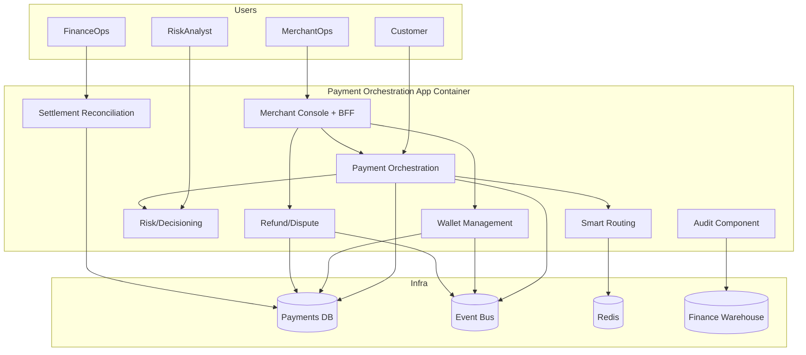

# C4 Component Diagram

```mermaid
flowchart TB
    subgraph Users
      Customer
      MerchantOps
      FinanceOps
      RiskAnalyst
    end

    subgraph POWP[Payment Orchestration App Container]
      UIBFF[Merchant Console + BFF]
      PayCmp[Payment Orchestration]
      WalletCmp[Wallet Management]
      RiskCmp[Risk/Decisioning]
      RouteCmp[Smart Routing]
      RefundCmp[Refund/Dispute]
      ReconCmp[Settlement Reconciliation]
      AuditCmp[Audit Component]
    end

    subgraph Infra
      OLTP[(Payments DB)]
      Bus[(Event Bus)]
      Cache[(Redis)]
      DWH[(Finance Warehouse)]
    end

    Customer --> PayCmp
    MerchantOps --> UIBFF
    FinanceOps --> ReconCmp
    RiskAnalyst --> RiskCmp

    UIBFF --> PayCmp
    UIBFF --> WalletCmp
    UIBFF --> RefundCmp

    PayCmp --> RiskCmp
    PayCmp --> RouteCmp
    PayCmp --> OLTP
    WalletCmp --> OLTP
    RefundCmp --> OLTP
    ReconCmp --> OLTP

    PayCmp --> Bus
    WalletCmp --> Bus
    RefundCmp --> Bus
    RouteCmp --> Cache
    AuditCmp --> DWH
```
