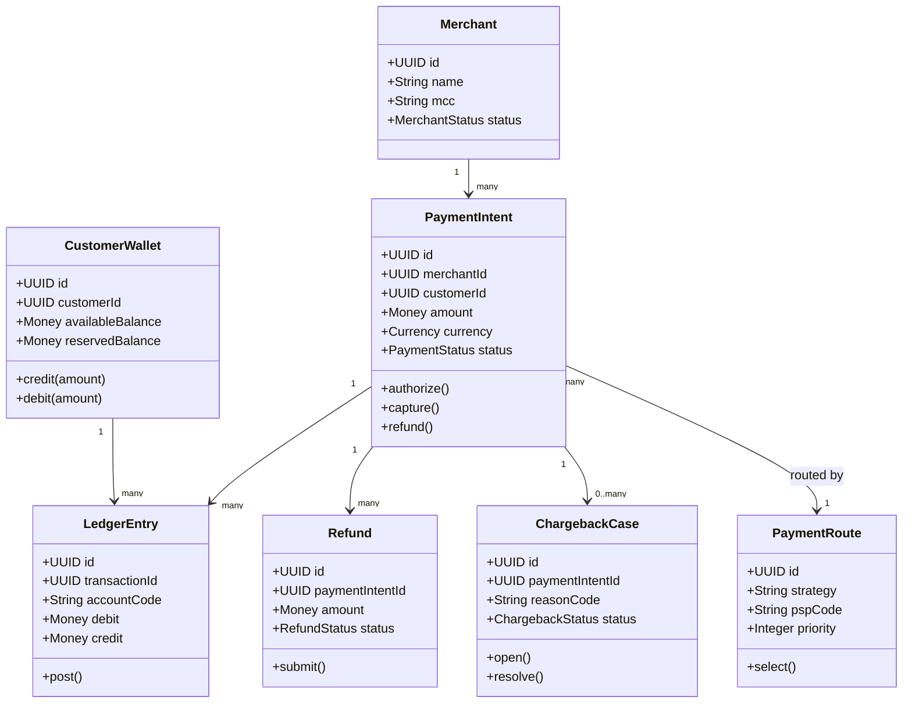

# Class Diagrams

```mermaid
classDiagram
    class Merchant {
      +UUID id
      +String name
      +String mcc
      +MerchantStatus status
    }

    class CustomerWallet {
      +UUID id
      +UUID customerId
      +Money availableBalance
      +Money reservedBalance
      +credit(amount)
      +debit(amount)
    }

    class PaymentIntent {
      +UUID id
      +UUID merchantId
      +UUID customerId
      +Money amount
      +Currency currency
      +PaymentStatus status
      +authorize()
      +capture()
      +refund()
    }

    class PaymentRoute {
      +UUID id
      +String strategy
      +String pspCode
      +Integer priority
      +select()
    }

    class LedgerEntry {
      +UUID id
      +UUID transactionId
      +String accountCode
      +Money debit
      +Money credit
      +post()
    }

    class Refund {
      +UUID id
      +UUID paymentIntentId
      +Money amount
      +RefundStatus status
      +submit()
    }

    class ChargebackCase {
      +UUID id
      +UUID paymentIntentId
      +String reasonCode
      +ChargebackStatus status
      +open()
      +resolve()
    }

    Merchant "1" --> "many" PaymentIntent
    PaymentIntent "1" --> "many" LedgerEntry
    PaymentIntent "1" --> "many" Refund
    PaymentIntent "1" --> "0..many" ChargebackCase
    CustomerWallet "1" --> "many" LedgerEntry
    PaymentIntent "many" --> "1" PaymentRoute : routed by
```
