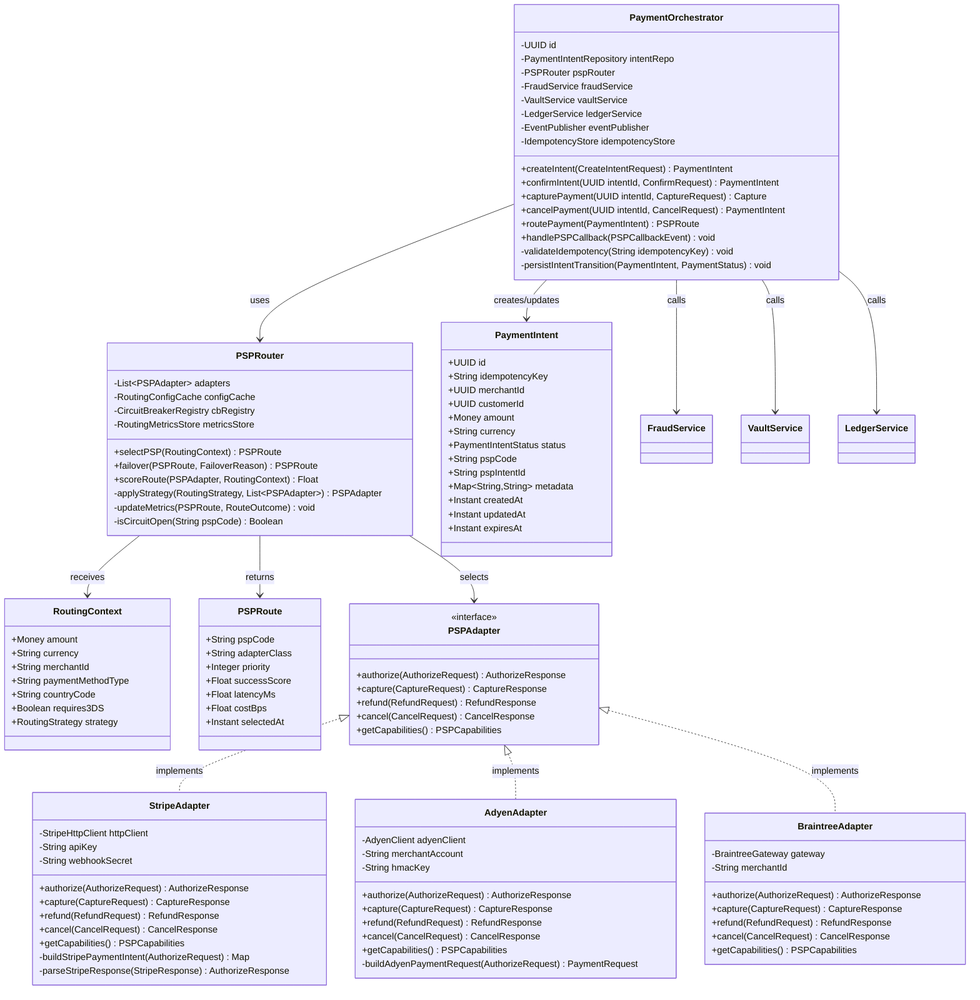
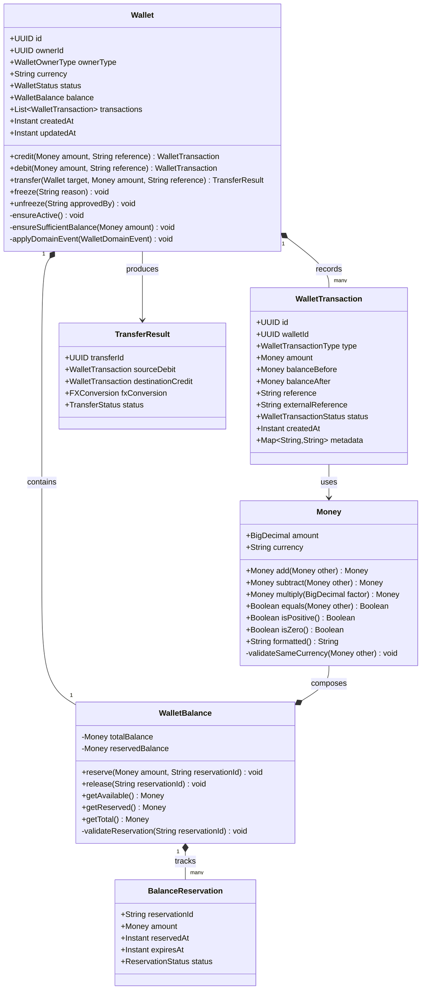
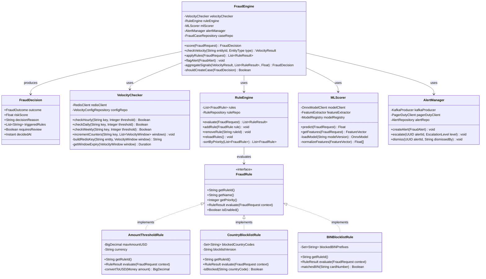
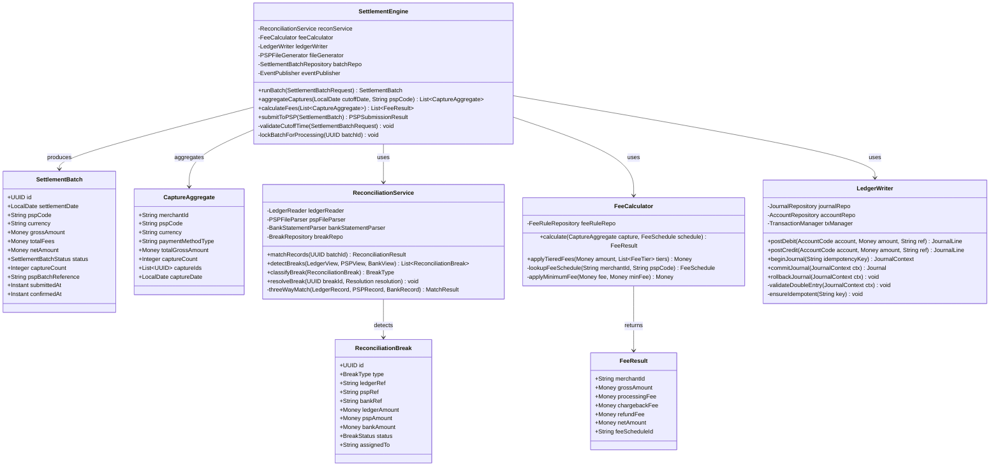

# Class Diagrams — Payment Orchestration and Wallet Platform

> **Scope:** UML class diagrams for the four core domain aggregates: Payment Orchestration,
> Wallet, Fraud Engine, and Settlement Engine. Visibility modifiers: `+` public, `-` private,
> `#` protected. All monetary values use the `Money` value object (amount + currency).

---

## CD-001: Payment Orchestration Domain

### 1.1 PaymentOrchestrator and PSP Routing

---

## CD-002: Wallet Aggregate

---

## CD-003: Fraud Engine

---

## CD-004: Settlement Engine

---

## Design Notes

| Class | Pattern | Key Design Decision |
|---|---|---|
| `PaymentOrchestrator` | Application Service | Orchestrates cross-domain calls; holds no business state |
| `PSPRouter` | Strategy + Circuit Breaker | Strategy pattern for routing; Resilience4j circuit breakers per PSP |
| `PSPAdapter` | Adapter / Port | Anti-corruption layer isolating PSP API differences |
| `Wallet` | Aggregate Root (DDD) | All balance mutations go through `Wallet`; invariants enforced in domain |
| `Money` | Value Object | Immutable; arithmetic methods return new instances; currency-aware |
| `FraudEngine` | Facade | Composes velocity, rules, and ML signals into single decision |
| `RuleEngine` | Chain of Responsibility | Ordered rule evaluation; short-circuits on BLOCK decision |
| `LedgerWriter` | Unit of Work | Journal context tracks debit/credit pairs before commit |
| `SettlementEngine` | Domain Service | Stateless; operates on settlement batch aggregate |

