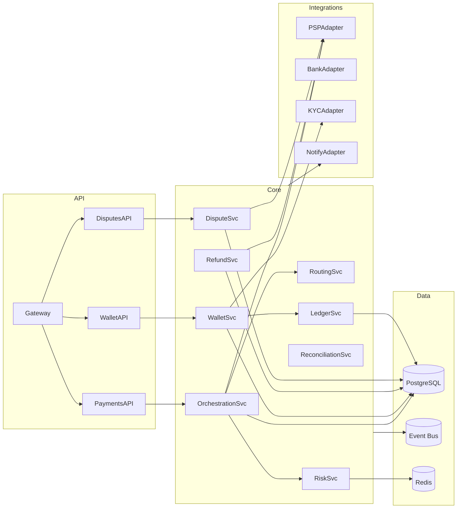

# Component Diagrams

```mermaid
flowchart LR
    subgraph API
      Gateway
      PaymentsAPI
      WalletAPI
      DisputesAPI
    end

    subgraph Core
      OrchestrationSvc
      RoutingSvc
      RiskSvc
      WalletSvc
      RefundSvc
      DisputeSvc
      ReconciliationSvc
      LedgerSvc
    end

    subgraph Integrations
      PSPAdapter
      BankAdapter
      KYCAdapter
      NotifyAdapter
    end

    subgraph Data
      DB[(PostgreSQL)]
      MQ[(Event Bus)]
      Cache[(Redis)]
    end

    Gateway --> PaymentsAPI --> OrchestrationSvc
    Gateway --> WalletAPI --> WalletSvc
    Gateway --> DisputesAPI --> DisputeSvc

    OrchestrationSvc --> RoutingSvc
    OrchestrationSvc --> RiskSvc
    OrchestrationSvc --> PSPAdapter
    WalletSvc --> LedgerSvc
    RefundSvc --> PSPAdapter
    DisputeSvc --> PSPAdapter

    OrchestrationSvc --> DB
    WalletSvc --> DB
    RefundSvc --> DB
    DisputeSvc --> DB
    LedgerSvc --> DB

    Core --> MQ
    RiskSvc --> Cache
    WalletSvc --> KYCAdapter
    Core --> NotifyAdapter
```
