# ERD & Database Schema — Payment Orchestration and Wallet Platform

## Table of Contents
1. [Schema Overview](#1-schema-overview)
2. [Entity-Relationship Diagram](#2-entity-relationship-diagram)
3. [SQL Table Definitions](#3-sql-table-definitions)
4. [Foreign Key Reference Table](#4-foreign-key-reference-table)
5. [Index Definitions](#5-index-definitions)
6. [Partitioning Definitions](#6-partitioning-definitions)
7. [Database Triggers](#7-database-triggers)

---

## 1. Schema Overview

### 1.1 Database Engine & Extensions

| Property | Value |
|---|---|
| Engine | PostgreSQL 15+ |
| Required Extensions | `uuid-ossp`, `pgcrypto`, `pg_trgm`, `btree_gist` |
| Default Encoding | UTF-8 |
| Default Timezone | UTC (all timestamps stored as `TIMESTAMPTZ`) |
| Collation | `en_US.UTF-8` |

```sql
CREATE EXTENSION IF NOT EXISTS "uuid-ossp";
CREATE EXTENSION IF NOT EXISTS "pgcrypto";
CREATE EXTENSION IF NOT EXISTS "pg_trgm";
CREATE EXTENSION IF NOT EXISTS "btree_gist";
```

### 1.2 Schema Organisation

The database is split into six logical schemas to enforce separation of concerns and apply fine-grained access control per service identity.

| Schema | Owned By | Purpose |
|---|---|---|
| `payments` | payments-service | Payment intents, attempts, authorisations, captures, refunds, chargebacks |
| `wallets` | wallet-service | Wallet accounts, balances, wallet-level transactions, virtual accounts |
| `settlement` | settlement-service | Settlement batches, settlement records, fee rules, fee records |
| `risk` | risk-service | Risk scores, fraud alerts, split payment rules |
| `ledger` | ledger-service | Double-entry ledger journals and entries |
| `audit` | audit-service | Webhook events, API keys, idempotency keys, sandbox configs |

```sql
CREATE SCHEMA IF NOT EXISTS payments;
CREATE SCHEMA IF NOT EXISTS wallets;
CREATE SCHEMA IF NOT EXISTS settlement;
CREATE SCHEMA IF NOT EXISTS risk;
CREATE SCHEMA IF NOT EXISTS ledger;
CREATE SCHEMA IF NOT EXISTS audit;
```

### 1.3 Cross-Schema Shared Tables

The following tables live in the `public` schema and are referenced by multiple services:

- `merchants` — master merchant registry, referenced by all schemas
- `customers` — payer identity, referenced by `payments` and `risk`
- `fx_rates` — exchange rates consumed by `wallets`, `settlement`, and `payments`
- `currency_conversions` — FX execution records

### 1.4 Naming Conventions

- All primary keys: `id UUID DEFAULT gen_random_uuid()`
- Foreign keys: `<referenced_table_singular>_id` (e.g. `merchant_id`, `wallet_id`)
- Enum-style columns enforced with `CHECK (col IN (...))` rather than PostgreSQL `ENUM` types to allow online extension
- Boolean columns prefixed with `is_` where ambiguous
- Timestamps always suffixed with `_at`; use `TIMESTAMPTZ NOT NULL DEFAULT NOW()` for event-time columns
- Monetary amounts: `NUMERIC(20,6)` — sufficient for micro-currency precision and large transaction values without floating-point error
- Currency codes: `CHAR(3)` following ISO 4217

### 1.5 Indexing Strategy

| Index Type | When Applied |
|---|---|
| B-tree (default) | Equality and range lookups on scalars, FKs, status, timestamps |
| Partial index | High-cardinality status columns where a subset is queried (e.g. `WHERE status = 'pending'`) |
| Composite B-tree | Query patterns with multiple filter predicates (`merchant_id + created_at`) |
| GIN | `JSONB` columns searched with `@>` or `jsonb_path_query` |
| GIN `pg_trgm` | `TEXT` columns subject to `ILIKE` or full-text search |
| Unique | Idempotency keys, vault tokens, `(base_currency, quote_currency, fetched_at)` |
| Partition index | Created per-partition to avoid cross-partition bloat |

All FK columns carry a `CREATE INDEX` unless already covered by a unique constraint. This prevents sequential scans during `ON DELETE` cascade operations.

### 1.6 Foreign Key Conventions

| Action | Applied To |
|---|---|
| `ON DELETE RESTRICT` | Financial records — prevents orphan removal (payment_intents, capture_records) |
| `ON DELETE CASCADE` | Dependent child rows where lifecycle is owned by parent (capture_records → payment_attempt) |
| `ON DELETE SET NULL` | Optional references where the parent can be deleted without invalidating the child |
| `ON UPDATE CASCADE` | Not used — all PKs are immutable UUIDs |

---

## 2. Entity-Relationship Diagram

```mermaid
erDiagram
    MERCHANTS {
        uuid   id PK
        uuid   tenant_id
        string legal_name
        string trading_name
        string mcc
        string status
        string risk_tier
        string settlement_currency
        string payout_schedule
        string webhook_url
        timestamptz kyc_verified_at
        timestamptz created_at
    }
    CUSTOMERS {
        uuid   id PK
        uuid   merchant_id FK
        string external_ref
        string email
        string phone_e164
        string full_name
        date   date_of_birth
        string country_code
        string kyc_status
        string risk_level
        inet   ip_address
        string device_fingerprint
        timestamptz created_at
    }
    WALLETS {
        uuid   id PK
        string owner_type
        uuid   owner_id
        string wallet_type
        string status
        string currency
        timestamptz created_at
        timestamptz frozen_at
    }
    WALLET_BALANCES {
        uuid    id PK
        uuid    wallet_id FK
        string  currency
        numeric available_balance
        numeric reserved_balance
        int     version
        timestamptz last_updated_at
    }
    WALLET_TRANSACTIONS {
        uuid   id PK
        uuid   wallet_id FK
        string transaction_type
        numeric amount
        string currency
        string reference_type
        uuid   reference_id
        string idempotency_key
        timestamptz occurred_at
    }
    PAYMENT_INTENTS {
        uuid   id PK
        uuid   merchant_id FK
        uuid   customer_id FK
        numeric amount
        string currency
        string status
        string capture_method
        string idempotency_key
        string client_secret
        timestamptz created_at
        timestamptz expires_at
    }
    PAYMENT_ATTEMPTS {
        uuid   id PK
        uuid   payment_intent_id FK
        string psp_id
        int    attempt_number
        string status
        string error_code
        string psp_transaction_id
        timestamptz started_at
        timestamptz completed_at
        int    latency_ms
    }
    AUTHORIZATION_RECORDS {
        uuid   id PK
        uuid   payment_attempt_id FK
        string auth_code
        string avs_result_code
        string three_ds_status
        numeric authorized_amount
        timestamptz authorized_at
        timestamptz expiry_at
    }
    CAPTURE_RECORDS {
        uuid   id PK
        uuid   payment_attempt_id FK
        uuid   authorization_record_id FK
        numeric captured_amount
        uuid   settlement_batch_id
        timestamptz captured_at
        timestamptz settled_at
    }
    REFUND_RECORDS {
        uuid   id PK
        uuid   payment_intent_id FK
        uuid   capture_record_id FK
        numeric amount
        string reason
        string status
        string idempotency_key
        timestamptz created_at
        timestamptz processed_at
    }
    CHARGEBACK_RECORDS {
        uuid   id PK
        uuid   payment_intent_id FK
        uuid   capture_record_id FK
        numeric amount
        string reason_code
        string network
        string status
        timestamptz received_at
        timestamptz deadline_at
    }
    DISPUTES {
        uuid   id PK
        uuid   chargeback_id FK
        uuid   merchant_id FK
        string status
        string outcome
        jsonb  evidence_submitted
        timestamptz created_at
        timestamptz resolved_at
    }
    PAYMENT_METHODS {
        uuid   id PK
        uuid   customer_id FK
        uuid   merchant_id FK
        string method_type
        string status
        string vault_token
        string card_brand
        string card_last4
        string upi_vpa
        boolean is_default
        timestamptz created_at
    }
    VIRTUAL_ACCOUNTS {
        uuid   id PK
        uuid   merchant_id FK
        uuid   linked_wallet_id FK
        string currency
        string account_number
        string iban
        string status
        string purpose
        timestamptz expires_at
    }
    FX_RATES {
        uuid   id PK
        string base_currency
        string quote_currency
        numeric bid_rate
        numeric ask_rate
        numeric mid_rate
        string source
        timestamptz fetched_at
        timestamptz valid_until
    }
    CURRENCY_CONVERSIONS {
        uuid   id PK
        uuid   fx_rate_id FK
        uuid   wallet_transaction_id FK
        string from_currency
        string to_currency
        numeric from_amount
        numeric to_amount
        numeric rate_applied
        timestamptz created_at
    }
    SETTLEMENT_BATCHES {
        uuid   id PK
        uuid   merchant_id FK
        date   batch_date
        string currency
        numeric gross_amount
        numeric net_amount
        int    record_count
        string status
        timestamptz initiated_at
        timestamptz completed_at
    }
    SETTLEMENT_RECORDS {
        uuid   id PK
        uuid   batch_id FK
        uuid   capture_record_id FK
        numeric amount
        numeric net_amount
        string reconciliation_status
    }
    LEDGER_ENTRIES {
        uuid   id PK
        uuid   wallet_id FK
        string entry_type
        numeric amount
        string currency
        numeric balance_after
        uuid   journal_id
        string idempotency_key
        timestamptz posted_at
        timestamptz reversed_at
    }
    RISK_SCORES {
        uuid     id PK
        uuid     payment_intent_id FK
        uuid     customer_id FK
        smallint score
        string   decision
        string   model_version
        inet     ip_address
        jsonb    velocity_flags
        timestamptz scored_at
    }
    FRAUD_ALERTS {
        uuid   id PK
        uuid   risk_score_id FK
        uuid   payment_intent_id FK
        uuid   customer_id FK
        string alert_type
        string severity
        string status
        timestamptz created_at
        timestamptz resolved_at
    }
    SPLIT_PAYMENT_RULES {
        uuid    id PK
        uuid    payment_intent_id FK
        uuid    recipient_merchant_id FK
        numeric share_percentage
        numeric amount_override
        int     payout_delay_hours
        string  status
    }
    FEE_RULES {
        uuid   id PK
        uuid   merchant_id FK
        string payment_method_type
        string fee_model
        int    percentage_bps
        numeric flat_fee_amount
        timestamptz effective_from
        timestamptz effective_to
    }
    FEE_RECORDS {
        uuid   id PK
        uuid   payment_intent_id FK
        uuid   fee_rule_id FK
        string fee_type
        numeric amount
        timestamptz calculated_at
    }
    WEBHOOK_EVENTS {
        uuid   id PK
        uuid   merchant_id FK
        string event_type
        jsonb  payload
        string delivery_status
        int    attempt_count
        timestamptz next_retry_at
        timestamptz created_at
    }
    API_KEYS {
        uuid   id PK
        uuid   merchant_id FK
        string key_hash
        string key_prefix
        string environment
        text[] scopes
        timestamptz last_used_at
        timestamptz expires_at
        timestamptz created_at
    }
    SANDBOX_CONFIGS {
        uuid    id PK
        uuid    merchant_id FK
        int     test_clock_offset_hours
        boolean auto_authorize
        boolean auto_capture
        numeric simulated_failure_rate
        timestamptz created_at
    }
    IDEMPOTENCY_KEYS {
        uuid   id PK
        string key_hash
        uuid   merchant_id FK
        string request_path
        int    response_status
        jsonb  response_body
        timestamptz created_at
        timestamptz expires_at
    }

    MERCHANTS           ||--o{ PAYMENT_INTENTS       : "initiates"
    MERCHANTS           ||--o{ CUSTOMERS             : "owns"
    MERCHANTS           ||--o{ VIRTUAL_ACCOUNTS      : "holds"
    MERCHANTS           ||--o{ SETTLEMENT_BATCHES    : "receives"
    MERCHANTS           ||--o{ DISPUTES              : "files"
    MERCHANTS           ||--o{ WEBHOOK_EVENTS        : "receives"
    MERCHANTS           ||--o{ API_KEYS              : "authenticates with"
    MERCHANTS           |o--|| SANDBOX_CONFIGS       : "configures"
    MERCHANTS           ||--o{ IDEMPOTENCY_KEYS      : "scopes"
    MERCHANTS           ||--o{ FEE_RULES             : "governed by"
    MERCHANTS           ||--o{ SPLIT_PAYMENT_RULES   : "recipient of"
    CUSTOMERS           ||--o{ PAYMENT_INTENTS       : "makes"
    CUSTOMERS           ||--o{ PAYMENT_METHODS       : "owns"
    CUSTOMERS           ||--o{ RISK_SCORES           : "assessed by"
    CUSTOMERS           ||--o{ FRAUD_ALERTS          : "flagged in"
    PAYMENT_INTENTS     ||--o{ PAYMENT_ATTEMPTS      : "executes via"
    PAYMENT_INTENTS     ||--o{ REFUND_RECORDS        : "refunded through"
    PAYMENT_INTENTS     ||--o{ CHARGEBACK_RECORDS    : "disputed via"
    PAYMENT_INTENTS     ||--o{ FEE_RECORDS           : "charged"
    PAYMENT_INTENTS     ||--o{ SPLIT_PAYMENT_RULES   : "split by"
    PAYMENT_INTENTS     ||--o{ RISK_SCORES           : "scored by"
    PAYMENT_INTENTS     ||--o{ FRAUD_ALERTS          : "triggers"
    PAYMENT_ATTEMPTS    ||--|| AUTHORIZATION_RECORDS : "produces"
    PAYMENT_ATTEMPTS    ||--o{ CAPTURE_RECORDS       : "results in"
    AUTHORIZATION_RECORDS ||--o{ CAPTURE_RECORDS     : "authorises"
    CAPTURE_RECORDS     ||--o{ REFUND_RECORDS        : "refunded via"
    CAPTURE_RECORDS     ||--o{ CHARGEBACK_RECORDS    : "disputed as"
    CAPTURE_RECORDS     ||--o{ SETTLEMENT_RECORDS    : "settled in"
    CHARGEBACK_RECORDS  ||--|| DISPUTES              : "escalates to"
    SETTLEMENT_BATCHES  ||--o{ SETTLEMENT_RECORDS    : "contains"
    WALLETS             ||--|| WALLET_BALANCES       : "tracks"
    WALLETS             ||--o{ WALLET_TRANSACTIONS   : "records"
    WALLETS             ||--o{ LEDGER_ENTRIES        : "posted to"
    WALLETS             ||--o{ VIRTUAL_ACCOUNTS      : "linked to"
    PAYMENT_METHODS     ||--o{ PAYMENT_INTENTS       : "selected for"
    FX_RATES            ||--o{ CURRENCY_CONVERSIONS  : "applied in"
    CURRENCY_CONVERSIONS ||--|| WALLET_TRANSACTIONS  : "records"
    RISK_SCORES         ||--o{ FRAUD_ALERTS          : "generates"
    FEE_RULES           ||--o{ FEE_RECORDS           : "calculates"
```



---

## 3. SQL Table Definitions

```sql
-- ============================================================
-- EXTENSION & SCHEMA SETUP
-- ============================================================
CREATE EXTENSION IF NOT EXISTS "uuid-ossp";
CREATE EXTENSION IF NOT EXISTS "pgcrypto";
CREATE EXTENSION IF NOT EXISTS "pg_trgm";
CREATE EXTENSION IF NOT EXISTS "btree_gist";

CREATE SCHEMA IF NOT EXISTS payments;
CREATE SCHEMA IF NOT EXISTS wallets;
CREATE SCHEMA IF NOT EXISTS settlement;
CREATE SCHEMA IF NOT EXISTS risk;
CREATE SCHEMA IF NOT EXISTS ledger;
CREATE SCHEMA IF NOT EXISTS audit;

-- ============================================================
-- MERCHANTS  (public schema — shared across all services)
-- ============================================================
CREATE TABLE merchants (
    id                   UUID         PRIMARY KEY DEFAULT gen_random_uuid(),
    tenant_id            UUID         NOT NULL,
    legal_name           VARCHAR(500) NOT NULL,
    trading_name         VARCHAR(500),
    mcc                  VARCHAR(4)   CHECK (mcc ~ '^\d{4}$'),
    registration_number  VARCHAR(100),
    tax_id               VARCHAR(100),
    status               VARCHAR(20)  NOT NULL DEFAULT 'pending'
                             CHECK (status IN ('pending','active','suspended','offboarded')),
    risk_tier            VARCHAR(10)  NOT NULL DEFAULT 'medium'
                             CHECK (risk_tier IN ('low','medium','high')),
    settlement_currency  CHAR(3)      NOT NULL,
    payout_schedule      VARCHAR(20)  NOT NULL DEFAULT 'daily'
                             CHECK (payout_schedule IN ('daily','weekly','monthly','manual')),
    webhook_url          VARCHAR(2048),
    kyc_verified_at      TIMESTAMPTZ,
    kyc_provider         VARCHAR(100),
    kyc_reference_id     VARCHAR(255),
    metadata             JSONB        NOT NULL DEFAULT '{}',
    created_at           TIMESTAMPTZ  NOT NULL DEFAULT NOW(),
    updated_at           TIMESTAMPTZ  NOT NULL DEFAULT NOW()
);

-- ============================================================
-- CUSTOMERS
-- ============================================================
CREATE TABLE customers (
    id                 UUID         PRIMARY KEY DEFAULT gen_random_uuid(),
    merchant_id        UUID         NOT NULL REFERENCES merchants(id) ON DELETE RESTRICT,
    external_ref       VARCHAR(255),
    email              VARCHAR(320),
    phone_e164         VARCHAR(20),
    full_name          VARCHAR(500),
    date_of_birth      DATE,
    country_code       CHAR(2),
    kyc_status         VARCHAR(20)  NOT NULL DEFAULT 'not_started'
                           CHECK (kyc_status IN ('not_started','pending','verified','failed','expired')),
    risk_level         VARCHAR(10)  NOT NULL DEFAULT 'low'
                           CHECK (risk_level IN ('low','medium','high','blocked')),
    ip_address         INET,
    device_fingerprint VARCHAR(255),
    metadata           JSONB        NOT NULL DEFAULT '{}',
    created_at         TIMESTAMPTZ  NOT NULL DEFAULT NOW(),
    updated_at         TIMESTAMPTZ  NOT NULL DEFAULT NOW(),
    UNIQUE (merchant_id, external_ref)
);

-- ============================================================
-- PAYMENT METHODS
-- ============================================================
CREATE TABLE payments.payment_methods (
    id                        UUID         PRIMARY KEY DEFAULT gen_random_uuid(),
    customer_id               UUID         REFERENCES customers(id) ON DELETE SET NULL,
    merchant_id               UUID         NOT NULL REFERENCES merchants(id) ON DELETE RESTRICT,
    method_type               VARCHAR(30)  NOT NULL
                                  CHECK (method_type IN ('card','bank_account','upi','crypto','wallet','ach','sepa')),
    status                    VARCHAR(20)  NOT NULL DEFAULT 'active'
                                  CHECK (status IN ('active','expired','removed','failed_verification')),
    vault_token               VARCHAR(255) NOT NULL UNIQUE,
    card_brand                VARCHAR(30),
    card_last4                CHAR(4),
    card_exp_month            SMALLINT     CHECK (card_exp_month BETWEEN 1 AND 12),
    card_exp_year             SMALLINT     CHECK (card_exp_year >= 2020),
    card_fingerprint          VARCHAR(255),
    billing_address           JSONB,
    bank_account_last4        CHAR(4),
    bank_routing_number_hash  VARCHAR(64),
    upi_vpa                   VARCHAR(255),
    is_default                BOOLEAN      NOT NULL DEFAULT FALSE,
    metadata                  JSONB        NOT NULL DEFAULT '{}',
    created_at                TIMESTAMPTZ  NOT NULL DEFAULT NOW(),
    updated_at                TIMESTAMPTZ  NOT NULL DEFAULT NOW()
);

-- ============================================================
-- PAYMENT INTENTS
-- ============================================================
CREATE TABLE payments.payment_intents (
    id                         UUID          PRIMARY KEY DEFAULT gen_random_uuid(),
    merchant_id                UUID          NOT NULL REFERENCES merchants(id) ON DELETE RESTRICT,
    customer_id                UUID          REFERENCES customers(id) ON DELETE SET NULL,
    amount                     NUMERIC(20,6) NOT NULL CHECK (amount > 0),
    currency                   CHAR(3)       NOT NULL,
    status                     VARCHAR(50)   NOT NULL DEFAULT 'requires_payment_method'
                                   CHECK (status IN (
                                       'requires_payment_method',
                                       'requires_confirmation',
                                       'requires_action',
                                       'processing',
                                       'requires_capture',
                                       'captured',
                                       'cancelled',
                                       'failed'
                                   )),
    capture_method             VARCHAR(20)   NOT NULL DEFAULT 'automatic'
                                   CHECK (capture_method IN ('automatic','manual')),
    confirmation_method        VARCHAR(20)   DEFAULT 'automatic'
                                   CHECK (confirmation_method IN ('automatic','manual')),
    payment_method_types       TEXT[]        NOT NULL DEFAULT '{}',
    selected_payment_method_id UUID          REFERENCES payments.payment_methods(id) ON DELETE SET NULL,
    idempotency_key            VARCHAR(255)  UNIQUE,
    client_secret              VARCHAR(255)  UNIQUE,
    description                VARCHAR(1000),
    metadata                   JSONB         NOT NULL DEFAULT '{}',
    statement_descriptor       VARCHAR(22),
    shipping_address           JSONB,
    billing_address            JSONB,
    created_at                 TIMESTAMPTZ   NOT NULL DEFAULT NOW(),
    updated_at                 TIMESTAMPTZ   NOT NULL DEFAULT NOW(),
    expires_at                 TIMESTAMPTZ   NOT NULL DEFAULT NOW() + INTERVAL '1 hour',
    cancelled_at               TIMESTAMPTZ,
    cancellation_reason        VARCHAR(255),
    captured_amount            NUMERIC(20,6) CHECK (captured_amount > 0),
    captured_at                TIMESTAMPTZ
);

-- ============================================================
-- PAYMENT ATTEMPTS  (partitioned by started_at)
-- ============================================================
CREATE TABLE payments.payment_attempts (
    id                  UUID          PRIMARY KEY DEFAULT gen_random_uuid(),
    payment_intent_id   UUID          NOT NULL REFERENCES payments.payment_intents(id) ON DELETE RESTRICT,
    psp_id              VARCHAR(50)   NOT NULL,
    psp_name            VARCHAR(100),
    attempt_number      INT           NOT NULL DEFAULT 1 CHECK (attempt_number >= 1),
    status              VARCHAR(30)   NOT NULL DEFAULT 'pending'
                            CHECK (status IN (
                                'pending','authorizing','authorized',
                                'capturing','captured','failed','cancelled'
                            )),
    error_code          VARCHAR(50),
    error_message       TEXT,
    psp_transaction_id  VARCHAR(255),
    psp_raw_response    JSONB,
    risk_score_id       UUID,
    routing_reason      VARCHAR(255),
    started_at          TIMESTAMPTZ   NOT NULL DEFAULT NOW(),
    completed_at        TIMESTAMPTZ,
    latency_ms          INT           CHECK (latency_ms >= 0)
) PARTITION BY RANGE (started_at);

-- ============================================================
-- AUTHORIZATION RECORDS
-- ============================================================
CREATE TABLE payments.authorization_records (
    id                           UUID          PRIMARY KEY DEFAULT gen_random_uuid(),
    payment_attempt_id           UUID          NOT NULL UNIQUE
                                     REFERENCES payments.payment_attempts(id) ON DELETE RESTRICT,
    auth_code                    VARCHAR(20),
    avs_result_code              VARCHAR(2),
    cvv_result_code              VARCHAR(1),
    eci_indicator                VARCHAR(2),
    three_ds_version             VARCHAR(10),
    three_ds_status              VARCHAR(20)
                                     CHECK (three_ds_status IN (
                                         'Y','N','U','A','C','R','I',NULL
                                     )),
    three_ds_authentication_id   VARCHAR(255),
    authorized_amount            NUMERIC(20,6) NOT NULL CHECK (authorized_amount > 0),
    authorized_currency          CHAR(3)       NOT NULL,
    authorized_at                TIMESTAMPTZ   NOT NULL DEFAULT NOW(),
    expiry_at                    TIMESTAMPTZ   NOT NULL DEFAULT NOW() + INTERVAL '7 days',
    acquirer_reference_number    VARCHAR(50)
);

-- ============================================================
-- CAPTURE RECORDS
-- ============================================================
CREATE TABLE payments.capture_records (
    id                    UUID          PRIMARY KEY DEFAULT gen_random_uuid(),
    payment_attempt_id    UUID          NOT NULL REFERENCES payments.payment_attempts(id) ON DELETE RESTRICT,
    authorization_record_id UUID        NOT NULL REFERENCES payments.authorization_records(id) ON DELETE RESTRICT,
    captured_amount       NUMERIC(20,6) NOT NULL CHECK (captured_amount > 0),
    captured_currency     CHAR(3)       NOT NULL,
    capture_method        VARCHAR(20)   NOT NULL DEFAULT 'automatic'
                              CHECK (capture_method IN ('automatic','manual')),
    psp_capture_id        VARCHAR(255),
    captured_at           TIMESTAMPTZ   NOT NULL DEFAULT NOW(),
    settlement_batch_id   UUID,
    settled_at            TIMESTAMPTZ
);

-- ============================================================
-- REFUND RECORDS
-- ============================================================
CREATE TABLE payments.refund_records (
    id                  UUID          PRIMARY KEY DEFAULT gen_random_uuid(),
    payment_intent_id   UUID          NOT NULL REFERENCES payments.payment_intents(id) ON DELETE RESTRICT,
    capture_record_id   UUID          NOT NULL REFERENCES payments.capture_records(id) ON DELETE RESTRICT,
    amount              NUMERIC(20,6) NOT NULL CHECK (amount > 0),
    currency            CHAR(3)       NOT NULL,
    reason              VARCHAR(50)   NOT NULL
                            CHECK (reason IN (
                                'duplicate','fraudulent','requested_by_customer',
                                'product_not_received','other'
                            )),
    status              VARCHAR(30)   NOT NULL DEFAULT 'pending'
                            CHECK (status IN ('pending','processing','succeeded','failed','cancelled')),
    psp_refund_id       VARCHAR(255),
    initiator_type      VARCHAR(20)   NOT NULL
                            CHECK (initiator_type IN ('merchant','admin','automated')),
    initiator_id        UUID          NOT NULL,
    idempotency_key     VARCHAR(255)  UNIQUE,
    failure_reason      TEXT,
    metadata            JSONB         NOT NULL DEFAULT '{}',
    created_at          TIMESTAMPTZ   NOT NULL DEFAULT NOW(),
    updated_at          TIMESTAMPTZ   NOT NULL DEFAULT NOW(),
    processed_at        TIMESTAMPTZ
);

-- ============================================================
-- CHARGEBACK RECORDS
-- ============================================================
CREATE TABLE payments.chargeback_records (
    id                  UUID          PRIMARY KEY DEFAULT gen_random_uuid(),
    payment_intent_id   UUID          NOT NULL REFERENCES payments.payment_intents(id) ON DELETE RESTRICT,
    capture_record_id   UUID          NOT NULL REFERENCES payments.capture_records(id) ON DELETE RESTRICT,
    amount              NUMERIC(20,6) NOT NULL CHECK (amount > 0),
    currency            CHAR(3)       NOT NULL,
    reason_code         VARCHAR(4)    NOT NULL,
    network             VARCHAR(20)   NOT NULL
                            CHECK (network IN ('visa','mastercard','amex','discover')),
    status              VARCHAR(30)   NOT NULL DEFAULT 'received'
                            CHECK (status IN (
                                'received','under_review','won','lost',
                                'pre_arbitration','arbitration'
                            )),
    dispute_id          UUID,
    received_at         TIMESTAMPTZ   NOT NULL DEFAULT NOW(),
    deadline_at         TIMESTAMPTZ,
    responded_at        TIMESTAMPTZ,
    response_evidence   JSONB         NOT NULL DEFAULT '{}',
    created_at          TIMESTAMPTZ   NOT NULL DEFAULT NOW(),
    updated_at          TIMESTAMPTZ   NOT NULL DEFAULT NOW()
);

-- ============================================================
-- DISPUTES
-- ============================================================
CREATE TABLE payments.disputes (
    id                  UUID         PRIMARY KEY DEFAULT gen_random_uuid(),
    chargeback_id       UUID         NOT NULL UNIQUE
                            REFERENCES payments.chargeback_records(id) ON DELETE RESTRICT,
    merchant_id         UUID         NOT NULL REFERENCES merchants(id) ON DELETE RESTRICT,
    status              VARCHAR(30)  NOT NULL DEFAULT 'open'
                            CHECK (status IN ('open','investigating','closed')),
    outcome             VARCHAR(20)
                            CHECK (outcome IN ('won','lost','accepted','pending')),
    evidence_submitted  JSONB        NOT NULL DEFAULT '{}',
    internal_notes      TEXT,
    assigned_to         UUID,
    created_at          TIMESTAMPTZ  NOT NULL DEFAULT NOW(),
    updated_at          TIMESTAMPTZ  NOT NULL DEFAULT NOW(),
    resolved_at         TIMESTAMPTZ
);

-- ============================================================
-- WALLETS
-- ============================================================
CREATE TABLE wallets.wallets (
    id             UUID         PRIMARY KEY DEFAULT gen_random_uuid(),
    owner_type     VARCHAR(20)  NOT NULL
                       CHECK (owner_type IN ('merchant','customer','platform')),
    owner_id       UUID         NOT NULL,
    wallet_type    VARCHAR(30)  NOT NULL
                       CHECK (wallet_type IN (
                           'stored_value','escrow','settlement','payout','reserve'
                       )),
    status         VARCHAR(20)  NOT NULL DEFAULT 'active'
                       CHECK (status IN ('active','frozen','closed','pending')),
    currency       CHAR(3)      NOT NULL,
    frozen_at      TIMESTAMPTZ,
    frozen_reason  TEXT,
    closed_at      TIMESTAMPTZ,
    metadata       JSONB        NOT NULL DEFAULT '{}',
    created_at     TIMESTAMPTZ  NOT NULL DEFAULT NOW(),
    updated_at     TIMESTAMPTZ  NOT NULL DEFAULT NOW(),
    UNIQUE (owner_type, owner_id, wallet_type, currency)
);

-- ============================================================
-- WALLET BALANCES  (one row per wallet — optimistic locking via version)
-- ============================================================
CREATE TABLE wallets.wallet_balances (
    id                UUID          PRIMARY KEY DEFAULT gen_random_uuid(),
    wallet_id         UUID          NOT NULL UNIQUE
                          REFERENCES wallets.wallets(id) ON DELETE RESTRICT,
    currency          CHAR(3)       NOT NULL,
    available_balance NUMERIC(20,6) NOT NULL DEFAULT 0 CHECK (available_balance >= 0),
    reserved_balance  NUMERIC(20,6) NOT NULL DEFAULT 0 CHECK (reserved_balance >= 0),
    last_updated_at   TIMESTAMPTZ   NOT NULL DEFAULT NOW(),
    version           INT           NOT NULL DEFAULT 0 CHECK (version >= 0)
);

-- ============================================================
-- WALLET TRANSACTIONS
-- ============================================================
CREATE TABLE wallets.wallet_transactions (
    id                UUID          PRIMARY KEY DEFAULT gen_random_uuid(),
    wallet_id         UUID          NOT NULL REFERENCES wallets.wallets(id) ON DELETE RESTRICT,
    transaction_type  VARCHAR(30)   NOT NULL
                          CHECK (transaction_type IN (
                              'credit','debit','reserve','release',
                              'refund','chargeback','fee','fx_conversion',
                              'payout','adjustment'
                          )),
    amount            NUMERIC(20,6) NOT NULL CHECK (amount > 0),
    currency          CHAR(3)       NOT NULL,
    reference_type    VARCHAR(50),
    reference_id      UUID,
    balance_before    NUMERIC(20,6) NOT NULL,
    balance_after     NUMERIC(20,6) NOT NULL,
    idempotency_key   VARCHAR(255)  UNIQUE,
    description       TEXT,
    metadata          JSONB         NOT NULL DEFAULT '{}',
    occurred_at       TIMESTAMPTZ   NOT NULL DEFAULT NOW()
);

-- ============================================================
-- VIRTUAL ACCOUNTS
-- ============================================================
CREATE TABLE wallets.virtual_accounts (
    id               UUID         PRIMARY KEY DEFAULT gen_random_uuid(),
    merchant_id      UUID         NOT NULL REFERENCES merchants(id) ON DELETE RESTRICT,
    currency         CHAR(3)      NOT NULL,
    bank_id          VARCHAR(50),
    account_number   VARCHAR(50),
    routing_number   VARCHAR(20),
    iban             VARCHAR(34),
    swift_code       VARCHAR(11),
    status           VARCHAR(20)  NOT NULL DEFAULT 'active'
                         CHECK (status IN ('active','expired','closed')),
    purpose          VARCHAR(30)  NOT NULL
                         CHECK (purpose IN ('payment_collection','fx_receipt')),
    expires_at       TIMESTAMPTZ,
    linked_wallet_id UUID         REFERENCES wallets.wallets(id) ON DELETE SET NULL,
    metadata         JSONB        NOT NULL DEFAULT '{}',
    created_at       TIMESTAMPTZ  NOT NULL DEFAULT NOW(),
    updated_at       TIMESTAMPTZ  NOT NULL DEFAULT NOW()
);

-- ============================================================
-- FX RATES  (public schema — consumed by multiple services)
-- ============================================================
CREATE TABLE fx_rates (
    id              UUID           PRIMARY KEY DEFAULT gen_random_uuid(),
    base_currency   CHAR(3)        NOT NULL,
    quote_currency  CHAR(3)        NOT NULL,
    bid_rate        NUMERIC(20,10) NOT NULL CHECK (bid_rate > 0),
    ask_rate        NUMERIC(20,10) NOT NULL CHECK (ask_rate > 0),
    mid_rate        NUMERIC(20,10) NOT NULL CHECK (mid_rate > 0),
    source          VARCHAR(50)    NOT NULL
                        CHECK (source IN ('ecb','bloomberg','openexchangerates','manual')),
    fetched_at      TIMESTAMPTZ    NOT NULL DEFAULT NOW(),
    valid_until     TIMESTAMPTZ    NOT NULL,
    spread_bps      INT            NOT NULL DEFAULT 0 CHECK (spread_bps >= 0),
    UNIQUE (base_currency, quote_currency, fetched_at),
    CHECK (base_currency <> quote_currency),
    CHECK (ask_rate >= bid_rate)
);

-- ============================================================
-- CURRENCY CONVERSIONS
-- ============================================================
CREATE TABLE currency_conversions (
    id                     UUID          PRIMARY KEY DEFAULT gen_random_uuid(),
    from_currency          CHAR(3)       NOT NULL,
    to_currency            CHAR(3)       NOT NULL,
    from_amount            NUMERIC(20,6) NOT NULL CHECK (from_amount > 0),
    to_amount              NUMERIC(20,6) NOT NULL CHECK (to_amount > 0),
    fx_rate_id             UUID          NOT NULL REFERENCES fx_rates(id) ON DELETE RESTRICT,
    rate_applied           NUMERIC(20,10) NOT NULL CHECK (rate_applied > 0),
    fee_amount             NUMERIC(20,6) NOT NULL DEFAULT 0 CHECK (fee_amount >= 0),
    fee_currency           CHAR(3),
    wallet_transaction_id  UUID          REFERENCES wallets.wallet_transactions(id) ON DELETE SET NULL,
    created_at             TIMESTAMPTZ   NOT NULL DEFAULT NOW(),
    CHECK (from_currency <> to_currency)
);

-- ============================================================
-- SETTLEMENT BATCHES
-- ============================================================
CREATE TABLE settlement.settlement_batches (
    id               UUID          PRIMARY KEY DEFAULT gen_random_uuid(),
    merchant_id      UUID          NOT NULL REFERENCES merchants(id) ON DELETE RESTRICT,
    batch_date       DATE          NOT NULL,
    currency         CHAR(3)       NOT NULL,
    gross_amount     NUMERIC(20,6) NOT NULL DEFAULT 0 CHECK (gross_amount >= 0),
    fee_amount       NUMERIC(20,6) NOT NULL DEFAULT 0 CHECK (fee_amount >= 0),
    net_amount       NUMERIC(20,6) NOT NULL DEFAULT 0,
    record_count     INT           NOT NULL DEFAULT 0 CHECK (record_count >= 0),
    status           VARCHAR(20)   NOT NULL DEFAULT 'pending'
                         CHECK (status IN ('pending','processing','completed','failed','cancelled')),
    psp_id           VARCHAR(50),
    batch_reference  VARCHAR(255),
    initiated_at     TIMESTAMPTZ   NOT NULL DEFAULT NOW(),
    completed_at     TIMESTAMPTZ,
    failure_reason   TEXT,
    created_at       TIMESTAMPTZ   NOT NULL DEFAULT NOW(),
    updated_at       TIMESTAMPTZ   NOT NULL DEFAULT NOW(),
    UNIQUE (merchant_id, batch_date, currency)
);

-- ============================================================
-- SETTLEMENT RECORDS
-- ============================================================
CREATE TABLE settlement.settlement_records (
    id                     UUID          PRIMARY KEY DEFAULT gen_random_uuid(),
    batch_id               UUID          NOT NULL
                               REFERENCES settlement.settlement_batches(id) ON DELETE RESTRICT,
    capture_record_id      UUID          NOT NULL
                               REFERENCES payments.capture_records(id) ON DELETE RESTRICT,
    amount                 NUMERIC(20,6) NOT NULL CHECK (amount > 0),
    currency               CHAR(3)       NOT NULL,
    fee_amount             NUMERIC(20,6) NOT NULL DEFAULT 0 CHECK (fee_amount >= 0),
    net_amount             NUMERIC(20,6) NOT NULL,
    psp_reference          VARCHAR(255),
    reconciliation_status  VARCHAR(20)   NOT NULL DEFAULT 'pending'
                               CHECK (reconciliation_status IN (
                                   'pending','matched','unmatched',
                                   'disputed','manual_override'
                               )),
    created_at             TIMESTAMPTZ   NOT NULL DEFAULT NOW(),
    UNIQUE (batch_id, capture_record_id)
);

-- ============================================================
-- FEE RULES
-- ============================================================
CREATE TABLE settlement.fee_rules (
    id                   UUID          PRIMARY KEY DEFAULT gen_random_uuid(),
    merchant_id          UUID          REFERENCES merchants(id) ON DELETE CASCADE,
    payment_method_type  VARCHAR(30),
    currency             CHAR(3),
    fee_model            VARCHAR(20)   NOT NULL
                             CHECK (fee_model IN ('flat','percentage','tiered')),
    flat_fee_amount      NUMERIC(10,6) CHECK (flat_fee_amount >= 0),
    percentage_bps       INT           CHECK (percentage_bps BETWEEN 0 AND 10000),
    min_fee              NUMERIC(10,6) CHECK (min_fee >= 0),
    max_fee              NUMERIC(10,6) CHECK (max_fee >= 0),
    effective_from       TIMESTAMPTZ   NOT NULL DEFAULT NOW(),
    effective_to         TIMESTAMPTZ,
    priority             INT           NOT NULL DEFAULT 100 CHECK (priority >= 0),
    created_at           TIMESTAMPTZ   NOT NULL DEFAULT NOW(),
    updated_at           TIMESTAMPTZ   NOT NULL DEFAULT NOW(),
    CHECK (effective_to IS NULL OR effective_to > effective_from)
);

-- ============================================================
-- FEE RECORDS
-- ============================================================
CREATE TABLE settlement.fee_records (
    id                UUID          PRIMARY KEY DEFAULT gen_random_uuid(),
    payment_intent_id UUID          NOT NULL
                          REFERENCES payments.payment_intents(id) ON DELETE RESTRICT,
    fee_rule_id       UUID          REFERENCES settlement.fee_rules(id) ON DELETE SET NULL,
    fee_type          VARCHAR(30)   NOT NULL
                          CHECK (fee_type IN (
                              'processing','fx','chargeback','refund','payout'
                          )),
    amount            NUMERIC(20,6) NOT NULL CHECK (amount >= 0),
    currency          CHAR(3)       NOT NULL,
    calculated_at     TIMESTAMPTZ   NOT NULL DEFAULT NOW()
);

-- ============================================================
-- LEDGER ENTRIES  (partitioned by posted_at — append-only)
-- ============================================================
CREATE TABLE ledger.ledger_entries (
    id                 UUID          PRIMARY KEY DEFAULT gen_random_uuid(),
    wallet_id          UUID          NOT NULL REFERENCES wallets.wallets(id) ON DELETE RESTRICT,
    entry_type         VARCHAR(10)   NOT NULL CHECK (entry_type IN ('debit','credit')),
    amount             NUMERIC(20,6) NOT NULL CHECK (amount > 0),
    currency           CHAR(3)       NOT NULL,
    balance_after      NUMERIC(20,6) NOT NULL,
    journal_id         UUID          NOT NULL,
    reference_type     VARCHAR(50),
    reference_id       UUID,
    description        TEXT,
    posted_at          TIMESTAMPTZ   NOT NULL DEFAULT NOW(),
    reversed_at        TIMESTAMPTZ,
    reversal_entry_id  UUID,
    idempotency_key    VARCHAR(255)  UNIQUE
) PARTITION BY RANGE (posted_at);

-- ============================================================
-- RISK SCORES  (partitioned by scored_at)
-- ============================================================
CREATE TABLE risk.risk_scores (
    id                 UUID         PRIMARY KEY DEFAULT gen_random_uuid(),
    payment_intent_id  UUID         NOT NULL
                           REFERENCES payments.payment_intents(id) ON DELETE RESTRICT,
    customer_id        UUID         REFERENCES customers(id) ON DELETE SET NULL,
    score              SMALLINT     NOT NULL CHECK (score BETWEEN 0 AND 100),
    decision           VARCHAR(20)  NOT NULL
                           CHECK (decision IN ('allow','review','block')),
    model_version      VARCHAR(20)  NOT NULL,
    ip_address         INET,
    ip_country         CHAR(2),
    device_fingerprint VARCHAR(255),
    velocity_flags     JSONB        NOT NULL DEFAULT '{}',
    ml_features        JSONB        NOT NULL DEFAULT '{}',
    scored_at          TIMESTAMPTZ  NOT NULL DEFAULT NOW(),
    expires_at         TIMESTAMPTZ
) PARTITION BY RANGE (scored_at);

-- ============================================================
-- FRAUD ALERTS
-- ============================================================
CREATE TABLE risk.fraud_alerts (
    id                UUID         PRIMARY KEY DEFAULT gen_random_uuid(),
    risk_score_id     UUID         REFERENCES risk.risk_scores(id) ON DELETE SET NULL,
    payment_intent_id UUID         NOT NULL
                          REFERENCES payments.payment_intents(id) ON DELETE RESTRICT,
    customer_id       UUID         REFERENCES customers(id) ON DELETE SET NULL,
    alert_type        VARCHAR(30)  NOT NULL
                          CHECK (alert_type IN (
                              'velocity_breach','ml_model','rule_based','manual'
                          )),
    severity          VARCHAR(20)  NOT NULL
                          CHECK (severity IN ('low','medium','high','critical')),
    description       TEXT,
    status            VARCHAR(30)  NOT NULL DEFAULT 'open'
                          CHECK (status IN (
                              'open','investigating','resolved','false_positive'
                          )),
    assigned_to       UUID,
    created_at        TIMESTAMPTZ  NOT NULL DEFAULT NOW(),
    updated_at        TIMESTAMPTZ  NOT NULL DEFAULT NOW(),
    resolved_at       TIMESTAMPTZ
);

-- ============================================================
-- SPLIT PAYMENT RULES
-- ============================================================
CREATE TABLE risk.split_payment_rules (
    id                     UUID          PRIMARY KEY DEFAULT gen_random_uuid(),
    payment_intent_id      UUID          NOT NULL
                               REFERENCES payments.payment_intents(id) ON DELETE CASCADE,
    recipient_merchant_id  UUID          NOT NULL REFERENCES merchants(id) ON DELETE RESTRICT,
    share_percentage       NUMERIC(6,4)  NOT NULL
                               CHECK (share_percentage > 0 AND share_percentage <= 100),
    amount_override        NUMERIC(20,6) CHECK (amount_override > 0),
    currency               CHAR(3),
    payout_delay_hours     INT           NOT NULL DEFAULT 0 CHECK (payout_delay_hours >= 0),
    status                 VARCHAR(20)   NOT NULL DEFAULT 'active'
                               CHECK (status IN ('active','cancelled','paid')),
    created_at             TIMESTAMPTZ   NOT NULL DEFAULT NOW(),
    UNIQUE (payment_intent_id, recipient_merchant_id)
);

-- ============================================================
-- WEBHOOK EVENTS  (partitioned by created_at)
-- ============================================================
CREATE TABLE audit.webhook_events (
    id               UUID         PRIMARY KEY DEFAULT gen_random_uuid(),
    merchant_id      UUID         NOT NULL REFERENCES merchants(id) ON DELETE CASCADE,
    event_type       VARCHAR(100) NOT NULL,
    event_version    VARCHAR(10)  NOT NULL DEFAULT 'v1',
    payload          JSONB        NOT NULL,
    delivery_status  VARCHAR(20)  NOT NULL DEFAULT 'pending'
                         CHECK (delivery_status IN (
                             'pending','delivered','failed','suspended'
                         )),
    attempt_count    INT          NOT NULL DEFAULT 0 CHECK (attempt_count >= 0),
    next_retry_at    TIMESTAMPTZ,
    last_attempt_at  TIMESTAMPTZ,
    delivered_at     TIMESTAMPTZ,
    response_code    INT,
    response_body    TEXT,
    created_at       TIMESTAMPTZ  NOT NULL DEFAULT NOW()
) PARTITION BY RANGE (created_at);

-- ============================================================
-- API KEYS
-- ============================================================
CREATE TABLE audit.api_keys (
    id           UUID         PRIMARY KEY DEFAULT gen_random_uuid(),
    merchant_id  UUID         NOT NULL REFERENCES merchants(id) ON DELETE CASCADE,
    key_hash     VARCHAR(64)  NOT NULL UNIQUE,
    key_prefix   VARCHAR(8)   NOT NULL,
    name         VARCHAR(255),
    environment  VARCHAR(20)  NOT NULL DEFAULT 'live'
                     CHECK (environment IN ('live','test')),
    scopes       TEXT[]       NOT NULL DEFAULT '{}',
    last_used_at TIMESTAMPTZ,
    expires_at   TIMESTAMPTZ,
    revoked_at   TIMESTAMPTZ,
    created_at   TIMESTAMPTZ  NOT NULL DEFAULT NOW(),
    created_by   UUID
);

-- ============================================================
-- SANDBOX CONFIGS
-- ============================================================
CREATE TABLE audit.sandbox_configs (
    id                       UUID           PRIMARY KEY DEFAULT gen_random_uuid(),
    merchant_id              UUID           NOT NULL UNIQUE
                                 REFERENCES merchants(id) ON DELETE CASCADE,
    test_clock_offset_hours  INT            NOT NULL DEFAULT 0,
    auto_authorize           BOOLEAN        NOT NULL DEFAULT TRUE,
    auto_capture             BOOLEAN        NOT NULL DEFAULT TRUE,
    simulated_failure_rate   NUMERIC(5,2)   NOT NULL DEFAULT 0
                                 CHECK (simulated_failure_rate BETWEEN 0 AND 100),
    created_at               TIMESTAMPTZ    NOT NULL DEFAULT NOW(),
    updated_at               TIMESTAMPTZ    NOT NULL DEFAULT NOW()
);

-- ============================================================
-- IDEMPOTENCY KEYS
-- ============================================================
CREATE TABLE audit.idempotency_keys (
    id                  UUID         PRIMARY KEY DEFAULT gen_random_uuid(),
    key_hash            VARCHAR(64)  NOT NULL UNIQUE,
    merchant_id         UUID         NOT NULL REFERENCES merchants(id) ON DELETE CASCADE,
    request_path        VARCHAR(500) NOT NULL,
    request_body_hash   VARCHAR(64),
    response_status     INT,
    response_body       JSONB,
    created_at          TIMESTAMPTZ  NOT NULL DEFAULT NOW(),
    expires_at          TIMESTAMPTZ  NOT NULL DEFAULT NOW() + INTERVAL '24 hours'
);
```

---

## 4. Foreign Key Reference Table

| Table | Column | References | ON DELETE | ON UPDATE |
|---|---|---|---|---|
| `customers` | `merchant_id` | `merchants(id)` | RESTRICT | NO ACTION |
| `payments.payment_methods` | `customer_id` | `customers(id)` | SET NULL | NO ACTION |
| `payments.payment_methods` | `merchant_id` | `merchants(id)` | RESTRICT | NO ACTION |
| `payments.payment_intents` | `merchant_id` | `merchants(id)` | RESTRICT | NO ACTION |
| `payments.payment_intents` | `customer_id` | `customers(id)` | SET NULL | NO ACTION |
| `payments.payment_intents` | `selected_payment_method_id` | `payments.payment_methods(id)` | SET NULL | NO ACTION |
| `payments.payment_attempts` | `payment_intent_id` | `payments.payment_intents(id)` | RESTRICT | NO ACTION |
| `payments.authorization_records` | `payment_attempt_id` | `payments.payment_attempts(id)` | RESTRICT | NO ACTION |
| `payments.capture_records` | `payment_attempt_id` | `payments.payment_attempts(id)` | RESTRICT | NO ACTION |
| `payments.capture_records` | `authorization_record_id` | `payments.authorization_records(id)` | RESTRICT | NO ACTION |
| `payments.refund_records` | `payment_intent_id` | `payments.payment_intents(id)` | RESTRICT | NO ACTION |
| `payments.refund_records` | `capture_record_id` | `payments.capture_records(id)` | RESTRICT | NO ACTION |
| `payments.chargeback_records` | `payment_intent_id` | `payments.payment_intents(id)` | RESTRICT | NO ACTION |
| `payments.chargeback_records` | `capture_record_id` | `payments.capture_records(id)` | RESTRICT | NO ACTION |
| `payments.disputes` | `chargeback_id` | `payments.chargeback_records(id)` | RESTRICT | NO ACTION |
| `payments.disputes` | `merchant_id` | `merchants(id)` | RESTRICT | NO ACTION |
| `wallets.wallets` | *(no FK — owner_id is polymorphic)* | — | — | — |
| `wallets.wallet_balances` | `wallet_id` | `wallets.wallets(id)` | RESTRICT | NO ACTION |
| `wallets.wallet_transactions` | `wallet_id` | `wallets.wallets(id)` | RESTRICT | NO ACTION |
| `wallets.virtual_accounts` | `merchant_id` | `merchants(id)` | RESTRICT | NO ACTION |
| `wallets.virtual_accounts` | `linked_wallet_id` | `wallets.wallets(id)` | SET NULL | NO ACTION |
| `currency_conversions` | `fx_rate_id` | `fx_rates(id)` | RESTRICT | NO ACTION |
| `currency_conversions` | `wallet_transaction_id` | `wallets.wallet_transactions(id)` | SET NULL | NO ACTION |
| `settlement.settlement_batches` | `merchant_id` | `merchants(id)` | RESTRICT | NO ACTION |
| `settlement.settlement_records` | `batch_id` | `settlement.settlement_batches(id)` | RESTRICT | NO ACTION |
| `settlement.settlement_records` | `capture_record_id` | `payments.capture_records(id)` | RESTRICT | NO ACTION |
| `settlement.fee_rules` | `merchant_id` | `merchants(id)` | CASCADE | NO ACTION |
| `settlement.fee_records` | `payment_intent_id` | `payments.payment_intents(id)` | RESTRICT | NO ACTION |
| `settlement.fee_records` | `fee_rule_id` | `settlement.fee_rules(id)` | SET NULL | NO ACTION |
| `ledger.ledger_entries` | `wallet_id` | `wallets.wallets(id)` | RESTRICT | NO ACTION |
| `risk.risk_scores` | `payment_intent_id` | `payments.payment_intents(id)` | RESTRICT | NO ACTION |
| `risk.risk_scores` | `customer_id` | `customers(id)` | SET NULL | NO ACTION |
| `risk.fraud_alerts` | `risk_score_id` | `risk.risk_scores(id)` | SET NULL | NO ACTION |
| `risk.fraud_alerts` | `payment_intent_id` | `payments.payment_intents(id)` | RESTRICT | NO ACTION |
| `risk.fraud_alerts` | `customer_id` | `customers(id)` | SET NULL | NO ACTION |
| `risk.split_payment_rules` | `payment_intent_id` | `payments.payment_intents(id)` | CASCADE | NO ACTION |
| `risk.split_payment_rules` | `recipient_merchant_id` | `merchants(id)` | RESTRICT | NO ACTION |
| `audit.webhook_events` | `merchant_id` | `merchants(id)` | CASCADE | NO ACTION |
| `audit.api_keys` | `merchant_id` | `merchants(id)` | CASCADE | NO ACTION |
| `audit.sandbox_configs` | `merchant_id` | `merchants(id)` | CASCADE | NO ACTION |
| `audit.idempotency_keys` | `merchant_id` | `merchants(id)` | CASCADE | NO ACTION |

---

## 5. Index Definitions

```sql
-- ============================================================
-- MERCHANTS
-- ============================================================
CREATE INDEX idx_merchants_tenant_id          ON merchants (tenant_id);
CREATE INDEX idx_merchants_status             ON merchants (status);
CREATE INDEX idx_merchants_risk_tier          ON merchants (risk_tier);
CREATE INDEX idx_merchants_settlement_currency ON merchants (settlement_currency);
CREATE INDEX idx_merchants_created_at         ON merchants (created_at DESC);

-- ============================================================
-- CUSTOMERS
-- ============================================================
CREATE INDEX idx_customers_merchant_id        ON customers (merchant_id);
CREATE INDEX idx_customers_email              ON customers (merchant_id, email);
CREATE INDEX idx_customers_kyc_status         ON customers (kyc_status);
CREATE INDEX idx_customers_risk_level         ON customers (risk_level);
CREATE INDEX idx_customers_device_fingerprint ON customers (device_fingerprint)
    WHERE device_fingerprint IS NOT NULL;
CREATE INDEX idx_customers_created_at         ON customers (merchant_id, created_at DESC);

-- ============================================================
-- PAYMENT METHODS
-- ============================================================
CREATE UNIQUE INDEX idx_payment_methods_vault_token
    ON payments.payment_methods (vault_token);
CREATE INDEX idx_payment_methods_customer_id
    ON payments.payment_methods (customer_id)
    WHERE customer_id IS NOT NULL;
CREATE INDEX idx_payment_methods_merchant_id
    ON payments.payment_methods (merchant_id);
CREATE INDEX idx_payment_methods_card_fingerprint
    ON payments.payment_methods (card_fingerprint)
    WHERE card_fingerprint IS NOT NULL;
CREATE INDEX idx_payment_methods_status
    ON payments.payment_methods (status, method_type);
CREATE INDEX idx_payment_methods_is_default
    ON payments.payment_methods (customer_id, is_default)
    WHERE is_default = TRUE;

-- ============================================================
-- PAYMENT INTENTS
-- ============================================================
CREATE UNIQUE INDEX idx_payment_intents_idempotency_key
    ON payments.payment_intents (idempotency_key)
    WHERE idempotency_key IS NOT NULL;
CREATE UNIQUE INDEX idx_payment_intents_client_secret
    ON payments.payment_intents (client_secret)
    WHERE client_secret IS NOT NULL;
CREATE INDEX idx_payment_intents_merchant_created
    ON payments.payment_intents (merchant_id, created_at DESC);
CREATE INDEX idx_payment_intents_customer_created
    ON payments.payment_intents (customer_id, created_at DESC)
    WHERE customer_id IS NOT NULL;
CREATE INDEX idx_payment_intents_status
    ON payments.payment_intents (status)
    WHERE status NOT IN ('captured','cancelled','failed');
CREATE INDEX idx_payment_intents_merchant_status
    ON payments.payment_intents (merchant_id, status, created_at DESC);
CREATE INDEX idx_payment_intents_expires_at
    ON payments.payment_intents (expires_at)
    WHERE status IN ('requires_payment_method','requires_confirmation','requires_action');

-- ============================================================
-- PAYMENT ATTEMPTS  (indexes created per partition in practice)
-- ============================================================
CREATE INDEX idx_payment_attempts_payment_intent_id
    ON payments.payment_attempts (payment_intent_id);
CREATE INDEX idx_payment_attempts_status_started
    ON payments.payment_attempts (status, started_at DESC);
CREATE INDEX idx_payment_attempts_psp_id
    ON payments.payment_attempts (psp_id, started_at DESC);
CREATE INDEX idx_payment_attempts_psp_transaction_id
    ON payments.payment_attempts (psp_transaction_id)
    WHERE psp_transaction_id IS NOT NULL;

-- ============================================================
-- AUTHORIZATION RECORDS
-- ============================================================
CREATE UNIQUE INDEX idx_auth_records_payment_attempt_id
    ON payments.authorization_records (payment_attempt_id);
CREATE INDEX idx_auth_records_expiry_at
    ON payments.authorization_records (expiry_at)
    WHERE expiry_at > NOW();

-- ============================================================
-- CAPTURE RECORDS
-- ============================================================
CREATE INDEX idx_capture_records_payment_attempt_id
    ON payments.capture_records (payment_attempt_id);
CREATE INDEX idx_capture_records_settlement_batch_id
    ON payments.capture_records (settlement_batch_id)
    WHERE settlement_batch_id IS NOT NULL;
CREATE INDEX idx_capture_records_captured_at
    ON payments.capture_records (captured_at DESC);

-- ============================================================
-- REFUND RECORDS
-- ============================================================
CREATE INDEX idx_refund_records_payment_intent_id
    ON payments.refund_records (payment_intent_id);
CREATE INDEX idx_refund_records_capture_record_id
    ON payments.refund_records (capture_record_id);
CREATE INDEX idx_refund_records_status
    ON payments.refund_records (status)
    WHERE status IN ('pending','processing');
CREATE UNIQUE INDEX idx_refund_records_idempotency_key
    ON payments.refund_records (idempotency_key)
    WHERE idempotency_key IS NOT NULL;

-- ============================================================
-- CHARGEBACK RECORDS
-- ============================================================
CREATE INDEX idx_chargeback_records_payment_intent_id
    ON payments.chargeback_records (payment_intent_id);
CREATE INDEX idx_chargeback_records_capture_record_id
    ON payments.chargeback_records (capture_record_id);
CREATE INDEX idx_chargeback_records_status
    ON payments.chargeback_records (status, deadline_at);
CREATE INDEX idx_chargeback_records_network_reason
    ON payments.chargeback_records (network, reason_code);

-- ============================================================
-- DISPUTES
-- ============================================================
CREATE UNIQUE INDEX idx_disputes_chargeback_id
    ON payments.disputes (chargeback_id);
CREATE INDEX idx_disputes_merchant_id
    ON payments.disputes (merchant_id, status);
CREATE INDEX idx_disputes_assigned_to
    ON payments.disputes (assigned_to)
    WHERE assigned_to IS NOT NULL;

-- ============================================================
-- WALLETS
-- ============================================================
CREATE INDEX idx_wallets_owner
    ON wallets.wallets (owner_type, owner_id);
CREATE INDEX idx_wallets_status
    ON wallets.wallets (status)
    WHERE status <> 'closed';
CREATE INDEX idx_wallets_currency
    ON wallets.wallets (currency, wallet_type);

-- ============================================================
-- WALLET BALANCES
-- ============================================================
CREATE UNIQUE INDEX idx_wallet_balances_wallet_id
    ON wallets.wallet_balances (wallet_id);

-- ============================================================
-- WALLET TRANSACTIONS
-- ============================================================
CREATE INDEX idx_wallet_txns_wallet_occurred
    ON wallets.wallet_transactions (wallet_id, occurred_at DESC);
CREATE INDEX idx_wallet_txns_reference
    ON wallets.wallet_transactions (reference_type, reference_id);
CREATE INDEX idx_wallet_txns_idempotency_key
    ON wallets.wallet_transactions (idempotency_key)
    WHERE idempotency_key IS NOT NULL;
CREATE INDEX idx_wallet_txns_type
    ON wallets.wallet_transactions (transaction_type, occurred_at DESC);

-- ============================================================
-- VIRTUAL ACCOUNTS
-- ============================================================
CREATE INDEX idx_virtual_accounts_merchant_id
    ON wallets.virtual_accounts (merchant_id);
CREATE INDEX idx_virtual_accounts_status
    ON wallets.virtual_accounts (status)
    WHERE status = 'active';
CREATE INDEX idx_virtual_accounts_linked_wallet
    ON wallets.virtual_accounts (linked_wallet_id)
    WHERE linked_wallet_id IS NOT NULL;
CREATE UNIQUE INDEX idx_virtual_accounts_iban
    ON wallets.virtual_accounts (iban)
    WHERE iban IS NOT NULL;

-- ============================================================
-- FX RATES
-- ============================================================
CREATE INDEX idx_fx_rates_pair_fetched
    ON fx_rates (base_currency, quote_currency, fetched_at DESC);
CREATE INDEX idx_fx_rates_valid_until
    ON fx_rates (valid_until)
    WHERE valid_until > NOW();

-- ============================================================
-- CURRENCY CONVERSIONS
-- ============================================================
CREATE INDEX idx_currency_conversions_fx_rate_id
    ON currency_conversions (fx_rate_id);
CREATE INDEX idx_currency_conversions_created_at
    ON currency_conversions (created_at DESC);

-- ============================================================
-- SETTLEMENT BATCHES
-- ============================================================
CREATE INDEX idx_settlement_batches_merchant_date
    ON settlement.settlement_batches (merchant_id, batch_date DESC);
CREATE INDEX idx_settlement_batches_status
    ON settlement.settlement_batches (status)
    WHERE status IN ('pending','processing');
CREATE INDEX idx_settlement_batches_psp_id
    ON settlement.settlement_batches (psp_id, batch_date DESC);

-- ============================================================
-- SETTLEMENT RECORDS
-- ============================================================
CREATE INDEX idx_settlement_records_batch_id
    ON settlement.settlement_records (batch_id);
CREATE INDEX idx_settlement_records_capture_record_id
    ON settlement.settlement_records (capture_record_id);
CREATE INDEX idx_settlement_records_recon_status
    ON settlement.settlement_records (reconciliation_status)
    WHERE reconciliation_status IN ('unmatched','disputed');

-- ============================================================
-- FEE RULES
-- ============================================================
CREATE INDEX idx_fee_rules_merchant_id
    ON settlement.fee_rules (merchant_id)
    WHERE merchant_id IS NOT NULL;
CREATE INDEX idx_fee_rules_effective
    ON settlement.fee_rules (effective_from, effective_to, priority);
CREATE INDEX idx_fee_rules_method_type
    ON settlement.fee_rules (payment_method_type, currency);

-- ============================================================
-- FEE RECORDS
-- ============================================================
CREATE INDEX idx_fee_records_payment_intent_id
    ON settlement.fee_records (payment_intent_id);
CREATE INDEX idx_fee_records_fee_type
    ON settlement.fee_records (fee_type, calculated_at DESC);

-- ============================================================
-- LEDGER ENTRIES  (indexes created per partition in practice)
-- ============================================================
CREATE INDEX idx_ledger_entries_wallet_posted
    ON ledger.ledger_entries (wallet_id, posted_at DESC);
CREATE INDEX idx_ledger_entries_journal_id
    ON ledger.ledger_entries (journal_id);
CREATE UNIQUE INDEX idx_ledger_entries_idempotency_key
    ON ledger.ledger_entries (idempotency_key)
    WHERE idempotency_key IS NOT NULL;
CREATE INDEX idx_ledger_entries_reference
    ON ledger.ledger_entries (reference_type, reference_id);
CREATE INDEX idx_ledger_entries_reversal
    ON ledger.ledger_entries (reversal_entry_id)
    WHERE reversal_entry_id IS NOT NULL;

-- ============================================================
-- RISK SCORES  (indexes created per partition in practice)
-- ============================================================
CREATE INDEX idx_risk_scores_payment_intent_id
    ON risk.risk_scores (payment_intent_id);
CREATE INDEX idx_risk_scores_customer_scored
    ON risk.risk_scores (customer_id, scored_at DESC)
    WHERE customer_id IS NOT NULL;
CREATE INDEX idx_risk_scores_decision
    ON risk.risk_scores (decision, scored_at DESC)
    WHERE decision IN ('review','block');

-- ============================================================
-- FRAUD ALERTS
-- ============================================================
CREATE INDEX idx_fraud_alerts_risk_score_id
    ON risk.fraud_alerts (risk_score_id);
CREATE INDEX idx_fraud_alerts_payment_intent_id
    ON risk.fraud_alerts (payment_intent_id);
CREATE INDEX idx_fraud_alerts_customer_id
    ON risk.fraud_alerts (customer_id)
    WHERE customer_id IS NOT NULL;
CREATE INDEX idx_fraud_alerts_status_severity
    ON risk.fraud_alerts (status, severity)
    WHERE status IN ('open','investigating');
CREATE INDEX idx_fraud_alerts_assigned_to
    ON risk.fraud_alerts (assigned_to)
    WHERE assigned_to IS NOT NULL;

-- ============================================================
-- SPLIT PAYMENT RULES
-- ============================================================
CREATE INDEX idx_split_payment_rules_payment_intent_id
    ON risk.split_payment_rules (payment_intent_id);
CREATE INDEX idx_split_payment_rules_recipient_merchant_id
    ON risk.split_payment_rules (recipient_merchant_id);

-- ============================================================
-- WEBHOOK EVENTS  (indexes created per partition in practice)
-- ============================================================
CREATE INDEX idx_webhook_events_merchant_type
    ON audit.webhook_events (merchant_id, event_type);
CREATE INDEX idx_webhook_events_delivery_retry
    ON audit.webhook_events (delivery_status, next_retry_at)
    WHERE delivery_status IN ('pending','failed');
CREATE INDEX idx_webhook_events_created_at
    ON audit.webhook_events (created_at DESC);
CREATE INDEX idx_webhook_events_merchant_created
    ON audit.webhook_events (merchant_id, created_at DESC);

-- ============================================================
-- API KEYS
-- ============================================================
CREATE UNIQUE INDEX idx_api_keys_key_hash
    ON audit.api_keys (key_hash);
CREATE INDEX idx_api_keys_merchant_id
    ON audit.api_keys (merchant_id, environment);
CREATE INDEX idx_api_keys_expires_at
    ON audit.api_keys (expires_at)
    WHERE expires_at IS NOT NULL AND revoked_at IS NULL;

-- ============================================================
-- IDEMPOTENCY KEYS
-- ============================================================
CREATE UNIQUE INDEX idx_idempotency_keys_key_hash
    ON audit.idempotency_keys (key_hash);
CREATE INDEX idx_idempotency_keys_merchant_path
    ON audit.idempotency_keys (merchant_id, request_path);
CREATE INDEX idx_idempotency_keys_expires_at
    ON audit.idempotency_keys (expires_at);
```

---

## 6. Partitioning Definitions

All high-volume append-only tables use `PARTITION BY RANGE` on their primary timestamp column. Partitions are created monthly. A `pg_cron` job (or external scheduler) creates the next month's partition at the start of each month.

### 6.1 payment_attempts

```sql
-- Parent table already declared with PARTITION BY RANGE (started_at)

CREATE TABLE payments.payment_attempts_y2025m01
    PARTITION OF payments.payment_attempts
    FOR VALUES FROM ('2025-01-01') TO ('2025-02-01');

CREATE TABLE payments.payment_attempts_y2025m02
    PARTITION OF payments.payment_attempts
    FOR VALUES FROM ('2025-02-01') TO ('2025-03-01');

CREATE TABLE payments.payment_attempts_y2025m03
    PARTITION OF payments.payment_attempts
    FOR VALUES FROM ('2025-03-01') TO ('2025-04-01');

-- Default partition catches any out-of-range inserts during partition lag
CREATE TABLE payments.payment_attempts_default
    PARTITION OF payments.payment_attempts DEFAULT;

-- Partition-local indexes (repeat for each partition)
CREATE INDEX idx_payment_attempts_y2025m01_intent_id
    ON payments.payment_attempts_y2025m01 (payment_intent_id);
CREATE INDEX idx_payment_attempts_y2025m01_status
    ON payments.payment_attempts_y2025m01 (status, started_at DESC);
```

### 6.2 ledger_entries

```sql
-- Parent table already declared with PARTITION BY RANGE (posted_at)

CREATE TABLE ledger.ledger_entries_y2025m01
    PARTITION OF ledger.ledger_entries
    FOR VALUES FROM ('2025-01-01') TO ('2025-02-01');

CREATE TABLE ledger.ledger_entries_y2025m02
    PARTITION OF ledger.ledger_entries
    FOR VALUES FROM ('2025-02-01') TO ('2025-03-01');

CREATE TABLE ledger.ledger_entries_y2025m03
    PARTITION OF ledger.ledger_entries
    FOR VALUES FROM ('2025-03-01') TO ('2025-04-01');

CREATE TABLE ledger.ledger_entries_default
    PARTITION OF ledger.ledger_entries DEFAULT;

-- Partition-local indexes
CREATE INDEX idx_ledger_entries_y2025m01_wallet_posted
    ON ledger.ledger_entries_y2025m01 (wallet_id, posted_at DESC);
CREATE INDEX idx_ledger_entries_y2025m01_journal_id
    ON ledger.ledger_entries_y2025m01 (journal_id);
```

### 6.3 webhook_events

```sql
-- Parent table already declared with PARTITION BY RANGE (created_at)

CREATE TABLE audit.webhook_events_y2025m01
    PARTITION OF audit.webhook_events
    FOR VALUES FROM ('2025-01-01') TO ('2025-02-01');

CREATE TABLE audit.webhook_events_y2025m02
    PARTITION OF audit.webhook_events
    FOR VALUES FROM ('2025-02-01') TO ('2025-03-01');

CREATE TABLE audit.webhook_events_y2025m03
    PARTITION OF audit.webhook_events
    FOR VALUES FROM ('2025-03-01') TO ('2025-04-01');

CREATE TABLE audit.webhook_events_default
    PARTITION OF audit.webhook_events DEFAULT;

-- Partition-local indexes
CREATE INDEX idx_webhook_events_y2025m01_delivery
    ON audit.webhook_events_y2025m01 (delivery_status, next_retry_at)
    WHERE delivery_status IN ('pending','failed');
CREATE INDEX idx_webhook_events_y2025m01_merchant
    ON audit.webhook_events_y2025m01 (merchant_id, created_at DESC);
```

### 6.4 risk_scores

```sql
-- Parent table already declared with PARTITION BY RANGE (scored_at)

CREATE TABLE risk.risk_scores_y2025m01
    PARTITION OF risk.risk_scores
    FOR VALUES FROM ('2025-01-01') TO ('2025-02-01');

CREATE TABLE risk.risk_scores_y2025m02
    PARTITION OF risk.risk_scores
    FOR VALUES FROM ('2025-02-01') TO ('2025-03-01');

CREATE TABLE risk.risk_scores_y2025m03
    PARTITION OF risk.risk_scores
    FOR VALUES FROM ('2025-03-01') TO ('2025-04-01');

CREATE TABLE risk.risk_scores_default
    PARTITION OF risk.risk_scores DEFAULT;

-- Partition-local indexes
CREATE INDEX idx_risk_scores_y2025m01_payment_intent
    ON risk.risk_scores_y2025m01 (payment_intent_id);
CREATE INDEX idx_risk_scores_y2025m01_customer_scored
    ON risk.risk_scores_y2025m01 (customer_id, scored_at DESC);
```

### 6.5 Partition Maintenance Script

The following template is registered as a `pg_cron` job running on the 25th of each month at 02:00 UTC to provision the next month's partition across all partitioned tables.

```sql
-- Run via pg_cron:  SELECT cron.schedule('create-monthly-partitions', '0 2 25 * *', $$...$$);
DO $$
DECLARE
    next_month      DATE := date_trunc('month', NOW() + INTERVAL '1 month');
    next_month_end  DATE := next_month + INTERVAL '1 month';
    suffix          TEXT := to_char(next_month, 'y"y"YYYY"m"MM');
BEGIN
    EXECUTE format(
        'CREATE TABLE IF NOT EXISTS payments.payment_attempts_%s
             PARTITION OF payments.payment_attempts
             FOR VALUES FROM (%L) TO (%L)',
        suffix, next_month, next_month_end
    );
    EXECUTE format(
        'CREATE TABLE IF NOT EXISTS ledger.ledger_entries_%s
             PARTITION OF ledger.ledger_entries
             FOR VALUES FROM (%L) TO (%L)',
        suffix, next_month, next_month_end
    );
    EXECUTE format(
        'CREATE TABLE IF NOT EXISTS audit.webhook_events_%s
             PARTITION OF audit.webhook_events
             FOR VALUES FROM (%L) TO (%L)',
        suffix, next_month, next_month_end
    );
    EXECUTE format(
        'CREATE TABLE IF NOT EXISTS risk.risk_scores_%s
             PARTITION OF risk.risk_scores
             FOR VALUES FROM (%L) TO (%L)',
        suffix, next_month, next_month_end
    );
END;
$$;
```

### 6.6 Data Retention & Archival

| Table | Hot Retention | Archive Strategy |
|---|---|---|
| `payments.payment_attempts` | 13 months | Detach + copy to cold storage (S3 Parquet), then DROP PARTITION |
| `ledger.ledger_entries` | 7 years (regulatory) | Detach + archive to immutable object store, keep partition attached read-only |
| `audit.webhook_events` | 90 days | Detach + drop (delivery is ephemeral) |
| `risk.risk_scores` | 12 months | Detach + archive to analytics warehouse |

---

## 7. Database Triggers

### 7.1 updated_at Auto-Update Trigger

A single reusable trigger function is applied to every table with an `updated_at` column.

```sql
-- ============================================================
-- TRIGGER FUNCTION: set_updated_at
-- ============================================================
CREATE OR REPLACE FUNCTION set_updated_at()
RETURNS TRIGGER
LANGUAGE plpgsql
AS $$
BEGIN
    NEW.updated_at := NOW();
    RETURN NEW;
END;
$$;

-- Apply to: merchants
CREATE TRIGGER trg_merchants_updated_at
    BEFORE UPDATE ON merchants
    FOR EACH ROW EXECUTE FUNCTION set_updated_at();

-- Apply to: customers
CREATE TRIGGER trg_customers_updated_at
    BEFORE UPDATE ON customers
    FOR EACH ROW EXECUTE FUNCTION set_updated_at();

-- Apply to: payments.payment_methods
CREATE TRIGGER trg_payment_methods_updated_at
    BEFORE UPDATE ON payments.payment_methods
    FOR EACH ROW EXECUTE FUNCTION set_updated_at();

-- Apply to: payments.payment_intents
CREATE TRIGGER trg_payment_intents_updated_at
    BEFORE UPDATE ON payments.payment_intents
    FOR EACH ROW EXECUTE FUNCTION set_updated_at();

-- Apply to: payments.refund_records
CREATE TRIGGER trg_refund_records_updated_at
    BEFORE UPDATE ON payments.refund_records
    FOR EACH ROW EXECUTE FUNCTION set_updated_at();

-- Apply to: payments.chargeback_records
CREATE TRIGGER trg_chargeback_records_updated_at
    BEFORE UPDATE ON payments.chargeback_records
    FOR EACH ROW EXECUTE FUNCTION set_updated_at();

-- Apply to: payments.disputes
CREATE TRIGGER trg_disputes_updated_at
    BEFORE UPDATE ON payments.disputes
    FOR EACH ROW EXECUTE FUNCTION set_updated_at();

-- Apply to: wallets.wallets
CREATE TRIGGER trg_wallets_updated_at
    BEFORE UPDATE ON wallets.wallets
    FOR EACH ROW EXECUTE FUNCTION set_updated_at();

-- Apply to: wallets.virtual_accounts
CREATE TRIGGER trg_virtual_accounts_updated_at
    BEFORE UPDATE ON wallets.virtual_accounts
    FOR EACH ROW EXECUTE FUNCTION set_updated_at();

-- Apply to: settlement.settlement_batches
CREATE TRIGGER trg_settlement_batches_updated_at
    BEFORE UPDATE ON settlement.settlement_batches
    FOR EACH ROW EXECUTE FUNCTION set_updated_at();

-- Apply to: settlement.fee_rules
CREATE TRIGGER trg_fee_rules_updated_at
    BEFORE UPDATE ON settlement.fee_rules
    FOR EACH ROW EXECUTE FUNCTION set_updated_at();

-- Apply to: risk.fraud_alerts
CREATE TRIGGER trg_fraud_alerts_updated_at
    BEFORE UPDATE ON risk.fraud_alerts
    FOR EACH ROW EXECUTE FUNCTION set_updated_at();

-- Apply to: audit.sandbox_configs
CREATE TRIGGER trg_sandbox_configs_updated_at
    BEFORE UPDATE ON audit.sandbox_configs
    FOR EACH ROW EXECUTE FUNCTION set_updated_at();
```

### 7.2 Wallet Balance Optimistic Lock Version Increment

When `wallet_balances` is updated, the `version` counter is automatically incremented. Application code performing a balance update must supply the `version` it last read in a `WHERE` clause; if the row count is 0 the transaction was lost to a concurrent writer and must be retried.

```sql
-- ============================================================
-- TRIGGER FUNCTION: increment_wallet_balance_version
-- ============================================================
CREATE OR REPLACE FUNCTION increment_wallet_balance_version()
RETURNS TRIGGER
LANGUAGE plpgsql
AS $$
BEGIN
    -- Guard: only increment when balance columns actually change
    IF NEW.available_balance IS DISTINCT FROM OLD.available_balance
       OR NEW.reserved_balance IS DISTINCT FROM OLD.reserved_balance
    THEN
        NEW.version        := OLD.version + 1;
        NEW.last_updated_at := NOW();
    END IF;
    RETURN NEW;
END;
$$;

CREATE TRIGGER trg_wallet_balances_version
    BEFORE UPDATE ON wallets.wallet_balances
    FOR EACH ROW EXECUTE FUNCTION increment_wallet_balance_version();
```

### 7.3 Ledger Append-Only Enforcement

Ledger entries are immutable after insertion. Updates and deletes are blocked at the database level; corrections are made by inserting a reversal entry and a new correcting entry.

```sql
-- ============================================================
-- TRIGGER FUNCTION: deny_ledger_mutation
-- ============================================================
CREATE OR REPLACE FUNCTION deny_ledger_mutation()
RETURNS TRIGGER
LANGUAGE plpgsql
AS $$
BEGIN
    RAISE EXCEPTION
        'ledger_entries is append-only. '
        'To correct an entry, insert a reversal_entry_id reference instead. '
        'Attempted % on entry id=%',
        TG_OP, OLD.id
        USING ERRCODE = 'raise_exception';
    RETURN NULL;
END;
$$;

CREATE TRIGGER trg_ledger_entries_no_update
    BEFORE UPDATE ON ledger.ledger_entries
    FOR EACH ROW EXECUTE FUNCTION deny_ledger_mutation();

CREATE TRIGGER trg_ledger_entries_no_delete
    BEFORE DELETE ON ledger.ledger_entries
    FOR EACH ROW EXECUTE FUNCTION deny_ledger_mutation();
```

### 7.4 Payment Intent Expiry Guard

Prevents status transitions on expired payment intents that have not yet been explicitly cancelled.

```sql
-- ============================================================
-- TRIGGER FUNCTION: guard_payment_intent_expiry
-- ============================================================
CREATE OR REPLACE FUNCTION guard_payment_intent_expiry()
RETURNS TRIGGER
LANGUAGE plpgsql
AS $$
BEGIN
    IF OLD.expires_at < NOW()
       AND NEW.status NOT IN ('cancelled','failed')
       AND OLD.status NOT IN ('captured','cancelled','failed')
    THEN
        RAISE EXCEPTION
            'Cannot transition payment_intent % from % to %: intent expired at %',
            OLD.id, OLD.status, NEW.status, OLD.expires_at
            USING ERRCODE = 'raise_exception';
    END IF;
    RETURN NEW;
END;
$$;

CREATE TRIGGER trg_payment_intents_expiry_guard
    BEFORE UPDATE ON payments.payment_intents
    FOR EACH ROW EXECUTE FUNCTION guard_payment_intent_expiry();
```

### 7.5 Split Rule Percentage Sum Check

Ensures that the sum of `share_percentage` across all active split rules for a given payment intent never exceeds 100%.

```sql
-- ============================================================
-- TRIGGER FUNCTION: check_split_percentage_sum
-- ============================================================
CREATE OR REPLACE FUNCTION check_split_percentage_sum()
RETURNS TRIGGER
LANGUAGE plpgsql
AS $$
DECLARE
    total_pct NUMERIC;
BEGIN
    SELECT COALESCE(SUM(share_percentage), 0)
      INTO total_pct
      FROM risk.split_payment_rules
     WHERE payment_intent_id = NEW.payment_intent_id
       AND status = 'active'
       AND id <> COALESCE(NEW.id, gen_random_uuid());

    IF total_pct + NEW.share_percentage > 100 THEN
        RAISE EXCEPTION
            'Split percentage sum for payment_intent % would exceed 100%% (current=%, adding=%)',
            NEW.payment_intent_id, total_pct, NEW.share_percentage
            USING ERRCODE = 'raise_exception';
    END IF;
    RETURN NEW;
END;
$$;

CREATE TRIGGER trg_split_payment_rules_pct_sum
    BEFORE INSERT OR UPDATE ON risk.split_payment_rules
    FOR EACH ROW EXECUTE FUNCTION check_split_percentage_sum();
```

