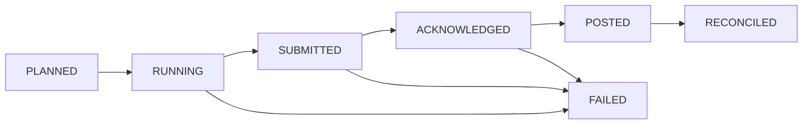

# Ledger and Settlement — Payment Orchestration and Wallet Platform

This document defines the accounting model, journal posting recipes, settlement processing, and reconciliation logic for the platform. It is the implementation contract for finance-facing services and any service that changes balances.

## 1. Ledger Scope and Design Principles

- The ledger is the accounting system of record for all monetary events.
- Wallet balances are read models derived from ledger journals plus wallet-specific bucket rules.
- Journal records are append-only and immutable.
- Posting is exactly once per business event using unique keys and replay-safe outbox processing.
- All amounts are stored in minor units with explicit currency and tenant context.

## 2. Core Tables

| Table | Purpose | Key Constraints |
|---|---|---|
| `accounts` | Chart of accounts by tenant, currency, and account role | Unique on `tenant_id + account_code + currency` |
| `journal_headers` | Journal metadata and posting state | Unique on `business_event_type + business_event_id + posting_version` |
| `journal_lines` | Debit and credit lines | At least two lines per journal; balanced by currency |
| `account_balances` | Materialized balances for fast reads | Updated only from committed journal lines |
| `settlement_batches` | Batch headers keyed by merchant, provider, date, currency | Unique on `merchant_id + provider + settlement_date + currency` |
| `settlement_batch_items` | Captures, refunds, fees, and chargebacks included in a batch | Immutable once batch enters `SUBMITTED` |
| `reconciliation_runs` | Snapshot-based matching run metadata | References imported file checksums |
| `reconciliation_breaks` | Breaks produced by matching engine | Unique on run plus break fingerprint |

### 2.1 Journal Header Fields

| Field | Description |
|---|---|
| `journal_id` | Stable unique identifier |
| `business_event_type` | `payment_capture`, `wallet_transfer`, `refund_finalized`, `chargeback_lost`, `payout_return`, and similar |
| `business_event_id` | Aggregate-specific unique ID |
| `posting_version` | Starts at `1`; increments only for supervised rebuilds |
| `correlation_id` | Distributed trace anchor |
| `source_service` | Producing service name |
| `effective_at` | Financial effective timestamp |
| `status` | `PENDING`, `POSTED`, `REVERSED` |
| `reversal_of_journal_id` | Populated only for reversal journals |
| `metadata` | JSON payload with provider refs, FX data, approval ids |

## 3. Chart of Accounts

Recommended account groups per tenant and currency:

| Account Code | Type | Example Use |
|---|---|---|
| `asset:cash:operating_bank` | Asset | Cleared cash on bank statement |
| `asset:receivable:psp_clearing` | Asset | Captured funds due from PSP |
| `asset:receivable:chargeback_recovery` | Asset | Merchant shortfall after lost chargeback |
| `liability:merchant:pending_settlement` | Liability | Merchant funds not yet released |
| `liability:merchant:wallet_available` | Liability | Merchant spendable wallet balance |
| `liability:merchant:wallet_reserved` | Liability | Funds held for dispute, reserve, or payout review |
| `liability:customer:wallet_available` | Liability | Customer wallet balance |
| `liability:refund:payable` | Liability | Refund committed but not yet cleared |
| `expense:provider_fees` | Expense | PSP processing or payout rail fees |
| `revenue:platform_processing_fees` | Revenue | Fees charged to merchant |
| `revenue:fx_markup` | Revenue | Markup on FX conversions |

## 4. Posting Recipes

### 4.1 Capture Recognition

| Leg | Debit | Credit | Notes |
|---|---|---|---|
| Gross capture | `asset:receivable:psp_clearing` | `liability:merchant:pending_settlement` | Gross amount expected from PSP |
| Platform fee accrual | `liability:merchant:pending_settlement` | `revenue:platform_processing_fees` | Optional if fee charged at capture time |
| Provider fee accrual | `expense:provider_fees` | `asset:receivable:psp_clearing` | Optional when provider deducts from remittance |

### 4.2 Merchant Wallet Release After Clearing Period

| Leg | Debit | Credit |
|---|---|---|
| Release merchant funds | `liability:merchant:pending_settlement` | `liability:merchant:wallet_available` |
| Move reserve hold | `liability:merchant:wallet_available` | `liability:merchant:wallet_reserved` |

### 4.3 Wallet Top Up from Bank or Card

| Scenario | Debit | Credit |
|---|---|---|
| Bank transfer credited to wallet | `asset:cash:operating_bank` | `liability:customer:wallet_available` |
| Card top up awaiting PSP settlement | `asset:receivable:psp_clearing` | `liability:customer:wallet_available` |

### 4.4 Wallet Transfer

| Debit | Credit | Notes |
|---|---|---|
| Source wallet liability | Destination wallet liability | Same currency transfer |
| Source wallet liability | FX bridge liability | First leg of cross-currency transfer |
| FX bridge liability | Destination wallet liability | Second leg with FX rate metadata |

### 4.5 Refund

Refund path depends on where merchant funds currently reside.

| Situation | Debit | Credit |
|---|---|---|
| Funds still pending settlement | `liability:merchant:pending_settlement` | `liability:refund:payable` |
| Funds already in merchant wallet | `liability:merchant:wallet_available` | `liability:refund:payable` |
| Provider confirms refund cleared | `liability:refund:payable` | `asset:receivable:psp_clearing` or `asset:cash:operating_bank` |

### 4.6 Chargeback Lost

| Leg | Debit | Credit | Notes |
|---|---|---|---|
| Principal loss | `liability:merchant:wallet_reserved` or `liability:merchant:wallet_available` | `liability:refund:payable` | Use reserved funds first |
| Chargeback fee | `liability:merchant:wallet_available` | `expense:provider_fees` | Separate fee visibility |
| Merchant shortfall | `asset:receivable:chargeback_recovery` | `liability:refund:payable` | Used when wallet balance is insufficient |

### 4.7 Payout Initiation and Return

| Scenario | Debit | Credit |
|---|---|---|
| Reserve payout | `liability:merchant:wallet_available` | `liability:merchant:wallet_reserved` |
| Dispatch payout | `liability:merchant:wallet_reserved` | `asset:cash:operating_bank` |
| Payout return | `asset:cash:operating_bank` | `liability:merchant:wallet_available` or `liability:merchant:wallet_reserved` |

## 5. Ledger Invariants

The ledger service must enforce these invariants transactionally:

1. Debits equal credits per currency within each journal.
2. No line may reference an inactive account.
3. Every journal belongs to exactly one tenant and one business event.
4. Reversals must reference an existing posted journal and mirror its amount sign.
5. Read-model balances may lag, but source journals must be committed before any outward success response for capture, payout reservation, refund acceptance, or chargeback finalization.

## 6. Posting API Contract

`POST /v1/ledger/journals` must support:

- idempotency by `business_event_type + business_event_id + posting_version`
- validation-only mode for dry-run testing in settlement rebuilds
- optional `approval_context` for manual adjustments
- synchronous invariant failures with machine-readable reason codes

Example request envelope:

```json
{
  "business_event_type": "payment_capture",
  "business_event_id": "cap_01J2PAYMENT123",
  "posting_version": 1,
  "correlation_id": "cor_01J2TRACE123",
  "effective_at": "2025-07-14T10:21:04Z",
  "lines": [
    {
      "account_code": "asset:receivable:psp_clearing",
      "direction": "debit",
      "amount": 12500,
      "currency": "USD"
    },
    {
      "account_code": "liability:merchant:pending_settlement",
      "direction": "credit",
      "amount": 12500,
      "currency": "USD"
    }
  ]
}
```

## 7. Settlement Batch Lifecycle



Batch rules:

- `PLANNED`: items selected from captured journals by merchant, provider, date, and currency.
- `RUNNING`: batch totals and artifacts are materialized; no new captures may be added.
- `SUBMITTED`: provider file or API call sent; snapshot becomes immutable.
- `ACKNOWLEDGED`: provider accepted the batch or clearing file.
- `POSTED`: expected cash movement or clearing receivable update posted to ledger.
- `RECONCILED`: matching engine confirms all material lines or approved timing exceptions.

## 8. Three-Way Reconciliation Design

Reconciliation inputs:

| Input | Source | Required Keys |
|---|---|---|
| Ledger snapshot | Ledger service export | `journal_id`, `payment_intent_id`, `provider_reference`, `amount`, `currency`, `effective_date` |
| PSP file | SFTP, API, or webhook-delivered artifact | `provider_reference`, `settlement_date`, `gross`, `fees`, `net`, `currency` |
| Bank file | CAMT.053, CAMT.054, MT940, ACH return file | `bank_reference`, `value_date`, `net`, `currency` |

Matching order:

1. Exact match on provider reference and amount.
2. Match on network reference plus settlement date tolerance.
3. Match on aggregated batch totals for provider fee lines.
4. Classify remaining records into break categories.

Break policies:

- `TIMING`: auto-close if resolved within configured aging window.
- `AMOUNT_MISMATCH`: requires finance review and often a provider inquiry.
- `MISSING_FROM_LEDGER`: blocks merchant payout if exposure exceeds threshold.
- `DUPLICATE`: create incident and hold related payout release.
- `UNMAPPED_FEE`: requires fee mapping update or supervised adjustment.

## 9. Replay and Repair

- Replaying an event must never mutate an already posted journal unless replay is operating in explicit rebuild mode with `posting_version > 1`.
- Repair tooling must generate new journals or new reconciliation runs; it must not edit historical rows.
- Any repair affecting merchant balances requires a dual-approved attestation entry in the audit log.

## 10. Operational Hooks

- Ledger invariant failure: page finance on-call and payments on-call, mark aggregate `OPERATIONS_HOLD`, stop payout release for affected merchant.
- Reconciliation break above threshold: emit `reconciliation.break.detected.v1` and create an ops case.
- Aged `refund:payable` or `payout reserved` positions: create stale-liability alert for finance review.
