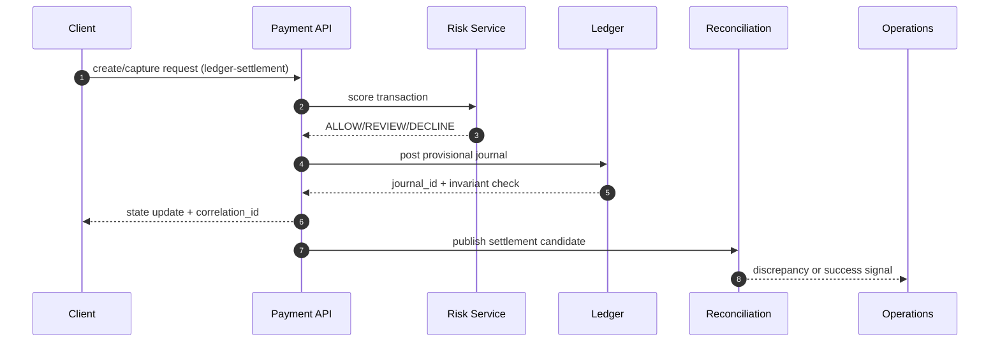

# Ledger and Settlement

## Problem Scope
This document details architecture and operational controls for **ledger and settlement** in the **Payment Orchestration and Wallet Platform**.

## Core Invariants
- Critical mutations are idempotent and traceable through correlation IDs.
- Reconciliation can recompute canonical state from immutable source events.
- User-visible state transitions remain monotonic and auditable.

## Workflow Design
1. Validate request shape, policy, and actor permissions.
2. Execute transactional write(s) with optimistic concurrency protections.
3. Emit durable events for downstream projections and side effects.
4. Run compensating actions when asynchronous steps fail.

## Data and API Considerations
- Enumerate lifecycle statuses and forbidden transitions.
- Define read model projections for dashboards and operations tooling.
- Include API idempotency keys, pagination, filtering, and cursor semantics.

## Failure Handling
- Timeout handling with bounded retries and dead-letter workflows.
- Human-in-the-loop escalation path for unrecoverable conflicts.
- Post-incident replay/backfill procedure with verification checklist.

## Artifact-Specific Deep Dive: Lifecycle, Reconciliation, Disputes, Fraud, and Ledger Safety

### Why this artifact matters
This document now defines **ledger-settlement** behavior and explicitly maps architecture intent to API contracts, diagrammed flows, and day-2 operations owned by **Finance Eng, Treasury Ops**.

### Transaction state transitions required in this artifact
- `INITIATED -> AUTHORIZING -> AUTHORIZED -> CAPTURE_PENDING -> CAPTURED` for card and wallet charges.
- `CAPTURED -> SETTLEMENT_PENDING -> SETTLED` after provider clearing confirmation.
- `CAPTURED|SETTLED -> REFUND_PENDING -> PARTIALLY_REFUNDED|REFUNDED` for merchant-initiated refunds.
- `SETTLED -> CHARGEBACK_OPEN -> CHARGEBACK_WON|CHARGEBACK_LOST` for issuer disputes.
- `CAPTURED -> LEDGER_POSTED -> SETTLEMENT_PENDING` so outward success waits for journal durability.
- Each transition MUST include: actor, triggering API/event, timeout, retry policy, and compensating action.

### API contracts this artifact must keep consistent
- `POST /ledger/journals`: documented here with required request ids, idempotency keys, and failure reason codes for **ledger-settlement**.
- `POST /ledger/reversals`: documented here with required request ids, idempotency keys, and failure reason codes for **ledger-settlement**.
- `GET /ledger/accounts/{id}/entries`: documented here with required request ids, idempotency keys, and failure reason codes for **ledger-settlement**.
- `GET /reconciliation/discrepancies`: documented here with required request ids, idempotency keys, and failure reason codes for **ledger-settlement**.
- All mutating calls MUST return `correlation_id`, `idempotency_key`, `previous_state`, `new_state`, and `transition_reason`.

### In-depth flow diagram for ledger-and-settlement

### Reconciliation, dispute/refund, and fraud controls
- Reconciliation: three-way match (ledger vs PSP file vs bank statement) with tolerance thresholds and auto-classification into `timing`, `amount`, `missing`, `duplicate` breaks.
- Disputes/Refunds: evidence chain-of-custody, SLA timers, and automatic ledger reversals when disputes are lost.
- Fraud: pre-auth risk decisioning, post-auth anomaly detection, and payout velocity controls tied to case management.

### Ledger invariants and operational hooks
- Invariants enforced here: double-entry balance, append-only journal, exactly-once posting per business event, and currency-safe postings.
- Operational process: if any invariant fails, move transaction to `OPERATIONS_HOLD`, page on-call + finance, and block payout release until compensating journals are approved.
- Runbooks must include: replay commands, manual override approvals (dual control), and incident-close reconciliation attestation.

