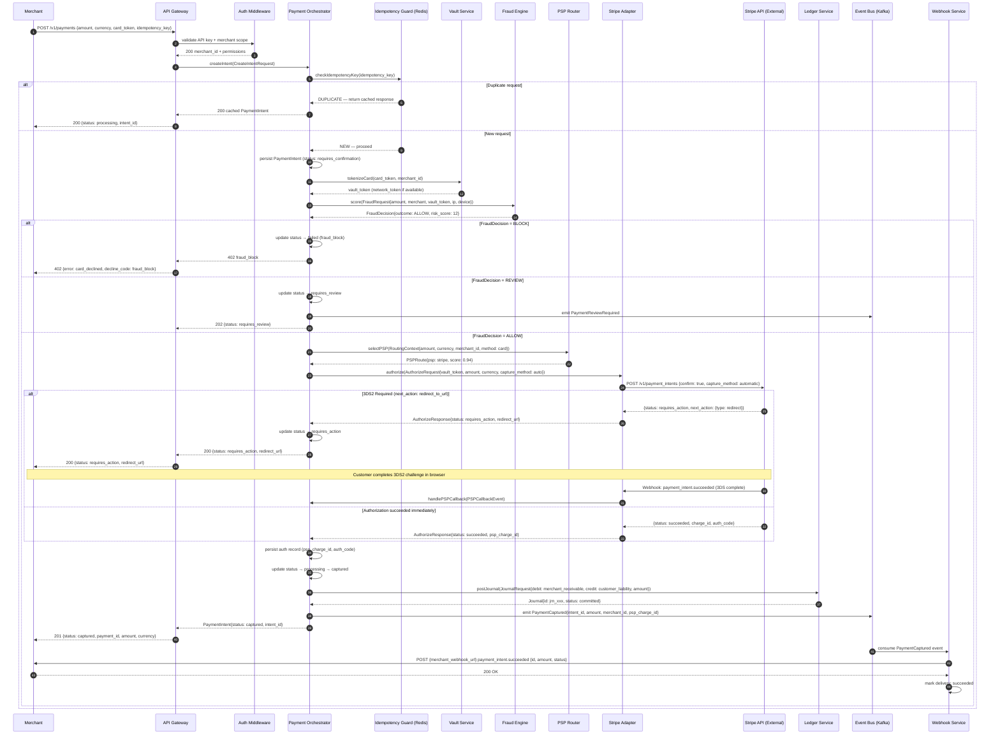
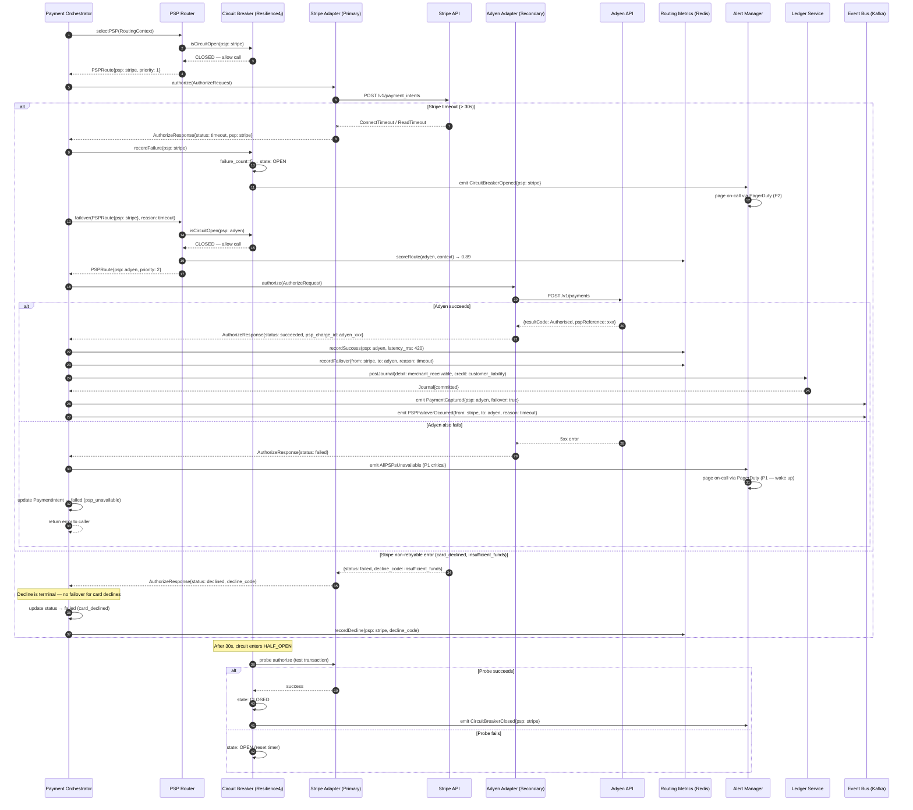
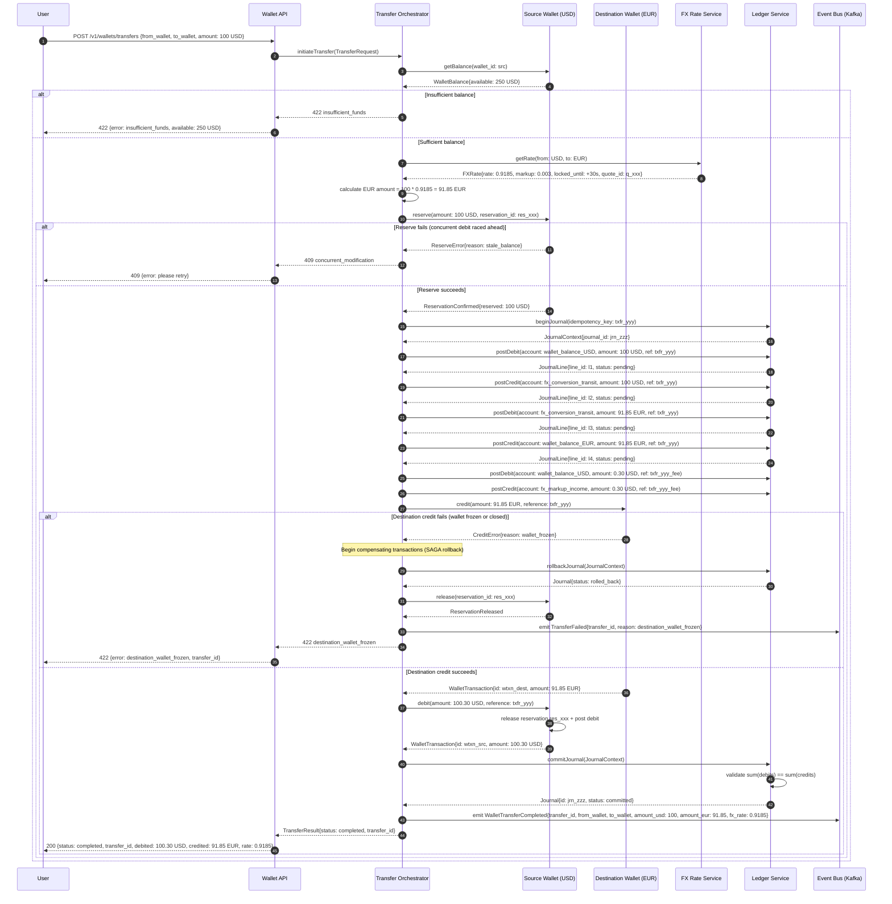

# Sequence Diagrams — Payment Orchestration and Wallet Platform

> **Scope:** Three production-level sequence diagrams covering the critical payment flows:
> card authorization/capture, PSP failover, and cross-currency wallet transfer with rollback.
> All steps include system names, synchronous vs. asynchronous call types, and error paths.

---

## SD-001: Card Payment Authorization and Capture (Full Detail)

> **Trigger:** Merchant submits `POST /v1/payments` with card token and amount.
> **Outcome:** Payment captured, ledger posted, webhook delivered.
> **3DS2 branch:** Triggered when card issuer requires strong customer authentication.

---

## SD-002: PSP Failover Sequence

> **Trigger:** Primary PSP (Stripe) times out or returns a non-retryable error during authorization.
> **Outcome:** Payment routes to secondary PSP (Adyen), metrics updated, alert emitted.
> **Circuit Breaker:** Opens after 5 failures in 60s; half-open probe after 30s.

---

## SD-003: Wallet-to-Wallet Transfer with FX and Rollback

> **Trigger:** User calls `POST /v1/wallets/transfers` to send USD to a EUR wallet.
> **Outcome:** Source wallet debited, destination wallet credited in EUR, double-entry ledger posted.
> **Rollback:** Any failure after balance reservation triggers full compensating transactions.

---

## Diagram Reference

| Diagram | Primary Flow | Error Paths | Async Steps |
|---|---|---|---|
| SD-001 | Auth → 3DS2 → Capture → Ledger → Webhook | Fraud block, Review hold, Stripe decline | Webhook delivery (post-response) |
| SD-002 | Stripe auth → Timeout → Circuit open → Adyen failover | All PSPs down (P1), Card decline (no failover) | Circuit half-open probe |
| SD-003 | FX quote → Reserve → Ledger → Credit → Debit → Commit | Insufficient funds, Race condition, Destination frozen | Event emission (post-commit) |

