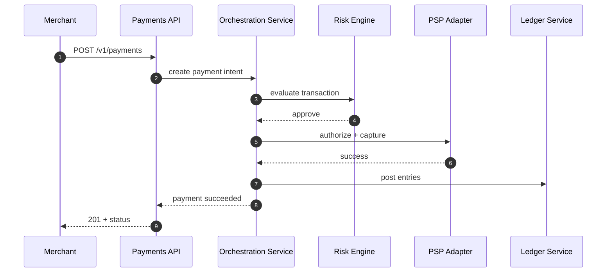
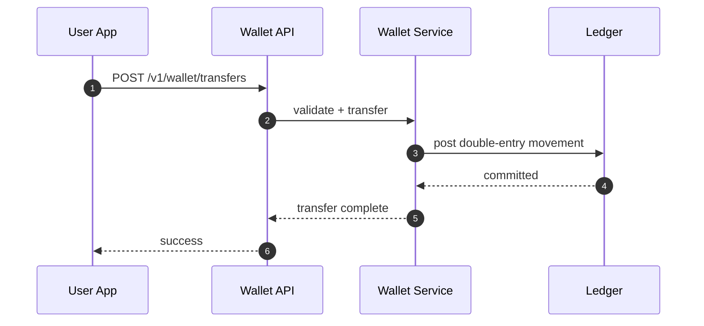

# Sequence Diagrams

## Auth + Capture with Orchestration

```mermaid
sequenceDiagram
    autonumber
    participant M as Merchant
    participant API as Payments API
    participant ORCH as Orchestration Service
    participant RISK as Risk Engine
    participant PSP as PSP Adapter
    participant LEDGER as Ledger Service

    M->>API: POST /v1/payments
    API->>ORCH: create payment intent
    ORCH->>RISK: evaluate transaction
    RISK-->>ORCH: approve
    ORCH->>PSP: authorize + capture
    PSP-->>ORCH: success
    ORCH->>LEDGER: post entries
    ORCH-->>API: payment succeeded
    API-->>M: 201 + status
```

## Wallet Transfer

```mermaid
sequenceDiagram
    autonumber
    participant U as User App
    participant API as Wallet API
    participant WAL as Wallet Service
    participant LEDGER as Ledger

    U->>API: POST /v1/wallet/transfers
    API->>WAL: validate + transfer
    WAL->>LEDGER: post double-entry movement
    LEDGER-->>WAL: committed
    WAL-->>API: transfer complete
    API-->>U: success
```
