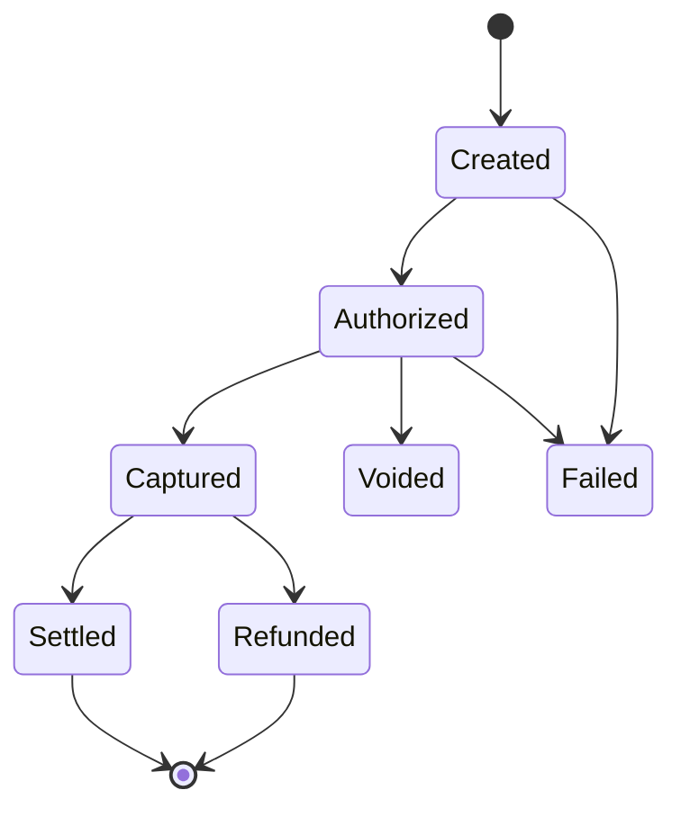
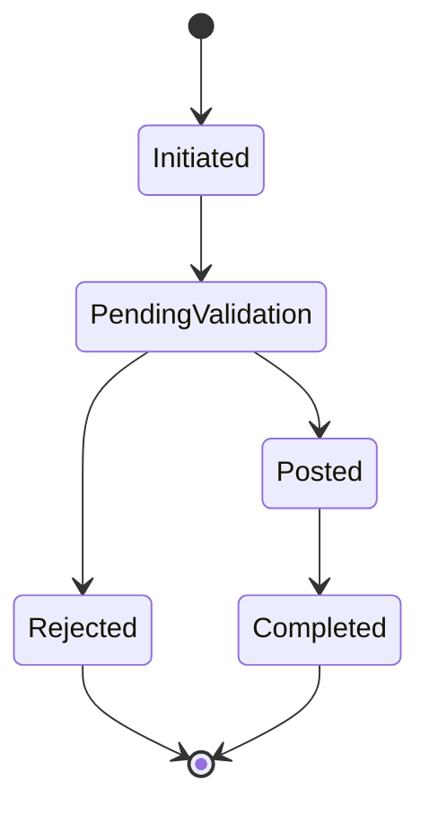
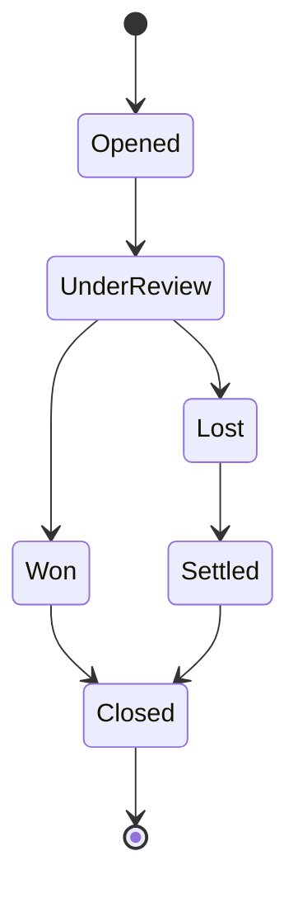

# State Machine Diagrams

## Payment Transaction Lifecycle

```mermaid
stateDiagram-v2
    [*] --> Created
    Created --> Authorized
    Authorized --> Captured
    Authorized --> Voided
    Captured --> Settled
    Captured --> Refunded
    Authorized --> Failed
    Created --> Failed
    Settled --> [*]
    Refunded --> [*]
```

## Wallet Transfer Lifecycle

```mermaid
stateDiagram-v2
    [*] --> Initiated
    Initiated --> PendingValidation
    PendingValidation --> Posted
    PendingValidation --> Rejected
    Posted --> Completed
    Rejected --> [*]
    Completed --> [*]
```

## Chargeback Lifecycle

```mermaid
stateDiagram-v2
    [*] --> Opened
    Opened --> UnderReview
    UnderReview --> Won
    UnderReview --> Lost
    Lost --> Settled
    Won --> Closed
    Settled --> Closed
    Closed --> [*]
```
