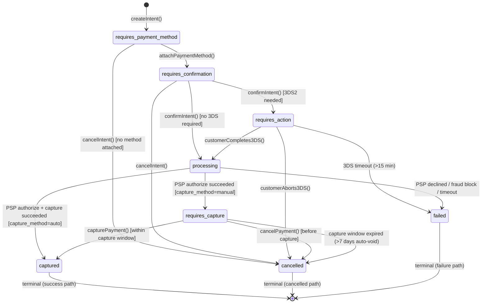
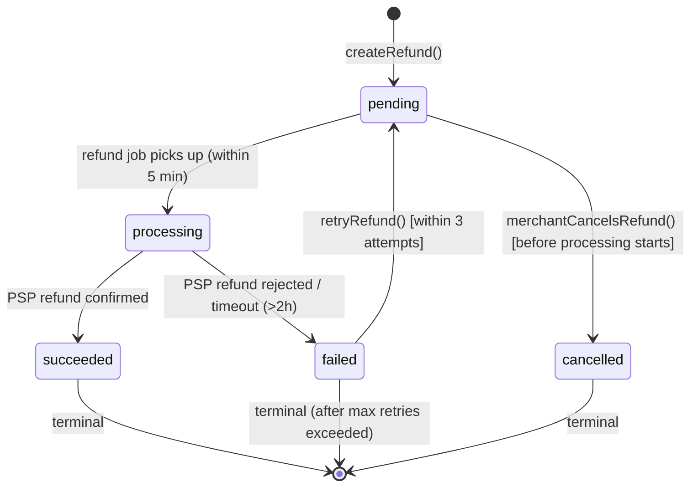
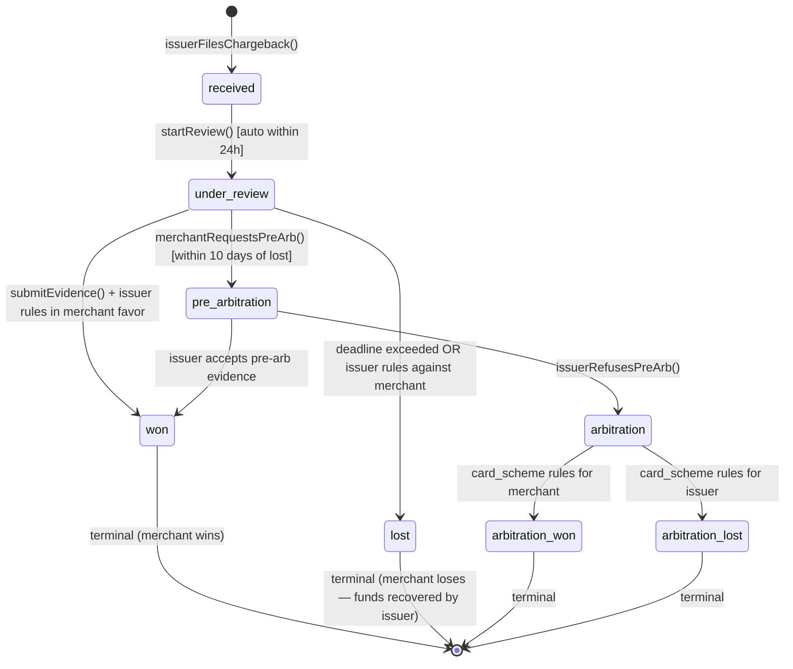
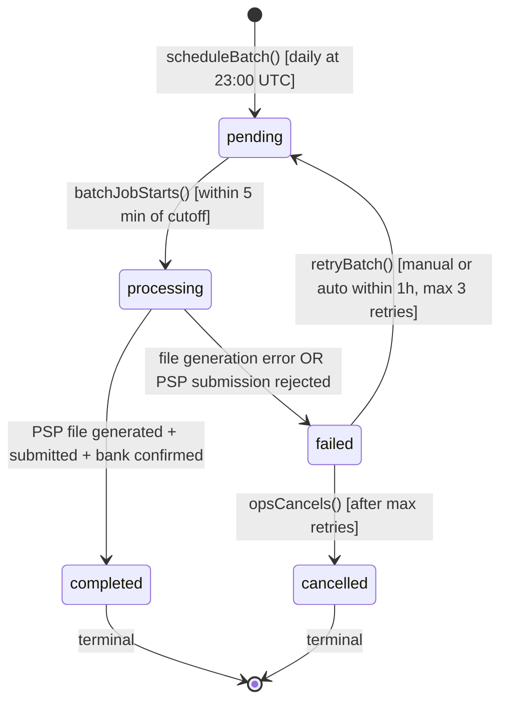
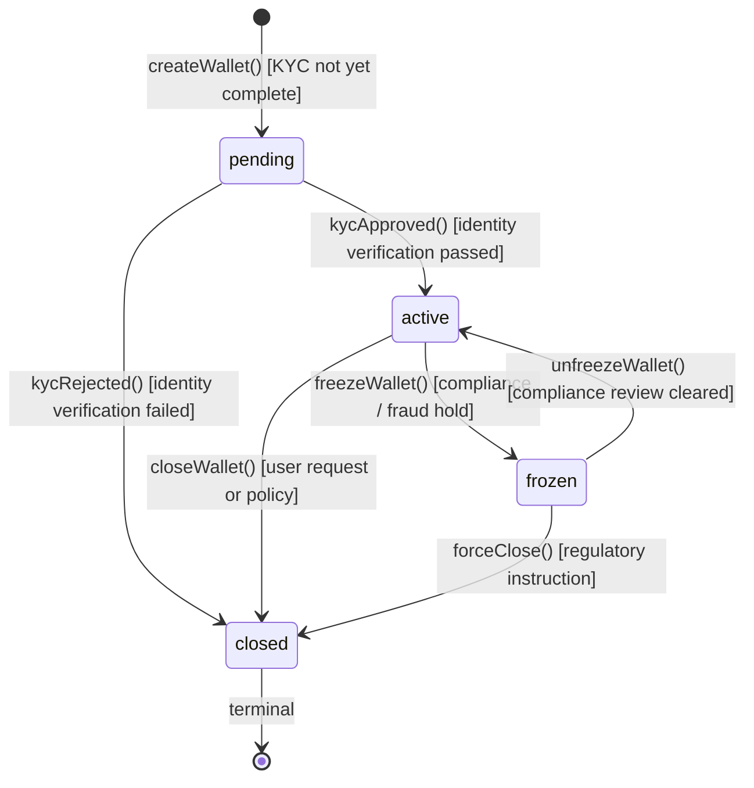

# State Machine Diagrams — Payment Orchestration and Wallet Platform

> **Scope:** Formal state machine specifications for five core domain entities. Each diagram
> includes: valid states, transition triggers, guard conditions, side effects, timeout-based
> auto-transitions, and explicitly forbidden transitions.

---

## SM-001: PaymentIntent States

### State Diagram

### Transition Specification

| From | To | Trigger | Guard | Side Effects |
|---|---|---|---|---|
| `requires_payment_method` | `requires_confirmation` | `attachPaymentMethod()` | Payment method valid, not expired | Vault tokenizes card; persist method reference |
| `requires_confirmation` | `requires_action` | `confirmIntent()` | Card issuer mandates 3DS2 (bin lookup) | Emit `payment.requires_action`; start 15-min 3DS timer |
| `requires_confirmation` | `processing` | `confirmIntent()` | No 3DS required | Call PSP authorize; persist psp_intent_id |
| `requires_action` | `processing` | `customerCompletes3DS()` | 3DS authentication result = success | Cancel 3DS timer; resume PSP auth |
| `requires_action` | `failed` | timeout | 3DS window > 15 minutes | Cancel 3DS session; emit `payment.failed` |
| `processing` | `requires_capture` | PSP callback | PSP status = authorized; capture_method = manual | Persist auth_code; start 7-day capture window |
| `processing` | `captured` | PSP callback | PSP status = captured; capture_method = auto | Post ledger journal; emit `payment.captured` |
| `processing` | `failed` | PSP callback / timeout | PSP declined OR 30s timeout exceeded | Record decline_code; emit `payment.failed` |
| `requires_capture` | `captured` | `capturePayment()` | Within 7-day capture window | Post ledger journal; emit `payment.captured` |
| `requires_capture` | `cancelled` | 7-day timer | Capture window expired | Auto-void at PSP; emit `payment.cancelled` |

**Forbidden transitions:** `captured → requires_capture`, `failed → processing`, `cancelled → any`

---

## SM-002: Refund States

### State Diagram

### Transition Specification

| From | To | Trigger | Guard | Side Effects |
|---|---|---|---|---|
| `[*]` | `pending` | `createRefund()` | `payment.status == captured`; `refund_amount <= remaining_capturable` | Validate refund amount; reserve refund in ledger |
| `pending` | `processing` | Async refund job | Scheduled within 5 minutes of creation | Call PSP refund API; set processing_started_at |
| `pending` | `cancelled` | `cancelRefund()` | Job not yet started | Release ledger reserve; emit `refund.cancelled` |
| `processing` | `succeeded` | PSP callback / poll | PSP refund status = succeeded | Post ledger credit reversal; emit `refund.succeeded`; update payment `amount_refunded` |
| `processing` | `failed` | PSP callback / 2h timeout | PSP error or no callback within 2 hours | Log failure reason; emit `refund.failed`; increment retry_count |
| `failed` | `pending` | `retryRefund()` | `retry_count < 3` | Re-enqueue refund job with exponential backoff |

**Forbidden transitions:** `succeeded → pending` (re-refund must be a new refund object), `cancelled → processing`

---

## SM-003: Chargeback States

### State Diagram

### Transition Specification

| From | To | Trigger | Guard | Side Effects |
|---|---|---|---|---|
| `[*]` | `received` | Issuer notification (via PSP webhook) | Payment is captured and within dispute window | Create chargeback case; freeze merchant payout for dispute amount; notify merchant |
| `received` | `under_review` | Auto-trigger (within 24h SLA) | Case created | Start evidence collection timer (scheme-specific, e.g. 20 days for Visa) |
| `under_review` | `won` | Issuer decision | Evidence submitted; issuer rules in merchant's favor | Unfreeze funds; post ledger reversal of chargeback hold; emit `chargeback.won` |
| `under_review` | `lost` | Evidence deadline / issuer decision | Deadline exceeded OR issuer rules for cardholder | Debit merchant account; post ledger chargeback_debit; emit `chargeback.lost` |
| `under_review` | `pre_arbitration` | Merchant submits additional evidence | `lost` hasn't been final; within 10 days of last ruling | Forward evidence to pre-arb process; notify issuer |
| `pre_arbitration` | `arbitration` | Issuer rejects pre-arb | Issuer does not accept pre-arb evidence | Escalate to card scheme; pay arbitration filing fee (record as fee_expense) |
| `arbitration` | `arbitration_won` | Card scheme ruling | Scheme rules in merchant's favor | Recover funds; post reversal; emit `chargeback.arbitration_won` |
| `arbitration` | `arbitration_lost` | Card scheme ruling | Scheme rules against merchant | Final debit; emit `chargeback.arbitration_lost` |

**Chargeback fees:** A chargeback fee (`$20–$100`) is recorded as a `chargeback_fee` ledger debit at the `received` state regardless of outcome.

---

## SM-004: SettlementBatch States

### State Diagram

### Transition Specification

| From | To | Trigger | Guard | Side Effects |
|---|---|---|---|---|
| `[*]` | `pending` | Scheduled cron (23:00 UTC daily) | No duplicate batch for same date/psp | Aggregate captures for cutoff period; lock batch record |
| `pending` | `processing` | Batch job dequeued | Lock acquired | Start fee calculation; set `processing_started_at` |
| `processing` | `completed` | PSP submission confirmed | File hash validated; bank ACK received | Write settlement journal entries; emit `settlement.completed`; update merchant_receivable balances |
| `processing` | `failed` | File error / PSP rejection / timeout | Error in generation or PSP returns rejection | Set `failure_reason`; emit `settlement.failed`; alert finance ops |
| `failed` | `pending` | Retry trigger | `retry_count < 3` | Increment retry; exponential backoff (1h, 2h, 4h) |
| `failed` | `cancelled` | Manual cancellation after max retries | `retry_count >= 3` | Emit `settlement.cancelled`; require manual ops investigation |

---

## SM-005: Wallet States

### State Diagram

### Transition Specification

| From | To | Trigger | Guard | Side Effects |
|---|---|---|---|---|
| `[*]` | `pending` | `createWallet()` | User/merchant account exists; currency supported | Create wallet record; trigger KYC workflow |
| `pending` | `active` | `kycApproved()` | KYC service returns pass | Enable credit/debit; emit `wallet.activated`; set `activated_at` |
| `pending` | `closed` | `kycRejected()` | KYC service returns fail | Emit `wallet.closed`; notify user; prevent reopening without new KYC |
| `active` | `frozen` | `freezeWallet()` | Compliance flag OR fraud alert | Block all debits and credits; cancel pending transfers; emit `wallet.frozen`; notify user and compliance team |
| `active` | `closed` | `closeWallet()` | Balance must be zero OR transferred out | Ensure zero balance; emit `wallet.closed`; archive transaction history |
| `frozen` | `active` | `unfreezeWallet()` | Compliance review cleared; dual approval required | Re-enable transactions; emit `wallet.unfrozen`; log approver_id |
| `frozen` | `closed` | `forceClose()` | Regulatory instruction | Confiscate balance per regulatory instruction; archive records |

**Forbidden transitions:** `active → pending` (no de-activation without close), `closed → active` (closed is terminal), `pending → frozen` (cannot freeze before activation)

---

## Cross-Entity State Constraints

| PaymentIntent State | Refund Allowed? | Chargeback Possible? |
|---|---|---|
| `requires_payment_method` | No | No |
| `processing` | No | No |
| `captured` | Yes | Yes (within dispute window) |
| `cancelled` | No | No |
| `failed` | No | No |

| Wallet State | Debit | Credit | Transfer Out | Transfer In |
|---|---|---|---|---|
| `pending` | ✗ | ✗ | ✗ | ✗ |
| `active` | ✓ | ✓ | ✓ | ✓ |
| `frozen` | ✗ | ✗ | ✗ | ✗ |
| `closed` | ✗ | ✗ | ✗ | ✗ |

