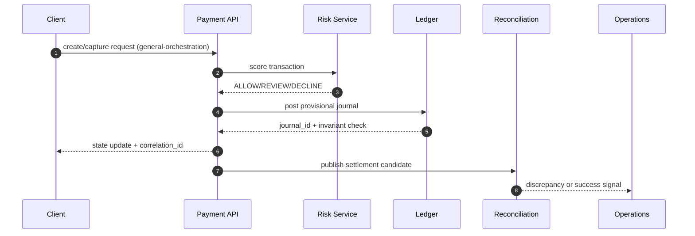

# Edge Cases - Payment Orchestration and Wallet Platform

This pack captures high-risk edge scenarios for Payments workflows.
Each document includes failure mode, detection, containment, recovery, and prevention guidance.

## Included Categories
- Domain-specific failure modes
- API/UI reliability concerns
- Security and compliance controls
- Operational incident and runbook procedures

## Artifact-Specific Deep Dive: Lifecycle, Reconciliation, Disputes, Fraud, and Ledger Safety

### Why this artifact matters
This document now defines **general-orchestration** behavior and explicitly maps architecture intent to API contracts, diagrammed flows, and day-2 operations owned by **Payments Eng, Finance Ops**.

### Transaction state transitions required in this artifact
- `INITIATED -> AUTHORIZING -> AUTHORIZED -> CAPTURE_PENDING -> CAPTURED` for card and wallet charges.
- `CAPTURED -> SETTLEMENT_PENDING -> SETTLED` after provider clearing confirmation.
- `CAPTURED|SETTLED -> REFUND_PENDING -> PARTIALLY_REFUNDED|REFUNDED` for merchant-initiated refunds.
- `SETTLED -> CHARGEBACK_OPEN -> CHARGEBACK_WON|CHARGEBACK_LOST` for issuer disputes.
- Each transition MUST include: actor, triggering API/event, timeout, retry policy, and compensating action.

### API contracts this artifact must keep consistent
- `POST /payments`: documented here with required request ids, idempotency keys, and failure reason codes for **general-orchestration**.
- `GET /payments/{id}`: documented here with required request ids, idempotency keys, and failure reason codes for **general-orchestration**.
- `POST /payments/{id}/refunds`: documented here with required request ids, idempotency keys, and failure reason codes for **general-orchestration**.
- `POST /ledger/journals`: documented here with required request ids, idempotency keys, and failure reason codes for **general-orchestration**.
- All mutating calls MUST return `correlation_id`, `idempotency_key`, `previous_state`, `new_state`, and `transition_reason`.

### In-depth flow diagram for README

### Reconciliation, dispute/refund, and fraud controls
- Reconciliation: three-way match (ledger vs PSP file vs bank statement) with tolerance thresholds and auto-classification into `timing`, `amount`, `missing`, `duplicate` breaks.
- Disputes/Refunds: evidence chain-of-custody, SLA timers, and automatic ledger reversals when disputes are lost.
- Fraud: pre-auth risk decisioning, post-auth anomaly detection, and payout velocity controls tied to case management.

### Ledger invariants and operational hooks
- Invariants enforced here: double-entry balance, append-only journal, exactly-once posting per business event, and currency-safe postings.
- Operational process: if any invariant fails, move transaction to `OPERATIONS_HOLD`, page on-call + finance, and block payout release until compensating journals are approved.
- Runbooks must include: replay commands, manual override approvals (dual control), and incident-close reconciliation attestation.

