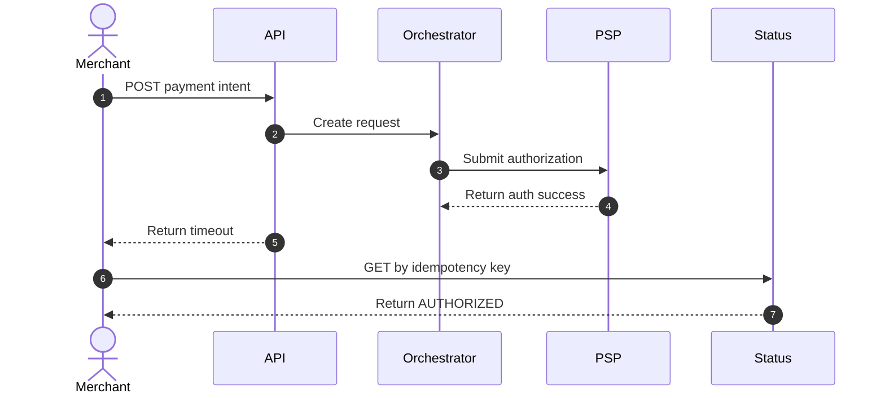

# API and UI Edge Cases — Payment Orchestration and Wallet Platform

This document covers race conditions and experience gaps between merchant APIs, operator consoles, and eventually consistent backend processing. The goal is to prevent operators or merchants from taking the same financial action twice or acting on stale state.

## 1. High-Risk Scenarios

| Scenario | Risk | Required Backend Behavior | Required UI Behavior |
|---|---|---|---|
| Client times out after authorization succeeds | Merchant retries and may fear double charge | Expose operation status by idempotency key and payment intent ID | Show `processing` state and poll authoritative status endpoint |
| Operator double-clicks capture | Duplicate capture against same auth | Reject second capture if no capturable amount remains | Disable action after first submit and display capture journal ref |
| API refund and console refund happen concurrently | Over-refund | Serialize refund creation on payment intent and remaining refundable amount | Show latest refundable amount from server before confirmation |
| Payout list is based on stale balance projection | Merchant payout exceeds available cleared funds | Use authoritative wallet reserve transaction at submit time | Display freshness timestamp and refresh on submit |
| Webhook delivery is delayed but UI already shows success | Merchant distrusts state | Provide eventual status timeline with event processing timestamps | Display webhook delivery status separately from payment status |
| Paginated dispute queue changes under analyst | Lost work or skipped case | Use cursor pagination over immutable sort keys | Keep filters and cursor stable; warn when newer items exist |

## 2. API Contract Rules

- Mutating responses must include `correlation_id`, resource ID, current status, and next recommended poll URL.
- Long-running or ambiguous operations return a stable operation resource instead of forcing clients to guess final state.
- List endpoints expose `as_of` timestamps so UIs can disclose read-model staleness.
- Console mutations should use optimistic concurrency with version or `If-Match` headers on mutable operational objects such as dispute evidence drafts or merchant routing rules.

## 3. UI Rules for Financial Safety

- Never render a destructive financial action button as immediately repeatable.
- When status is `PROCESSING`, `PSP_RESULT_UNKNOWN`, or `OPERATIONS_HOLD`, the UI must present investigation guidance instead of retry buttons.
- Money totals shown in the UI must label whether they are `available`, `pending`, or `reserved`.
- Refund and payout forms must preload server-calculated maximum values rather than trusting client-side arithmetic.

## 4. Timeout Recovery Sequence

## 5. Detection Signals

- ratio of client timeouts followed by successful idempotent replays
- repeated console submissions from the same operator in a short window
- projection freshness lag above SLO for balance or dispute views
- mismatch between payment success webhooks and merchant console refresh counts

## 6. Containment and Recovery

- If stale read models are detected, switch the affected UI panel to read-only mode and direct users to the canonical detail endpoint.
- If a client reports duplicate UI actions, inspect operation timeline by `correlation_id` before issuing any manual fix.
- If projection lag causes payout or refund confusion, halt the affected action path with a feature flag until the lag is cleared.
